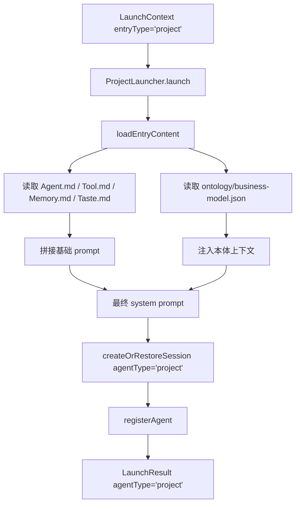

# F20：Project Launcher —— 项目入口如何注入本体上下文

## 开篇场景

用户在首页或项目列表中点击一个项目卡片。和普通 Agent 不同，项目入口启动的 Agent 需要知道：

- 这个项目的业务模型是什么？
- 已经访谈过哪些内容？
- 项目的当前阶段是什么？

这些信息存放在 `data/projects/{id}/` 目录，尤其是 `ontology/business-model.json`。`ProjectLauncher` 的任务就是把它们读出来，注入 system prompt，然后启动一个 `agentType='project'` 的 Agent。

## 核心问题

**Project Launcher 与 Agent Launcher 的核心差异是什么？为什么项目入口要把 `business-model.json` 注入 system prompt，而不是让 Agent 在运行中自己去读？**

## 概念阶梯

**Project Agent**：`agentType='project'`，与具体项目绑定，拥有项目目录作为工作目录。

**项目数据目录**：`data/projects/{id}/`，包含 `Agent.md`、`Tool.md`、`Memory.md`、`Taste.md`、`ontology/business-model.json` 等。

**业务模型本体**：`business-model.json` 是项目访谈后生成的结构化本体，描述项目、团队、目标、任务等实体。

**Frozen Snapshot 模式**：启动时把 `Knowledge.md` / `Patterns.md` 等快照加载到 system prompt，运行中新生成的知识只写入磁盘，不实时修改 prompt，保持 prefix cache 稳定。

## 图解：ProjectLauncher 启动流程



## 源码精读

### 1. ProjectLauncher 类定义

[packages/core/src/lib/features/services/launcher/project.ts 第 20—88 行](../../../../packages/core/src/lib/features/services/launcher/project.ts#L20)

```typescript
export class ProjectLauncher extends Launcher {
  readonly entryType = 'project' as const;

  async launch(ctx: LaunchContext): Promise<LaunchResult> {
    try {
      const projectBaseDir = path.join(PROJECTS_DIR, ctx.entryId);

      // 1. 读取入口内容
      const content = await this.loadEntryContent(ctx.entryId);
      const agentMd = content['Agent.md'] || '';

      // 2. 构建系统提示词
      let systemPrompt = agentMd;

      // 注入本体上下文
      if (content['business-model.json']) {
        systemPrompt += '\n\n## 本体上下文\n\n';
        systemPrompt += 'The following business model ontology is loaded:\n\n';
        systemPrompt += '```json\n' + content['business-model.json'] + '\n```\n';
      }

      // 注入 Memory.md
      if (content['Memory.md']) {
        systemPrompt += '\n\n## 历史记忆\n\n' + content['Memory.md'];
      }

      // 注入 Taste.md
      if (content['Taste.md']) {
        systemPrompt += '\n\n## 风格偏好\n\n' + content['Taste.md'];
      }
      systemPrompt = appendGlobalUserPreferencesPrompt(systemPrompt);

      // 3. 创建/恢复会话
      const { sessionId } = await this.createOrRestoreSession({
        projectId: ctx.entryId,
        projectName: ctx.entryId,
        systemPrompt,
        agentType: 'project',
        agentBaseDir: projectBaseDir,
        sessionId: ctx.restoreSessionId || ctx.sessionId,
      });

      // 4. 注册 Agent 到 AgentManager
      const tools = await this.registerAgent(sessionId, ctx.entryId, {
        systemPrompt,
        agentType: 'project',
        agentBaseDir: projectBaseDir,
        isWindowBound: ctx.isWindowBound,
      });

      return {
        success: true,
        sessionId,
        systemPrompt,
        agentType: 'project',
        baseDir: projectBaseDir,
        tools,
      };
    } catch (error) {
      return { success: false, ..., error: ... };
    }
  }
}
```

与普通 Agent 的关键差异：

1. **目录不同**：`data/projects/{id}/`。
2. **读取 ontology**：把 `business-model.json` 作为代码块注入。
3. **注入 Taste**：项目 Agent 有独立的 `Taste.md` 风格文件。
4. **agentType='project'**。
5. **没有使用 `buildAgentSystemPrompt`**：项目 Launcher 自己拼接 prompt，因为它需要把本体上下文放在特定位置。

### 2. 注入 business-model.json

[packages/core/src/lib/features/services/launcher/project.ts 第 34—39 行](../../../../packages/core/src/lib/features/services/launcher/project.ts#L34)

```typescript
if (content['business-model.json']) {
  systemPrompt += '\n\n## 本体上下文\n\n';
  systemPrompt += 'The following business model ontology is loaded:\n\n';
  systemPrompt += '```json\n' + content['business-model.json'] + '\n```\n';
}
```

把 JSON 本体直接放在 system prompt 里，有两个好处：

- **零延迟**：Agent 不需要在每次回复前调用工具查询本体；
- **上下文稳定**：LLM 在 system prompt 开头就能看到完整业务模型，推理更一致。

代价是：如果本体很大，会占用大量上下文窗口。MVP 阶段假设业务模型在可控大小内。

### 3. loadEntryContent

[packages/core/src/lib/features/services/launcher/project.ts 第 90—111 行](../../../../packages/core/src/lib/features/services/launcher/project.ts#L90)

```typescript
async loadEntryContent(id: string): Promise<Record<string, string>> {
  const projectBaseDir = path.join(PROJECTS_DIR, id);
  const result: Record<string, string> = {};

  for (const file of ['Agent.md', 'Tool.md', 'Memory.md', 'Taste.md']) {
    const content = this.readMdFile(projectBaseDir, file);
    if (content !== null) {
      result[file] = content;
    }
  }

  // 读取本体文件
  const ontologyContent = this.readMdFile(
    path.join(projectBaseDir, 'ontology'),
    'business-model.json',
  );
  if (ontologyContent !== null) {
    result['business-model.json'] = ontologyContent;
  }

  return result;
}
```

注意：这里用 `readMdFile` 读取 JSON 文件，是因为基类方法只读文本内容，不关心扩展名。实际文件中 `business-model.json` 是 JSON 文本。

### 4. 为什么不调用 buildAgentSystemPrompt？

普通 Agent 用 `buildAgentSystemPrompt`，因为它有标准的记忆/知识/模式注入顺序。但项目 Agent 的 prompt 结构更特殊：

- 需要先展示业务模型；
- 记忆和风格段落用中文标题；
- 不注入 `AGENT_PERMISSION_PROMPT`（也许 Tool.md 里已有，或项目 Agent 有单独的权限声明）。

所以 `ProjectLauncher` 选择手动拼接，以获得更大的灵活性。

## 真实调用链

用户点击项目卡片：

1. Web 构造 `LaunchContext { entryType: 'project', entryId: 'proj-abc' }`。
2. `launcherRegistry.launch` 路由到 `ProjectLauncher`。
3. 读取 `data/projects/proj-abc/` 下文件。
4. 把 `ontology/business-model.json` 注入 system prompt。
5. 创建 `AgentSession`，`projectContext.currentPath = projectBaseDir`。
6. `AgentManager` 创建 `OriginOSAgent`。
7. Web 打开项目聊天窗口，Agent 已经知道项目背景。

## 关键类型与数据示例

### 项目目录示例

```
data/web/projects/proj-abc/
├── Agent.md
├── Tool.md
├── Memory.md
├── Taste.md
└── ontology/
    └── business-model.json
```

### business-model.json 片段

```json
{
  "version": "1.0",
  "entities": [
    { "id": "proj_1", "type": "Project", "properties": { "name": "电商后台" } },
    { "id": "person_1", "type": "Person", "properties": { "name": "Alice" } }
  ]
}
```

### 生成的 system prompt 片段

```markdown
# Project Agent
...

## 本体上下文

The following business model ontology is loaded:

```json
{ "entities": [...] }
```

## 历史记忆

...

## 风格偏好

...
```

## 失败路径与边界

| 场景 | 会发生什么 | 原因 |
|---|---|---|
| 项目目录不存在 | 抛错，返回 `success: false` | `loadEntryContent` 读取失败 |
| `business-model.json` 不存在 | 不注入本体段落 | 项目可能还没完成访谈 |
| `Agent.md` 不存在 | `systemPrompt` 为空，只有后续段落 | `agentMd` 为空 |
| `Taste.md` 不存在 | 不注入风格段落 | 无默认风格 |

**一个关键边界**：项目 Launcher 没有把 `Knowledge.md` / `Patterns.md` 注入 prompt。这是因为项目 Agent 的“知识”目前主要由 `business-model.json` 承载；后续如果项目 Agent 也要走 7 层 prompt 体系，可能会在这里补充。

## 测试证据

- `ProjectLauncher` 当前无直接测试。
- 建议补测试：
  - 正常项目启动：验证 `agentType='project'`、`baseDir` 指向项目目录。
  - 本体注入：验证 `business-model.json` 出现在 `systemPrompt` 中。
  - 缺失 Agent.md：验证仍能返回成功。

## 练习与验收

1. **准备一个测试项目**：在 `data/web/projects/test-proj/` 下创建 `Agent.md` 和 `ontology/business-model.json`。
2. **调用 ProjectLauncher**：验证返回的 `baseDir` 和 `systemPrompt`。
3. **检查会话文件**：在 `data/web/projects/test-proj/sessions/` 下找到会话文件，验证 `projectContext.currentPath`。
4. **对比 AgentLauncher**：同一 `entryId` 分别用 `agent` 和 `project` 启动，观察 `baseDir` 和 `agentType` 差异。

**验收标准**：能解释项目 Launcher 与普通 Agent Launcher 的差异，能独立验证本体上下文注入。

## 章节收束

本节课看了 `ProjectLauncher`。它比 `AgentLauncher` 多了一步：把项目本体注入 system prompt。下一节课看最复杂的启动器之一：`RoleAgentLauncher`，它要加载角色上下文、状态机和记忆追踪器。
