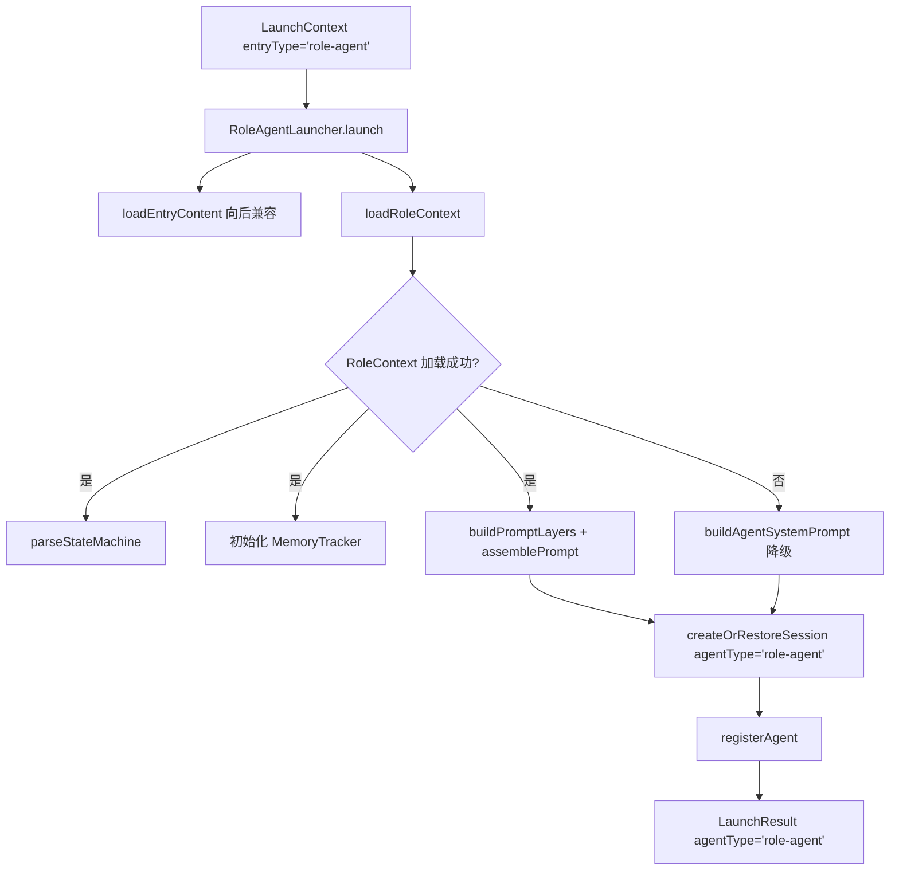

# F21：RoleAgent Launcher —— 角色、状态机与记忆追踪的启动

## 开篇场景

用户安装了一个“架构师”RoleAgent。与普通 Agent 不同，这个角色：

- 有明确的角色身份定义（`Agent.md`）；
- 有阶段定义（`Role.md`），比如“调研 → 设计 → 评审 → 交付”；
- 有已安装技能（`.skills/` 软链接）；
- 有长期记忆（`Memory.md`），需要按 turn 追加；
- 有状态机，在每次 turn_end 时检查是否需要切换阶段。

`RoleAgentLauncher` 的任务就是把这些全部加载起来，并挂上 `turn_start` / `turn_end` 钩子。

## 核心问题

**RoleAgent 的启动器为什么需要同时加载 `RoleContext`、状态机、`MemoryTracker`，还要注册全局事件钩子？这些组件如何在运行中协同？**

## 概念阶梯

**RoleContext**：角色上下文，包含 `Agent.md`、`Role.md`、`Tool.md`、`Taste.md`、已安装技能、记忆、知识、模式等。

**StateMachine**：从 `Role.md` 解析出的阶段和转换条件，维护 `currentPhase`。

**MemoryTracker**：按 turn 记录对话，达到阈值时把摘要追加到 `Memory.md`。

**PromptLayers**：7 层 system prompt 的分层快照，支持单独重建某一层（如工具箱层）。

**全局事件拦截器**：通过重写 `agentManager.subscribeToAgent`，在 RoleAgent 订阅时自动附加 `turn_start` 和 `turn_end` 钩子。

## 图解：RoleAgentLauncher 启动流程



## 源码精读

### 1. launch 方法的主分支

[packages/core/src/lib/features/services/launcher/role-agent.ts 第 254—343 行](../../../../packages/core/src/lib/features/services/launcher/role-agent.ts#L254)

```typescript
async launch(ctx: LaunchContext): Promise<LaunchResult> {
  try {
    const agentBaseDir = path.join(AGENTS_DIR, ctx.entryId);

    // 1. 读取入口内容（向后兼容）
    const content = await this.loadEntryContent(ctx.entryId);
    const agentMd = content['Agent.md'] || '';

    // 2. 尝试加载 RoleContext（新流程）
    const roleContext = await loadRoleContext(agentBaseDir);

    let systemPrompt: string;

    if (roleContext) {
      // 成功加载 → 使用 6 层 system prompt
      const stateMachine = parseStateMachine(roleContext.roleMd);
      roleContext.currentPhase = stateMachine.currentPhase;
      const memoryTracker = new MemoryTracker(agentBaseDir);
      // ... 记录 hash, 构建 layers, 存储状态
      systemPrompt = assemblePrompt(promptLayers);
    } else {
      // 降级到旧流程
      systemPrompt = buildAgentSystemPrompt(agentMd, { ... });
    }

    // 3. 创建/恢复会话
    const { sessionId } = await this.createOrRestoreSession({
      projectId: ctx.entryId,
      projectName: ctx.entryId,
      systemPrompt,
      agentType: 'role-agent',
      agentBaseDir,
      sessionId: ctx.restoreSessionId || ctx.sessionId,
    });

    // 4. 注册 Agent
    await this.registerAgent(sessionId, ctx.entryId, { ... });

    return { success: true, sessionId, systemPrompt, agentType: 'role-agent', baseDir: agentBaseDir, tools: [] };
  } catch (error) {
    return { success: false, ... };
  }
}
```

核心逻辑：

1. 先尝试新流程 `loadRoleContext`。
2. 如果成功，构建 7 层 prompt，初始化状态机和记忆追踪器。
3. 如果失败，回退到旧的 `buildAgentSystemPrompt`。
4. 最后创建会话并注册 Agent。

### 2. 全局 Hook 的安装

[packages/core/src/lib/features/services/launcher/role-agent.ts 第 59—88 行](../../../../packages/core/src/lib/features/services/launcher/role-agent.ts#L59)

```typescript
function setupGlobalRoleAgentHook(): void {
  const gh = globalThis as Record<string, unknown>;
  if (gh['__roleAgentHookInstalled']) return;
  gh['__roleAgentHookInstalled'] = true;

  const originalSubscribeToAgent = agentManager.subscribeToAgent.bind(agentManager);

  agentManager.subscribeToAgent = (
    sessionId: string,
    listener: (event: AgentEvent) => void,
  ): (() => void) | null => {
    const originalCleanup = originalSubscribeToAgent(sessionId, listener);
    if (!originalCleanup) return null;

    const startCleanup = setupRoleAgentTurnStartHook(sessionId);
    const endCleanup = setupRoleAgentTurnHook(sessionId);

    return () => {
      originalCleanup();
      startCleanup?.();
      endCleanup?.();
    };
  };
}
```

这是一个 AOP 风格的全局拦截器：

- 用 `__roleAgentHookInstalled` 保证只安装一次；
- 重写 `agentManager.subscribeToAgent`；
- 任何 session 订阅事件时，都会额外挂上 RoleAgent 的 `turn_start` 和 `turn_end` 钩子。

### 3. turn_start 钩子：动态刷新 Tool.md 和技能

[packages/core/src/lib/features/services/launcher/role-agent.ts 第 94—156 行](../../../../packages/core/src/lib/features/services/launcher/role-agent.ts#L94)

```typescript
function setupRoleAgentTurnStartHook(sessionId: string): (() => void) | null {
  return agentManager.subscribeToAgent(sessionId, (event: AgentEvent) => {
    if (event.type !== 'turn_start') return;
    const state = roleSessions.get(sessionId);
    if (!state) return;
    refreshToolMdIfNeeded(sessionId, state);
  });
}
```

`refreshToolMdIfNeeded` 会：

1. 计算 `Tool.md` 和 `.skills/` 的 hash；
2. 如果变化，更新 `roleContext` 中对应字段；
3. 只重建 `toolbox` 层；
4. 调用 `agent.setSystemPrompt(newPrompt)`。

这样 Agent 在运行中安装了新技能或修改了 Tool.md 后，下一次 turn 开始时就能生效，而不需要重启。

### 4. turn_end 钩子：状态机 + 记忆追踪

[packages/core/src/lib/features/services/launcher/role-agent.ts 第 162—193 行](../../../../packages/core/src/lib/features/services/launcher/role-agent.ts#L162)

```typescript
function setupRoleAgentTurnHook(sessionId: string): (() => void) | null {
  return agentManager.subscribeToAgent(sessionId, (event: AgentEvent) => {
    if (event.type !== 'turn_end') return;
    const state = roleSessions.get(sessionId);
    if (!state) return;

    // 1. 状态机检查
    const transition = checkTransition(state.stateMachine, [turnEnd.message]);
    if (transition) {
      applyTransition(state.stateMachine, transition.to);
      state.roleContext.currentPhase = transition.to;
      updateRoleMdPhase(state.roleContext.agentBaseDir, transition.to);
    }

    // 2. 记忆追踪
    const userText = extractUserText(turnEnd.message);
    state.memoryTracker.recordTurn(userText, state.memoryTracker.turnCount + 1);
    if (state.memoryTracker.shouldFlush()) {
      state.memoryTracker.flushMemory(existingMemory).catch(...);
    }
  });
}
```

每次用户回合结束时：

- 检查状态机是否满足阶段转换条件；
- 如果转换，更新 `Role.md` 中的 `currentPhase`；
- 记录用户消息到 `MemoryTracker`；
- 如果达到 flush 阈值，把运行记忆写入 `Memory.md`。

### 5. 降级路径

[packages/core/src/lib/features/services/launcher/role-agent.ts 第 296—305 行](../../../../packages/core/src/lib/features/services/launcher/role-agent.ts#L296)

```typescript
} else {
  systemPrompt = buildAgentSystemPrompt(agentMd, {
    role: content['Role.md'],
    memory: content['Memory.md'],
    taste: content['Taste.md'],
    baseDir: agentBaseDir,
  });
}
```

如果 `loadRoleContext` 失败（比如没有 `Role.md`），就退化成普通 Agent 的 prompt 构建方式，只是额外注入 `Role.md` 作为角色状态段落。

## 真实调用链

用户点击 RoleAgent 入口：

1. `launcherRegistry.launch({ entryType: 'role-agent', entryId: 'architect' })`。
2. `RoleAgentLauncher` 读取 `data/agents/architect/` 下文件。
3. 调用 `loadRoleContext` 加载角色上下文。
4. 解析 `Role.md` 得到状态机，初始化 `MemoryTracker`。
5. 构建 7 层 system prompt。
6. 创建会话并注册 Agent。
7. 当用户发送消息时，`turn_start` 检查 Tool.md/技能变更；`turn_end` 检查状态机转换和记忆 flush。

## 关键类型与数据示例

### RoleAgent 目录示例

```
data/web/agents/architect/
├── Agent.md
├── Role.md
├── Tool.md
├── Taste.md
├── Memory.md
├── Knowledge.md
├── Patterns.md
├── .skills/          # 软链接
└── memory/
    └── history.jsonl
```

### Role.md 片段

```markdown
---
currentPhase: research
---

## phases

### research
行为特征：先访谈用户，收集需求、约束、现有系统信息。
进入条件：项目刚启动。

### design
行为特征：基于调研输出架构设计文档。
进入条件：用户确认需求完整。
```

### 状态转换触发

Agent 在回复末尾输出 `[PHASE:design]`，系统解析后调用 `applyTransition`。

## 失败路径与边界

| 场景 | 会发生什么 | 原因 |
|---|---|---|
| 没有 `Role.md` | 降级到旧 prompt 流程 | `loadRoleContext` 返回 null |
| 状态机转换条件不满足 | 保持当前阶段 | `checkTransition` 返回 null |
| `MemoryTracker.flushMemory` 失败 | 打印 warn，不影响当前回复 | catch 处理 |
| Tool.md 变更后 hash 相同 | 不刷新 system prompt | hash 比对 |

**一个关键边界**：`roleSessions` 用 `entryId` 而不是 `sessionId` 做 key。这意味着同一 RoleAgent 在同一时间只有一个全局状态。如果未来支持同一 RoleAgent 多会话并行，需要改为 `sessionId`。

## 测试证据

- `RoleAgentLauncher` 当前无直接测试。
- 建议补测试：
  - 新流程：加载 `RoleContext` 后返回 7 层 prompt；
  - 降级流程：缺少 `Role.md` 时使用旧 prompt；
  - `turn_end` 状态转换：mock 消息，验证 `Role.md` 的 `currentPhase` 被更新；
  - `turn_start` 刷新：修改 `Tool.md` 后触发 turn_start，验证 system prompt 更新。

## 练习与验收

1. **创建 RoleAgent 目录**：包含 `Agent.md`、`Role.md`、`Tool.md`、`Memory.md`。
2. **启动 RoleAgent**：调用 launcher，检查 `systemPrompt` 是否包含 7 层结构。
3. **触发阶段转换**：发送一条能让 Agent 输出 `[PHASE:新阶段]` 的消息，检查 `Role.md` 的 `currentPhase`。
4. **安装技能**：在 `.skills/` 下创建软链接，触发 turn_start，检查 system prompt 中技能表格是否更新。

**验收标准**：能解释 RoleAgent 启动器与普通 Agent 启动器的差异，能追踪状态机和记忆钩子的注册过程。

## 章节收束

本节课看了 `RoleAgentLauncher`。它把角色上下文、状态机、记忆追踪、动态刷新全部串起来，是四种启动器中最复杂的一个。下一节课看 `SkillLauncher`，它要处理 SKILL.md frontmatter、依赖声明和产物目录。
