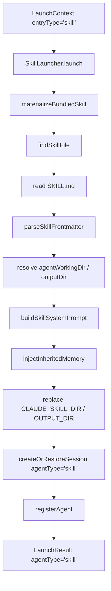

# F22：Skill Launcher —— Skill 启动、依赖解析与产物目录

## 开篇场景

用户在首页点击一个 Skill 卡片，比如“Agent 创建器”。和普通 Agent 不同，Skill 启动需要：

1. 找到 `SKILL.md`（可能在 `data/skills/{code}/`，也可能在 bundled 模板目录）；
2. 解析 frontmatter，提取 `dependencies`、`prerequisites`、`outputDir`；
3. 把 `dependencies` 转换成“先检查、再安装、再验证”的指引注入 prompt；
4. 决定工作目录和产物目录；
5. 如果是 bundled Skill，先把它物化到 `data/skills/{code}/`；
6. 创建会话并注册 Agent。

这就是 `SkillLauncher` 的职责。

## 核心问题

**Skill Launcher 如何同时支持用户自定义 Skill、bundled Skill、项目上下文 Skill？`outputDir` 和 `agentWorkingDir` 有什么区别？为什么需要把依赖安装指引写进 system prompt？**

## 概念阶梯

**Skill Source Directory**：Skill 源目录，可能是 bundled 模板或用户自定义目录，可能只读。

**Skill Working Directory**：Skill 运行时的工作目录，用于 bash/file 工具，通常可写。

**Output Directory**：Skill 产物输出目录，例如创建 Agent 时生成的文件放在这里。

**Frontmatter 依赖声明**：`SKILL.md` 头部通过 `dependencies` 和 `prerequisites` 声明需要预先安装的包或命令。

**Materialize Bundled Skill**：把 bundled Skill 从只读模板复制到 `data/skills/{code}/`，使其可写。

## 图解：SkillLauncher 启动流程



## 源码精读

### 1. launch 主流程

[packages/core/src/lib/features/services/launcher/skill.ts 第 365—468 行](../../../../packages/core/src/lib/features/services/launcher/skill.ts#L365)

```typescript
export class SkillLauncher extends Launcher {
  readonly entryType = 'skill' as const;

  async launch(ctx: LaunchContext): Promise<LaunchResult> {
    try {
      materializeBundledSkill(ctx.entryId);

      // 1. 查找并读取 SKILL.md
      const skillInfo = findSkillFile(ctx.entryId);
      if (!skillInfo) {
        return { success: false, ..., error: `Skill "${ctx.entryId}" not found` };
      }
      const skillMd = readFileSync(skillInfo.skillMdPath, 'utf-8');

      // 2. 解析 frontmatter
      const { dependencies, prerequisites, outputDir: frontmatterOutputDir } = parseSkillFrontmatter(skillMd);

      // 3. 构建系统提示词
      const dataSkillsDir = path.join(getDataRoot(), 'skills', ctx.entryId);
      const agentWorkingDir = ctx.agentBaseDir || dataSkillsDir;
      const resolvedOutputDir = frontmatterOutputDir
        ? resolveOutputDirFromFrontmatter(frontmatterOutputDir)
        : agentWorkingDir;

      const systemPrompt = buildSkillSystemPrompt(
        ctx.entryId, skillMd, agentWorkingDir, skillInfo.baseDir,
        dependencies, prerequisites, resolvedOutputDir,
      );
      const inheritedMemory = resolveInheritedMemory(agentWorkingDir);
      const resolvedPrompt = injectInheritedMemory(systemPrompt, inheritedMemory)
        .replace(/\$\{CLAUDE_SKILL_DIR\}/g, skillInfo.baseDir)
        .replace(/\$\{OUTPUT_DIR\}/g, resolvedOutputDir ?? '');

      // 4. 创建/恢复会话
      const projectId = ctx.projectId || `skill-${ctx.entryId}`;
      const { sessionId } = await this.createOrRestoreSession({
        projectId,
        projectName: `Skill: ${ctx.entryId}`,
        systemPrompt: resolvedPrompt,
        agentType: 'skill',
        agentBaseDir: agentWorkingDir,
        sessionId: ctx.restoreSessionId || ctx.sessionId,
        llmConfig: ctx.llmConfig,
      });

      // 5. 注册 Agent
      const tools = await this.registerAgent(sessionId, projectId, {
        systemPrompt: resolvedPrompt,
        agentType: 'skill',
        agentBaseDir: agentWorkingDir,
        llmConfig: ctx.llmConfig,
      });

      return { success: true, sessionId, systemPrompt: resolvedPrompt, agentType: 'skill', baseDir: agentWorkingDir, tools };
    } catch (error) {
      return { success: false, ... };
    }
  }
}
```

### 2. 查找 SKILL.md

[packages/core/src/lib/features/services/launcher/skill.ts 第 321—363 行](../../../../packages/core/src/lib/features/services/launcher/skill.ts#L321)

```typescript
function findSkillFile(skillCode: string): { skillMdPath: string; baseDir: string } | null {
  const skillDirs = [
    path.join(getDataRoot(), 'skills'),
    path.join(getDataRoot(), '.originos', 'skills'),
    ...getBundledSkillDirs(),
  ];

  // 精确路径
  for (const base of skillDirs) {
    const dir = path.join(base, skillCode);
    const skillMd = path.join(dir, 'SKILL.md');
    if (existsSync(skillMd)) return { skillMdPath: skillMd, baseDir: dir };
  }

  // 模糊匹配：按 code/name
  for (const base of skillDirs) {
    // ... 遍历目录，匹配 frontmatter 中的 code/name
  }
  return null;
}
```

查找顺序：

1. `data/skills/{code}/SKILL.md`
2. `data/.originos/skills/{code}/SKILL.md`
3. bundled skill 目录
4. 如果都没找到，按 `code` 或 `name` 模糊匹配。

### 3. 解析 Frontmatter

[packages/core/src/lib/features/services/launcher/skill.ts 第 86—129 行](../../../../packages/core/src/lib/features/services/launcher/skill.ts#L86)

```typescript
function parseSkillFrontmatter(content: string): {
  dependencies: string[];
  prerequisites: string[];
  name?: string;
  description?: string;
  outputDir?: string;
} {
  const frontmatterMatch = content.match(/^---\n([\s\S]*?)\n---/);
  if (!frontmatterMatch) return { dependencies: [], prerequisites: [] };

  // 解析 key:value 和多行数组
  // ...
}
```

支持：

- `dependencies: ["pip install xxx"]`
- `prerequisites` 多行 YAML 数组
- `outputDir: data/agents`
- `name`, `description`

### 4. 工作目录与产物目录

[packages/core/src/lib/features/services/launcher/skill.ts 第 397—413 行](../../../../packages/core/src/lib/features/services/launcher/skill.ts#L397)

```typescript
const dataSkillsDir = path.join(getDataRoot(), 'skills', ctx.entryId);
const agentWorkingDir = ctx.agentBaseDir || dataSkillsDir;
const resolvedOutputDir = frontmatterOutputDir
  ? resolveOutputDirFromFrontmatter(frontmatterOutputDir)
  : agentWorkingDir;
```

- `agentWorkingDir`：默认是 `data/skills/{code}/`，但项目上下文可以覆盖为项目目录。
- `resolvedOutputDir`：如果 frontmatter 声明了 `outputDir`，则解析为绝对路径；否则等于工作目录。

`resolveOutputDirFromFrontmatter` 会把相对路径解析到数据根目录：

```typescript
function resolveOutputDirFromFrontmatter(outputDir: string): string {
  if (path.isAbsolute(outputDir)) return outputDir;
  const normalized = outputDir.replace(/\\/g, '/').replace(/^\.?\//, '').replace(/\/+$/, '');
  if (normalized === 'data') return getDataRoot();
  if (normalized.startsWith('data/')) return path.join(getDataRoot(), normalized.slice('data/'.length));
  return path.join(getDataRoot(), normalized);
}
```

### 5. buildSkillSystemPrompt

[packages/core/src/lib/features/services/launcher/skill.ts 第 134—264 行](../../../../packages/core/src/lib/features/services/launcher/skill.ts#L134)

这个函数拼接 Skill 专属 prompt：

1. **工作目录说明**：`Working directory for this skill: ...`
2. **Skill source directory**：`Skill source directory: ...`，并说明 `${CLAUDE_SKILL_DIR}` 只用于读取 bundled 参考文件。
3. **Output directory**：如果与 working dir 不同，注入产物目录和 `${OUTPUT_DIR}` 使用规则。
4. **Skill identity**：`You are {displayName}.`
5. **Skill Instructions**：frontmatter 之后的 body。
6. **Required Dependencies**：如果有依赖，生成“检查 → 安装 → 验证”四步指引。
7. **Available Tools**：从 `ToolRegistry` 获取全部启用工具，按 category 分组。
8. **Tool Execution Rules / Network Access / User Communication Rules**：与 Agent 统一的权限声明。

### 6. 继承记忆

[packages/core/src/lib/features/services/launcher/skill.ts 第 266—316 行](../../../../packages/core/src/lib/features/services/launcher/skill.ts#L266)

```typescript
function resolveInheritedMemory(agentWorkingDir: string): {
  memory?: string; knowledge?: string; patterns?: string;
} {
  const readOptional = (fileName: string): string | undefined => {
    const filePath = path.join(agentWorkingDir, fileName);
    if (!existsSync(filePath)) return undefined;
    try { return readFileSync(filePath, 'utf-8').trim() || undefined; } catch { return undefined; }
  };
  return { memory: readOptional('Memory.md'), knowledge: readOptional('Knowledge.md'), patterns: readOptional('Patterns.md') };
}
```

如果 Skill 运行在项目目录下，它会继承项目目录中的 `Memory.md`、`Knowledge.md`、`Patterns.md`。

## 真实调用链

用户点击 Skill 卡片：

1. Web 构造 `LaunchContext { entryType: 'skill', entryId: 'agent-creator' }`。
2. `SkillLauncher` 物化 bundled Skill 到 `data/skills/agent-creator/`。
3. 查找并读取 `SKILL.md`。
4. 解析 frontmatter，决定 output dir。
5. 构建 Skill system prompt，替换 `${CLAUDE_SKILL_DIR}` 和 `${OUTPUT_DIR}`。
6. 创建 `AgentSession`，`agentType='skill'`。
7. 注册 Agent，Agent 开始按 Skill 指令工作。

## 关键类型与数据示例

### SKILL.md 示例

```markdown
---
name: agent-creator
description: Create a new agent from natural language.
outputDir: data/agents
dependencies:
  - npm install @originos/core
---

## Instructions

When the user describes an agent they want, create:
1. Agent.md
2. Tool.md
3. Memory.md

Use ${OUTPUT_DIR} for artifacts.
```

### 产物目录解析

| frontmatter outputDir | 解析结果 |
|---|---|
| `data/agents` | `{dataRoot}/agents` |
| `data/` | `{dataRoot}` |
| `/absolute/path` | `/absolute/path` |
| 未声明 | `agentWorkingDir` |

### 生成的 prompt 片段

```markdown
Working directory for this skill: /.../data/web/skills/agent-creator
Skill source directory: /.../data/web/skills/agent-creator
...

## Required Dependencies
This skill requires the following dependencies to be installed...

### Step 1: Determine dependency type
...

## Available Tools
**文件操作：**
- `read_file`: ...
- `write_file`: ...
```

## 失败路径与边界

| 场景 | 会发生什么 | 原因 |
|---|---|---|
| Skill 找不到 | 返回 `success: false` | `findSkillFile` 返回 null |
| frontmatter 格式错误 | `dependencies` / `prerequisites` 为空 | 解析异常被吞掉 |
| outputDir 是绝对路径 | 直接使用 | `path.isAbsolute` 分支 |
| bundled Skill 已物化 | `materializeBundledSkill` 幂等 | 内部会跳过已存在文件 |

**一个关键边界**：Skill 的 `projectId` 默认是 `skill-{code}`，但如果 `ctx.projectId` 被传入（比如项目上下文），就用项目 id。这决定了会话文件落在 `data/web/sessions/` 还是 `data/web/projects/{id}/sessions/`。

## 测试证据

- `features/services/launcher/__tests__/skill-launcher.test.ts` 存在，覆盖了三个关键场景：
  - bundled skill 回退物化；
  - bundled template skill 物化到 data skills；
  - 禁止 MSYS 风格路径（`/workspace`、`/c/`）进入 system prompt。

## 练习与验收

1. **创建一个自定义 Skill**：在 `data/web/skills/my-skill/SKILL.md` 中声明 `outputDir: data/agents` 和一个依赖。
2. **调用 SkillLauncher**：验证 `baseDir`、`systemPrompt` 中 `${OUTPUT_DIR}` 被替换。
3. **测试 bundled 回退**：设置 `ORIGINOS_BUNDLED_SKILLS_DIR` 为空目录，验证 launcher 能从 bundled 模板目录找到 Skill。
4. **运行在项目上下文**：传入 `projectId` 和 `agentBaseDir`，验证 `projectId` 覆盖和继承记忆注入。

**验收标准**：能解释 Skill 工作目录与产物目录的区别，能独立追踪 frontmatter 解析到 prompt 生成的完整链路。

## 章节收束

本节课看了 `SkillLauncher`。它需要处理 Skill 发现、frontmatter 解析、目录解析、记忆继承等复杂逻辑。下一节课看 launcher 的测试策略与边界验证。
