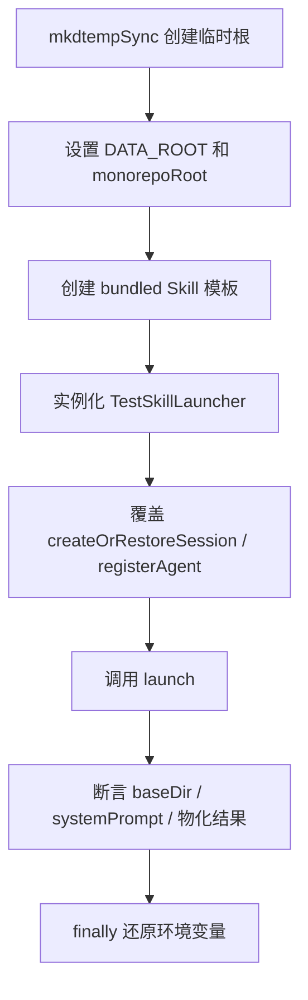

# F23：Launcher 测试与验证

## 开篇场景

Launcher 层的代码直接操作文件系统、创建会话、注册 Agent。如果每个测试都启动真实 LLM 和完整 Agent，测试会又慢又贵。因此 Launcher 测试的核心策略是：

1. **隔离文件系统**：用临时目录和 `setMonorepoRoot` / `process.env.DATA_ROOT` 控制数据根目录；
2. **Mock 会话和 Agent 注册**：子类覆盖 `createOrRestoreSession` 和 `registerAgent`，避免依赖 `agentSessionService` 和 `AgentManager`；
3. **验证 prompt 和路径**：测试重点不是 LLM 输出，而是 system prompt 中是否包含正确的工作目录、source 目录、依赖声明，以及路径是否符合预期。

这节课以 `skill-launcher.test.ts` 为例，讲 Launcher 层的测试模式。

## 核心问题

**Launcher 测试应该如何隔离文件系统和外部依赖？哪些断言最能反映启动器的正确性？**

## 概念阶梯

**Test Double**：测试中替代真实依赖的对象。这里用子类覆盖基类方法，属于“部分 mock”。

**Temporary Data Root**：通过 `process.env.DATA_ROOT` 把测试数据写到临时目录，避免污染真实数据。

**Bundled Skill Fallback**：当用户数据目录里没有 Skill 时，launcher 能从 bundled 模板目录物化一份。

**MSYS Path Blacklist**：在 Windows 打包环境下，要避免 `/workspace`、`/c/`、MSYS 风格路径进入 system prompt。

## 图解：SkillLauncher 测试结构



## 源码精读

### 1. 测试子类：隔离会话和 Agent 注册

[packages/core/src/lib/features/services/launcher/__tests__/skill-launcher.test.ts 第 8—16 行](../../../../packages/core/src/lib/features/services/launcher/__tests__/skill-launcher.test.ts#L8)

```typescript
class TestSkillLauncher extends SkillLauncher {
  protected override async createOrRestoreSession(): Promise<{ sessionId: string; isNew: boolean }> {
    return { sessionId: 'test-session', isNew: true };
  }

  protected override async registerAgent(): Promise<string[]> {
    return [];
  }
}
```

通过覆盖基类的 `createOrRestoreSession` 和 `registerAgent`，测试不再依赖 `agentSessionService` 和 `AgentManager`。这样测试只验证 Launcher 自己的逻辑：

- 找文件；
- 拼 prompt；
- 解析目录；
- 物化 bundled Skill。

### 2. bundled Skill 回退测试

[packages/core/src/lib/features/services/launcher/__tests__/skill-launcher.test.ts 第 19—74 行](../../../../packages/core/src/lib/features/services/launcher/__tests__/skill-launcher.test.ts#L19)

```typescript
it('falls back across bundled skill roots when an earlier root is present but incomplete', async () => {
  const originalRoot = getMonorepoRoot();
  const originalDataRoot = process.env.DATA_ROOT;
  const originalBundledDir = process.env.ORIGINOS_BUNDLED_SKILLS_DIR;
  const tempRoot = mkdtempSync(path.join(tmpdir(), 'originos-skill-launcher-'));
  const emptyBundledRoot = path.join(tempRoot, 'empty-bundled-skills');
  const monorepoRoot = path.join(tempRoot, 'repo');
  const dataRoot = path.join(tempRoot, 'data');
  const bundledSkillDir = path.join(monorepoRoot, 'templates', 'skills', 'skill-creator-app');
  mkdirSync(emptyBundledRoot, { recursive: true });
  mkdirSync(bundledSkillDir, { recursive: true });
  writeFileSync(path.join(bundledSkillDir, 'SKILL.md'), [...], 'utf8');

  try {
    setMonorepoRoot(monorepoRoot);
    process.env.DATA_ROOT = dataRoot;
    process.env.ORIGINOS_BUNDLED_SKILLS_DIR = emptyBundledRoot;

    const launcher = new TestSkillLauncher();
    const result = await launcher.launch({ entryId: 'skill-creator-app', entryType: 'skill' });
    const expectedWorkingDir = path.join(dataRoot, 'skills', 'skill-creator-app');

    expect(result.success).toBe(true);
    expect(result.baseDir).toBe(expectedWorkingDir);
    expect(result.systemPrompt).toContain(`Skill source directory: ${expectedWorkingDir}`);
    expect(result.systemPrompt).toContain('Create a skill.');
    expect(existsSync(path.join(expectedWorkingDir, 'SKILL.md'))).toBe(true);
  } finally {
    setMonorepoRoot(originalRoot);
    // 还原环境变量
  }
});
```

这个测试验证：

1. 当 `ORIGINOS_BUNDLED_SKILLS_DIR` 指向的空目录找不到 Skill 时；
2. Launcher 会回退到 `monorepoRoot/templates/skills/{code}/`；
3. 并把 bundled Skill 物化到 `dataRoot/skills/{code}/`；
4. 最终 `baseDir` 指向数据目录下的 Skill 目录，而不是 bundled 源目录。

### 3. bundled Skill 物化测试

[packages/core/src/lib/features/services/launcher/__tests__/skill-launcher.test.ts 第 76—124 行](../../../../packages/core/src/lib/features/services/launcher/__tests__/skill-launcher.test.ts#L76)

```typescript
it('materializes bundled template skills into data skills before launch', async () => {
  // ... 创建临时目录和 bundled skill
  const result = await launcher.launch({ entryId: 'windows-skill', entryType: 'skill' });
  const expectedWorkingDir = path.join(dataRoot, 'skills', 'windows-skill');

  expect(result.success).toBe(true);
  expect(result.baseDir).toBe(expectedWorkingDir);
  expect(result.systemPrompt).toContain(`Skill source directory: ${expectedWorkingDir}`);
  expect(result.systemPrompt).toContain(`Write artifacts to ${expectedWorkingDir}.`);
  expect(result.systemPrompt).not.toContain('${OUTPUT_DIR}');
  expect(result.systemPrompt).not.toContain('/workspace');
  expect(existsSync(path.join(expectedWorkingDir, 'SKILL.md'))).toBe(true);
});
```

重点验证：

- `${OUTPUT_DIR}` 必须被替换为真实路径；
- system prompt 不能残留 MSYS 风格路径 `/workspace`。

### 4. MSYS 路径黑名单测试

[packages/core/src/lib/features/services/launcher/__tests__/skill-launcher.test.ts 第 126—182 行](../../../../packages/core/src/lib/features/services/launcher/__tests__/skill-launcher.test.ts#L126)

```typescript
it('never injects MSYS-style paths (/workspace, /c/) into the system prompt', async () => {
  // ... bundled skill frontmatter 中声明 outputDir: data/
  const result = await launcher.launch({ entryId: 'windows-skill', entryType: 'skill' });
  const expectedWorkingDir = path.join(dataRoot, 'skills', 'windows-skill');

  expect(result.success).toBe(true);
  expect(result.baseDir).toBe(expectedWorkingDir);
  expect(result.baseDir).not.toContain('/workspace');
  expect(result.systemPrompt).not.toContain('${OUTPUT_DIR}');
  expect(result.systemPrompt).toContain(dataRoot);
  expect(result.systemPrompt).not.toContain('/workspace');
  expect(result.systemPrompt).not.toMatch(/\/c\//);
  expect(result.systemPrompt).not.toContain('MSYS');
});
```

这个测试针对 Windows 打包环境的典型 bug：

- MSYS 会把 Windows 路径映射成 `/workspace`、`/c/`；
- 如果 launcher 错误地使用了 MSYS 根路径，Agent 会读到错误目录；
- 测试确保 `baseDir` 和 `systemPrompt` 都使用真实的数据根路径。

## 关键类型与数据示例

### 测试环境变量

```typescript
process.env.DATA_ROOT = dataRoot;                    // 数据根目录
process.env.ORIGINOS_BUNDLED_SKILLS_DIR = bundledDir; // bundled skill 覆盖目录
setMonorepoRoot(monorepoRoot);                       // monorepo 根目录
```

### 断言重点

| 断言 | 验证目标 |
|---|---|
| `result.success` | 启动流程没有抛错 |
| `result.baseDir` | 工作目录指向数据根目录 |
| `result.systemPrompt` | 包含 Skill 内容、替换后的路径 |
| `not.toContain('${OUTPUT_DIR}')` | 占位符被替换 |
| `not.toContain('/workspace')` | 没有 MSYS 路径泄漏 |
| `existsSync(...)` | bundled Skill 确实被物化 |

## 失败路径与边界

| 场景 | 测试应如何覆盖 | 原因 |
|---|---|---|
| bundled 目录为空 | 回退到 monorepo 模板 | 多源查找 |
| outputDir 未声明 | 默认等于 workingDir | 避免占位符为空 |
| outputDir 声明为 `data/` | 解析为数据根目录 | 相对路径解析规则 |
| Skill 文件不存在 | 返回 `success: false` | 边界保护 |

**一个关键边界**：测试中没有断言 `LaunchResult.tools`，因为当前 `registerAgent` 返回空数组。如果未来 `tools` 字段被填充，测试需要同步更新。

## 测试证据

- `skill-launcher.test.ts` 是 launcher 层唯一的现有测试文件。
- 已覆盖：bundled 回退、物化、路径黑名单。
- 未覆盖：用户自定义 Skill、项目上下文 Skill、frontmatter 依赖注入、继承记忆注入。

## 练习与验收

1. **为 AgentLauncher 写一个最小测试**：覆盖 `Agent.md` 存在/不存在两种情况，验证 `agentType='assistant'` 和 system prompt 内容。
2. **为 ProjectLauncher 写一个最小测试**：mock `business-model.json`，验证 system prompt 包含 JSON 本体。
3. **为 RoleAgentLauncher 写一个降级测试**：缺少 `Role.md` 时验证使用 `buildAgentSystemPrompt`。
4. **扩展 skill-launcher 测试**：覆盖 `dependencies` 非空时 system prompt 包含安装指引。

**验收标准**：能独立为任意 Launcher 编写隔离文件系统的单元测试，能说明每个断言的验证目标。

## 章节收束

到这里，F.2 的 launcher 部分（F18–F23）讲完。下一部分进入持久化 Agent 运行时：F24 看 `persistent-agent.ts` 如何加载工作空间文件并初始化 Agent。
