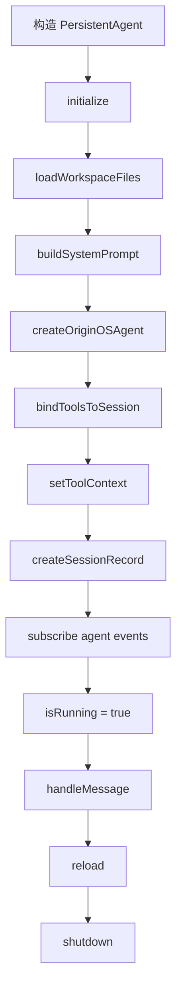

# F24：Persistent Agent —— 工作空间文件加载与初始化

## 开篇场景

用户在 Desktop 端打开一个项目窗口。和普通 Web 会话不同，这个项目 Agent 需要：

1. 长期驻留，直到用户关闭项目或主动停止；
2. 热重载：用户修改 `Agent.md` / `Tool.md` 后不需要重启 Agent；
3. 自己决定问候语：启动时判断 `business-model.json` 是否存在，不存在则进入访谈，存在则基于已有内容生成问候；
4. 接入认知系统：每轮对话后记录实践日志，会话结束时提取知识。

`PersistentAgent` 就是为实现这种“项目级长期运行 Agent”而设计的类。

## 核心问题

**为什么需要一个与普通 `OriginOSAgent` 不同的 `PersistentAgent`？它如何从项目目录自主加载配置、构建 system prompt、并在运行中热重载？**

## 概念阶梯

**PersistentAgent**：封装 `OriginOSAgent` 的长期运行实例，与项目目录绑定，提供 `initialize / handleMessage / reload / shutdown` 等生命周期方法。

**WorkspaceContextFile**：工作空间上下文文件，包含文件名、相对路径、内容。

**loadWorkspaceFiles**：按优先级加载项目目录下的 `.md` 文件，类似 OpenClaw 的 bootstrap 文件加载。

**AgentDefinition / ToolDefinition / SkillDefinition**：从 `Agent.md`、`Tool.md`、`Skill.md` 解析出的结构化配置。

**热重载（Hot Reload）**：在 Agent 运行过程中，重新读取配置并更新 system prompt 和工具，不中断实例。

## 图解：PersistentAgent 生命周期



## 源码精读

### 1. PersistentAgentConfig

[packages/core/src/lib/integrations/pi-agent/persistent-agent.ts 第 195—206 行](../../../../packages/core/src/lib/integrations/pi-agent/persistent-agent.ts#L195)

```typescript
export interface PersistentAgentConfig {
  projectId: string;
  workingDirectory: string;
  agentDefinition: AgentDefinition;
  toolDefinition: ToolDefinition;
  skillDefinition: SkillDefinition;
  workspaceFiles?: WorkspaceContextFile[];
  builtSystemPrompt?: string;
  cognitiveManager?: CognitiveManager;
  sleepScheduler?: SleepComputeScheduler;
  completionGuardEnabled?: boolean;
}
```

配置说明：

- `projectId`：Agent 归属的项目。
- `workingDirectory`：项目目录，所有文件操作的基准。
- `agentDefinition / toolDefinition / skillDefinition`：从对应 `.md` 文件解析。
- `workspaceFiles`：额外加载的工作空间文件（如 `taste.md`、`SOUL.md`）。
- `builtSystemPrompt`：外部已经构建好的 7 层 system prompt，优先使用。
- `cognitiveManager`：认知系统钩子。
- `sleepScheduler`：睡眠计算调度器，会话结束时执行延迟任务。
- `completionGuardEnabled`：是否启用完成守护（默认 true）。

### 2. loadWorkspaceFiles

[packages/core/src/lib/integrations/pi-agent/persistent-agent.ts 第 60—113 行](../../../../packages/core/src/lib/integrations/pi-agent/persistent-agent.ts#L60)

```typescript
export async function loadWorkspaceFiles(projectDir: string): Promise<WorkspaceContextFile[]> {
  const files: WorkspaceContextFile[] = [];
  const priorityFiles = [
    'Agent.md', 'Tool.md', 'Skill.md', 'taste.md',
    'SOUL.md', 'MEMORY.md', 'IDENTITY.md',
  ];

  // 先加载优先级文件
  for (const fileName of priorityFiles) {
    if (EXCLUDED_WORKSPACE_FILES.has(fileName)) continue;
    const filePath = path.join(projectDir, fileName);
    try {
      const content = await fs.readFile(filePath, 'utf-8');
      if (content.trim()) files.push({ name: fileName, path: fileName, content });
    } catch { /* 文件不存在，跳过 */ }
  }

  // 再加载其他根目录 .md 文件
  try {
    const entries = await fs.readdir(projectDir, { withFileTypes: true });
    for (const entry of entries) {
      if (!entry.isFile()) continue;
      if (!entry.name.endsWith('.md') && !entry.name.endsWith('.MD')) continue;
      if (EXCLUDED_WORKSPACE_FILES.has(entry.name)) continue;
      if (priorityFiles.includes(entry.name)) continue;
      // ...
    }
  } catch { /* 目录读取失败 */ }

  return files;
}
```

设计要点：

- 优先级顺序保证重要文件排在前面；
- 自动跳过 `bootstrap.md`、`user.md`、`HEARTBEAT.md`；
- 不强制要求文件存在，缺失则跳过。

### 3. buildProjectContextSection

[packages/core/src/lib/integrations/pi-agent/persistent-agent.ts 第 131—155 行](../../../../packages/core/src/lib/integrations/pi-agent/persistent-agent.ts#L131)

```typescript
export function buildProjectContextSection(files: WorkspaceContextFile[]): string {
  if (files.length === 0) return '';
  const lines: string[] = [
    '# Project Context',
    '',
    '以下工作空间文件已加载。请遵循其中的定义和指导：',
  ];
  // SOUL.md / taste.md 特殊提示
  // ...
  for (const file of files) {
    lines.push(`## ${file.path}`, '', file.content, '');
  }
  return lines.join('\n');
}
```

把多个 `.md` 文件统一打包成 `# Project Context` section，让 LLM 把项目配置当作上下文。

### 4. initialize 流程

[packages/core/src/lib/integrations/pi-agent/persistent-agent.ts 第 266—399 行](../../../../packages/core/src/lib/integrations/pi-agent/persistent-agent.ts#L266)

```typescript
async initialize(llmConfig?: { ... }): Promise<void> {
  if (this.isRunning) {
    console.warn(`[PersistentAgent] Agent already running for project: ${this.projectId}`);
    return;
  }

  // 1. 构建 system prompt
  const systemPrompt = this.builtSystemPrompt ?? this.buildSystemPrompt();

  // 2. 创建 OriginOSAgent
  this.agent = await createOriginOSAgent({
    sessionId: `persistent-${this.projectId}`,
    systemPrompt,
    variables: { projectId: this.projectId, projectName: this.agentDefinition.name },
    llmConfig,
    completionGuardEnabled: this.completionGuardEnabled,
  });

  // 3. 注册工具
  const persistentSessionId = `persistent-${this.projectId}`;
  const tools = bindToolsToSession(this.buildTools(), persistentSessionId);
  this.agent.setTools(tools as AgentTool<any>[]);

  // 4. 设置工具上下文
  const context = { workingDirectory: this.workingDirectory, sessionId: persistentSessionId };
  setToolContext(persistentSessionId, context);
  getToolContextManager().setDefaultContext(context);

  // 5. 创建持久化 session 记录
  try {
    await agentSessionService.createSession({
      sessionId: persistentSessionId,
      projectId: this.projectId,
      projectName: this.agentDefinition.name,
      systemPrompt,
      agentType: this.agentDefinition.agentType,
    });
  } catch (err) {
    console.warn('[PersistentAgent] Failed to create session record:', err);
  }

  // 6. 订阅事件
  this.agent.subscribe(async (event: any) => { ... });

  this.isRunning = true;
  this.startedAt = Date.now();
}
```

初始化六步：

1. **system prompt**：优先用外部构建好的 7 层 prompt，否则自己用 workspace 文件拼。
2. **创建 Agent**：`sessionId` 固定为 `persistent-{projectId}`，保证同一项目复用同一会话。
3. **绑定工具**：从 `Tool.md` 过滤允许的工具。
4. **设置工具上下文**：让 bash/file 等工具知道工作目录。
5. **创建 session 记录**：把持久会话保存到 `agentSessionService`。
6. **订阅事件**：处理 `agent_end`、`turn_end` 等事件。

### 5. buildSystemPrompt

[packages/core/src/lib/integrations/pi-agent/persistent-agent.ts 第 560—645 行](../../../../packages/core/src/lib/integrations/pi-agent/persistent-agent.ts#L560)

两种模式：

- **OpenClaw 风格**：如果有 `workspaceFiles`，生成 `# Project Context`，注入所有 `.md` 文件。
- **旧结构化格式**：如果没有 workspace 文件，按 `AGENT DEFINITION / SKILL / WORKING DIRECTORY` 拼。

两种模式都会注入工具执行规则和工作目录说明。

### 6. buildTools

[packages/core/src/lib/integrations/pi-agent/persistent-agent.ts 第 650—673 行](../../../../packages/core/src/lib/integrations/pi-agent/persistent-agent.ts#L650)

```typescript
private buildTools(): AgentTool[] {
  initializeBuiltInTools();
  const builtInTools = getAgentTools();
  const allowedToolNames = this.toolDefinition.allowedTools || [];
  if (allowedToolNames.length === 0) return builtInTools;
  return builtInTools.filter(tool => allowedToolNames.includes(tool.name));
}
```

- 先确保内置工具已注册；
- 如果 `Tool.md` 没有声明 `allowedTools`，允许所有工具；
- 否则按名称过滤。

## 真实调用链

Desktop 项目窗口打开：

1. `usePersistentAgent` 调用 `initializeProjectAgent` 和 `startProjectAgent`。
2. `AgentProjectService` 调用 `persistentAgentManager.startAgent(projectId)`。
3. `PersistentAgentManager` 读取 `Agent.md` / `Tool.md` / `Skill.md`，加载 workspace 文件，构建 7 层 prompt。
4. 构造 `PersistentAgent` 并调用 `initialize`。
5. `PersistentAgent` 创建 `OriginOSAgent`，绑定工具和上下文，创建持久会话记录。
6. Agent 就绪，等待用户消息。

## 关键类型与数据示例

### AgentDefinition 示例

```typescript
{
  agentId: 'proj-abc-agent',
  agentType: 'project',
  version: '1.0.0',
  name: 'Project Agent',
  content: '...'
}
```

### ToolDefinition 示例

```typescript
{
  toolsVersion: '1.0.0',
  allowedTools: ['read_file', 'write_file', 'list_files'],
  content: '...'
}
```

### WorkspaceContextFile 示例

```typescript
{
  name: 'Agent.md',
  path: 'Agent.md',
  content: '...'
}
```

## 失败路径与边界

| 场景 | 会发生什么 | 原因 |
|---|---|---|
| Agent 已在运行 | `initialize` 直接返回 | `isRunning` 检查 |
| `builtSystemPrompt` 未传且 workspace 为空 | 使用旧结构化 prompt | 降级分支 |
| `Tool.md` 不存在 | 允许所有内置工具 | `allowedTools` 为空 |
| session 记录创建失败 | 打印 warn，不影响初始化 | catch 处理 |

**一个关键边界**：`PersistentAgent` 不自己决定如何构建 7 层 project prompt。它依赖外部传入 `builtSystemPrompt`（由 `PersistentAgentManager` 调用 `project-agent/project-prompt.ts` 构建）。这种分层让 `PersistentAgent` 保持通用，7 层 prompt 逻辑交给 project-agent 模块。

## 测试证据

- `persistent-agent.ts` 当前无直接单元测试。
- 建议补测试：
  - `loadWorkspaceFiles` 的优先级和排除列表；
  - `buildProjectContextSection` 的输出格式；
  - `buildTools` 的过滤逻辑；
  - `initialize` 的幂等性（重复调用不创建多个 Agent）。

## 练习与验收

1. **准备项目目录**：包含 `Agent.md`、`Tool.md`、`taste.md`。
2. **调用 loadWorkspaceFiles**：验证返回顺序和排除列表行为。
3. **构造 PersistentAgent 并 initialize**：mock `createOriginOSAgent` 和 `agentSessionService`，验证调用参数。
4. **热重载测试**：修改 `Tool.md` 后调用 `reload`，验证 `setSystemPrompt` 和 `setTools` 被调用。

**验收标准**：能解释 `PersistentAgent` 的初始化六步，能说明它和普通 `OriginOSAgent` 的主要区别。

## 章节收束

本节课看了 `PersistentAgent` 的初始化流程。下一节课看它的事件订阅和认知钩子：如何在 `turn_end` 和 `agent_end` 时驱动认知系统。
