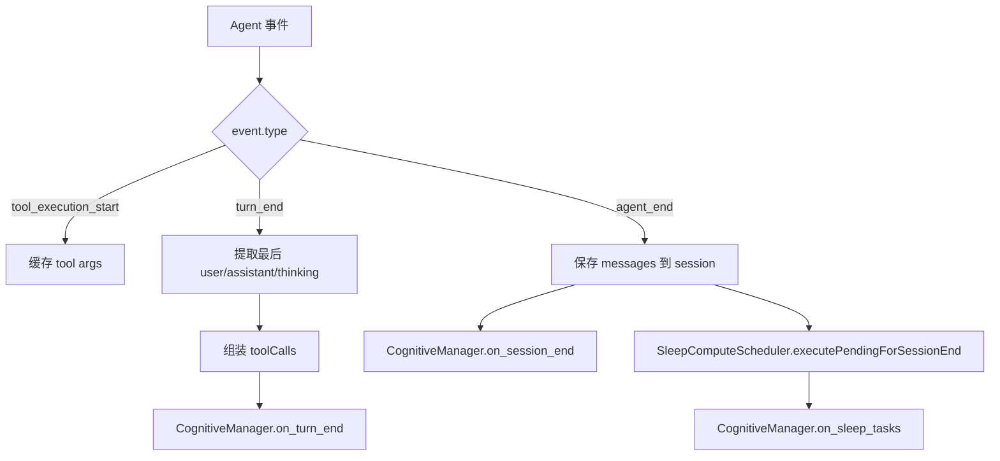

# F25：Persistent Agent 事件订阅与认知钩子

## 开篇场景

`PersistentAgent` 启动后，并不是被动地等待用户发消息。它需要在 Agent 运行的关键节点做额外工作：

- **tool_execution_start**：记录工具调用的参数，用于后续认知分析；
- **turn_end**：把本轮用户消息、助手回复、工具调用链、是否出错等信息交给 `CognitiveManager`；
- **agent_end**：保存完整消息历史到 `agentSessionService`，触发 `on_session_end` 和睡眠任务。

这节课看 `PersistentAgent` 的 `subscribe` 回调里这些认知钩子是如何组织的。

## 核心问题

**为什么 `PersistentAgent` 要在 `turn_end` 时把 tool args、tool results、用户纠正等信息组装成结构化数据交给认知系统？`agent_end` 和 `turn_end` 的职责边界是什么？**

## 概念阶梯

**turn_end**：一次用户消息处理完成的事件，包含最终消息、工具结果等。

**agent_end**：一次完整的 Agent 运行结束的事件，通常包含完整消息历史。

**CognitiveManager.on_turn_end**：每轮触发的轻量钩子，主要记录实践日志。

**CognitiveManager.on_session_end**：会话结束时触发的重量钩子，用于知识提取和模式沉淀。

**SleepComputeScheduler**：把延迟计算任务推迟到会话结束时执行，避免阻塞当前回复。

**Correction Detection**：检测用户消息中的纠正信号，如“不对”“应该”“改为”。

## 图解：事件订阅与认知钩子



## 源码精读

### 1. 订阅入口

[packages/core/src/lib/integrations/pi-agent/persistent-agent.ts 第 321—390 行](../../../../packages/core/src/lib/integrations/pi-agent/persistent-agent.ts#L321)

```typescript
this.agent.subscribe(async (event: any) => {
  // 追踪 tool args
  if (event.type === 'tool_execution_start') {
    this.turnArgs.set(event.toolCallId, event.args ?? {});
  }

  // agent_end：保存对话 + 触发 session_end
  if (event.type === 'agent_end' && event.messages?.length > 0) {
    try {
      await agentSessionService.updateSession(persistentSessionId, {
        messages: event.messages,
        status: 'completed',
      }, this.projectId);
    } catch (err) {
      console.warn('[PersistentAgent] Failed to save session messages:', err);
    }
  }

  // turn_end：认知钩子
  if (event.type === 'turn_end') {
    // ... 组装数据并调用 cognitiveManager.on_turn_end
  }

  // agent_end：session_end 钩子
  if (event.type === 'agent_end' && event.messages?.length > 0) {
    this.cognitiveManager?.on_session_end(event.messages);
  }

  // sleep-compute：会话结束时执行待处理任务
  if (event.type === 'agent_end' && this.sleepScheduler) {
    const pendingTasks = this.sleepScheduler.executePendingForSessionEnd();
    if (pendingTasks.length > 0) {
      this.cognitiveManager?.on_sleep_tasks(pendingTasks);
    }
  }
});
```

### 2. tool_execution_start：缓存参数

```typescript
if (event.type === 'tool_execution_start') {
  this.turnArgs.set(event.toolCallId, event.args ?? {});
}
```

`tool_execution_start` 是唯一携带原始工具参数的事件。后续 `turn_end` 里的 `toolResults` 只包含结果，不包含参数。所以这里用 `Map` 把 `toolCallId → args` 缓存起来。

### 3. turn_end 数据组装

[packages/core/src/lib/integrations/pi-agent/persistent-agent.ts 第 339—376 行](../../../../packages/core/src/lib/integrations/pi-agent/persistent-agent.ts#L339)

```typescript
if (event.type === 'turn_end') {
  const toolResults = event.toolResults ?? [];
  const messages = event.messages ?? [];
  const lastUser = findLastMessage(messages, 'user');
  const lastAssistant = findLastMessage(messages, 'assistant');
  const lastThinking = findLastThinking(messages);

  let anyError = false;
  const toolCalls = toolResults.map((tr: any) => {
    const args = this.turnArgs.get(tr.toolCallId) ?? {};
    this.turnArgs.delete(tr.toolCallId);
    const content = Array.isArray(tr.content)
      ? tr.content.filter((c: any) => c.type === 'text').map((c: any) => c.text).join('')
      : String(tr.content ?? '');
    if (tr.isError) anyError = true;
    return {
      name: tr.toolName ?? 'unknown',
      params: args,
      result: content,
      success: !tr.isError,
    };
  });

  this.cognitiveManager?.on_turn_end({
    turnNumber: ++this.turnCounter,
    userMessage: lastUser ?? '',
    assistantMessage: lastAssistant ?? '',
    assistantThinking: lastThinking,
    toolCalls,
    outcome: {
      resolved: !anyError,
      toolChainLength: toolResults.length,
      userCorrections: detectCorrections(lastUser ?? '').length || undefined,
    },
    timestamp: Date.now(),
  });
}
```

组装的数据结构：

- `turnNumber`：第几轮；
- `userMessage` / `assistantMessage`：最后一条用户/助手消息；
- `assistantThinking`：最后一条 assistant 消息中的 thinking 内容；
- `toolCalls`：本次调用的工具列表，包含名称、参数、结果、是否成功；
- `outcome.resolved`：是否有任何工具报错；
- `outcome.toolChainLength`：工具调用链长度；
- `outcome.userCorrections`：用户纠正信号数量。

### 4. agent_end：保存消息与触发 session_end

[packages/core/src/lib/integrations/pi-agent/persistent-agent.ts 第 328—336 行](../../../../packages/core/src/lib/integrations/pi-agent/persistent-agent.ts#L328)

```typescript
if (event.type === 'agent_end' && event.messages?.length > 0) {
  try {
    await agentSessionService.updateSession(persistentSessionId, {
      messages: event.messages,
      status: 'completed',
    }, this.projectId);
  } catch (err) {
    console.warn('[PersistentAgent] Failed to save session messages:', err);
  }
}
```

`agent_end` 时把完整消息历史写回 `agentSessionService`，保证持久化会话与 Agent 内部状态一致。

[packages/core/src/lib/integrations/pi-agent/persistent-agent.ts 第 379—381 行](../../../../packages/core/src/lib/integrations/pi-agent/persistent-agent.ts#L379)

```typescript
if (event.type === 'agent_end' && event.messages?.length > 0) {
  this.cognitiveManager?.on_session_end(event.messages);
}
```

然后触发 `CognitiveManager.on_session_end`，让认知系统做重量级的知识提取和模式沉淀。

### 5. sleep-compute 任务

[packages/core/src/lib/integrations/pi-agent/persistent-agent.ts 第 384—389 行](../../../../packages/core/src/lib/integrations/pi-agent/persistent-agent.ts#L384)

```typescript
if (event.type === 'agent_end' && this.sleepScheduler) {
  const pendingTasks = this.sleepScheduler.executePendingForSessionEnd();
  if (pendingTasks.length > 0) {
    this.cognitiveManager?.on_sleep_tasks(pendingTasks);
  }
}
```

`SleepComputeScheduler` 允许把某些不需要立即执行的认知任务（如摘要生成、模式分析）推迟到会话结束。`executePendingForSessionEnd` 取出所有待执行任务，交给 `CognitiveManager`。

### 6. 工具函数 findLastMessage / findLastThinking

[packages/core/src/lib/integrations/pi-agent/persistent-agent.ts 第 683—717 行](../../../../packages/core/src/lib/integrations/pi-agent/persistent-agent.ts#L683)

```typescript
function findLastMessage(messages: any[], role: string): string {
  for (let i = messages.length - 1; i >= 0; i--) {
    const msg = messages[i];
    if (msg.role === role) {
      if (typeof msg.content === 'string') return msg.content;
      if (Array.isArray(msg.content)) {
        return msg.content
          .filter((c: any) => c.type === 'text' && c.text)
          .map((c: any) => c.text)
          .join(' ');
      }
      break;
    }
  }
  return '';
}

function findLastThinking(messages: any[]): string {
  // 从最后一条 assistant 消息中提取 type='thinking' 块
}
```

这两个工具函数处理 AgentMessage 可能是字符串或数组的两种情况。

## 真实调用链

用户向项目 Agent 发送一条消息：

1. `usePersistentAgent.sendMessage` 调用 `sendProjectAgentMessage`。
2. `AgentProjectService` 调用 `agent.handleMessage(content)`。
3. `PersistentAgent.handleMessage` 调用 `this.agent.prompt(message)`。
4. `OriginOSAgent` 运行，产生事件流：
   - `tool_execution_start`：PersistentAgent 缓存 args；
   - `turn_end`：PersistentAgent 组装数据，调用 `CognitiveManager.on_turn_end`；
   - `agent_end`：PersistentAgent 保存消息，调用 `on_session_end` 和 sleep tasks。
5. 事件通过 IPC/SSE 推送到前端。

## 关键类型与数据示例

### TurnEndData 示例

```typescript
{
  turnNumber: 3,
  userMessage: '帮我列出项目根目录下的所有文件',
  assistantMessage: '我来帮你列出文件。',
  assistantThinking: '用户需要文件列表，我应该调用 list_files 工具。',
  toolCalls: [
    { name: 'list_files', params: { path: '.' }, result: '...', success: true }
  ],
  outcome: { resolved: true, toolChainLength: 1 },
  timestamp: 1234567890,
}
```

### userCorrections 触发条件

```typescript
const corrections = detectCorrections('不对，应该用 Python 而不是 Node.js');
// corrections.length > 0
```

## 失败路径与边界

| 场景 | 会发生什么 | 原因 |
|---|---|---|
| `toolResults` 包含 isError=true | `outcome.resolved=false` | 任意工具报错 |
| `turnArgs` 中找不到 toolCallId | `params` 为 `{}` | 可能是事件顺序异常 |
| `agentSessionService.updateSession` 失败 | 打印 warn，认知钩子仍执行 | 保存和认知解耦 |
| `cognitiveManager` 未注册 | 跳过认知钩子 | `?.` 可选调用 |

**一个关键边界**：`turnArgs` 在 `turn_end` 处理完后会 `delete`，避免内存泄漏。但如果 `tool_execution_start` 和 `turn_end` 之间出现 `agent_end` 或异常，可能导致 args 残留。目前依赖 Map 在 `turn_end` 时清理。

## 测试证据

- `persistent-agent.ts` 的事件处理当前无直接测试。
- 建议补测试：
  - mock `OriginOSAgent` 事件，验证 `on_turn_end` 收到的数据结构；
  - 工具报错时 `outcome.resolved` 为 false；
  - `agent_end` 时 `updateSession` 和 `on_session_end` 都被调用；
  - 用户纠正消息能正确计数。

## 练习与验收

1. **mock OriginOSAgent 事件**：构造 `tool_execution_start` + `turn_end` + `agent_end` 序列，验证 `CognitiveManager` 收到正确调用。
2. **测试工具报错路径**：让 `toolResults` 中有一个 `isError=true`，验证 `resolved=false`。
3. **测试 session 保存失败**：让 `agentSessionService.updateSession` 抛错，验证认知钩子仍然执行。
4. **分析内存泄漏风险**：如果 `turn_end` 事件丢失，`turnArgs` 是否会无限增长？提出改进方案。

**验收标准**：能解释 `turn_end` 和 `agent_end` 的职责边界，能独立 mock 事件并验证认知钩子的调用。

## 章节收束

本节课看了 `PersistentAgent` 的事件订阅和认知钩子。下一节课看 `PersistentAgentManager`，它管理多个项目的 PersistentAgent 实例，并负责注册认知 Providers 和 Memory Core 工具。
