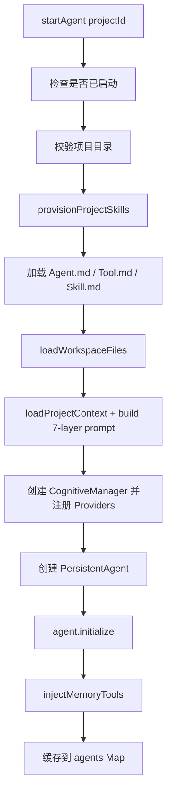

# F26：Persistent Agent Manager —— 项目 Agent 生命周期与认知 Providers

## 开篇场景

一个 Desktop 端可能同时打开多个项目，每个项目对应一个长期运行的 Agent。系统需要：

1. 保证每个项目只有一个 Agent 实例（单例 per project）；
2. 启动时补齐项目依赖的 bundled Skill；
3. 加载项目上下文，构建 7 层 system prompt；
4. 创建 `CognitiveManager`，注册实践日志、知识、记忆、模式四个 Providers；
5. 注入 Memory Core 工具，让 Agent 能读写 core memory 和 archival memory；
6. 支持热重载和停止所有 Agent。

这些职责都在 `PersistentAgentManager` 中。

## 核心问题

**为什么 `PersistentAgentManager` 既是单例又要挂载到 `globalThis`？它在启动项目 Agent 时做了哪些前置准备？**

## 概念阶梯

**PersistentAgentManager**：管理多个 `PersistentAgent` 实例的单例，提供项目 Agent 的完整生命周期管理。

**ProjectContext**：项目上下文，包含 `Agent.md`、`Tool.md`、`Memory.md`、`Knowledge.md`、`Patterns.md`、`business-model.json` 等，用于构建 7 层 prompt。

**Cognitive Providers**：认知系统的插件，包括 `PracticeLogger`、`KnowledgeProvider`、`MemoryProvider`、`PatternProvider`。

**Memory Core**：三层记忆系统（core memory、archival memory、working memory），为 Agent 提供长期存储和检索能力。

**Global Singleton via globalThis**：在 Next.js HMR 或 Electron 多窗口环境下，避免实例被重复创建。

## 图解：startAgent 的 8 个步骤



## 源码精读

### 1. 单例与 globalThis

[packages/core/src/lib/integrations/pi-agent/persistent-agent-manager.ts 第 441—455 行](../../../../packages/core/src/lib/integrations/pi-agent/persistent-agent-manager.ts#L441)

```typescript
declare global {
  var __globalPersistentAgentManager: PersistentAgentManager | undefined;
}

function getGlobalPersistentAgentManager(): PersistentAgentManager {
  if (!globalThis.__globalPersistentAgentManager) {
    globalThis.__globalPersistentAgentManager = new PersistentAgentManager();
  }
  return globalThis.__globalPersistentAgentManager;
}

export const persistentAgentManager = getGlobalPersistentAgentManager();
```

在 Next.js 开发模式下，模块可能被热重载重新执行；在 Electron 多窗口中，每个窗口可能有独立的 renderer 进程。通过 `globalThis` 挂载单例，可以保证跨 HMR/进程只有一个管理器实例。

### 2. startAgent 步骤日志

[packages/core/src/lib/integrations/pi-agent/persistent-agent-manager.ts 第 54—62 行](../../../../packages/core/src/lib/integrations/pi-agent/persistent-agent-manager.ts#L54)

```typescript
async startAgent(projectId: string, llmConfig?: RuntimeLLMConfig): Promise<PersistentAgent> {
  console.log(`[Manager] ========== START AGENT: ${projectId} ==========`);
  const t0 = Date.now();
  let lastStepAt = t0;
  const logStep = (label: string): void => {
    const now = Date.now();
    console.log(`[Manager] ${label} in ${now - lastStepAt}ms (total ${now - t0}ms)`);
    lastStepAt = now;
  };
  // ...
}
```

Manager 用步骤日志输出每个阶段的耗时，便于性能调优。

### 3. 幂等启动与 LLM 配置应用

[packages/core/src/lib/integrations/pi-agent/persistent-agent-manager.ts 第 65—72 行](../../../../packages/core/src/lib/integrations/pi-agent/persistent-agent-manager.ts#L65)

```typescript
if (this.agents.has(projectId)) {
  console.log(`[Manager] Agent already running for project: ${projectId}`);
  const existingAgent = this.agents.get(projectId)!;
  if (llmConfig) {
    existingAgent.applyLLMConfig(llmConfig);
  }
  return existingAgent;
}
```

如果 Agent 已在运行，直接复用，并应用新的 LLM 配置。这样用户调整模型参数后不需要重启 Agent。

### 4. 项目 Skill 补齐

[packages/core/src/lib/integrations/pi-agent/persistent-agent-manager.ts 第 86—91 行](../../../../packages/core/src/lib/integrations/pi-agent/persistent-agent-manager.ts#L86)

```typescript
const provisionedSkills = await provisionProjectSkills(projectDir);
const missingSkills = provisionedSkills.filter((result) => result.status === 'missing');
if (missingSkills.length > 0) {
  throw new Error(`Bundled project skills not found: ${missingSkills.map((result) => result.skillName).join(', ')}`);
}
```

每个项目启动前，系统会检查并补齐项目依赖的 bundled Skill（如项目初始化、本体编辑等）。如果缺少关键 Skill，启动失败。

### 5. 7 层项目 Prompt 构建

[packages/core/src/lib/integrations/pi-agent/persistent-agent-manager.ts 第 108—118 行](../../../../packages/core/src/lib/integrations/pi-agent/persistent-agent-manager.ts#L108)

```typescript
const projectCtx = await loadProjectContext(projectDir, projectId, agentDef.agentId);
let systemPrompt: string | undefined;
if (projectCtx) {
  const layers = buildProjectPromptLayers(projectCtx);
  systemPrompt = assembleProjectPrompt(layers);
  console.log(`[Manager] Step 4c: Built 7-layer system prompt`);
} else {
  console.warn(`[Manager] Step 4c: ProjectContext not loaded, falling back to workspace files`);
}
```

Manager 调用 `project-agent/project-context.ts` 加载项目上下文，再用 `project-agent/project-prompt.ts` 构建 7 层 system prompt，然后作为 `builtSystemPrompt` 传给 `PersistentAgent`。

### 6. 注册认知 Providers

[packages/core/src/lib/integrations/pi-agent/persistent-agent-manager.ts 第 121—136 行](../../../../packages/core/src/lib/integrations/pi-agent/persistent-agent-manager.ts#L121)

```typescript
const cognitiveManager = new CognitiveManager(projectDir);
cognitiveManager.register(new PracticeLogger(projectDir));
const knowledgeProvider = new KnowledgeProvider(projectDir);
cognitiveManager.register(knowledgeProvider);

const memoryCore = new MemoryCore(projectDir, projectId);
const memoryProvider = new MemoryProvider(memoryCore, projectId, knowledgeProvider);
cognitiveManager.register(memoryProvider);

const patternProvider = new PatternProvider(projectDir, memoryCore.archival);
patternProvider.initialize()
  .then(() => console.log(`[Manager] PatternProvider initialized in background for ${projectId}`))
  .catch((e: unknown) => console.warn('[Manager] PatternProvider init error:', e));
cognitiveManager.register(patternProvider);
```

四个 Providers：

- **PracticeLogger**：记录每轮实践日志到 JSONL。
- **KnowledgeProvider**：周期性分析日志，提取知识到 `knowledge/`。
- **MemoryProvider**：基于 Memory Core 的三层记忆，维护 core memory blocks。
- **PatternProvider**：从实践中沉淀经验模式到 `patterns/`。

### 7. 创建 PersistentAgent

[packages/core/src/lib/integrations/pi-agent/persistent-agent-manager.ts 第 148—159 行](../../../../packages/core/src/lib/integrations/pi-agent/persistent-agent-manager.ts#L148)

```typescript
const agent = new PersistentAgent({
  projectId,
  workingDirectory: projectDir,
  agentDefinition: agentDef,
  toolDefinition: toolDef,
  skillDefinition: skillDef,
  workspaceFiles,
  builtSystemPrompt: systemPrompt,
  cognitiveManager,
  completionGuardEnabled: false,
});
```

注意 `completionGuardEnabled: false`：项目 Agent 的完成判定由外部服务（如 `AgentProjectService`）处理，而不是 PersistentAgent 内部。

### 8. 注入 Memory Core 工具

[packages/core/src/lib/integrations/pi-agent/persistent-agent-manager.ts 第 273—337 行](../../../../packages/core/src/lib/integrations/pi-agent/persistent-agent-manager.ts#L273)

```typescript
private injectMemoryTools(agent: PersistentAgent, memoryCore: MemoryCore): void {
  const innerAgent = agent.getAgent();
  if (!innerAgent) return;

  const coreMemoryTools = new CoreMemoryTools(memoryCore.memory);
  const archivalMemoryTools = new ArchivalMemoryTools(memoryCore.archival);

  innerAgent.registerTool({
    name: 'core_memory_append',
    description: 'Append content to a core memory block.',
    // ...
    execute: async (_toolCallId, args) => { ... },
  } as any);

  // ... core_memory_replace, insert_memory_block, read_memory_block,
  //     archival_memory_insert, archival_memory_search
}
```

注入 6 个 Memory Core 工具：

- `core_memory_append`
- `core_memory_replace`
- `insert_memory_block`
- `read_memory_block`
- `archival_memory_insert`
- `archival_memory_search`

这些工具让 Agent 在运行时可以直接操作自己的长期记忆。

### 9. 其他生命周期方法

[packages/core/src/lib/integrations/pi-agent/persistent-agent-manager.ts 第 183—264 行](../../../../packages/core/src/lib/integrations/pi-agent/persistent-agent-manager.ts#L183)

```typescript
async stopAgent(projectId: string): Promise<void> { ... }
getAgent(projectId: string): PersistentAgent | null { ... }
isAgentRunning(projectId: string): boolean { ... }
getAllAgentStatus(): AgentStatus[] { ... }
async reloadAgent(projectId: string): Promise<void> { ... }
async stopAllAgents(): Promise<void> { ... }
```

- `stopAgent`：停止并删除实例。
- `getAgent / isAgentRunning`：状态查询。
- `getAllAgentStatus`：返回所有运行中 Agent 的状态数组。
- `reloadAgent`：重新读取配置并调用 `PersistentAgent.reload`。
- `stopAllAgents`：应用退出时调用。

## 真实调用链

Desktop 打开项目窗口：

1. `usePersistentAgent` 调用 `startProjectAgent`。
2. `AgentProjectService` 调用 `persistentAgentManager.startAgent(projectId, llmConfig)`。
3. Manager 检查实例、补齐 Skill、加载配置、构建 7 层 prompt。
4. 创建 `CognitiveManager` 和 `MemoryCore`，注册 Providers。
5. 创建 `PersistentAgent` 并 `initialize`。
6. 注入 Memory Core 工具。
7. 返回 Agent 实例，前端开始接收事件。

## 关键类型与数据示例

### AgentStatus

```typescript
{
  projectId: 'proj-abc',
  isRunning: true,
  agentType: 'project',
  version: '1.0.0',
  startedAt: 1234567890,
}
```

### 启动步骤耗时日志

```
[Manager] ========== START AGENT: proj-abc ==========
[Manager] Step 3b project skills provisioned in 12ms (total 12ms)
[Manager] Step 4 config files loaded in 5ms (total 17ms)
[Manager] Step 4c project context loaded in 8ms (total 25ms)
...
[Manager] ========== Agent started in 234ms ==========
```

## 失败路径与边界

| 场景 | 会发生什么 | 原因 |
|---|---|---|
| 项目目录不存在 | 抛错 `Project directory not found` | `fs.access` 失败 |
| bundled project skill 缺失 | 抛错，启动失败 | `provisionProjectSkills` 发现 missing |
| `Agent.md` 不存在 | 使用默认 Agent 定义 | `loadAgentDefinition` 兜底 |
| `Tool.md` 不存在 | 允许所有工具 | `loadToolDefinition` 兜底 |
| `loadProjectContext` 失败 | 退回到 workspace files prompt | 兼容旧项目 |
| Memory Core 工具注入失败 | 打印 warn，不影响启动 | catch 处理 |

**一个关键边界**：`PatternProvider.initialize()` 是后台异步执行的，不阻塞 Agent 启动。如果初始化失败，只打印 warn，不影响用户交互。这是“非关键路径异步化”的设计。

## 测试证据

- `PersistentAgentManager` 当前无直接测试。
- 建议补测试：
  - 幂等启动：同一 projectId 调用两次，返回同一实例；
  - LLM 配置应用：第二次调用传入不同 `llmConfig`，验证 `applyLLMConfig`；
  - 缺失项目目录：验证抛出错误；
  - Memory Core 工具注入：验证 `innerAgent.registerTool` 被调用 6 次。

## 练习与验收

1. **mock startAgent 完整流程**：用 mock `fs`、`MemoryCore`、`PersistentAgent` 验证 8 个步骤的调用顺序。
2. **测试 Provider 注册**：验证 `CognitiveManager.register` 被调用 4 次。
3. **测试 Memory Core 工具注入**：构造 mock `PersistentAgent`，验证 6 个工具的 `name` 和 `description`。
4. **分析 PatternProvider 后台初始化失败**：如果初始化失败，系统行为是否正确？如何改进？

**验收标准**：能解释 `PersistentAgentManager` 的启动流程，能独立追踪从项目目录到 Memory Core 工具注入的完整链路。

## 章节收束

本节课看了 `PersistentAgentManager`，它是项目 Agent 的“总控台”。下一节课看前端如何与它交互：`usePersistentAgent` Hook。
