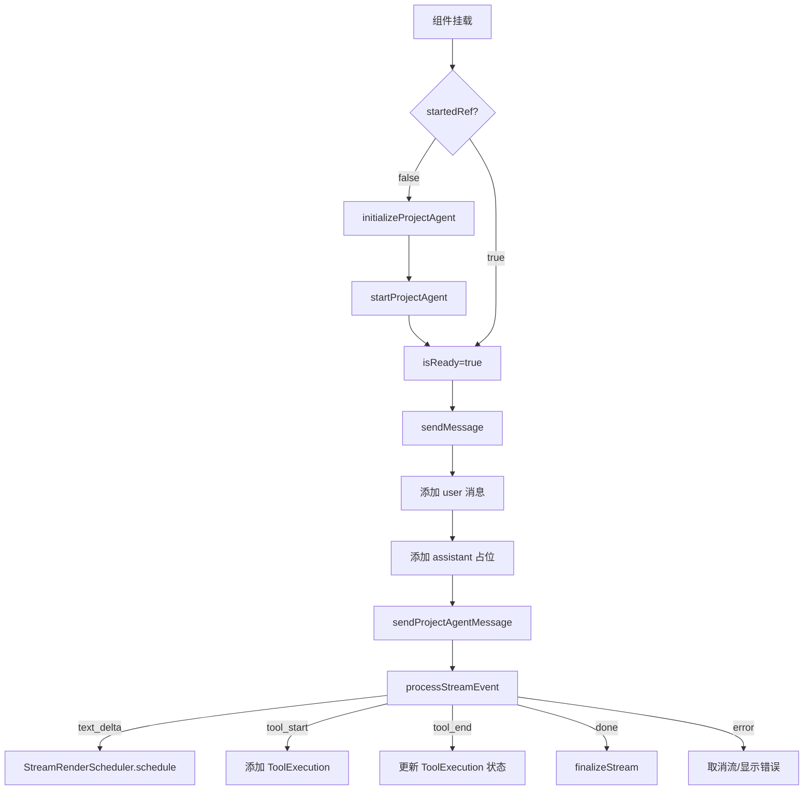

# F27：usePersistentAgent —— React Hook 与流式状态管理

## 开篇场景

在 Desktop 的项目窗口中，用户发送一条消息。前端需要：

1. 确保项目 Agent 已启动；
2. 把用户消息加入本地消息列表；
3. 显示一个占位 assistant 消息，等待流式增量；
4. 处理 `text_delta`、`assistant_message`、`tool_start`、`tool_end`、`artifact_changed`、`done`、`error` 等多种事件；
5. 支持中止当前生成；
6. 组件卸载或 StrictMode 双挂载时，避免重复启动/停止 Agent。

`usePersistentAgent` 就是封装这些逻辑的 React Hook。

## 核心问题

**为什么 `usePersistentAgent` 需要同时处理 Agent 生命周期、流式增量调度、工具执行帧和中止状态？React StrictMode 双挂载会带来什么问题？**

## 概念阶梯

**AgentMessage**：前端消息模型，包含 `role`、`content`、`timestamp`、`isStreaming`。

**ToolExecution**：工具执行帧，包含 `id`、`name`、`status`、`args`、`result`。

**StreamRenderScheduler**：流式渲染调度器，控制增量文本的提交频率，避免过频重渲染。

**appendStreamDelta / reconcileFinalStreamContent**：流式去重/对齐工具，处理增量文本和最终文本的一致性。

**StrictMode Double Mount**：React StrictMode 会故意双重挂载组件，Hook 需要避免因此创建两个 Agent 实例。

## 图解：usePersistentAgent 状态机



## 源码精读

### 1. Hook 签名与状态

[packages/core/src/lib/integrations/pi-agent/use-persistent-agent.ts 第 56—69 行](../../../../packages/core/src/lib/integrations/pi-agent/use-persistent-agent.ts#L56)

```typescript
export function usePersistentAgent(projectId: string, llmConfig?: LlmConfig): UsePersistentAgentState {
  const [isReady, setIsReady] = useState(false);
  const [isThinking, setIsThinking] = useState(false);
  const [messages, setMessages] = useState<AgentMessage[]>([]);
  const [toolExecutions, setToolExecutions] = useState<ToolExecution[]>([]);
  const [artifactVersion, setArtifactVersion] = useState(0);
  const abortRef = useRef<AbortController | null>(null);
  const abortingRef = useRef(false);
  const startedRef = useRef(false);
  const initTimestamp = useRef(0);
  const streamSchedulersRef = useRef(new Map<string, { content: string; scheduler: StreamRenderScheduler }>());
  // ...
}
```

状态说明：

- `isReady`：Agent 是否已启动。
- `isThinking`：Agent 是否正在生成回复。
- `messages`：消息列表。
- `toolExecutions`：当前轮次的工具执行帧。
- `artifactVersion`：业务模型等产物变更计数，用于触发前端刷新。
- `startedRef` / `initTimestamp`：防止 StrictMode 双挂载导致重复启动。
- `streamSchedulersRef`：每个 assistant 消息对应一个流式调度器。

### 2. 启动 Agent 与 StrictMode 处理

[packages/core/src/lib/integrations/pi-agent/use-persistent-agent.ts 第 120—171 行](../../../../packages/core/src/lib/integrations/pi-agent/use-persistent-agent.ts#L120)

```typescript
useEffect(() => {
  const instanceTs = Date.now();
  const streamSchedulers = streamSchedulersRef.current;
  initTimestamp.current = instanceTs;
  if (startedRef.current) return;
  startedRef.current = true;

  const start = async () => {
    try {
      await initializeProjectAgent(projectId);
      const res = await startProjectAgent({ projectId, sessionId: `project-${projectId}`, llmConfig });
      if (res.success) {
        setIsReady(true);
      } else {
        console.error('[usePersistentAgent] Failed to start agent:', res.error);
      }
    } catch (e) {
      console.error('[usePersistentAgent] Error starting agent:', e);
    }
  };

  start();

  return () => {
    for (const state of streamSchedulers.values()) {
      state.scheduler.cancel();
    }
    streamSchedulers.clear();
    timer = setTimeout(() => {
      if (initTimestamp.current !== instanceTs) {
        console.log('[usePersistentAgent] Cleanup cancelled: component remounted (StrictMode)');
        return;
      }
      stopProjectAgent({ projectId }).catch(() => {});
    }, 500);
  };
}, [projectId]);
```

关键点：

1. `startedRef.current` 保证同一个 Hook 实例只启动一次。
2. `instanceTs` 和 `initTimestamp` 用于区分 StrictMode 的第一次挂载清理和第二次真实挂载。
3. 卸载时延迟 500ms 停止 Agent，如果 500ms 内组件重新挂载（StrictMode），则取消停止。

### 3. 流式状态管理

[packages/core/src/lib/integrations/pi-agent/use-persistent-agent.ts 第 71—117 行](../../../../packages/core/src/lib/integrations/pi-agent/use-persistent-agent.ts#L71)

```typescript
const getStreamState = useCallback((assistantId: string) => {
  const existing = streamSchedulersRef.current.get(assistantId);
  if (existing) return existing;
  const state = {
    content: '',
    scheduler: new StreamRenderScheduler({
      onCommit: (nextContent, isStreaming) => {
        setMessages(prev => prev.map(message =>
          message.id === assistantId
            ? { ...message, content: nextContent, isStreaming }
            : message
        ));
      },
      onDebug: (debugEvent) => { ... },
    }),
  };
  streamSchedulersRef.current.set(assistantId, state);
  return state;
}, [projectId]);

const finalizeStream = useCallback(async (assistantId: string, finalContent?: string) => {
  // ... 调用 scheduler.finish 并清理 Map
}, [getStreamState]);
```

每个 assistant 占位消息有一个 `StreamRenderScheduler`：

- `text_delta` 事件到达时，追加到 `state.content`，并调用 `scheduler.schedule`；
- `scheduler` 按一定频率把新内容 commit 到 React state；
- 流结束时调用 `finalizeStream`，用 `reconcileFinalStreamContent` 对齐最终文本，清理 Map。

### 4. 处理流式事件

[packages/core/src/lib/integrations/pi-agent/use-persistent-agent.ts 第 173—214 行](../../../../packages/core/src/lib/integrations/pi-agent/use-persistent-agent.ts#L173)

```typescript
const processStreamEvent = useCallback((
  event: { type: string; data: unknown },
  assistantId: string
) => {
  if (event.type === 'text_delta') {
    const delta = (event.data as { delta?: string })?.delta || '';
    const state = getStreamState(assistantId);
    state.content = appendStreamDelta(state.content, delta);
    state.scheduler.schedule(state.content);
  } else if (event.type === 'assistant_message') {
    const data = event.data as { content: string };
    const state = getStreamState(assistantId);
    state.content = reconcileFinalStreamContent(state.content, data.content);
    void state.scheduler.finish(state.content);
  } else if (event.type === 'tool_start') {
    setToolExecutions(prev => [...prev, { id, name, status: 'running', args, timestamp }]);
  } else if (event.type === 'tool_end') {
    setToolExecutions(prev => prev.map(t =>
      t.id === id ? { ...t, status: isError ? 'error' : 'completed', result } : t
    ));
  } else if (event.type === 'artifact_changed') {
    setArtifactVersion(v => v + 1);
  }
}, [finalizeStream, getStreamState]);
```

事件类型映射：

- `text_delta`：增量文本更新。
- `assistant_message`：最终完整 assistant 消息（用于对齐）。
- `tool_start` / `tool_end`：工具执行帧。
- `artifact_changed`：产物文件变更，触发前端刷新。
- `done`：在 `onDone` 回调中处理。
- `error`：在 `onError` 回调中处理。

### 5. sendMessage 流程

[packages/core/src/lib/integrations/pi-agent/use-persistent-agent.ts 第 216—303 行](../../../../packages/core/src/lib/integrations/pi-agent/use-persistent-agent.ts#L216)

```typescript
const sendMessage = useCallback(async (content: string) => {
  if (!isReady || isThinking) return;
  // 等待 abort 完成
  // 添加 user 消息
  // 添加 assistant 占位
  // 调用 sendProjectAgentMessage
  // onEvent -> processStreamEvent
  // onDone -> finalizeStream + setIsThinking(false)
  // onError -> cancelStream + 显示错误
}, [projectId, isReady, isThinking, llmConfig, processStreamEvent, finalizeStream, cancelStream]);
```

### 6. triggerGreeting

[packages/core/src/lib/integrations/pi-agent/use-persistent-agent.ts 第 305—377 行](../../../../packages/core/src/lib/integrations/pi-agent/use-persistent-agent.ts#L305)

```typescript
const triggerGreeting = useCallback(async () => {
  if (!isReady || isThinking) return;
  // 不添加 user 消息，发送 __SYSTEM_TRIGGER_GREETING__
  // 其余流程与 sendMessage 相同
}, [projectId, isReady, isThinking, llmConfig, processStreamEvent, finalizeStream, cancelStream]);
```

项目窗口打开时，可以调用 `triggerGreeting()` 让 Agent 自动生成问候语，而不需要用户先发消息。

### 7. abort 流程

[packages/core/src/lib/integrations/pi-agent/use-persistent-agent.ts 第 379—407 行](../../../../packages/core/src/lib/integrations/pi-agent/use-persistent-agent.ts#L379)

```typescript
const abort = useCallback(async () => {
  abortRef.current?.abort();
  for (const state of streamSchedulersRef.current.values()) {
    state.scheduler.cancel();
  }
  streamSchedulersRef.current.clear();
  abortingRef.current = true;
  // 如果占位消息有内容则保留，无内容则移除
  setMessages(prev => {
    const last = prev[prev.length - 1];
    if (last?.role === 'assistant' && last?.isStreaming) {
      if (last.content) return prev.map(m => m === last ? { ...m, isStreaming: false } : m);
      return prev.filter(m => m !== last);
    }
    return prev;
  });
  setIsThinking(false);
  try { await abortProjectAgent({ projectId }); } catch {}
  await new Promise(r => setTimeout(r, 300));
  abortingRef.current = false;
}, [projectId]);
```

中止时：

1. 取消 AbortController；
2. 取消所有流式调度器；
3. 设置 `abortingRef`，阻止新的 `sendMessage`；
4. 清理 UI 中的占位消息；
5. 通知服务端中止；
6. 等待 300ms 让服务端状态清理完成。

## 真实调用链

用户在项目窗口输入消息：

1. `usePersistentAgent.sendMessage(content)`。
2. 添加用户消息和 assistant 占位。
3. `sendProjectAgentMessage` 通过 IPC/SSE 发送到 `AgentProjectService`。
4. `AgentProjectService` 调用 `agent.handleMessage(content)`。
5. `PersistentAgent` 内部事件通过 IPC/SSE 推回前端。
6. `processStreamEvent` 更新 `messages` 和 `toolExecutions`。
7. `onDone` 调用 `finalizeStream`，结束当前轮次。

## 关键类型与数据示例

### UsePersistentAgentState

```typescript
{
  isReady: true,
  isThinking: false,
  messages: [
    { role: 'user', content: '帮我列出文件', timestamp: 1234567890 },
    { id: 'assistant-...', role: 'assistant', content: '...', timestamp: 1234567891, isStreaming: false }
  ],
  toolExecutions: [
    { id: 'tool-1', name: 'list_files', status: 'completed', args: { path: '.' }, result: '...', timestamp: 1234567892 }
  ],
  artifactVersion: 1,
  sendMessage: async (content: string) => {},
  triggerGreeting: async () => {},
  abort: () => {},
}
```

## 失败路径与边界

| 场景 | 会发生什么 | 原因 |
|---|---|---|
| Agent 未就绪时 sendMessage | 直接返回 | `if (!isReady \|\| isThinking) return` |
| 正在 abort 时 sendMessage | 等待最多 3 秒 | `abortingRef.current` 检查 |
| sendProjectAgentMessage 失败 | 取消流，显示错误 | `onError` / `res.success=false` |
| StrictMode 双挂载 | 只启动一次 Agent，清理被取消 | `startedRef` + `initTimestamp` |
| 组件卸载 | 500ms 后停止 Agent | 延迟清理 |

**一个关键边界**：`usePersistentAgent` 的 `projectId` 在 `useEffect` 依赖数组中，如果 `projectId` 变化，Hook 会认为组件卸载并启动新 Agent。因此切换项目时应重新挂载组件或重置 `startedRef`。

## 测试证据

- `usePersistentAgent` 当前无直接测试。
- 建议补测试：
  - StrictMode 双挂载不重复启动；
  - `text_delta` 事件正确更新消息内容；
  - `tool_start` / `tool_end` 正确维护工具执行帧；
  - `abort` 后 `isThinking` 为 false，占位消息被移除；
  - `triggerGreeting` 不添加 user 消息。

## 练习与验收

1. **mock 事件序列**：构造 `text_delta`、`tool_start`、`tool_end`、`assistant_message`、`done` 序列，验证 `messages` 和 `toolExecutions` 的最终状态。
2. **测试 StrictMode 双挂载**：模拟组件挂载→卸载→挂载，验证 `startProjectAgent` 只调用一次。
3. **测试 abort 行为**：在流式过程中调用 `abort`，验证占位消息处理。
4. **分析 projectId 变化**：如果在同一个组件中切换 projectId，会发生什么？如何修复？

**验收标准**：能解释 `usePersistentAgent` 的启动、流式、中止三条主线，能独立 mock 事件并验证 UI 状态。

## 章节收束

本节课看了 `usePersistentAgent` Hook。它是 Web/Desktop 复用的前端入口，负责把项目 Agent 的运行时状态映射到 React 状态。下一节课看几个支撑 prompt 和 trace 的小文件：`memory-consumption`、`runtime-working-summary`、`recent-trace-compression`。
