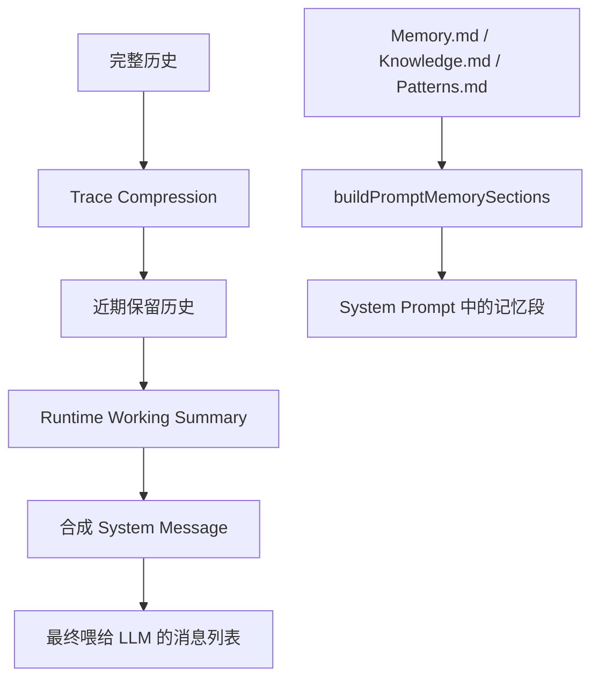

# F28：Prompt 记忆、工作摘要与 Trace 压缩

## 开篇场景

Agent 运行越久，消息历史越长。如果每次都把完整历史喂给 LLM，上下文窗口和成本都会爆炸。系统需要在几个层面做“瘦身”：

1. **Prompt 记忆注入**：启动时把 `Memory.md`、`Knowledge.md`、`Patterns.md` 注入 system prompt，但做截断，避免过长；
2. **运行时工作摘要**：从近期消息中提取“当前任务、最近失败原因、禁止重复动作”，作为 synthetic system message 插入；
3. **Trace 压缩**：对远期的工具调用链进行有损压缩，只保留最近若干轮和最近若干条完整 trace。

这节课看三个小文件：

- `memory-consumption.ts`
- `runtime-working-summary.ts`
- `recent-trace-compression.ts`

## 核心问题

**为什么记忆注入、工作摘要、trace 压缩要分开处理？它们分别解决什么问题，又是如何相互配合的？**

## 概念阶梯

**PromptMemoryContract**：包含 `memoryBlocks`、`memoryMd`、`knowledgeMd`、`patternsMd` 的记忆注入合同。

**PromptMemorySections**：把上述合同转换成 system prompt 中四个 section 的字符串块。

**RuntimeWorkingSummary**：运行时工作摘要，包含 `currentTask`、`failureReason`、`doNotRepeat`。

**Synthetic System Message**：运行时动态构造的 system 消息，不来自用户或助手。

**Trace Compression**：对历史消息进行有损压缩，保留最近用户/助手轮次和最近工具调用 trace。

## 图解：三层瘦身机制



## 源码精读

### 1. buildPromptMemorySections

[packages/core/src/lib/integrations/pi-agent/memory-consumption.ts 第 24—52 行](../../../../packages/core/src/lib/integrations/pi-agent/memory-consumption.ts#L24)

```typescript
export function buildPromptMemorySections(
  options: BuildPromptMemorySectionsOptions,
): PromptMemorySections {
  const coreMemorySection = options.memoryBlocks && options.memoryBlocks.length > 0
    ? `\n### Core Memory\n\n<memory_blocks>...${renderMemoryBlocksXML(options.memoryBlocks)}</memory_blocks>`
    : '';

  const stableMemorySection = (!options.memoryBlocks || options.memoryBlocks.length === 0) && options.memoryMd
    ? `\n### ${options.stableMemoryHeading ?? 'Long-term Stable Memory'}\n\n${toStableMemoryExcerpt(options.memoryMd, options.maxStableMemoryChars ?? 4000)}`
    : '';

  const knowledgeSection = options.knowledgeMd
    ? `\n### ${options.knowledgeHeading ?? 'Knowledge Base Snapshot'}\n\n${options.knowledgeMd}`
    : '';

  const patternsSection = options.patternsMd
    ? `\n### ${options.patternsHeading ?? 'Experience Patterns Snapshot'}\n\n${options.patternsMd}`
    : '';

  return { coreMemorySection, stableMemorySection, knowledgeSection, patternsSection };
}
```

四个 section 互斥或组合：

- 如果提供了 `memoryBlocks`，渲染 Core Memory XML；
- 否则如果有 `memoryMd`，渲染 Long-term Stable Memory（截断）；
- `knowledgeMd` 和 `patternsMd` 可选注入。

### 2. toStableMemoryExcerpt

[packages/core/src/lib/integrations/pi-agent/memory-consumption.ts 第 54—72 行](../../../../packages/core/src/lib/integrations/pi-agent/memory-consumption.ts#L54)

```typescript
export function toStableMemoryExcerpt(memoryMd: string, maxChars: number): string {
  const normalized = memoryMd.trim();
  if (!normalized) return '';

  const sections = normalized
    .split(/\n(?=##\s+)/)
    .map((section) => section.trim())
    .filter(Boolean);

  const preferredSection = sections.find((section) => section.startsWith('## 更新记忆'))
    ?? sections.find((section) => section.startsWith('## '))
    ?? normalized;

  if (preferredSection.length <= maxChars) return preferredSection;
  return `${preferredSection.slice(0, maxChars).trim()}\n\n[长期记忆摘要已截断，更多内容请通过 memory / read_file 按需读取]`;
}
```

优先选择 `## 更新记忆` section，否则选第一个 `## ` section。如果仍超过 `maxChars`，截断并提示 Agent 可通过工具读取完整内容。

### 3. renderMemoryBlocksXML

[packages/core/src/lib/integrations/pi-agent/memory-consumption.ts 第 74—99 行](../../../../packages/core/src/lib/integrations/pi-agent/memory-consumption.ts#L74)

```typescript
export function renderMemoryBlocksXML(blocks: MemoryBlock[]): string {
  const lines: string[] = [];
  blocks.forEach((block, idx) => {
    const label = block.label || 'block';
    const value = block.value || '';
    const desc = block.description || '';
    const charsCurrent = value.length;
    const limit = block.limit || 0;

    lines.push(`<${label}>`);
    lines.push('<description>', desc, '</description>');
    lines.push('<metadata>');
    if (block.readOnly) lines.push('- read_only=true');
    lines.push(`- chars_current=${charsCurrent}`);
    lines.push(`- chars_limit=${limit}`);
    lines.push('</metadata>');
    lines.push('<value>', value, '</value>');
    lines.push(`</${label}>`);
    if (idx !== blocks.length - 1) lines.push('');
  });
  return lines.join('\n');
}
```

输出 Letta 风格的 XML，让 LLM 理解每个 memory block 的限额和只读属性。

### 4. buildRuntimeWorkingSummary

[packages/core/src/lib/integrations/pi-agent/runtime-working-summary.ts 第 66—96 行](../../../../packages/core/src/lib/integrations/pi-agent/runtime-working-summary.ts#L66)

```typescript
export function buildRuntimeWorkingSummary(messages: AgentMessage[]): RuntimeWorkingSummary {
  const currentTask = [...messages]
    .reverse()
    .find((message) => message.role === 'user');
  const currentTaskText = currentTask
    ? normalizeLine(getTextContent(currentTask)).slice(0, 200)
    : undefined;

  let failureReason: string | undefined;
  let doNotRepeat: string | undefined;

  for (const message of [...messages].reverse()) {
    const text = getTextContent(message);
    if (!text) continue;
    if (!failureReason) failureReason = extractFailureReason(text);
    if (!doNotRepeat) doNotRepeat = extractDoNotRepeat(text);
    if (failureReason && doNotRepeat) break;
  }

  return { currentTask: currentTaskText, failureReason, doNotRepeat };
}
```

从近期消息中提取：

- `currentTask`：最近一条用户消息；
- `failureReason`：最近的失败原因（匹配“失败原因”、“Error:”、“not found”、“不存在”）；
- `doNotRepeat`：最近的禁止重复指令（匹配“不要重复”、“改为”等）。

### 5. createWorkingSummaryMessage

[packages/core/src/lib/integrations/pi-agent/runtime-working-summary.ts 第 98—127 行](../../../../packages/core/src/lib/integrations/pi-agent/runtime-working-summary.ts#L98)

```typescript
export function createWorkingSummaryMessage(messages: AgentMessage[]): AgentMessage | null {
  const summary = buildRuntimeWorkingSummary(messages);
  if (!summary.currentTask && !summary.failureReason && !summary.doNotRepeat) {
    return null;
  }

  const lines = ['[Working Summary]'];
  if (summary.currentTask) lines.push(`当前任务：${summary.currentTask}`);
  if (summary.failureReason) lines.push(`最近失败原因：${summary.failureReason}`);
  if (summary.doNotRepeat) lines.push(`禁止重复动作：${summary.doNotRepeat}`);

  return {
    role: 'system',
    content: [{ type: 'text', text: lines.join('\n') }],
  } as unknown as AgentMessage;
}
```

如果没有可提取的信息，返回 `null`；否则构造一条 `[Working Summary]` 合成 system message。

### 6. compressRecentTrace

[packages/core/src/lib/integrations/pi-agent/recent-trace-compression.ts 第 86—157 行](../../../../packages/core/src/lib/integrations/pi-agent/recent-trace-compression.ts#L86)

```typescript
export function compressRecentTrace(
  messages: TraceMessage[],
  options?: CompressionOptions,
): CompressionResult {
  const maxHistory = options?.maxHistory ?? DEFAULT_MAX_HISTORY;      // 20
  const keepRecent = options?.keepRecent ?? DEFAULT_KEEP_RECENT;      // 10
  const preserveTraceCount = options?.preserveTraceCount ?? DEFAULT_PRESERVE_TRACE_COUNT; // 6

  if (messages.length <= maxHistory) {
    return { messages, compressed: false, preservedTraceCount: 0 };
  }

  // 1. 保留最近 keepRecent 条消息
  // 2. 保留最近 preserveTraceCount 条 trace
  // 3. 如果保留的 trace 跨压缩边界，保留完整 tool call/result 组
  // 4. 按索引过滤，保持时序
}
```

压缩规则：

1. 如果历史不超过 20 条，不压缩；
2. 保留最近 10 条消息（用户/助手轮次）；
3. 保留最近 6 条 tool/assistant trace；
4. 工具调用和结果必须成对保留，避免出现孤儿 tool result。

## 真实调用链

1. **启动时**：`PersistentAgentManager` 构建 7 层 prompt，其中 `buildPromptMemorySections` 注入 `Memory.md` / `Knowledge.md` / `Patterns.md`。
2. **运行中**：每次向 LLM 发送消息前，系统可能调用 `createWorkingSummaryMessage` 把近期工作摘要插入消息列表。
3. **历史过长时**：调用 `compressRecentTrace` 压缩消息历史，再喂给 LLM。

## 关键类型与数据示例

### MemoryBlock XML 输出

```xml
<human>
<description>User core memory</description>
<metadata>
- chars_current=42
- chars_limit=2000
</metadata>
<value>用户偏好简洁直接的回答。</value>
</human>
```

### Working Summary Message

```markdown
[Working Summary]
当前任务：列出项目根目录下的所有文件
最近失败原因：Error: directory not found
禁止重复动作：不要用绝对路径
```

### CompressionResult

```typescript
{
  messages: [...],      // 压缩后的消息
  compressed: true,
  preservedTraceCount: 6,
}
```

## 失败路径与边界

| 场景 | 会发生什么 | 原因 |
|---|---|---|
| `memoryMd` 为空 | `stableMemorySection` 为空 | 跳过 |
| `memoryBlocks` 存在 | 不渲染 `stableMemorySection` | 互斥 |
| 没有失败/纠正信息 | `createWorkingSummaryMessage` 返回 null | 无内容可总结 |
| 历史不足 20 条 | `compressRecentTrace` 不压缩 | 阈值判断 |
| tool call 与 result 分离 | 保留完整组 | 避免孤儿结果 |

**一个关键边界**：`compressRecentTrace` 只压缩 `toolResult` / `tool` / `assistant` 消息，保留用户消息和最近的对话轮次。这样 LLM 不会丢失用户意图，但会丢失远期工具调用细节。

## 测试证据

- `runtime-working-summary.ts` 和 `recent-trace-compression.ts` 当前无直接测试。
- `memory-consumption.ts` 作为辅助函数，依赖调用方测试间接覆盖。
- 建议补测试：
  - `toStableMemoryExcerpt` 的截断行为；
  - `buildRuntimeWorkingSummary` 的中文/英文失败原因提取；
  - `compressRecentTrace` 保留完整 tool call/result 组；
  - 历史刚好 20 条时不压缩。

## 练习与验收

1. **测试记忆截断**：构造一个超长 `Memory.md`，验证 `toStableMemoryExcerpt` 截断并保留提示。
2. **测试工作摘要**：构造包含“Error:”和“改为”的消息历史，验证 `createWorkingSummaryMessage` 输出。
3. **测试 trace 压缩**：构造 30 条消息，包含若干完整工具调用组，验证压缩后没有孤儿 tool result。
4. **比较三种机制**：分别说明 `memory-consumption`、`runtime-working-summary`、`recent-trace-compression` 解决什么问题。

**验收标准**：能解释三层瘦身机制的差异，能独立使用这三个工具处理消息和记忆。

## 章节收束

本节课看了支撑 prompt 和 trace 的三个小文件。下一节课看 `goal-extension.ts`，它是一个非常薄的边界文件，负责注册 Pi Agent Adapter 的 Goal 扩展。
