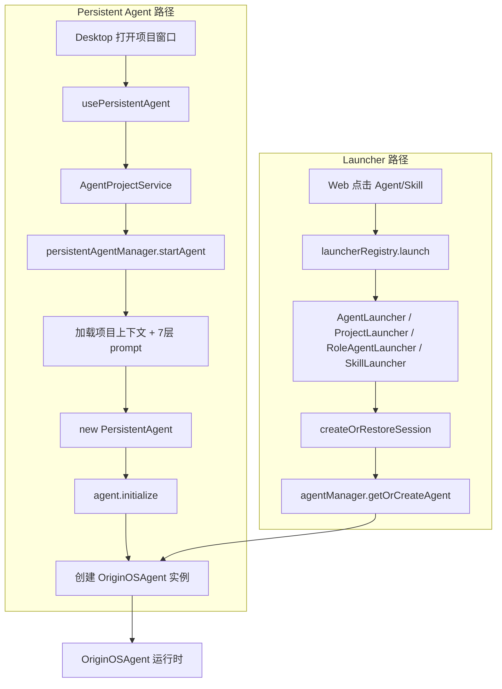

# F30：Launcher 与持久化运行时的集成关系

## 开篇场景

F.2 单元已经讲了两条主线：

1. **Launcher 主线**：`features/services/launcher/*` 负责把入口调用转换成 `LaunchResult`，给 Web/Desktop 一个统一的启动合同。
2. **Persistent Agent 主线**：`integrations/pi-agent/persistent-agent*` 负责让项目 Agent 长期存活、热重载、接入认知系统。

但它们之间的关系并不直观：

- `ProjectLauncher` 创建的是 `agentType='project'` 的会话，使用 `AgentManager` 管理；
- `PersistentAgentManager` 也读 `data/projects/{id}/Agent.md`，创建的是 `PersistentAgent`。
- 什么时候用 launcher？什么时候用 persistent agent？它们会冲突吗？

这节课把两者放在一起，讲清楚它们的定位和衔接。

## 核心问题

**Launcher 和 PersistentAgentManager 分别服务于什么场景？它们读取相同的数据目录，为什么不会互相替代？项目 Agent 在 Web 端和 Desktop 端的启动路径有什么不同？**

## 概念阶梯

**Launcher（启动器）**：面向“入口点击”的同步启动合同。它不关心 Agent 是否长期存活，只负责创建会话并注册到 `AgentManager`。

**PersistentAgentManager**：面向“项目窗口/项目会话”的长期运行时管理。它创建并缓存 `PersistentAgent` 实例，直到项目关闭。

**AgentManager**：普通 Agent 的实例管理器，提供 `getOrCreateAgent`、`subscribeToAgent` 等。

**Desktop 项目视图**：在 Electron 中打开一个项目窗口，通常使用 `usePersistentAgent` + `PersistentAgentManager`。

**Web 项目入口**：在 Web 中点击项目卡片，可能通过 `ProjectLauncher` 创建一次性的项目 Agent 会话。

## 图解：两条主线的调用链



## 源码精读

### 1. Launcher 只到 AgentManager

[packages/core/src/lib/features/services/launcher/base.ts 第 215—237 行](../../../../packages/core/src/lib/features/services/launcher/base.ts#L215)

```typescript
protected async registerAgent(
  sessionId: string,
  projectId: string,
  options: { ... },
): Promise<string[]> {
  await agentManager.getOrCreateAgent(sessionId, projectId, {
    systemPrompt: options.systemPrompt,
    agentType: options.agentType,
    agentBaseDir: options.agentBaseDir,
    isWindowBound: options.isWindowBound,
    llmConfig: options.llmConfig,
  });
  return [];
}
```

所有 Launcher 的 `registerAgent` 都调用 `AgentManager.getOrCreateAgent`。这意味着：

- Launcher 不持有 Agent 实例；
- Agent 生命周期由 `AgentManager` 管理（如 idle cleanup、窗口绑定销毁）。

### 2. PersistentAgentManager 也创建 OriginOSAgent

[packages/core/src/lib/integrations/pi-agent/persistent-agent-manager.ts 第 148—159 行](../../../../packages/core/src/lib/integrations/pi-agent/persistent-agent-manager.ts#L148)

```typescript
const agent = new PersistentAgent({
  projectId,
  workingDirectory: projectDir,
  agentDefinition: agentDef,
  toolDefinition: toolDef,
  skillDefinition: skillDef,
  workspaceFiles,
  builtSystemPrompt: systemPrompt,
  cognitiveManager,
  completionGuardEnabled: false,
});

await agent.initialize(llmConfig);
```

`PersistentAgent` 内部也调用 `createOriginOSAgent`，并把实例缓存到 `PersistentAgentManager.agents` Map 中。

### 3. 两者读取相同目录但使用方式不同

| 维度 | Launcher 的 ProjectLauncher | PersistentAgentManager |
|---|---|---|
| 触发入口 | Web 点击项目卡片 | Desktop 打开项目窗口 |
| Agent 类型 | `agentType='project'` | `agentType` 来自 `Agent.md` |
| Prompt 构建 | 手动拼接 Agent.md + business-model.json + Memory.md + Taste.md | 调用 project-agent/project-prompt.ts 构建 7 层 prompt |
| 实例管理 | AgentManager | PersistentAgentManager 自身 |
| 生命周期 | 与会话/窗口绑定 | 与项目窗口绑定，支持热重载 |
| 认知系统 | 无 | 有 CognitiveManager + Memory Core |

### 4. Desktop 项目窗口的完整链路

[packages/desktop/src/main/services/agent-project-service.ts 第 83—106 行](../../../../packages/desktop/src/main/services/agent-project-service.ts#L83)

```typescript
ipcMain.handle(
  IPC_CHANNELS.AGENT_PROJECT_START,
  async (_event, request: AgentProjectStartRequest): Promise<IpcResponse> => {
    try {
      if (!request.projectId) { ... }
      persistRuntimeLLMConfig(request.llmConfig);
      const agent = await persistentAgentManager.startAgent(request.projectId, request.llmConfig);
      return {
        success: true,
        data: { status: agent.getStatus() },
        timestamp: new Date().toISOString(),
      };
    } catch (error) {
      return this.toErrorResponse(error, '[AgentProjectService] Start agent failed');
    }
  }
);
```

Desktop 项目窗口不经过 `ProjectLauncher`，直接调用 `persistentAgentManager.startAgent`。

### 5. Web 项目入口的完整链路

Web 中如果有一个“项目入口”按钮，它可能会：

```typescript
const result = await launch({
  entryId: projectId,
  entryType: 'project',
  isWindowBound: true,
});
```

这会创建一次性的项目 Agent 会话，适合快速问答，不积累长期记忆。

### 6. 为什么需要两套路径

- **Web 版本**：通常是无状态的 HTTP 请求，用户关闭标签页后 Agent 应该被清理。`AgentManager` 的 idle cleanup 适合这种场景。
- **Desktop 版本**：项目是长期工作空间，用户可能在多个会话中与同一个项目 Agent 交互。`PersistentAgentManager` 的缓存和热重载更适合。
- **产品演进**：未来 Web 也可能引入项目级持久 Agent，此时可以复用 `PersistentAgentManager`； launcher 层可以保持不变。

## 真实调用链对比

### 场景 A：Web 点击项目卡片

1. 前端调用 `launch({ entryType: 'project', entryId })`。
2. `ProjectLauncher` 读取 `data/projects/{id}/`。
3. 创建 `AgentSession`，`agentType='project'`。
4. `AgentManager.getOrCreateAgent` 创建普通 Agent 实例。
5. 前端用 `sessionId` 打开聊天窗口。
6. 窗口关闭后，`AgentManager` 根据 `isWindowBound` 决定是否清理。

### 场景 B：Desktop 打开项目窗口

1. 组件挂载，`usePersistentAgent` 调用 `startProjectAgent`。
2. `AgentProjectService` 调用 `persistentAgentManager.startAgent`。
3. `PersistentAgentManager` 加载项目上下文、构建 7 层 prompt、注册 Cognitive Providers。
4. 创建 `PersistentAgent` 并 `initialize`。
5. 用户发送消息，`agent.handleMessage` 驱动 `OriginOSAgent`。
6. 事件通过 IPC 推送到所有窗口。
7. 窗口关闭时，`usePersistentAgent` 的 cleanup 延迟调用 `stopProjectAgent`。

## 关键类型与数据示例

### Web 项目启动结果

```typescript
{
  success: true,
  sessionId: 'sess-proj-abc',
  agentType: 'project',
  baseDir: '/.../data/web/projects/proj-abc',
  systemPrompt: '...'
}
```

### Desktop 项目启动结果

```typescript
{
  success: true,
  data: {
    status: {
      projectId: 'proj-abc',
      isRunning: true,
      agentType: 'project',
      version: '1.0.0',
      startedAt: 1234567890,
    }
  }
}
```

## 失败路径与边界

| 场景 | Launcher 路径 | Persistent Agent 路径 |
|---|---|---|
| 项目目录不存在 | 返回 `success: false` | 抛错 `Project directory not found` |
| Agent.md 缺失 | 继续，可能 system prompt 为空 | 使用默认 Agent 定义 |
| 同一项目多次启动 | 创建多个会话 | 复用同一实例 |
| LLM 配置变化 | 通过 `llmConfig` 传入 | `applyLLMConfig` 热更新 |
| 窗口关闭 | Agent 可能被清理 | `shutdown` 释放资源 |

**一个关键边界**：目前两条路径读取的是同一套 `data/projects/{id}/` 文件，但创建的 `OriginOSAgent` 实例是独立的。这意味着 Web 启动的项目 Agent 和 Desktop 启动的项目 Agent 不会共享内存中的状态，它们通过磁盘文件（如 `Memory.md`、`business-model.json`）间接同步。

## 测试证据

- 目前两条路径分别测试：
  - Launcher 路径：依赖 `skill-launcher.test.ts`；
  - Persistent Agent 路径：无直接单元测试，主要通过 Desktop 端到端验证。
- 建议补集成测试：
  - 验证同一项目目录被 Launcher 和 PersistentAgentManager 启动后，system prompt 中 `Agent.md` 内容一致；
  - 验证 Desktop 路径的 Cognitive Providers 被正确注册；
  - 验证 Web 路径不会创建 PersistentAgent 实例。

## 练习与验收

1. **画出两条路径**：不看代码，独立画出 Web 项目入口和 Desktop 项目窗口的启动链路。
2. **比较 prompt 构建**：同一项目的 `Agent.md`，在 `ProjectLauncher` 和 `PersistentAgentManager` 中分别如何进入 system prompt？
3. **分析共享与隔离**：两条路径创建的 Agent 实例共享什么？隔离什么？
4. **设计统一入口**：如果未来 Web 也想用 PersistentAgent，如何改造现有代码？

**验收标准**：能清楚说明 launcher 和 persistent agent 的适用场景和衔接关系，能独立追踪两种启动路径。

## 章节收束

到这里，F.2 单元的技术内容已经讲完。下一节课（F31）是本单元小结 Workshop，会复盘 launcher 和 persistent agent 的完整链路，并给出综合实验。
