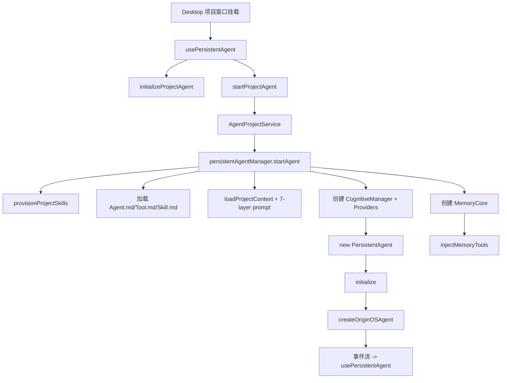

# F31：单元小结 Workshop —— Launcher 与持久化 Agent 运行时

## 本单元学了什么

F.2 单元围绕两个问题展开：

1. **入口点击后，系统如何根据类型启动不同的 Agent/Skill？**
2. **项目 Agent 如何长期存活、热重载、接入认知系统？**

答案分布在两条主线中：

| 文件/模块 | 职责 |
|---|---|
| `features/services/launcher/base.ts` | Launcher 基类、启动合同、`buildAgentSystemPrompt` |
| `features/services/launcher/registry.ts` | 启动器注册表，按 `entryType` 路由 |
| `features/services/launcher/agent.ts` | 普通 Agent 启动器 |
| `features/services/launcher/project.ts` | 项目入口启动器，注入本体上下文 |
| `features/services/launcher/role-agent.ts` | RoleAgent 启动器，加载状态机和记忆钩子 |
| `features/services/launcher/skill.ts` | Skill 启动器，解析 frontmatter 和产物目录 |
| `features/services/launcher/__tests__/skill-launcher.test.ts` | Launcher 层测试示例 |
| `integrations/pi-agent/persistent-agent.ts` | 持久化 Agent 实例、workspace 文件加载、初始化/热重载/关闭 |
| `integrations/pi-agent/persistent-agent-manager.ts` | 项目 Agent 单例管理、认知 Providers、Memory Core 工具注入 |
| `integrations/pi-agent/use-persistent-agent.ts` | React Hook，连接前端与项目 Agent |
| `integrations/pi-agent/memory-consumption.ts` | prompt 记忆段落构建 |
| `integrations/pi-agent/runtime-working-summary.ts` | 运行时工作摘要 |
| `integrations/pi-agent/recent-trace-compression.ts` | 近期工具调用 trace 压缩 |
| `integrations/pi-agent/goal-extension.ts` | Pi Agent Adapter Goal 扩展注册边界 |

## 核心控制流复盘

### Launcher 控制流

```mermaid
flowchart TD
    A[Web/Desktop 入口点击] --> B{entryType}
    B -->|agent| C[AgentLauncher]
    B -->|role-agent| D[RoleAgentLauncher]
    B -->|project| E[ProjectLauncher]
    B -->|skill| F[SkillLauncher]
    C --> G[读取 data/agents/{id}/]
    D --> H[读取 data/agents/{id}/ + RoleContext]
    E --> I[读取 data/projects/{id}/ + ontology]
    F --> J[查找 SKILL.md + 物化 bundled]
    G --> K[buildAgentSystemPrompt]
    H --> L[7-layer Role prompt / 降级]
    I --> M[手动拼接 prompt]
    J --> N[buildSkillSystemPrompt]
    K --> O[createOrRestoreSession]
    L --> O
    M --> O
    N --> O
    O --> P[agentManager.getOrCreateAgent]
```

### Persistent Agent 控制流



## 关键设计决策回顾

### 1. 为什么 Launcher 需要抽象基类 + 注册表？

- **单一职责**：每个 Launcher 只处理一种入口类型。
- **开闭原则**：新增入口类型时，只需要新增一个 Launcher 并注册到 Registry。
- **上层无感知**：Web/Desktop 只需要知道 `launch(ctx)`，不需要判断类型。

### 2. 为什么 RoleAgentLauncher 要注册全局事件钩子？

- `turn_start` 检查 Tool.md / 技能变化，实现动态刷新；
- `turn_end` 检查状态机转换和记忆 flush；
- 通过重写 `agentManager.subscribeToAgent` 实现 AOP，避免每个 RoleAgent 调用方都手动注册钩子。

### 3. 为什么 SkillLauncher 要把依赖安装指引写进 prompt？

Skill 经常依赖外部包或命令。LLM 需要自己检查、安装、验证依赖。把指引写进 prompt 比写死 handler 更灵活，因为：

- 不同 Skill 依赖不同；
- 环境可能已安装某些依赖；
- 用户可能使用不同包管理器。

### 4. 为什么 PersistentAgentManager 要挂载到 globalThis？

避免 Next.js HMR 或 Electron 多窗口导致重复创建 Manager，保证同一项目只有一个 Agent 实例。

### 5. 为什么 Launcher 路径和 Persistent Agent 路径并存？

- **Launcher**：适合一次性、会话级、Web 为主的入口；
- **Persistent Agent**：适合长期、项目级、Desktop 为主的窗口；
- 两者读取相同数据目录，但实例管理方式不同，满足不同产品场景。

## 单元验收实验

### 实验 1：追踪普通 Agent 启动

1. 在 `data/web/agents/test-agent/` 下创建 `Agent.md`。
2. 调用 `launcherRegistry.launch({ entryType: 'agent', entryId: 'test-agent' })`。
3. 检查返回的 `baseDir`、`agentType`、`systemPrompt`。
4. 在 `data/web/sessions/` 下找到对应会话文件。

### 实验 2：追踪项目入口启动

1. 在 `data/web/projects/test-proj/` 下创建 `Agent.md` 和 `ontology/business-model.json`。
2. 调用 `launcherRegistry.launch({ entryType: 'project', entryId: 'test-proj' })`。
3. 验证 `systemPrompt` 包含 `business-model.json` 内容。
4. 检查 `projectContext.currentPath` 指向项目目录。

### 实验 3：追踪 Skill 启动

1. 创建一个测试 Skill，frontmatter 中声明 `outputDir: data/agents` 和一个依赖。
2. 调用 `launcherRegistry.launch({ entryType: 'skill', entryId: 'test-skill' })`。
3. 验证 `${OUTPUT_DIR}` 被替换、`systemPrompt` 包含依赖安装指引。

### 实验 4：Desktop 项目 Agent 生命周期

1. 在 Desktop 端打开一个项目窗口。
2. 观察控制台 `PersistentAgentManager` 启动日志。
3. 发送一条消息，观察 `CognitiveManager.on_turn_end` 是否被触发。
4. 关闭窗口，500ms 后观察 `PersistentAgent` shutdown 日志。

### 实验 5：Memory Core 工具调用

1. 启动 Desktop 项目 Agent。
2. 让用户发送消息：“记住我的名字叫 Alice”。
3. 验证 Agent 调用了 `core_memory_append` 或 `archival_memory_insert`。
4. 检查 `data/web/projects/{id}/memory-core/` 下是否有更新。

## 常见问题与自检

| 问题 | 自检方法 |
|---|---|
| Launcher 和普通 AgentManager 的关系是什么？ | 看 `Launcher.registerAgent` 如何调用 `agentManager.getOrCreateAgent` |
| Skill 的工作目录和产物目录怎么决定？ | 看 `SkillLauncher` 中 `agentWorkingDir` 和 `resolvedOutputDir` 的解析 |
| RoleAgent 的状态机在哪里更新？ | 看 `role-agent.ts` 的 `turn_end` 钩子和 `updateRoleMdPhase` |
| PersistentAgent 和普通 OriginOSAgent 有什么不同？ | 看 `PersistentAgent.initialize` 的六步和事件订阅 |
| 为什么 persistentAgentManager 要挂 globalThis？ | 看 `getGlobalPersistentAgentManager` 的实现 |
| CognitiveManager 什么时候被触发？ | 看 `PersistentAgent` 的 `turn_end` 和 `agent_end` 事件处理 |
| `compressRecentTrace` 为什么保留完整 tool 组？ | 看 `collectToolTraceGroups` 和压缩边界处理 |

## 本单元边界

- **不讲 `role-agent` 内部细节**：状态机、system-prompt 各层构建、Dream 记忆维护属于 F.3。
- **不讲 `project-agent` 内部细节**：项目访谈流程、7 层 prompt 构建属于 F.4。
- **不讲 `cognitive` 完整实现**：知识提取、模式沉淀、Memory Core 底层属于 F.5 / F.6。
- **不讲 Electron IPC 细节**：`AgentProjectService` 的 IPC 处理属于 Desktop 专属内容。

## 下一步

F.3 单元将深入 RoleAgent：

- `role-agent/role-context.ts` 如何加载 7 个 .md 文件和已安装技能；
- `role-agent/state-machine.ts` 如何解析和推进状态机；
- `role-agent/system-prompt.ts` 如何构建 7 层 system prompt；
- `role-agent/memory-tracker.ts` 和 `dream.ts` 如何维护长期记忆。

## 练习与验收

1. **画出本单元两条主线**：不看教材，独立画出 Launcher 路径和 Persistent Agent 路径。
2. **解释每一层职责**：能向他人解释 `features/services/launcher`、`integrations/pi-agent/persistent-agent*`、`use-persistent-agent` 三者的关系。
3. **定位任意代码**：给定一个功能（如“启动项目 Agent 时注入 Memory Core 工具”），能说出涉及哪些文件。
4. **发现边界问题**：找出本单元中至少一个 TODO、一个无测试覆盖的关键路径、一个潜在的 StrictMode/多实例问题。

**验收标准**：能不看代码解释 F.2 单元的整体架构，能独立完成 Launcher 启动和 Desktop Persistent Agent 启动的端到端追踪。

## 章节收束

F.2 单元讲完了 OriginOS 的启动层和持久化运行时。我们从统一的 Launcher 合同出发，看了四种入口启动器；又看了 PersistentAgent 如何让项目 Agent 长期工作，并通过 CognitiveManager 和 Memory Core 不断进化。

下一单元进入 RoleAgent 的内心世界：角色、状态机、记忆与梦。
