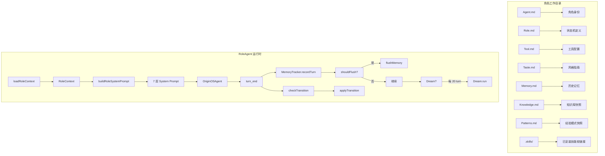

# F32：RoleAgent 总览与认知地图

## 开篇场景

用户在 OriginOS 首页看到一个“代码审查助手”角色，点击后系统启动了一个 RoleAgent。和普通 Agent 不同，这个 RoleAgent：

- 有自己的工作目录 `data/agents/code-reviewer/`，里面放着 `Agent.md`、`Role.md`、`Tool.md` 等文件；
- 启动时自动扫描 `.skills/` 目录，发现已安装 `eslint-skill`、`pr-review-skill`；
- 系统 prompt 不是静态的，而是根据当前阶段（如“准备阶段”→“执行阶段”→“复盘阶段”）动态变化；
- 每 20 轮对话后，Dream 自动整理 Memory.md，去掉过时的，补充新的事实。

RoleAgent 就是 OriginOS 中“有身份、有阶段、有记忆、有技能”的智能体。

## 核心问题

**RoleAgent 和普通 Agent 的本质区别是什么？它的“角色”由哪些文件定义？状态机如何影响行为？记忆如何持久化和自动维护？**

## 概念阶梯

**RoleAgent**：带有角色定义、状态机、技能管理和自动记忆维护的持久化 Agent。

**角色工作目录**：`data/agents/{id}/`，包含 7 个 .md 文件 + `.skills/` 目录 + `memory/` 目录。

**RoleContext**：从角色工作目录加载的完整上下文，包含所有 .md 文件内容和已安装技能列表。

**StateMachine**：从 `Role.md` 解析出的阶段定义和转换规则。

**MemoryTracker**：在 `turn_end` 后记录记忆条目，达到阈值时刷盘到 `Memory.md`。

**Dream**：每 N 轮触发一次的两阶段自动记忆维护（LLM 分析 → 精准编辑 Memory.md）。

**MemoryBlock**：Letta 风格的三元记忆块（label + value + limit），支持结构化读写。

**7 层 System Prompt**：Layer 1（身份）→ Layer 7（安全），每层独立构建、按需重建。

## 图解：RoleAgent 架构

## 关键文件职责

| 文件 | 职责 |
|---|---|
| `role-context.ts` | 加载 7 个 .md 文件，扫描 `.skills/`，构建 `RoleContext` |
| `skill-resolver.ts` | 解析 `.skills/` 中的软链接，提取 `SKILL.md` frontmatter |
| `state-machine.ts` | 从 `Role.md` 解析状态机，检测阶段转换 |
| `system-prompt.ts` | 7 层 system prompt 构建器 |
| `memory-tracker.ts` | JSONL 历史存储、Memory Block 管理、Recall 检索 |
| `dream.ts` | 两阶段自动记忆维护（Phase 1 prompt + Phase 2 指令执行） |
| `consolidator.ts` | Token 预算触发式压缩（预留接口） |
| `index.ts` | 模块统一导出 |

## 与普通 Agent 的对比

| 维度 | 普通 Agent | RoleAgent |
|---|---|---|
| 工作目录 | 无 | `data/agents/{id}/` |
| 身份定义 | 内联 system prompt | `Agent.md` |
| 状态机 | 无 | `Role.md` 定义阶段 |
| 技能管理 | 静态 | `.skills/` 动态软链接 |
| 记忆持久化 | 无 | `Memory.md` + JSONL |
| 自动维护 | 无 | Dream 每 20 turn |
| System Prompt | 单层 | 7 层分层构建 |
| 工具权限 | 固定 | `Tool.md` frontmatter 控制 |

## 阅读建议

1. 先通读 `role-context.ts`，理解 `RoleContext` 的 12 个字段。
2. 再看 `state-machine.ts`，理解 `parseStateMachine` 和 `checkTransition`。
3. 然后看 `system-prompt.ts`，理解 7 层 prompt 的构建逻辑。
4. 最后看 `memory-tracker.ts` 和 `dream.ts`，理解记忆的记录和自动维护。

## 章节收束

RoleAgent 是 OriginOS 中最复杂的 Agent 类型。下一节课（F33）从 `role-context.ts` 开始，看系统如何加载角色的完整上下文。
