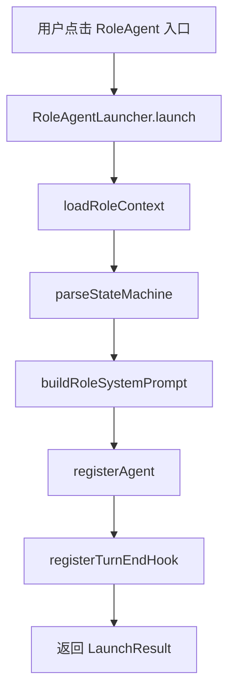
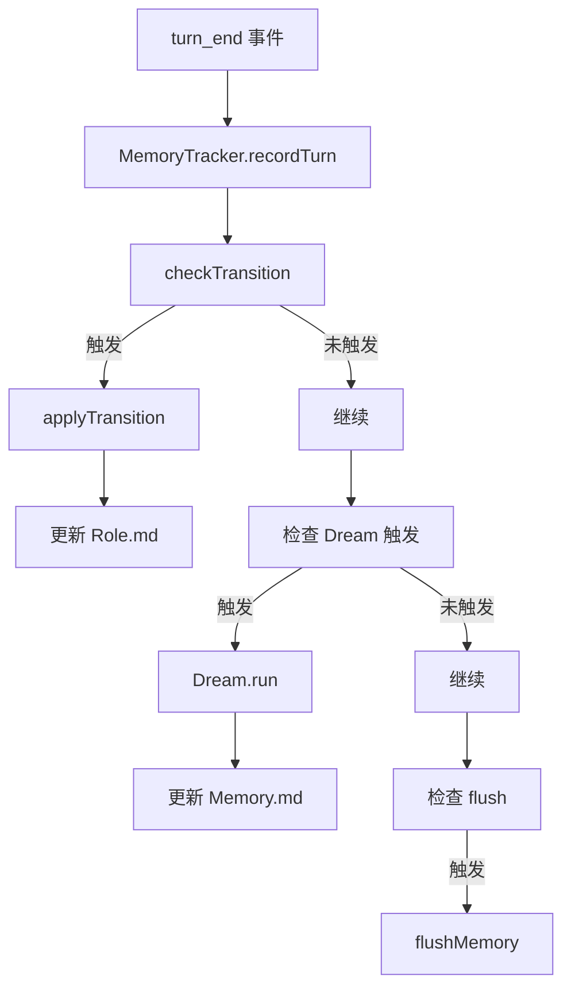

# F45：F.3 单元小结 Workshop —— RoleAgent 的角色、状态机与记忆

## 本单元学了什么

F.3 单元围绕 RoleAgent 展开，讲了 7 个核心文件：

| 文件 | 职责 |
|---|---|
| `role-context.ts` | 加载 7 个 .md 文件，扫描 `.skills/`，构建 `RoleContext` |
| `skill-resolver.ts` | 解析 `.skills/` 中的软链接，提取 `SkillInfo` |
| `state-machine.ts` | 从 `Role.md` 解析状态机，检测阶段转换 |
| `system-prompt.ts` | 7 层 system prompt 构建器 |
| `memory-tracker.ts` | JSONL 历史存储、Memory Block 管理、Recall 检索 |
| `dream.ts` | 两阶段自动记忆维护 |
| `consolidator.ts` | Token 预算触发式压缩（预留接口） |

## 核心控制流复盘

### RoleAgent 启动流程

### turn_end 钩子流程

## 关键设计决策回顾

### 1. 为什么用 7 层 prompt？

- **模块化**：每层独立构建，按需重建；
- **可维护性**：修改某层不影响其他层；
- **清晰性**：LLM 更容易理解结构化 prompt。

### 2. 为什么用 JSONL 存储历史？

- **增量读取**：支持 cursor 增量读取；
- **结构化**：每行是一个 JSON 对象，易于解析；
- **可扩展**：支持关键词检索。

### 3. 为什么 Dream 分两个阶段？

- **解耦**：Phase 1 的 LLM 调用和 Phase 2 的指令执行解耦；
- **可测试**：Phase 2 可以独立测试；
- **可替换**：Phase 1 可以用不同 LLM 实现。

## 单元验收实验

### 实验 1：构造 RoleAgent 目录

1. 创建 `data/agents/test-role/` 目录；
2. 写入 `Agent.md`、`Role.md`、`Tool.md`、`Taste.md`；
3. 创建 `.skills/` 软链接；
4. 调用 `loadRoleContext`，验证 `RoleContext`。

### 实验 2：模拟状态机转换

1. 构造 `Role.md`，定义 3 个阶段；
2. 构造包含 `[PHASE:execution]` 的消息历史；
3. 验证 `checkTransition` 输出。

### 实验 3：测试 Dream

1. 构造 Memory.md；
2. 构造 LLM 输出（ADD/UPDATE/REMOVE）；
3. 验证 `dream.run` 正确更新 Memory.md。

### 实验 4：测试 Memory Block

1. 构造 Memory.md（含 blocks）；
2. 验证 `parseBlocksFromMarkdown` 输出；
3. 验证 `serializeBlocksToMarkdown` 还原。

## 常见问题与自检

| 问题 | 自检方法 |
|---|---|
| RoleContext 包含哪些字段？ | 看 `role-context.ts` 接口定义 |
| 状态机如何解析？ | 看 `parseStateMachine` 实现 |
| 7 层 prompt 是哪 7 层？ | 看 `system-prompt.ts` 注释 |
| Memory Block 格式？ | 看 `memory-tracker.ts` 注释 |
| Dream 触发条件？ | 看 `dream.ts` 配置 |

## 下一步

F.4 单元将深入 ProjectAgent：

- `project-context.ts` 如何加载项目上下文；
- `project-prompt.ts` 如何构建 7 层 prompt；
- 项目访谈流程；
- 业务模型集成。

## 练习与验收

1. **画出本单元架构**：不看教材，独立画出 RoleAgent 的启动和运行时流程。
2. **解释每一层职责**：能向他人解释 7 层 prompt 的分层逻辑。
3. **定位任意代码**：给定一个功能（如“Dream 自动维护记忆”），能说出涉及哪些文件。
4. **发现边界问题**：找出本单元中至少一个 TODO、一个无测试覆盖的关键路径。

**验收标准**：能不看代码解释 F.3 单元的整体架构，能独立完成 RoleAgent 启动和运行时追踪。

## 章节收束

F.3 单元讲完了 RoleAgent 的角色、状态机与记忆。下一单元进入 ProjectAgent 的世界。
