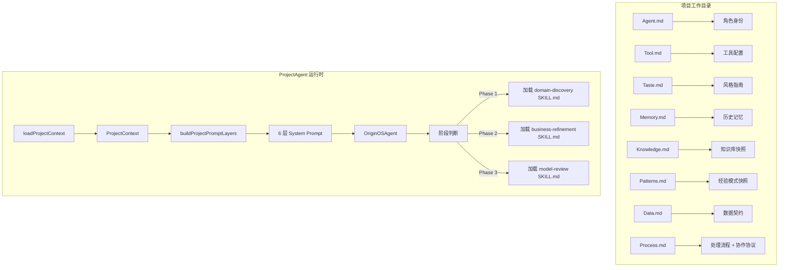

# F46：ProjectAgent 总览与认知地图

## 开篇场景

用户在 OriginOS 中创建了一个“园区管理系统”项目。系统需要：

1. 加载项目上下文（`Agent.md`、`Tool.md`、`Taste.md`、`Memory.md` 等）；
2. 根据项目阶段（访谈→精炼→审阅）动态加载对应技能；
3. 支持多 Agent 协作（需求调研 Agent、项目管理 Agent 等）；
4. 业务模型持久化到 `output/business-model.json`。

ProjectAgent 就是 OriginOS 中“项目化、协作化、阶段化”的智能体。

## 核心问题

**ProjectAgent 和 RoleAgent 的本质区别是什么？ProjectAgent 的 6 层 prompt 和 RoleAgent 的 7 层 prompt 有什么不同？**

## 概念阶梯

**ProjectContext**：项目上下文的统一接口，包含 `Agent.md`、`Tool.md`、`Taste.md`、`Memory.md`、`Knowledge.md`、`Patterns.md`、Memory Blocks、已安装技能、allowedTools、工作目录、项目 ID、Agent ID。

**ProjectCollaborationContext**：多 Agent 协作上下文，额外包含 `Data.md`（数据契约）和 `Process.md`（处理流程、协作协议）。

**ProjectPromptLayers**：6 层 prompt（身份、状态记忆、思维循环、工具箱、风格、权限）。

**CollaborativePromptLayers**：7 层协作 prompt（身份、数据契约、处理流程、协作协议、工具箱、风格、权限）。

**provisionProjectSkill**：将 bundled skill 幂等补齐到项目目录，已存在的文件不会被覆盖。

## 图解：ProjectAgent 架构

## 关键文件职责

| 文件 | 职责 |
|---|---|
| `project-context.ts` | 加载项目上下文（6 个 .md 文件 + 技能扫描） |
| `project-collaboration-context.ts` | 加载多 Agent 协作上下文（额外加载 Data.md + Process.md） |
| `project-prompt.ts` | 6 层 project prompt 构建器 |
| `collaboration-prompt.ts` | 7 层协作 prompt 构建器（多 Agent 场景） |
| `project-skill-provisioning.ts` | 将 bundled skills 幂等补齐到项目目录 |
| `index.ts` | 模块统一导出 |

## 与 RoleAgent 的对比

| 维度 | RoleAgent | ProjectAgent |
|---|---|---|
| 工作目录 | `data/agents/{id}/` | `data/projects/{id}/` |
| Prompt 层数 | 7 层 | 6 层（无安全层） |
| 状态机 | 有（Role.md） | 无（通过 business-model.json 判断阶段） |
| 协作 | 单 Agent | 多 Agent 协作 |
| 技能来源 | `.skills/` 软链接 | `skills/` 目录（从 bundled 复制） |
| Data.md / Process.md | 无 | 有（协作场景） |
| 业务模型 | 无 | `output/business-model.json` |

## 阅读建议

1. 先通读 `project-context.ts`，理解 `ProjectContext` 的字段。
2. 再看 `project-prompt.ts`，理解 6 层 prompt 的构建逻辑。
3. 然后看 `collaboration-prompt.ts`，理解多 Agent 协作的 7 层 prompt。
4. 最后看 `project-skill-provisioning.ts`，理解技能如何幂等补齐。

## 章节收束

ProjectAgent 是 OriginOS 中项目化协作的核心。下一节课（F47）从 `project-context.ts` 开始。
