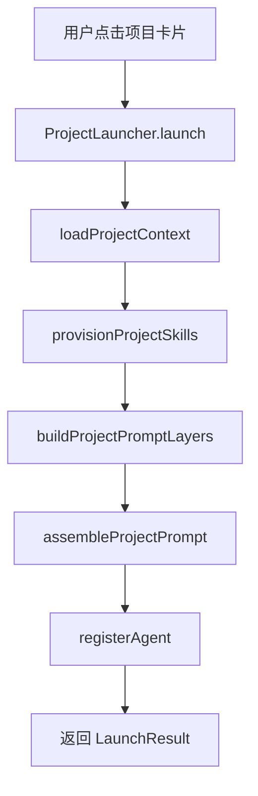
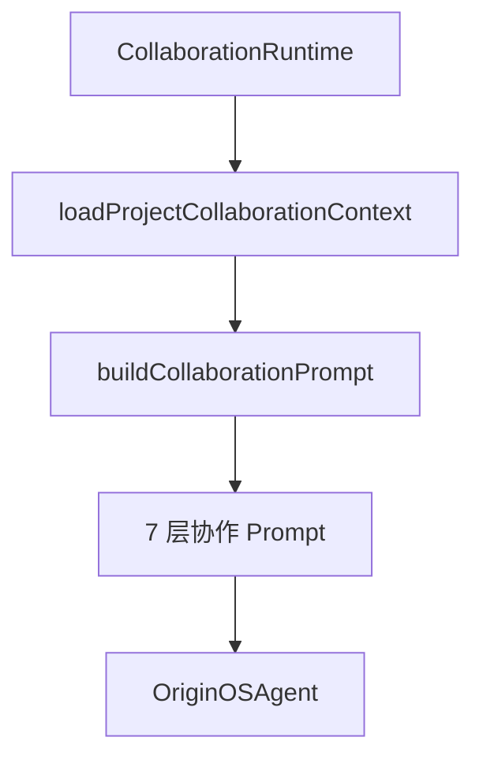

# F55：F.4 单元小结 Workshop —— ProjectAgent 的项目化协作

## 本单元学了什么

F.4 单元围绕 ProjectAgent 展开，讲了 5 个核心文件：

| 文件 | 职责 |
|---|---|
| `project-context.ts` | 加载项目上下文（6 个 .md 文件 + 技能扫描） |
| `project-collaboration-context.ts` | 加载多 Agent 协作上下文（额外加载 Data.md + Process.md） |
| `project-prompt.ts` | 6 层 project prompt 构建器 |
| `collaboration-prompt.ts` | 7 层协作 prompt 构建器（多 Agent 场景） |
| `project-skill-provisioning.ts` | 将 bundled skills 幂等补齐到项目目录 |

## 核心控制流复盘

### ProjectAgent 启动流程

### 多 Agent 协作流程

## 关键设计决策回顾

### 1. 为什么 ProjectAgent 是 6 层 prompt？

- 去掉了 RoleAgent 的“安全层”，因为 ProjectAgent 更关注业务协作；
- 增加了“动态技能加载”，让 Agent 在运行中加载 SKILL.md。

### 2. 为什么需要幂等补齐？

- 项目技能需要持久化到项目目录；
- 用户可能修改技能，不能覆盖；
- 新技能需要自动补齐。

### 3. 为什么协作 prompt 是 7 层？

- 增加了“数据契约”和“协作协议”两层；
- 让 Agent 知道自己的数据边界和协作关系。

## 单元验收实验

### 实验 1：构造项目目录

1. 创建 `data/projects/test-proj/` 目录；
2. 写入 `Agent.md`、`Tool.md`、`Taste.md`；
3. 调用 `loadProjectContext`，验证 `ProjectContext`。

### 实验 2：测试技能补齐

1. 调用 `provisionProjectSkills(projectDir)`；
2. 验证 `skills/` 目录下有内置技能；
3. 修改某个技能文件，再次调用，验证不覆盖。

### 实验 3：构建协作 Prompt

1. 构造 `ProjectCollaborationContext`；
2. 调用 `buildCollaborationPrompt`；
3. 验证 7 层内容。

## 常见问题与自检

| 问题 | 自检方法 |
|---|---|
| ProjectContext 包含哪些字段？ | 看 `project-context.ts` 接口定义 |
| 6 层 prompt 是哪 6 层？ | 看 `project-prompt.ts` 注释 |
| 协作 prompt 的额外两层？ | 看 `collaboration-prompt.ts` 注释 |
| 幂等补齐的原理？ | 看 `project-skill-provisioning.ts` 实现 |

## 下一步

F.5 单元将深入认知系统：

- `cognitive/manager.ts` 如何管理认知生命周期；
- `cognitive/practice-logger.ts` 如何记录实践日志；
- `cognitive/knowledge-provider.ts` 如何提取知识；
- `cognitive/pattern-provider.ts` 如何沉淀模式。

## 练习与验收

1. **画出本单元架构**：不看教材，独立画出 ProjectAgent 的启动和协作流程。
2. **解释每一层职责**：能向他人解释 6 层和 7 层 prompt 的区别。
3. **定位任意代码**：给定一个功能（如“技能幂等补齐”），能说出涉及哪些文件。
4. **发现边界问题**：找出本单元中至少一个 TODO、一个无测试覆盖的关键路径。

**验收标准**：能不看代码解释 F.4 单元的整体架构，能独立完成 ProjectAgent 启动和协作追踪。

## 章节收束

F.4 单元讲完了 ProjectAgent 的项目化协作。下一单元进入认知系统的世界。
