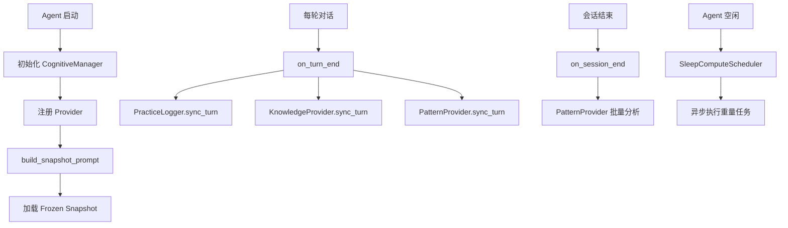
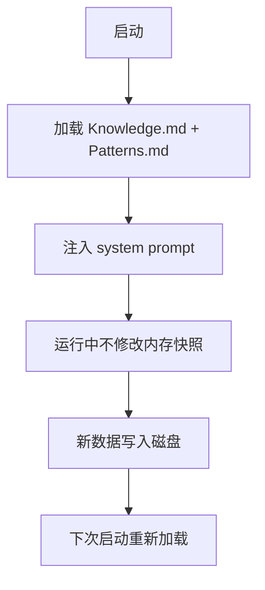

# F71：F.5 单元小结 Workshop —— 认知系统

## 本单元学了什么

F.5 单元围绕认知系统展开，讲了 10 个核心文件：

| 文件 | 职责 |
|---|---|
| `cognitive/manager.ts` | 认知管理器，编排多个 CognitiveProvider |
| `cognitive/practice-logger.ts` | 实践日志记录，每 turn 自动记录结构化数据 |
| `cognitive/knowledge-provider.ts` | 知识库 Provider，从对话中提取实体和事实 |
| `cognitive/pattern-provider.ts` | 经验模式 Provider，识别工具链模式 + Reflexion |
| `cognitive/unified-ontology.ts` | 统一本体模型，Entity/Attribute/Relation/Rule |
| `cognitive/rule-engine.ts` | 规则引擎，混合模式（结构化 + 自然语言） |
| `cognitive/sleep-compute.ts` | 睡眠计算调度器，异步执行重量操作 |
| `cognitive/knowledge-ingest.ts` | 知识来源 Ingest，导入业务模型 |
| `cognitive/types.ts` | 认知系统类型定义 |
| `cognitive/index.ts` | 统一导出 |

## 核心控制流复盘

### 认知系统生命周期

### Frozen Snapshot 模式

## 关键设计决策回顾

### 1. 为什么需要 Frozen Snapshot？

- **保持 prefix cache 稳定**：system prompt 前缀不变，LLM 可以复用计算结果
- **性能优化**：避免运行中频繁更新 system prompt
- **简单可靠**：下次启动时重新加载，包含新知识

### 2. 为什么知识提取用启发式？

- **性能考虑**：每轮都调用 LLM 提取知识太慢
- **精度权衡**：正则匹配精度有限，但速度快
- **未来方向**：可以接入 LLM 进行更精确的知识提取

### 3. 为什么 PatternProvider 需要 Reflexion？

- **从失败中学习**：成功的模式容易识别，失败的教训更重要
- **避免重复错误**：记录失败场景，下次遇到类似场景时提醒
- **自动优化**：通过反思不断改进 Agent 的行为

## 单元验收实验

### 实验 1：构造认知系统

1. 创建临时目录；
2. 初始化 CognitiveManager；
3. 注册 PracticeLogger、KnowledgeProvider、PatternProvider；
4. 调用 `sync_turn` 模拟多轮对话；
5. 验证文件生成。

### 实验 2：测试 Frozen Snapshot

1. 调用 `sync_turn` 产生知识；
2. 调用 `build_snapshot_prompt`；
3. 验证 Knowledge.md 和 Patterns.md 的内容；
4. 再次调用 `sync_turn`；
5. 验证内存中的 snapshot 不变。

### 实验 3：测试 Reflexion

1. 构造一个失败的 turn；
2. 调用 `PatternProvider.sync_turn`；
3. 验证 episodic-memory/ 下生成反思文件；
4. 调用 `searchReflections` 检索相关反思。

## 常见问题与自检

| 问题 | 自检方法 |
|---|---|
| CognitiveProvider 有哪些方法？ | 看 `types.ts` 接口定义 |
| Frozen Snapshot 什么时候更新？ | 看 `sync_turn` 和 `exportSnapshot` |
| Reflexion 如何去重？ | 看 `deduplicateAndSaveReflection` |
| 睡眠计算有哪些触发器？ | 看 `SleepTrigger` 类型定义 |
| 业务模型如何导入？ | 看 `KnowledgeIngest.ingestBusinessModel` |

## 下一步

F.6 单元将深入 Memory Core 桥接：

- `memory-core/core/` 如何与认知系统协作
- MemoryBlockManager 如何管理记忆块
- Dream 和 Consolidator 如何实现

## 练习与验收

1. **画出本单元架构**：不看教材，独立画出认知系统的架构图。
2. **解释 Frozen Snapshot**：能向他人解释为什么需要 Frozen Snapshot，以及它的优缺点。
3. **定位任意代码**：给定一个功能（如"失败反思"），能说出涉及哪些文件。
4. **发现边界问题**：找出本单元中至少一个 TODO、一个性能瓶颈。

**验收标准**：能不看代码解释 F.5 单元的整体架构，能独立完成认知系统的追踪和测试。

## 章节收束

F.5 单元讲完了认知系统。下一单元进入 Memory Core 桥接。
