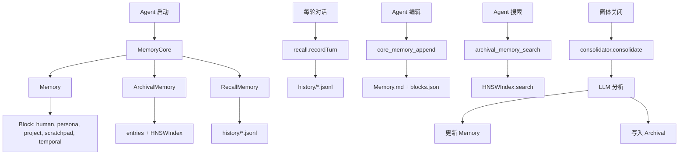

# F80：F.6 单元小结 Workshop —— Memory Core 桥接

## 本单元学了什么

F.6 单元围绕 Memory Core 展开，讲了 12 个核心文件：

| 文件 | 职责 |
|---|---|
| `memory-core/core/memory-core.ts` | 三层记忆统一门面 |
| `memory-core/core/memory.ts` | Block 集合管理 + compile/render |
| `memory-core/core/block.ts` | Block 类型定义 + 工厂函数 |
| `memory-core/core/consolidator.ts` | 窗体关闭时的主动记忆整理 |
| `memory-core/core/dream-compat.ts` | Dream 兼容层 |
| `memory-core/recall/recall-memory.ts` | 对话历史索引 + 语义搜索 |
| `memory-core/recall/history-store.ts` | JSONL 历史存储 |
| `memory-core/archival/archival-memory.ts` | 长期语义记忆存储 |
| `memory-core/archival/embedding.ts` | ONNX embedding + TF-IDF 回退 |
| `memory-core/archival/hnsw-index.ts` | HNSW 向量索引 |
| `memory-core/tools/core-memory-tools.ts` | Core Memory 工具 API |
| `memory-core/tools/archival-memory-tools.ts` | Archival Memory 工具 API |

## 核心控制流复盘

### Memory Core 三层架构

### 三层记忆对比

| 层级 | 存储内容 | 查询方式 | 持久化 | 容量 |
|---|---|---|---|---|
| **Core** | 结构化 Block | 按 label 直接访问 | Memory.md + blocks.json | 小（每个 Block 有 limit） |
| **Archival** | 非结构化文本 | 语义搜索（HNSW） | entries.jsonl + hnsw-index.bin | 大（无上限） |
| **Recall** | 对话历史 | 语义搜索 + 关键词 | history/*.jsonl | 中（按 session） |

## 关键设计决策回顾

### 1. 为什么需要三层记忆？

- **Core**：快速访问，结构化，适合当前状态
- **Archival**：大容量，语义搜索，适合长期知识
- **Recall**：按时间线，适合回溯对话

### 2. 为什么用 HNSW？

- 大规模向量搜索快（O(log n)）
- 支持增量插入
- 内存友好

### 3. 为什么用 Int8 量化？

- 节省存储（Float32 → Int8，4 倍压缩）
- 精度损失小（余弦相似度计算仍准确）

## 单元验收实验

### 实验 1：构造 Memory Core

1. 创建临时目录；
2. 初始化 MemoryCore；
3. 写入 Core Memory；
4. 插入 Archival Memory；
5. 记录 Recall Memory；
6. 验证文件生成。

### 实验 2：测试 HNSW 搜索

1. 插入 100 条 Archival Memory；
2. 执行语义搜索；
3. 验证搜索结果；
4. 测试 MMR 去重。

### 实验 3：测试 Consolidator

1. 构造 50 轮对话；
2. 调用 `consolidator.consolidate()`；
3. 验证 Memory Block 更新；
4. 验证 Archival Memory 写入。

## 常见问题与自检

| 问题 | 自检方法 |
|---|---|
| Block 有哪些属性？ | 看 `block.ts` 接口定义 |
| HNSW 参数如何设置？ | 看 `hnsw-index.ts` 构造函数 |
| Embedding 如何回退？ | 看 `embedding.ts` encode 方法 |
| Consolidator 什么时候触发？ | 看 `consolidator.ts` consolidate 方法 |
| Memory Core 工具有哪些？ | 看 `tools/` 目录 |

## 下一步

Part F 全部讲完了。接下来可以：

- 回顾 F.1-F.6 单元的整体架构
- 实践：为 Agent 添加自定义 Block
- 实践：优化 HNSW 搜索性能
- 实践：设计新的 Consolidator 策略

## 练习与验收

1. **画出本单元架构**：不看教材，独立画出 Memory Core 的三层架构。
2. **解释设计决策**：能向他人解释为什么需要三层记忆。
3. **定位任意代码**：给定一个功能（如"语义搜索"），能说出涉及哪些文件。
4. **发现边界问题**：找出本单元中至少一个 TODO、一个性能瓶颈。

**验收标准**：能不看代码解释 F.6 单元的整体架构，能独立完成 Memory Core 的追踪和测试。

## 章节收束

F.6 单元讲完了 Memory Core 桥接。Part F 全部完成！
