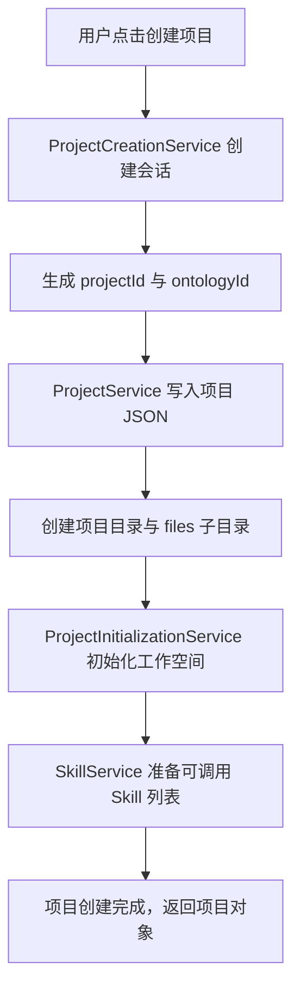
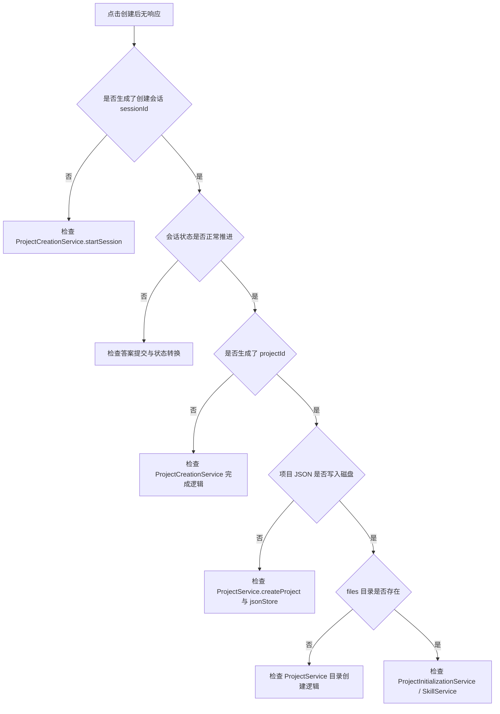

# 单元导读一：小王创建“社区咖啡馆”项目时，系统先把什么准备好（G01–G10）

> 本单元总问题：小王在 OriginOS 里点击“新建项目”并输入“社区咖啡馆”后，系统要生成哪些对象、调用哪些服务、把哪些东西存到磁盘，项目才算真正“立住”？

## 0. 本页先读什么

如果只记住一句话，记住这一句：

> **项目是 OriginOS 里最核心的长期容器；项目创建不是写一条记录，而是一组服务按顺序完成身份分配、目录创建、初始化配置和可扩展占位。**

这句话拆开有三层含义：

1. 项目有自己的稳定 ID，不能靠项目名称当身份。
2. 创建项目会同时产生磁盘目录、文件、关联 ID（如 ontologyId），而不是只写数据库/JSON。
3. `ProjectCreationService`、`ProjectService`、`ProjectInitializationService`、`SkillService` 分工不同，不能混成一个“创建函数”。

阅读本页可以按下面顺序：

| 阅读阶段 | 重点问题 | 对应章节 |
| --- | --- | --- |
| 建立总图 | 创建项目时，控制流和数据流经过哪些对象？ | 第 1、2 节 |
| 分清对象 | 创建会话、项目服务、初始化服务、Skill 服务各自负责什么？ | 第 3 节 |
| 对回课程 | 十节课分别补上判断链中的哪一段？ | 第 4 节 |
| 查证源码 | 哪些源码已在本单元精读，哪些留到后面？ | 第 5 节 |
| 练习排查 | 创建失败时，应按什么顺序定位？ | 第 6 节 |

## 1. 一次项目创建的主路径

小王在首页点击“创建项目”，输入名字“社区咖啡馆”，选择“餐饮零售”领域，然后系统进入创建流程。从代码视角看，这件事至少经过四层：

可以分成四段读。

**第一段是会话**：`ProjectCreationService` 先创建一个“项目创建会话”。它不等同于最终项目，而是收集答案过程中的临时状态容器。如果小王中途关闭窗口，会话可以恢复，项目却可能还没有真正生成。

**第二段是身份**：项目获得稳定的 `projectId`，同时预分配 `ontologyId`。这两个 ID 在后续访谈、本体、数据存储中都会被引用，是跨 feature 查找的关键。

**第三段是持久化**：`ProjectService` 把项目对象写入 `jsonStore`，并同步创建 `files/` 子目录。这一步失败，项目就算在内存里存在，也不算创建成功。

**第四段是初始化与扩展**：`ProjectInitializationService` 初始化工作空间模板，`SkillService` 把与该项目相关的 Skill 暴露出来，供后续访谈、文档处理、任务管理使用。

这张图建立了本单元最重要的底层判断：**项目创建不是单一写操作，而是“会话 → 身份 → 持久化 → 初始化 → 扩展”的顺序过程**。

## 2. 同一流程中的四类对象

初学者最容易犯的错误，是把“项目创建会话”“项目对象”“项目目录”“项目服务”混为一谈。它们都出现在“创建项目”附近，却承担完全不同的责任。

| 对象 | 它是什么 | 生命周期 | 典型字段 |
| --- | --- | --- | --- |
| `ProjectCreationSession` | 收集用户答案的临时会话 | 创建项目前/中；完成后可归档 | `sessionId`、`projectId`、`data.answers` |
| `Project` | 最终保存的项目实体 | 长期存在 | `id`、`name`、`ontologyId`、`status` |
| 项目目录 | 磁盘上的 `projects/{projectId}/` | 与项目同生命周期 | `project.json`、`files/`、`ontology/` |
| `ProjectService` | 项目 CRUD 的服务类 | 单例，应用启动后一直存在 | 无状态，操作方法 |

源码中也能看到这种分工。`ProjectCreationService` 管理的是 [packages/core/src/lib/features/project/project-creation-service.ts](../../../../packages/core/src/lib/features/project/project-creation-service.ts) 中的临时会话；`ProjectService` 管理的是 [packages/core/src/lib/features/services/project-service.ts](../../../../packages/core/src/lib/features/services/project-service.ts) 中的长期项目实体。两个文件不在同一目录，也不管理同一种对象。

## 3. 四个最容易混淆的服务

本单元还会反复遇到几个以“Project”或“Service”命名的文件，必须分清楚它们负责的边界。

### 3.1 ProjectCreationService vs ProjectService

| 维度 | `ProjectCreationService` | `ProjectService` |
| --- | --- | --- |
| 职责 | 管理创建会话、问题流、答案收集 | 管理已创建项目的 CRUD |
| 输入 | `StartProjectCreationRequest`、`SubmitAnswerRequest` | `CreateProjectRequest`、`UpdateProjectRequest` |
| 输出 | `ProjectCreationSession` + 下一个问题 | `Project` 实体 |
| 存储 | `data/sessions/project-creation/{sessionId}.json` | `data/projects/{projectId}/project.json` |
| 典型误区 | 以为它直接创建项目 | 以为它负责提问 |

### 3.2 ProjectService vs ProjectServiceReal

| 维度 | `ProjectService` | `ProjectServiceReal` |
| --- | --- | --- |
| 实现 | 基于 `jsonStore` 的单例实现 | “真实”业务实现，可能接入更多外部依赖 |
| 用途 | MVP 阶段默认实现 | 替换点，用于测试或未来扩展 |
| 当前关系 | 生产代码主要使用 `ProjectService` | 作为接口/实现的另一种实现存在 |

### 3.3 ProjectInitializationService vs SkillService

| 维度 | `ProjectInitializationService` | `SkillService` |
| --- | --- | --- |
| 职责 | 初始化项目工作空间、目录、模板 | 发现、调用与项目相关的 Skill |
| 调用时机 | 项目创建后 | 项目存在后的任意时刻 |
| 典型输出 | 目录结构、默认文件 | Skill 执行结果、产物文件 |
| 边界 | 不直接调用 Skill 的执行逻辑 | 不直接创建项目目录 |

## 4. 十节课连成一条因果链

G01–G10 不是十个孤立知识点。它们按“用户点击创建 → 系统准备项目”的顺序，一层一层补上判断能力。

| 课次 | 本课解决的判断问题 | 核心源码锚点 | 学完后的判断能力 |
| --- | --- | --- | --- |
| G01 | 项目创建为什么需要一个“会话”阶段 | `project/project-creation-service.ts` | 能区分创建会话与最终项目 |
| G02 | `ProjectCreationSession` 的状态如何推进 | `project/project-creation-service.ts` | 能解释答案如何被收集和验证 |
| G03 | `ProjectService` 怎样把项目写进磁盘 | `services/project-service.ts` | 能说清项目 JSON 的字段与目录约定 |
| G04 | `ProjectServiceReal` 为什么存在 | `services/project-service-real.ts` | 能识别默认实现与可替换实现 |
| G05 | 项目初始化服务做什么、不做什么 | `services/project-initialization-service.ts` | 能区分项目创建与项目初始化 |
| G06 | `SkillService` 如何发现项目可用 Skill | `services/skill-service.ts` | 能说清 Skill 调用入口与产物边界 |
| G07 | `services/index.ts` 如何组织公共 API | `services/index.ts` | 能判断某个能力是否对外暴露 |
| G08 | `project/index.ts` 的导出边界 | `project/index.ts` | 能识别项目 feature 的公共合同 |
| G09 | 项目服务为什么没有直接测试 | 复用上述文件 | 能说明缺失测试的风险与替代证据 |
| G10 | **单元小结课**：不用后端，也能验证一次项目创建骨架 | 复用上述文件 | 能纸面推演项目创建的完整字段与顺序 |

这条链的停止边界也要清楚。G01–G10 不详细讲：
- 访谈具体问什么问题（归单元二）；
- 本体如何生成（归单元三）；
- Web 页面如何发起创建请求（归 Part I）；
- Agent 如何调用项目服务（归 Part F / Part E）。

## 5. 源码覆盖台账（初步）

源码台账的作用，是防止“概念讲过”被误写成“源码已经覆盖”。本单元将直接精读以下生产源码，并配对对应测试或说明测试缺口。

| 课次 | 已直接精读的生产源码 | 配对验证 | 本单元只证明什么 |
| --- | --- | --- | --- |
| G01–G02 | `project/project-creation-service.ts` | 暂无直接测试；需通过运行/纸面推演验证 | 创建会话的状态推进、ID 生成、目录约定 |
| G03 | `services/project-service.ts` | 暂无直接测试；`services/launcher/__tests__/skill-launcher.test.ts` 为相邻测试 | 项目 JSON 字段、目录创建、CRUD 语义 |
| G04 | `services/project-service-real.ts` | 暂无直接测试 | 可替换实现的存在理由与边界 |
| G05 | `services/project-initialization-service.ts` | 暂无直接测试 | 初始化流程与失败处理 |
| G06 | `services/skill-service.ts` | `skills/__tests__/service.test.ts` 为相关测试 | Skill 调用入口与产物边界 |
| G07 | `services/index.ts` | 无测试；属于导出边界 | 公共 API 组织方式 |
| G08 | `project/index.ts` | 无测试；属于导出边界 | 项目 feature 的公共导出 |
| G09 | 不新增源码；聚焦测试缺口 | 复用上述文件 | 缺失测试的风险与替代验证 |
| G10 | 不新增源码；综合推演 | 复用上述文件 | 把分散知识转成可验证的创建骨架 |

## 6. 异常排查：从现象到责任层

当小王说“项目创建卡住了”或“创建完找不到文件”时，最稳的排查方式是按创建顺序逐层确认证据。

这张排查图的关键是：**每一层只检查它自己能证明的证据，不替下一层承担责任**。例如，`sessionId` 存在只能说明创建会话成功，不能证明项目 JSON 已写盘；项目 JSON 存在只能说明 `ProjectService` 成功，不能证明初始化服务一定跑完。

## 7. 进入下一单元前的口头验收

读完本单元后，应能不看书稿回答：

1. `ProjectCreationService` 和 `ProjectService` 各自生成什么 ID？这两个 ID 在后续流程中分别被谁使用？
2. 如果小王在创建过程中关闭窗口，哪些状态会丢失、哪些会保留？为什么？
3. `ProjectServiceReal` 存在的意义是什么？当前生产路径主要用哪个实现？
4. `ProjectInitializationService` 和 `SkillService` 的调用边界在哪里？一个创建项目失败，另一个是否必然失败？
5. 项目创建完成后，磁盘上至少应该出现哪几个文件或目录？如果缺少其中一个，应优先检查哪一层服务？

能用自己的话回答以上五个问题，本单元才算真正过关。
