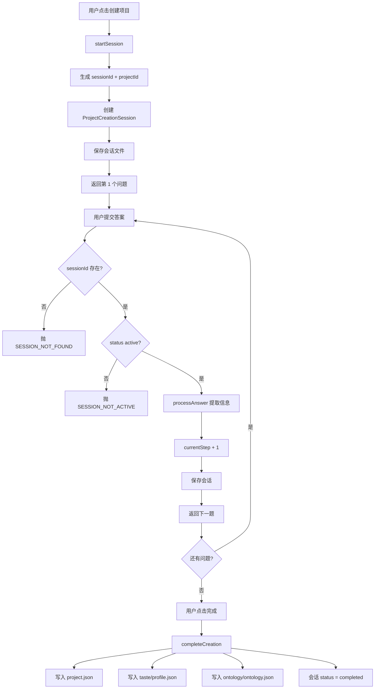

# G01：为什么创建项目要先经过一个“会话”阶段

> 本课核心问题：小王在 OriginOS 里点击“创建项目”后，系统为什么不直接写一条项目记录，而是先创建一个“项目创建会话”？

## 1. 开篇场景：小王想开咖啡馆

小王打开 OriginOS，在首页看到“创建项目”按钮。他点击后输入：

- 项目名称：社区咖啡馆
- 所属领域：餐饮零售

然后系统没有立刻显示“项目创建成功”，而是开始问他问题：

1. “请简单描述你的项目背景。”
2. “你最关注哪几个方面？（多选）”
3. “你习惯怎样工作？（单选）”

小王回答完，确认后，系统才显示项目创建成功，并打开项目工作空间。

从用户视角看，这只是“填了几个问题”。但从系统视角看，**“创建项目”被拆成了两个阶段**：先有一个收集答案的**会话阶段**，再有一个把答案固化成**项目实体**的**完成阶段**。

本课就解释：为什么这样设计？会话阶段产生了什么？没有它会出现什么问题？

## 2. 两种设计思路的对照

假设你是这个功能的开发者，你可能会想到两种做法。

### 2.1 做法一：一步到位

用户点击创建 → 系统直接生成 `project.json` → 显示成功。

这个做法的问题：
- 如果用户回答到一半关闭窗口，已答的内容没有地方保存。
- 如果创建流程有多步问题，每一步都要携带完整项目数据。
- 如果最后一步失败，前面所有步骤需要整体回滚。

### 2.2 做法二：会话 + 完成

用户点击创建 → 系统先建一个**临时会话** → 用户逐步回答问题 → 系统保存每一步答案 → 最后确认时，系统一次性把会话转成项目实体。

这个做法的好处：
- 中间状态可恢复：用户可以随时回来继续。
- 每一步只改会话，不改项目实体，失败成本低。
- 最后一步可以原子性地生成项目、TASTE、本体等多个产物。

OriginOS 采用的是做法二。`ProjectCreationService` 就是负责这个会话阶段的服务。

## 3. 源码精读：`ProjectCreationService` 的三阶段

打开 [packages/core/src/lib/features/project/project-creation-service.ts](../../../../packages/core/src/lib/features/project/project-creation-service.ts)。

这个文件的核心逻辑可以分为三段：开始会话、提交答案、完成创建。

### 3.1 开始会话：`startSession`

```typescript
async startSession(request: StartProjectCreationRequest): Promise<{
  session: ProjectCreationSession;
  question: Question;
}> {
  await ensureDir(this.sessionsDir);

  const sessionId = generateSessionId();
  const projectId = generateProjectId();

  const session = createProjectCreationSession({
    sessionId,
    projectId,
    userId: request.userId,
    projectName: request.projectName,
  });

  // ...

  await this.saveSession(session);

  const question = getQuestionForStep(1);
  if (!question) {
    throw new Error('Failed to get first问题');
  }

  return { session, question };
}
```

对应源码位置：[packages/core/src/lib/features/project/project-creation-service.ts 第 68—106 行](../../../../packages/core/src/lib/features/project/project-creation-service.ts#L68-L106)。

重点看三个字段：

- `sessionId`：本次创建流程的临时身份，格式为 `pc_{uuid}`。
- `projectId`：最终项目的稳定身份，格式为 `proj_{uuid}`，在会话建立时就预分配。
- `createProjectCreationSession`：工厂函数，生成一个带有 `currentStep`、`maxSteps`、`data`、`extractedData` 等字段的会话对象。

这里有一个关键设计：**`projectId` 在会话阶段就生成，而不是等到完成创建时**。这样后续每一步提交答案、最终完成创建，都可以围绕同一个 `projectId` 组织文件路径，避免最后一步再分配 ID 导致的路径不一致。

### 3.2 提交答案：`submitAnswer`

```typescript
async submitAnswer(
  sessionId: string,
  request: SubmitAnswerRequest
): Promise<{
  session: ProjectCreationSession;
  nextQuestion: Question | null;
}> {
  const session = await this.getSession(sessionId);
  if (!session) {
    throw new Error('SESSION_NOT_FOUND');
  }

  if (session.status !== 'active') {
    throw new Error('SESSION_NOT_ACTIVE');
  }

  if (session.currentStep !== request.step) {
    throw new Error('INVALID_STEP');
  }

  await this.processAnswer(session, request);

  const nextStep = session.currentStep + 1;
  session.currentStep = Math.min(nextStep, session.maxSteps);

  await this.saveSession(session);

  const nextQuestion = this.getCurrentQuestion(session);

  return { session, nextQuestion };
}
```

对应源码位置：[packages/core/src/lib/features/project/project-creation-service.ts 第 142—174 行](../../../../packages/core/src/lib/features/project/project-creation-service.ts#L142-L174)。

这一步做了三件明确的事：

1. **身份校验**：`sessionId` 必须存在，`status` 必须是 `active`，`step` 必须匹配当前步。
2. **答案处理**：`processAnswer` 根据当前步骤，把答案写入 `session.data`，并提取出一些派生信息（如 `experience_topology`、`taste_standards`）。
3. **状态推进**：`currentStep` 加一，保存会话，返回下一题。

注意：**这一步只改会话文件，不碰项目目录**。即使 `submitAnswer` 失败，已保存的项目实体也不会处于半成品状态。

### 3.3 完成创建：`completeCreation`

```typescript
async completeCreation(
  sessionId: string,
  request: CompleteCreationRequest
): Promise<{
  project: { id: string; name: string; createdAt: string; path: string };
  taste: TASTEProfile;
  ontology: { domains: number };
}> {
  const session = await this.getSession(sessionId);
  if (!session) {
    throw new Error('SESSION_NOT_FOUND');
  }

  // ...

  const projectId = session.projectId;
  const now = new Date().toISOString();

  await ensureDir(PROJECTS_DIR);
  const projectDir = path.join(PROJECTS_DIR, projectId);
  await ensureDir(projectDir);

  const project = {
    id: projectId,
    name: request.projectName,
    // ...
  };

  await fs.writeFile(
    path.join(projectDir, 'project.json'),
    JSON.stringify(project, null, 2)
  );

  // Generate Project TASTE
  const taste = this.generateProjectTASTE(session);
  // ...

  // Build initial Ontology
  const ontology = this.buildOntology(session);
  // ...

  session.status = 'completed';
  session.completedAt = now;
  await this.saveSession(session);

  return { project, taste, ontology };
}
```

对应源码位置：[packages/core/src/lib/features/project/project-creation-service.ts 第 237—331 行](../../../../packages/core/src/lib/features/project/project-creation-service.ts#L237-L331)。

这一步是“会话 → 实体”的转换点。它一次性做了三件事：

1. 在项目目录写入 `project.json`。
2. 生成并保存项目 TASTE 配置文件。
3. 生成并保存初始本体文件。

然后把会话状态改为 `completed`。

## 4. 图解：会话阶段与完成阶段的关系



这张图回答了一个问题：**会话是“缓冲区”，完成是“提交点”**。会话阶段允许失败和重试，完成阶段则是一次性把会话内容固化为多个实体。

## 5. 关键类型：会话里到底存了什么？

`ProjectCreationSession` 的类型定义在 [packages/core/src/types/project-creation.ts](../../../../packages/core/src/types/project-creation.ts)。本课先关注它的三个核心区域：

| 区域 | 用途 | 示例 |
| --- | --- | --- |
| `sessionId` / `projectId` | 流程身份与最终项目身份 | `pc_xxx`、`proj_xxx` |
| `data` | 用户原始答案 | `background`、`priorities`、`workMode` |
| `extractedData` | 系统从答案中提取的派生信息 | `experience_topology`、`taste_standards`、`context_features` |
| `currentStep` / `maxSteps` / `status` | 流程控制状态 | `active`、`completed` |

`data` 和 `extractedData` 的分离很重要：`data` 保存用户原始输入，便于回显和修改；`extractedData` 保存系统解析后的结构化信息，供后续生成 TASTE 和本体使用。

## 6. 失败路径与边界

### 6.1 会话不存在时提交答案

`submitAnswer` 会先 `getSession(sessionId)`，找不到就抛 `SESSION_NOT_FOUND`。这说明**提交答案不能脱离会话单独发生**。

### 6.2 会话已完成后再提交答案

如果 `session.status !== 'active'`，会抛 `SESSION_NOT_ACTIVE`。这防止了用户在已经完成后又重复提交。

### 6.3 步数不匹配

`session.currentStep !== request.step` 会抛 `INVALID_STEP`。这防止了乱序提交，比如用户在没有回答第 1 题的情况下直接提交第 2 题。

### 6.4 完成创建时会话不存在

`completeCreation` 同样会先查会话，找不到也抛 `SESSION_NOT_FOUND`。没有会话，就不能凭空生成项目。

### 6.5 当前实现的一个特殊点

注意：`completeCreation` 自己直接写了 `project.json`、`taste/profile.json`、`ontology/ontology.json`，而不是调用 `ProjectService` 或 `OntologyService`。这是当前 MVP 实现的特点：**会话完成逻辑内聚了项目、TASTE、本体的生成**。后续课程会讲到 `ProjectService` 的独立 CRUD，以及这种内聚在未来可能如何解耦。

## 7. 测试证据与缺口

### 已覆盖

- `ProjectCreationService` 本身目前没有直接单元测试。
- 相邻测试：`services/launcher/__tests__/skill-launcher.test.ts` 和 `skills/__tests__/service.test.ts` 涉及 Skill 调用，不直接覆盖创建会话流程。

### 缺口

- `startSession` 的 ID 生成、默认字段、首题返回没有自动化断言。
- `submitAnswer` 的三种异常路径（`SESSION_NOT_FOUND`、`SESSION_NOT_ACTIVE`、`INVALID_STEP`）没有自动化测试。
- `completeCreation` 写入的三个文件（`project.json`、`profile.json`、`ontology.json`）的字段和目录结构没有自动化验证。
- `processAnswer` 中的文本提取逻辑（如 `extractExperienceTopology`）依赖正则匹配，没有边界测试。

### 当前可做的验证

由于缺少单元测试，本课的验证主要依赖：

1. 阅读源码，确认字段和顺序。
2. 纸面推演：给定一个输入，逐步写出 `session.data` 和 `extractedData` 的变化。
3. 运行项目创建流程，检查 `data/sessions/project-creation/` 和 `data/projects/` 下是否生成预期文件。

## 8. 小实验：纸面推演一次创建流程

不使用真实 API Key，也不修改源码。只用纸面推演验证会话阶段的状态变化。

### 初始输入

```ts
const request = {
  userId: 'user-xiaowang',
  projectName: '社区咖啡馆',
  defaultValues: {
    background: '想在小区楼下开一家精品咖啡馆',
  },
};
```

### 实验一：startSession 之后应该出现什么？

根据 [packages/core/src/lib/features/project/project-creation-service.ts 第 68—106 行](../../../../packages/core/src/lib/features/project/project-creation-service.ts#L68-L106)，`startSession` 会：

1. 生成 `sessionId = pc_xxx` 和 `projectId = proj_xxx`。
2. 调用 `createProjectCreationSession`，产生 `currentStep = 1`、`maxSteps = 3`、`status = 'active'`。
3. 把 `request.defaultValues.background` 写入 `session.data.background`。
4. 保存文件到 `data/sessions/project-creation/pc_xxx.json`。
5. 返回第 1 个问题。

### 实验二：提交第 1 题答案后，会话如何变化？

假设小王回答第 1 题：

```ts
const answer = {
  step: 1,
  answer: {
    type: 'text',
    value: '社区咖啡馆，主营手冲咖啡和轻食，目标客群是附近居民和上班族',
  },
};
```

根据 `processAnswer` 第 1 步逻辑（[第 185—195 行](../../../../packages/core/src/lib/features/project/project-creation-service.ts#L185-L195)）：

- `session.data.background` 被更新。
- `session.extractedData.experience_topology` 会根据关键词提取，例如可能包含 `general-development`（因为当前实现主要面向技术项目，咖啡馆描述可能不匹配预设模式）。
- `session.extractedData.context_features` 会提取领域、任务类型、技术栈等。

然后 `currentStep` 变为 2，保存会话，返回第 2 题。

### 实验三：完成创建时，磁盘上会出现什么？

根据 `completeCreation`（[第 237—331 行](../../../../packages/core/src/lib/features/project/project-creation-service.ts#L237-L331)）：

1. `data/projects/{projectId}/project.json`：项目基本信息。
2. `data/taste/projects/{projectId}/profile.json`：项目 TASTE 配置。
3. `data/ontologies/{projectId}/ontology.json`：初始本体。
4. `data/sessions/project-creation/{sessionId}.json`：会话状态改为 `completed`。

### 实验结论

这个实验证明了：**会话阶段是独立的、可恢复的、顺序推进的；完成阶段是会话内容的一次性固化**。没有会话阶段，中间答案就没有地方暂存；没有完成阶段，会话就只是一个临时文件，不会变成真正的项目。

## 9. 口头验收

读完本课后，应能不看书稿回答：

1. `ProjectCreationService` 为什么不直接写 `project.json`，而是先写会话文件？
2. `sessionId` 和 `projectId` 分别在什么时候生成？各自的作用是什么？
3. 如果小王回答到第 2 题时关闭窗口，第 2 题的答案会丢失吗？为什么？
4. `submitAnswer` 会抛出哪三种错误？分别在什么条件下抛出？
5. `completeCreation` 一次性生成了哪三个产物？为什么这三个产物在会话阶段不生成？

## 10. 章节收束

本课建立了一个核心认知：**项目创建不是单次写操作，而是“会话缓冲 + 最终提交”的两段过程**。

`ProjectCreationService` 负责第一段：它管理临时会话、收集答案、维护步骤状态。`ProjectService` 和 `ProjectInitializationService` 负责第二段相关部分：把会话转成长期项目实体，并初始化工作空间。

下一课（G02）会深入 `ProjectCreationSession` 的状态结构，解释 `data` 和 `extractedData` 如何分工，以及 `processAnswer` 里的提取逻辑如何影响最终项目属性。
