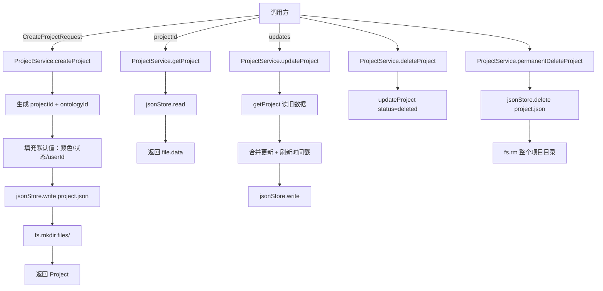

# G03：`ProjectService` 怎样把项目写进磁盘

> 本课核心问题：当小王完成创建流程后，`ProjectService` 如何把一个 `Project` 对象变成磁盘上的文件？它又提供了哪些长期维护项目的能力？

## 1. 开篇场景：项目终于创建了

上两节课讲到，小王回答了三个问题，点击“完成创建”。此时系统内部已经有一个完整的 `ProjectCreationSession`，包含：

- `projectId`：最终项目的稳定身份。
- `data.name`：确认后的项目名称“社区咖啡馆”。
- `data.background`：项目背景描述。
- `extractedData`：从答案中提取的领域、优先级、工作模式等信息。

`completeCreation` 会调用内部的写入逻辑，把一个 `Project` 对象写入磁盘。但 `ProjectService` 才是负责项目长期 CRUD 的服务。这节课我们就打开它，看看一个项目实体如何被创建、读取、更新、删除和查询。

## 2. 两种写文件的思路

在讲源码之前，先区分两个容易混淆的层次。

### 2.1 直接用 `fs.writeFile`

开发者可以写：

```ts
await fs.writeFile('/data/projects/proj-xxx/project.json', JSON.stringify(project));
```

这样做的问题是：
- 路径硬编码，换个环境就要改。
- 没有统一的数据封装格式。
- 没有版本、创建时间、更新时间等元数据。
- 读写分散在各处，难以维护。

### 2.2 通过 `jsonStore` 抽象层

OriginOS 选择了第二种：`ProjectService` 不直接调用 `fs`，而是调用 `jsonStore`。`jsonStore` 负责：

- 统一数据根目录的解析。
- 提供 `read`、`write`、`delete`、`listFiles` 等标准化接口。
- 封装 `DataFile<T>` 格式（包含 `version`、`createdAt`、`updatedAt`、`data`）。

`ProjectService` 则专注于项目业务逻辑：ID 生成、默认值、字段校验、目录创建、软删除等。

## 3. 源码精读：`ProjectService` 的 CRUD

打开 [packages/core/src/lib/features/services/project-service.ts](../../../../packages/core/src/lib/features/services/project-service.ts)。

### 3.1 单例模式

```ts
export class ProjectService {
  private static instance: ProjectService;

  private constructor() {}

  static getInstance(): ProjectService {
    if (!ProjectService.instance) {
      ProjectService.instance = new ProjectService();
    }
    return ProjectService.instance;
  }
}

export const projectService = ProjectService.getInstance();
```

对应源码位置：[packages/core/src/lib/features/services/project-service.ts 第 30—43 行](../../../../packages/core/src/lib/features/services/project-service.ts#L30-L43) 和 [第 387—390 行](../../../../packages/core/src/lib/features/services/project-service.ts#L387-L390)。

`ProjectService` 是单例。这意味着整个应用生命周期中只有一个 `ProjectService` 实例，所有项目操作都通过它进行。单例在这里不是为了共享可变状态（项目数据存在磁盘上），而是为了统一管理文件访问逻辑。

### 3.2 创建项目：`createProject`

```ts
async createProject(request: CreateProjectRequest): Promise<Project> {
  const now = Date.now();
  const projectId = this.generateId();

  const ontologyId = request.ontologyId || `ontology-${projectId}`;

  const colors = [
    "from-blue-500", "from-purple-500", "from-green-500",
    "from-yellow-500", "from-pink-500", "from-indigo-500",
    "from-red-500", "from-orange-500",
  ];
  const defaultColor = colors[projectId.charCodeAt(projectId.length - 1) % colors.length];

  const project: Project = {
    id: projectId,
    name: request.name,
    description: request.description || "",
    domain: request.domain,
    type: request.type || "generic",
    ontologyId,
    createdAt: now,
    updatedAt: now,
    lastModified: now,
    userId: request.userId || "current-user",
    status: "active",
    color: request.color || defaultColor,
    icon: undefined,
    metadata: {},
  };

  const filePath = jsonStore.getProjectPath(projectId);
  await jsonStore.write(filePath, project);

  const filesDir = `${jsonStore["PROJECTS_DIR"]}/${projectId}/files`;
  const fs = await import("fs/promises");
  await fs.mkdir(filesDir, { recursive: true }).catch(() => {});

  return project;
}
```

对应源码位置：[packages/core/src/lib/features/services/project-service.ts 第 55—104 行](../../../../packages/core/src/lib/features/services/project-service.ts#L55-L104)。

重点看几个设计决策：

1. **ID 生成**：`generateId()` 返回 `proj-${Date.now()}-${random}`。时间戳前缀让项目 ID 有大致排序性，随机后缀避免冲突。
2. **ontologyId 默认规则**：如果请求没有提供，就用 `ontology-${projectId}`。这保证了每个项目默认关联一个本体。
3. **颜色默认值**：从 8 个 Tailwind 渐变类中，根据 `projectId` 最后一个字符的 ASCII 码取模选择。这是一个确定性的伪随机策略：同一个 `projectId` 总是得到同一种默认颜色。
4. **写入方式**：先通过 `jsonStore.write` 写 `project.json`，再直接用 `fs.mkdir` 创建 `files/` 子目录。
5. **目录创建的错误处理**：`fs.mkdir(...).catch(() => {})` 表示目录已存在时静默忽略。这是为了支持幂等调用，但也意味着如果目录创建真正失败（如权限不足），错误也被吞掉了。

### 3.3 读取项目：`getProject`

```ts
async getProject(projectId: string): Promise<Project | null> {
  try {
    const filePath = jsonStore.getProjectPath(projectId);
    const file = await jsonStore.read<Project>(filePath);

    if (!file) {
      return null;
    }

    return file.data;
  } catch {
    return null;
  }
}
```

对应源码位置：[packages/core/src/lib/features/services/project-service.ts 第 109—122 行](../../../../packages/core/src/lib/features/services/project-service.ts#L109-L122)。

这里的关键是 `jsonStore.read<Project>(filePath)` 返回的是 `DataFile<Project>`，而不是直接的 `Project`。所以返回值是 `file.data`。

`DataFile<T>` 的结构是：

```ts
interface DataFile<T = unknown> {
  version: string;
  createdAt: string;
  updatedAt: string;
  data: T;
}
```

这意味着磁盘上的 `project.json` 实际上长这样：

```json
{
  "version": "1.0.0",
  "createdAt": "2026-09-02T10:00:00.000Z",
  "updatedAt": "2026-09-02T10:00:00.000Z",
  "data": { /* 真正的 Project 对象 */ }
}
```

这种封装的好处是：文件自带元数据，便于版本迁移和审计。代价是任何读取方都必须知道 `.data` 这层封装。

### 3.4 更新项目：`updateProject`

```ts
async updateProject(projectId: string, updates: UpdateProjectRequest): Promise<Project | null> {
  const existingProject = await this.getProject(projectId);

  if (!existingProject) {
    return null;
  }

  const now = Date.now();

  const updatedProject: Project = {
    ...existingProject,
    ...updates,
    updatedAt: now,
    lastModified: now,
    metadata: {
      ...existingProject.metadata,
      ...updates.metadata,
    },
  };

  const filePath = jsonStore.getProjectPath(projectId);
  const file = await jsonStore.read<Project>(filePath);

  if (file) {
    await jsonStore.write(filePath, updatedProject);
  }

  return updatedProject;
}
```

对应源码位置：[packages/core/src/lib/features/services/project-service.ts 第 143—172 行](../../../../packages/core/src/lib/features/services/project-service.ts#L143-L172)。

更新逻辑有几个注意点：

1. **先读后写**：先 `getProject` 拿旧数据，再合并更新。
2. **时间戳自动刷新**：`updatedAt` 和 `lastModified` 总是更新为当前时间。
3. **metadata 浅合并**：`metadata` 不是整体替换，而是旧值和新值的浅合并。这允许调用者只更新 metadata 中的某个字段，而不丢失其他字段。
4. **重复读取**：这里先 `getProject` 读取一次，又 `jsonStore.read` 读取一次。第二次读取主要是为了确认文件仍然存在，然后写入。这是一个略显冗余的实现，但保证了并发下的基本安全。

### 3.5 删除项目：软删除与硬删除

```ts
async deleteProject(projectId: string): Promise<boolean> {
  try {
    await this.updateProject(projectId, { status: "deleted" });
    return true;
  } catch {
    return false;
  }
}

async permanentDeleteProject(projectId: string): Promise<boolean> {
  try {
    const filePath = jsonStore.getProjectPath(projectId);
    await jsonStore.delete(filePath);

    const fs = await import("fs/promises");
    const projectDir = `${jsonStore["PROJECTS_DIR"]}/${projectId}`;
    await fs.rm(projectDir, { recursive: true, force: true }).catch(() => {});

    return true;
  } catch {
    return false;
  }
}
```

对应源码位置：[packages/core/src/lib/features/services/project-service.ts 第 177—206 行](../../../../packages/core/src/lib/features/services/project-service.ts#L177-L206)。

这是两种删除语义：

| 方法 | 行为 | 数据是否可恢复 |
| --- | --- | --- |
| `deleteProject` | 软删除，把 `status` 改为 `"deleted"` | 是，项目文件还在 |
| `permanentDeleteProject` | 硬删除，删除 `project.json` 和整个项目目录 | 否 |

软删除的设计让项目列表可以过滤掉已删除项目，但数据保留，便于未来实现“回收站”。硬删除则是真正的清理。

注意：`permanentDeleteProject` 中 `jsonStore.delete(filePath)` 和 `fs.rm(projectDir)` 是两个独立操作。如果前者成功、后者失败，项目 JSON 没了但目录残留，会留下孤儿目录。当前实现没有事务或回滚机制。

### 3.6 查询项目列表：`listProjects`

```ts
async listProjects(query: ProjectQuery = {}): Promise<ProjectListItem[]> {
  const allFiles = await jsonStore.listFiles(jsonStore["PROJECTS_DIR"]);

  const projects: ProjectListItem[] = [];

  for (const file of allFiles) {
    const projectId = file.replace(".json", "");
    const project = await this.getProject(projectId);

    if (!project) continue;

    if (query.status && project.status !== query.status) continue;
    if (query.userId && project.userId !== query.userId) continue;
    if (query.domain && project.domain !== query.domain) continue;

    if (query.search) {
      const searchLower = query.search.toLowerCase();
      const nameMatch = project.name.toLowerCase().includes(searchLower);
      const descMatch = project.description.toLowerCase().includes(searchLower);
      const domainMatch = project.domain.toLowerCase().includes(searchLower);

      if (!nameMatch && !descMatch && !domainMatch) continue;
    }

    // 计算本体大小
    const ontologyId = project.ontologyId;
    let ontologySize = 0;
    if (ontologyId) {
      const ontologyPath = jsonStore.getOntologyPath(ontologyId);
      const ontologyFile = await jsonStore.read<any>(ontologyPath);
      if (ontologyFile?.data?.nodes) {
        ontologySize = ontologyFile.data.nodes.length;
      }
    }

    projects.push({
      id: project.id,
      name: project.name,
      description: project.description,
      domain: project.domain,
      createdAt: project.createdAt,
      lastModified: project.lastModified,
      ontologySize,
      ontologyId: project.ontologyId || '',
      color: project.color,
      status: project.status,
      hasSolution: false,
    });
  }

  // 排序 + 分页
  // ...
}
```

对应源码位置：[packages/core/src/lib/features/services/project-service.ts 第 211—298 行](../../../../packages/core/src/lib/features/services/project-service.ts#L211-L298)。

`listProjects` 的逻辑是：

1. 列出 `PROJECTS_DIR` 下所有 `.json` 文件。
2. 逐个读取项目。
3. 按 `status`、`userId`、`domain`、`search` 过滤。
4. 计算每个项目的 `ontologySize`（通过读取关联的本体文件）。
5. 排序、分页、返回。

这里有两个性能边界：

- **N+1 读取**：每列出一个项目，都要 `getProject` 读一次；如果还要算 `ontologySize`，再读一次本体文件。项目数量多时，这是 O(N) 次文件读取。
- **全量过滤**：所有项目都读进内存后再过滤、排序、分页。MVP 阶段项目数量少，这不是问题；但数量多时会是瓶颈。

## 4. 图解：项目服务的调用边界



这张图回答了一个问题：**`ProjectService` 不直接发明文件格式，而是基于 `jsonStore` 的 `DataFile` 封装，再叠加项目业务逻辑（ID、默认值、软删除、查询过滤）**。

## 5. 关键类型：`Project` 与 `CreateProjectRequest`

`Project` 的类型定义在 [packages/core/src/types/project.ts](../../../../packages/core/src/types/project.ts)。本课关注几个核心字段：

| 字段 | 含义 | 默认值来源 |
| --- | --- | --- |
| `id` | 项目稳定身份 | `ProjectService.generateId()` |
| `name` | 项目名称 | 请求传入 |
| `description` | 项目描述 | 请求传入或空字符串 |
| `domain` | 领域 | 请求传入 |
| `type` | 项目类型 | 请求传入或 `"generic"` |
| `ontologyId` | 关联本体 ID | 请求传入或 `ontology-${projectId}` |
| `status` | 项目状态 | `"active"`，软删除时改为 `"deleted"` |
| `color` | 主题色 | 请求传入或按 projectId 取模 |
| `metadata` | 扩展元数据 | `{}` |

`CreateProjectRequest` 是创建项目的输入合同。它不要求调用方提供 `id`、`createdAt`、`status` 等字段，这些由 `ProjectService` 内部决定。这是一种常见的“输入最小化，输出完整化”设计。

## 6. 失败路径与边界

### 6.1 `files/` 目录创建失败被静默忽略

```ts
await fs.mkdir(filesDir, { recursive: true }).catch(() => {});
```

如果磁盘满了、权限不足或路径非法，`files/` 目录创建会失败，但 `createProject` 仍然返回项目对象。这会导致项目存在但文件目录缺失，后续上传文件时可能出错。

### 6.2 `updateProject` 中项目不存在时返回 `null`

不是抛异常，而是返回 `null`。调用方需要检查返回值，否则可能误以为更新成功。

### 6.3 `listProjects` 中 `ontologySize` 计算假设

代码假设本体文件有 `.data.nodes` 字段：

```ts
if (ontologyFile?.data?.nodes) {
  ontologySize = ontologyFile.data.nodes.length;
}
```

如果本体数据格式不是 `nodes` 数组，`ontologySize` 就会是 0。这与 `ontology-data-store` 中的格式可能不一致，是一个跨 feature 的格式假设风险。

### 6.4 软删除项目仍出现在列表查询的底层遍历中

`listProjects` 没有默认过滤 `status === "deleted"` 的项目。如果调用方不传 `query.status: "active"`，已删除项目也会进入过滤和排序流程。当前前端通常会传状态过滤，但这是一个默认行为上的陷阱。

## 7. 测试证据与缺口

### 已覆盖

- `ProjectService` 目前没有直接单元测试。
- 相邻测试：`services/launcher/__tests__/skill-launcher.test.ts` 可能间接使用项目路径，但不验证 `ProjectService` 的行为。

### 缺口

- `createProject` 的字段默认值（尤其是 `color` 和 `ontologyId`）没有自动化断言。
- `getProject` 对 `DataFile` 封装的处理没有测试。
- `updateProject` 的 `metadata` 浅合并没有测试。
- `deleteProject` 与 `permanentDeleteProject` 的语义区分没有测试。
- `listProjects` 的过滤、排序、分页逻辑没有测试。
- `files/` 目录创建失败的错误处理没有测试。

### 当前可做的验证

1. 运行项目创建流程，检查 `data/projects/{projectId}/project.json` 的字段。
2. 手动修改 `project.json` 的 `status` 为 `"deleted"`，观察 `listProjects` 的行为。
3. 删除 `project.json`，调用 `getProject`，确认返回 `null` 而不是抛错。

## 8. 小实验：验证 `DataFile` 封装

不使用真实模型，只通过文件系统观察 `ProjectService` 的写入行为。

### 步骤一：创建项目

假设调用：

```ts
const project = await projectService.createProject({
  name: '社区咖啡馆',
  description: '小区楼下的精品咖啡馆',
  domain: '餐饮零售',
  type: 'cafe',
  userId: 'user-xiaowang',
});
```

### 步骤二：观察磁盘文件

在 `data/projects/{projectId}/project.json` 中，你会看到：

```json
{
  "version": "1.0.0",
  "createdAt": "2026-09-02T10:00:00.000Z",
  "updatedAt": "2026-09-02T10:00:00.000Z",
  "data": {
    "id": "proj-...",
    "name": "社区咖啡馆",
    "description": "小区楼下的精品咖啡馆",
    "domain": "餐饮零售",
    "type": "cafe",
    "ontologyId": "ontology-proj-...",
    "status": "active",
    "color": "from-blue-500",
    "metadata": {},
    // ...
  }
}
```

### 步骤三：验证读取

```ts
const fetched = await projectService.getProject(project.id);
```

`fetched` 应该只包含 `data` 字段里的内容，不包含外层的 `version`、`createdAt`、`updatedAt`。

### 实验结论

这个实验说明：`ProjectService` 对调用方隐藏了 `DataFile` 封装。调用方拿到的是纯 `Project` 对象，但磁盘上保存的是带元数据的封装格式。这种分层让业务代码不关心存储细节，但教材中必须讲清楚这层封装，否则读者看到磁盘文件会困惑。

## 9. 口头验收

读完本课后，应能不看书稿回答：

1. `ProjectService` 为什么不直接调用 `fs.writeFile`，而是调用 `jsonStore.write`？
2. 创建项目时，`ontologyId` 和 `color` 的默认值分别是什么规则？
3. `getProject` 返回的是 `DataFile<Project>` 还是 `Project`？源码中在哪一步做了转换？
4. `deleteProject` 和 `permanentDeleteProject` 有什么区别？各有什么风险？
5. `listProjects` 计算 `ontologySize` 时做了什么假设？如果本体格式不同会怎样？

## 10. 章节收束

本课的核心认知是：**`ProjectService` 是项目实体的长期管家，它基于 `jsonStore` 封装，负责项目的创建、读取、更新、删除和查询，并在其中注入项目特有的业务规则**。

我们看到的几个关键设计：

- `DataFile` 封装隐藏了存储元数据。
- 默认颜色、默认 `ontologyId` 让调用方可以最小化输入。
- 软删除与硬删除分离，支持回收站与未来清理策略。
- 列表查询简单直接，但存在 N+1 读取和全量过滤的性能边界。

下一课（G04）会对比 `ProjectService` 和 `ProjectServiceReal`，解释为什么存在两个项目服务实现，以及它们各自的目录布局差异。
