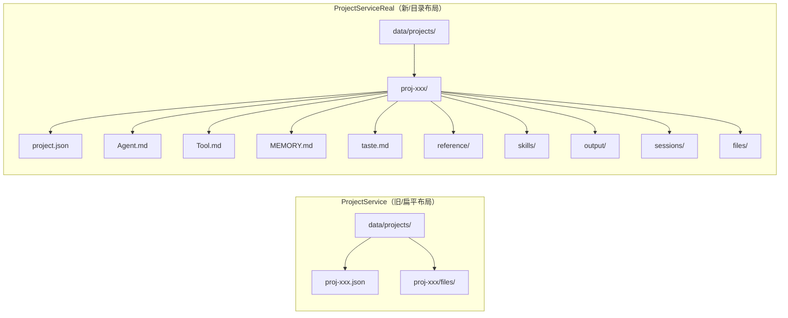

# G04：为什么存在两个项目服务实现

> 本课核心问题：`ProjectService` 和 `ProjectServiceReal` 有什么区别？为什么代码里同时存在两套项目 CRUD？生产路径到底用哪一套？

## 1. 开篇场景：小王的咖啡馆项目创建后，目录里多了什么？

上节课我们讲到，`ProjectService.createProject` 会写入 `project.json` 并创建 `files/` 目录。但如果你在项目中看到另一段创建逻辑，可能会发现它生成的目录结构完全不同：

```
data/projects/proj-xxx/
├── project.json
├── Agent.md
├── Tool.md
├── MEMORY.md
├── taste.md
├── reference/
│   └── business-model.json
├── skills/
├── output/
│   ├── documents/
│   ├── diagrams/
│   └── code/
└── sessions/
```

这不是 `ProjectService` 创建的，而是 `ProjectServiceReal` 创建的。这节课我们就来解释：为什么会有两套实现？它们各自负责什么场景？

## 2. 两个服务的核心差异

| 维度 | `ProjectService` | `ProjectServiceReal` |
| --- | --- | --- |
| 存储抽象 | 基于 `jsonStore` | 直接使用 `fs/promises` |
| 项目路径布局 | 扁平文件：`data/projects/{projectId}.json` + `data/projects/{projectId}/files/` | 目录布局：`data/projects/{projectId}/project.json` + 多个子目录 |
| 目录结构 | 只创建 `files/` | 创建 `reference/`、`skills/`、`output/`、`sessions/`、`files/` 等 |
| 模板复制 | 不复制 | 从 `templates/` 复制 `Agent.md`、`Tool.md`、`MEMORY.md`、`taste.md` |
| 读取兼容性 | 只读扁平布局 | 同时兼容扁平文件和新目录布局 |
| 当前使用状态 | MVP 默认路径 | 更完整的业务路径，部分场景已接入 |

这种“两个实现并存”的现象，在快速演进的项目中很常见：旧实现满足当前 MVP 需求，新实现承载未来架构方向，两者在迁移期共存。

## 3. 源码精读：`ProjectServiceReal` 的创建逻辑

打开 [packages/core/src/lib/features/services/project-service-real.ts](../../../../packages/core/src/lib/features/services/project-service-real.ts)。

### 3.1 直接使用 `fs/promises`

```ts
import { mkdir, readFile, writeFile, readdir, unlink, rm, copyFile, access } from 'fs/promises';
import { existsSync } from 'fs';
import path from 'path';
import { getTemplatesDir, getDataRoot } from '../../paths';

const DATA_DIR = path.join(getDataRoot(), 'projects');
const FILES_DIR = 'files';
```

对应源码位置：[packages/core/src/lib/features/services/project-service-real.ts 第 7—28 行](../../../../packages/core/src/lib/features/services/project-service-real.ts#L7-L28)。

与 `ProjectService` 最大的不同：`ProjectServiceReal` 不依赖 `jsonStore`，而是自己管理路径和文件操作。这意味着：

- 它要自己拼 `DATA_DIR`。
- 它要自己处理 `project.json` 的读写。
- 它不再使用 `DataFile<T>` 封装，`project.json` 直接保存 `Project` 对象。

### 3.2 创建项目：更完整的目录结构

```ts
async createProject(request: CreateProjectRequest): Promise<Project> {
  await ensureDataDir();

  const projectId = generateProjectId();
  const now = Date.now();

  const project: Project = {
    id: projectId,
    name: request.name,
    description: request.description || '',
    domain: request.domain,
    type: request.type || 'generic',
    ontologyId: request.ontologyId ?? '',
    createdAt: now,
    updatedAt: now,
    lastModified: now,
    userId: request.userId || 'current-user',
    status: request.status || 'active',
    color: request.color || generateRandomColor(),
    icon: request.icon,
    metadata: (request.metadata || {}) as ProjectMetadata,
  };

  const projectDir = path.join(DATA_DIR, projectId);
  await mkdir(projectDir, { recursive: true });

  const subdirs = [
    'reference',
    'skills',
    'output',
    'output/documents',
    'output/diagrams',
    'output/code',
    'sessions',
    'files',
  ];

  for (const subdir of subdirs) {
    await mkdir(path.join(projectDir, subdir), { recursive: true });
  }

  await writeFile(
    path.join(projectDir, 'project.json'),
    JSON.stringify(project, null, 2),
    'utf-8'
  );

  for (const templateFile of ['Agent.md', 'Tool.md', 'MEMORY.md', 'taste.md']) {
    const src = path.join(TEMPLATES_DIR, templateFile);
    const dest = path.join(projectDir, templateFile);
    try {
      await access(src);
      await copyFile(src, dest);
    } catch {
      // Template doesn't exist, skip
    }
  }

  return project;
}
```

对应源码位置：[packages/core/src/lib/features/services/project-service-real.ts 第 72—135 行](../../../../packages/core/src/lib/features/services/project-service-real.ts#L72-L135)。

这里有几个关键设计：

1. **目录式布局**：项目不再是单个 JSON 文件，而是一个目录 `data/projects/{projectId}/`，所有相关文件都组织在这个目录下。
2. **子目录语义明确**：
   - `reference/`：参考文件和知识库。
   - `skills/`：项目级 Skill。
   - `output/`：Agent 输出产物，再细分为 `documents/`、`diagrams/`、`code/`。
   - `sessions/`：会话历史。
   - `files/`：用户上传文件。
3. **模板文件复制**：从 `templates/` 复制 `Agent.md`、`Tool.md`、`MEMORY.md`、`taste.md`。这些文件是 Agent 运行时的上下文基础（详见 Part F）。
4. **不封装 DataFile**：`project.json` 直接就是 `Project` 对象，没有外层 `version` / `createdAt` / `updatedAt` 封装。

### 3.3 双布局兼容读取

```ts
async getProject(projectId: string): Promise<Project | null> {
  const flatPath = getProjectPath(projectId);
  const dirPath = getProjectDirPath(projectId);
  const projectPath = existsSync(flatPath) ? flatPath : existsSync(dirPath) ? dirPath : null;

  if (!projectPath) return null;

  try {
    const content = await readFile(projectPath, 'utf-8');
    return JSON.parse(content) as Project;
  } catch (error) {
    console.error('Error reading project:', error);
    return null;
  }
}
```

对应源码位置：[packages/core/src/lib/features/services/project-service-real.ts 第 140—155 行](../../../../packages/core/src/lib/features/services/project-service-real.ts#L140-L155)。

这是 `ProjectServiceReal` 的一个重要特性：**同时兼容旧布局（扁平文件）和新布局（目录式）**。它先检查 `data/projects/{projectId}.json`，再检查 `data/projects/{projectId}/project.json`。

这种设计的原因是：项目数据可能由旧代码或新代码创建，读取方不能假设只有一种布局。但这种兼容也增加了长期维护成本：未来如果要统一格式，需要迁移旧数据。

### 3.4 删除的双布局处理

```ts
async deleteProject(projectId: string): Promise<boolean> {
  const flatPath = getProjectPath(projectId);
  const dirPath = path.join(DATA_DIR, projectId);
  const isDirectory = existsSync(dirPath) && !existsSync(flatPath);
  const isFlatFile = existsSync(flatPath);

  if (!isDirectory && !isFlatFile) {
    return false;
  }

  try {
    if (isDirectory) {
      await rm(dirPath, { recursive: true, force: true });
    } else {
      await unlink(flatPath);
      const filesDir = getProjectFilesPath(projectId);
      if (existsSync(filesDir)) {
        await rm(filesDir, { recursive: true, force: true });
      }
    }
    return true;
  } catch (error) {
    console.error('Error deleting project:', error);
    return false;
  }
}
```

对应源码位置：[packages/core/src/lib/features/services/project-service-real.ts 第 188—216 行](../../../../packages/core/src/lib/features/services/project-service-real.ts#L188-L216)。

删除逻辑也体现了双布局兼容：

- 如果是目录布局，直接 `rm` 整个项目目录。
- 如果是扁平布局，先删 `.json` 文件，再删 `files/` 目录。

注意：这里只有硬删除，没有软删除。这与 `ProjectService` 的 `deleteProject`（软删除）语义不同。

## 4. 图解：两个服务的目录布局对比



这张图说明：`ProjectServiceReal` 不只是换一种存文件的方式，而是把“项目”从一个 JSON 记录扩展成了一个**完整的工作空间目录**。

## 5. 关键对比：哪一个才是“真相”？

### 5.1 当前生产路径主要用哪个？

根据源码搜索：

- `ProjectService` 被多处引用，包括 `project-creation-service.ts` 吗？不，`project-creation-service.ts` 的 `completeCreation` 是自己直接写 `project.json`。
- `ProjectServiceReal` 被 `project-initialization-service.ts` 使用（见 [第 15 行](../../../../packages/core/src/lib/features/services/project-initialization-service.ts#L15) 的导入，虽然导入的是 `agentSessionService`，但 `project-initialization-service.ts` 内部自己管理项目目录）。

实际上，当前代码中存在多条项目创建路径：

1. `ProjectCreationService.completeCreation`：自己直接写 `project.json`（在 `data/projects/{projectId}/` 下，但只写项目文件，不创建子目录）。
2. `ProjectService.createProject`：基于 `jsonStore` 的扁平布局实现。
3. `ProjectServiceReal.createProject`：基于 `fs` 的目录布局实现。
4. `ProjectInitializationService.initializeProject`：自己创建完整目录结构并写 `project.json`。

这种多重实现是项目演进中的典型技术债务。教材必须如实说明：**当前 OriginOS 中项目创建/读取有多条并行路径，而不是单一真相源**。

### 5.2 两条路径的数据是否兼容？

| 场景 | 兼容性 |
| --- | --- |
| `ProjectServiceReal.getProject` 读取 `ProjectService` 创建的扁平文件 | ✅ 兼容，因为 `getProject` 先检查扁平路径 |
| `ProjectService.getProject` 读取 `ProjectServiceReal` 创建的目录布局 | ❌ 不兼容，`ProjectService` 只通过 `jsonStore.getProjectPath` 读取 `.json` 文件 |
| `ProjectServiceReal.getProject` 读取 `ProjectInitializationService` 创建的目录 | ✅ 兼容，布局一致 |

这说明：**读取兼容性是不对称的**。`ProjectServiceReal` 能读旧布局，但 `ProjectService` 不能读新布局。

## 6. 失败路径与边界

### 6.1 模板文件不存在时静默跳过

```ts
for (const templateFile of ['Agent.md', 'Tool.md', 'MEMORY.md', 'taste.md']) {
  const src = path.join(TEMPLATES_DIR, templateFile);
  const dest = path.join(projectDir, templateFile);
  try {
    await access(src);
    await copyFile(src, dest);
  } catch {
    // Template doesn't exist, skip
  }
}
```

如果 `templates/` 目录缺少某些文件，项目仍然创建成功，但 Agent 运行所需的上下文文件可能缺失。这在开发环境或模板更新不完整时会导致问题。

### 6.2 `ontologyId` 默认值不同

- `ProjectService`：`request.ontologyId || `ontology-${projectId}``，默认非空。
- `ProjectServiceReal`：`request.ontologyId ?? ''`，默认空字符串。

如果调用方不传 `ontologyId`，两者行为不一致。这可能导致后续本体查找代码需要处理空字符串和 `ontology-xxx` 两种格式。

### 6.3 `listProjects` 的 `ontologySize` 计算口径不同

- `ProjectService`：从 `jsonStore.getOntologyPath(ontologyId)` 读取本体文件，数 `.data.nodes.length`。
- `ProjectServiceReal`：从 `data/projects/{projectId}/output/business-model.json` 读取，数 `.entities.length`。

这意味着同一个项目，用不同服务查询，显示的“本体大小”可能不同。这是跨实现的数据口径不一致。

### 6.4 删除语义不一致

- `ProjectService.deleteProject`：软删除。
- `ProjectServiceReal.deleteProject`：硬删除。

如果调用方混用两个服务，可能预期“删除后可恢复”，结果数据被彻底清理。

## 7. 测试证据与缺口

### 已覆盖

- `ProjectServiceReal` 没有直接单元测试。
- 相关测试可能通过 `ProjectInitializationService` 的调用间接覆盖部分路径。

### 缺口

- 两个服务创建的项目布局差异没有自动化对比测试。
- 双布局读取兼容性没有测试。
- `ontologySize` 计算口径不一致没有测试或文档说明。
- 删除语义差异没有测试。
- 模板文件缺失时的行为没有测试。

### 当前可做的验证

1. 分别调用 `ProjectService.createProject` 和 `ProjectServiceReal.createProject`，对比磁盘上生成的文件和目录。
2. 用 `ProjectServiceReal.getProject` 读取 `ProjectService` 创建的项目，确认能成功。
3. 用 `ProjectService.getProject` 读取 `ProjectServiceReal` 创建的项目，确认失败或返回 `null`。
4. 删除 `templates/Agent.md`，再调用 `ProjectServiceReal.createProject`，观察项目是否仍创建成功但缺少 `Agent.md`。

## 8. 小实验：观察两套实现的真实产物

### 实验一：用 `ProjectService` 创建

```ts
const p1 = await projectService.createProject({
  name: '咖啡馆-A',
  domain: '餐饮零售',
});
```

观察磁盘：

```
data/projects/
├── proj-a.json
└── proj-a/
    └── files/
```

`proj-a.json` 的内容是 `DataFile<Project>` 格式，外层有 `version`、`createdAt`、`updatedAt`、`data`。

### 实验二：用 `ProjectServiceReal` 创建

```ts
const p2 = await projectServiceReal.createProject({
  name: '咖啡馆-B',
  domain: '餐饮零售',
});
```

观察磁盘：

```
data/projects/
└── proj-b/
    ├── project.json
    ├── Agent.md
    ├── Tool.md
    ├── MEMORY.md
    ├── taste.md
    ├── reference/
    ├── skills/
    ├── output/
    │   ├── documents/
    │   ├── diagrams/
    │   └── code/
    ├── sessions/
    └── files/
```

`project.json` 的内容直接是 `Project` 对象，没有外层 `DataFile` 封装。

### 实验结论

这个实验说明：**两套实现不仅是接口不同，它们对“项目”这个概念的物理组织方式也不同**。`ProjectService` 把项目当作一个带元数据的 JSON 记录；`ProjectServiceReal` 把项目当作一个完整的工作空间目录。

## 9. 口头验收

读完本课后，应能不看书稿回答：

1. `ProjectService` 和 `ProjectServiceReal` 在存储抽象上最大的区别是什么？
2. `ProjectServiceReal` 创建项目时会生成哪些 `ProjectService` 不会生成的文件或目录？
3. 为什么 `ProjectServiceReal.getProject` 要先检查扁平文件路径，再检查目录布局路径？
4. 如果一套代码用 `ProjectService` 创建项目，另一套代码用 `ProjectServiceReal.getProject` 读取，会成功吗？反过来呢？
5. 两个服务的 `deleteProject` 语义有什么不同？混用会有什么风险？

## 10. 章节收束

本课的核心认知是：**OriginOS 当前存在两套项目服务实现，它们代表两种不同的项目存储哲学**。

- `ProjectService` 是 `jsonStore` 之上的轻量实现，适合 MVP 阶段的快速 CRUD。
- `ProjectServiceReal` 是更接近完整业务路径的实现，把项目组织成包含 Agent 上下文、Skill、输出、会话的完整工作空间。

这种并存是技术债务，但也是真实的代码现状。教材不能假装只有一套实现，必须讲清楚它们的差异、兼容性和风险。

下一课（G05）会进入 `ProjectInitializationService`，看一个项目创建后，系统如何进一步初始化它的目录、Agent 配置和业务模型。
