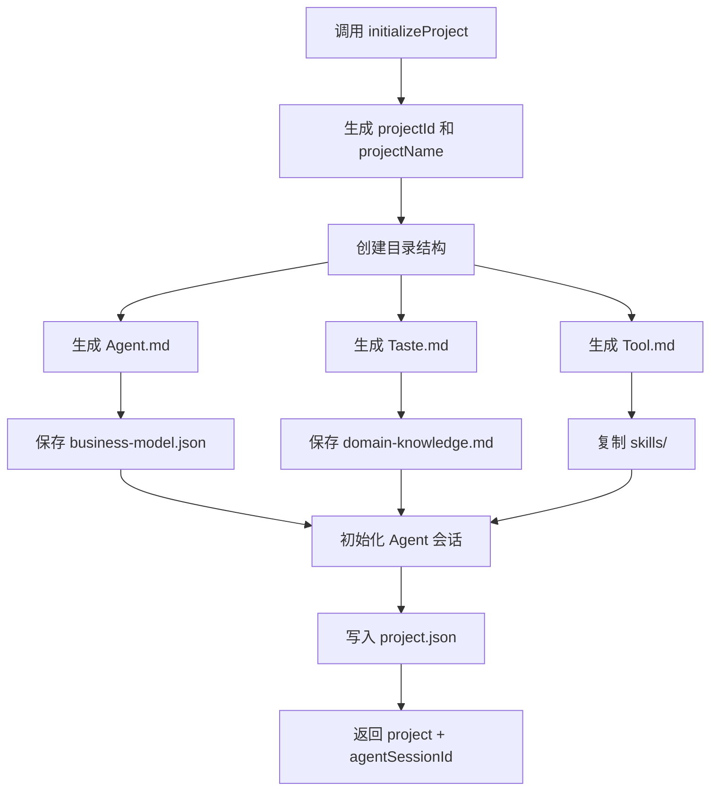

# G05：项目初始化服务做什么、不做什么

> 本课核心问题：`ProjectInitializationService` 在项目创建后还要做哪些事？它和 `ProjectService` / `ProjectServiceReal` 的边界在哪里？

## 1. 开篇场景：项目创建只是第一步

小王完成了创建流程，系统已经写入了 `project.json`。但这并不代表项目已经“可用”。一个可工作的项目还需要：

- Agent 能读到的行为规则文件（`Agent.md`）。
- Agent 能使用的工具配置（`Tool.md`）。
- 项目的风格指南（`Taste.md`）。
- 业务模型文件（`reference/business-model.json`）。
- 领域知识文档（`reference/domain-knowledge.md`）。
- 项目级 Skill（`skills/`）。
- 一个 Agent 会话（`sessions/`）。

这些不是 `ProjectService` 创建的，而是 `ProjectInitializationService` 的职责。这节课我们就看它如何把“一个项目记录”扩展成“一个可工作的项目工作空间”。

## 2. 初始化服务与项目服务的边界

在讲源码之前，先分清两个服务的职责。

| 服务 | 职责 | 它创造什么 | 它不做什么 |
| --- | --- | --- | --- |
| `ProjectService` / `ProjectServiceReal` | 项目的 CRUD | `project.json`、项目目录骨架 | 不生成 Agent 配置文件、不生成业务模型、不初始化 Agent 会话 |
| `ProjectInitializationService` | 项目工作空间的完整初始化 | `Agent.md`、`Tool.md`、`Taste.md`、业务模型、领域知识、Skill 复制、Agent 会话 | 不管理项目列表查询、不处理项目软删除 |

简单说：**`ProjectService` 让项目“存在”；`ProjectInitializationService` 让项目“可工作”**。

## 3. 源码精读：`initializeProject` 的十步流程

打开 [packages/core/src/lib/features/services/project-initialization-service.ts](../../../../packages/core/src/lib/features/services/project-initialization-service.ts)。

`initializeProject` 是核心入口，对应源码位置：[第 316—428 行](../../../../packages/core/src/lib/features/services/project-initialization-service.ts#L316-L428)。

它接收一个 `InitializeProjectParams`：

```ts
export interface InitializeProjectParams {
  businessModel: BusinessModel;
  skillsToInclude?: string[];
  userId?: string;
}
```

对应源码位置：[packages/core/src/lib/features/services/project-initialization-service.ts 第 60—64 行](../../../../packages/core/src/lib/features/services/project-initialization-service.ts#L60-L64)。

注意：**`ProjectInitializationService` 接收的是 `BusinessModel`，而不是 `CreateProjectRequest` 或 `ProjectCreationSession`**。这意味着它位于“业务模型已经确定”之后，负责把业务模型落地成文件和 Agent 上下文。

### 3.1 生成项目 ID 和标题

```ts
const projectId = generateProjectId();
const projectName = generateProjectTitle(businessModel);
const projectPath = getProjectPath(projectId);
```

对应源码位置：[packages/core/src/lib/features/services/project-initialization-service.ts 第 319—321 行](../../../../packages/core/src/lib/features/services/project-initialization-service.ts#L319-L321)。

这里有一个重要事实：**`ProjectInitializationService` 自己生成 `projectId`，不调用 `ProjectService` 或 `ProjectServiceReal`**。这意味着它是一条独立的项目创建路径。

如果调用方期望项目 ID 由 `ProjectService` 统一管理，这里就会出现 ID 来源不一致的问题。当前代码中，这条路径主要用于“基于业务模型初始化项目”的场景，与前面的“创建会话 → 完成创建”路径是并行的。

### 3.2 创建目录结构

```ts
await this.createProjectStructure(projectId);
```

`createProjectStructure` 的实现：

```ts
async createProjectStructure(projectId: string): Promise<void> {
  const projectPath = getProjectPath(projectId);

  await mkdir(projectPath, { recursive: true });

  const subdirs = [
    'reference',
    'skills',
    'output',
    'output/documents',
    'output/diagrams',
    'output/code',
    'sessions',
  ];

  for (const subdir of subdirs) {
    await mkdir(path.join(projectPath, subdir), { recursive: true });
  }
}
```

对应源码位置：[packages/core/src/lib/features/services/project-initialization-service.ts 第 433—453 行](../../../../packages/core/src/lib/features/services/project-initialization-service.ts#L433-L453)。

注意：这里创建的目录结构与 `ProjectServiceReal` 基本一致，但**没有创建 `files/` 目录**。如果后续需要用户上传文件，可能需要额外创建。

### 3.3 生成 Agent.md

```ts
const agentMdContent = generateAgentMd(businessModel, projectId);
await writeFile(
  path.join(projectPath, 'Agent.md'),
  agentMdContent,
  'utf-8'
);
```

对应源码位置：[packages/core/src/lib/features/services/project-initialization-service.ts 第 332—337 行](../../../../packages/core/src/lib/features/services/project-initialization-service.ts#L332-L337)。

`generateAgentMd`（[第 117—198 行](../../../../packages/core/src/lib/features/services/project-initialization-service.ts#L117-L198)）会根据 `businessModel` 生成一份 Markdown 文件，内容包括：

- 项目概述（ID、行业、背景）。
- 项目目录结构说明。
- Agent 行为规则（文件输出位置、命名规范、引用规则）。
- 知识库使用说明（`reference/business-model.json`、`reference/domain-knowledge.md`）。
- 技能执行说明。
- 业务实体列表。
- 业务规则列表。

这份文件是 Part F 中 Project Agent 的上下文基础。Agent 在后续会话中会读取 `Agent.md` 来理解自己的角色和行为边界。

### 3.4 生成 Taste.md 和 Tool.md

```ts
const tasteMdContent = generateTasteMd(businessModel);
await writeFile(path.join(projectPath, 'Taste.md'), tasteMdContent, 'utf-8');

const toolMdContent = generateToolMd();
await writeFile(path.join(projectPath, 'Tool.md'), toolMdContent, 'utf-8');
```

对应源码位置：[packages/core/src/lib/features/services/project-initialization-service.ts 第 340—356 行](../../../../packages/core/src/lib/features/services/project-initialization-service.ts#L340-L356)。

- `Taste.md`：风格指南，告诉 Agent 使用什么语言风格、沟通方式、输出规范。
- `Tool.md`：工具配置，列出 Agent 可用的工具列表，以及工作流技能说明。

这些文件与 `Agent.md` 一起，构成了 Agent 的“入职手册”。

### 3.5 保存业务模型和领域知识

```ts
await this.saveBusinessModel(projectId, businessModel);

const domainKnowledge = generateDomainKnowledge(businessModel);
await writeFile(
  path.join(projectPath, 'reference', 'domain-knowledge.md'),
  domainKnowledge,
  'utf-8'
);
```

对应源码位置：[packages/core/src/lib/features/services/project-initialization-service.ts 第 358—369 行](../../../../packages/core/src/lib/features/services/project-initialization-service.ts#L358-L369)。

`saveBusinessModel` 把 `businessModel` 对象序列化到 `reference/business-model.json`；`generateDomainKnowledge` 则生成一份人类可读的行业知识文档。

这里体现了数据的双重存储：

- `business-model.json`：机器可读，供 Agent 和后续代码解析。
- `domain-knowledge.md`：人类/Agent 可读，供自然语言上下文使用。

### 3.6 复制 Skill 文件

```ts
await this.copySkillsToProject(projectId, skillsToInclude);
```

`copySkillsToProject` 的实现：

```ts
async copySkillsToProject(projectId: string, skillNames: string[]): Promise<void> {
  const projectPath = getProjectPath(projectId);
  const targetSkillsDir = path.join(projectPath, 'skills');

  for (const skillName of skillNames) {
    const sourceSkillDir = path.join(SKILLS_SOURCE_DIR, skillName);
    const targetSkillDir = path.join(targetSkillsDir, skillName);

    if (!existsSync(sourceSkillDir)) {
      console.warn(`[ProjectInit] Skill not found: ${skillName}, skipping`);
      continue;
    }

    await mkdir(targetSkillDir, { recursive: true });

    const skillMdPath = path.join(sourceSkillDir, 'SKILL.md');
    if (existsSync(skillMdPath)) {
      await copyFile(skillMdPath, path.join(targetSkillDir, 'SKILL.md'));
    }

    const referencesDir = path.join(sourceSkillDir, 'references');
    if (existsSync(referencesDir)) {
      await cp(referencesDir, path.join(targetSkillDir, 'references'), { recursive: true });
    }
  }
}
```

对应源码位置：[packages/core/src/lib/features/services/project-initialization-service.ts 第 472—510 行](../../../../packages/core/src/lib/features/services/project-initialization-service.ts#L472-L510)。

这里的关键是：**项目初始化时会从全局 `data/skills/` 复制指定 Skill 到项目自己的 `skills/` 目录**。这样 Agent 在该项目内工作时，优先读取项目级 Skill，而不是全局 Skill。

默认复制的 Skill 是 `['project-initialization']`，但调用方可以指定更多。

### 3.7 初始化 Agent 会话

```ts
const agentSessionId = await this.initializeAgentSession(
  projectId,
  projectName,
  agentMdContent,
  projectPath
);
```

`initializeAgentSession` 的实现：

```ts
async initializeAgentSession(
  projectId: string,
  projectName: string,
  agentMdContent: string,
  _projectPath: string
): Promise<string> {
  const session = await agentSessionService.createSession({
    projectId,
    projectName,
    systemPrompt: agentMdContent,
    agentType: 'project-agent',
  });

  return session.sessionId;
}
```

对应源码位置：[packages/core/src/lib/features/services/project-initialization-service.ts 第 515—539 行](../../../../packages/core/src/lib/features/services/project-initialization-service.ts#L515-L539)。

这里创建了一个 `project-agent` 类型的 Agent 会话，并把 `Agent.md` 的内容作为 `systemPrompt`。这是项目初始化和 Agent 运行时的连接点。

注意注释中的 TODO：`session.metadata` 应该包含工作目录、输出目录、参考目录、技能目录，但当前被注释掉了。这意味着 Agent 可能需要通过其他方式（如工具参数）获取这些路径。

### 3.8 写入项目元数据

最后，`initializeProject` 创建并保存 `project.json`：

```ts
const now = Date.now();
const project: Project = {
  id: projectId,
  name: projectName,
  description: businessModel.background,
  domain: businessModel.industry,
  type: 'business-model',
  ontologyId: '',
  createdAt: now,
  updatedAt: now,
  lastModified: now,
  userId,
  status: 'active',
  color: generateRandomColor(),
  metadata: {
    businessModelSummary: JSON.stringify({
      entityCount: businessModel.entities.length,
      relationshipCount: businessModel.relationships.length,
      ruleCount: businessModel.businessRules.length,
    }),
    skillsList: skillsToInclude.join(','),
    agentSessionId,
  },
};

await writeFile(
  path.join(projectPath, 'project.json'),
  JSON.stringify(project, null, 2),
  'utf-8'
);
```

对应源码位置：[packages/core/src/lib/features/services/project-initialization-service.ts 第 385—416 行](../../../../packages/core/src/lib/features/services/project-initialization-service.ts#L385-L416)。

这里的 `project.json` 与 `ProjectServiceReal` 的格式一致：直接保存 `Project` 对象，没有 `DataFile` 封装。`metadata` 中保存了业务模型摘要、Skill 列表、Agent 会话 ID。

## 4. 图解：初始化服务的十步流程



这张图回答了一个问题：**项目初始化不是“在项目创建后再做一点事”，而是围绕业务模型生成一整套 Agent 可工作的上下文**。

## 5. 与 `ProjectServiceReal` 的关系

读到这里，你可能会问：`ProjectInitializationService` 和 `ProjectServiceReal` 都创建 `reference/`、`skills/`、`output/`、`sessions/` 目录，它们是什么关系？

| 维度 | `ProjectServiceReal.createProject` | `ProjectInitializationService.initializeProject` |
| --- | --- | --- |
| 输入 | `CreateProjectRequest` | `BusinessModel` + `skillsToInclude` |
| 是否生成 `Agent.md` | 是（从模板复制） | 是（从业务模型生成） |
| 是否生成 `Taste.md` / `Tool.md` | 是（从模板复制 `taste.md`，不生成 `Tool.md`） | 是（动态生成） |
| 是否保存业务模型 | 否 | 是 |
| 是否初始化 Agent 会话 | 否 | 是 |
| 是否写入 `project.json` | 是 | 是 |

可以看出：`ProjectServiceReal` 更像“通用项目创建器”，`ProjectInitializationService` 更像“业务模型驱动的项目初始化器”。两者有重叠，但侧重点不同。

当前代码中，它们并没有互相调用，而是各自独立完成项目创建。这再次说明：**OriginOS 中项目创建存在多条并行路径**。

## 6. 失败路径与边界

### 6.1 缺少回滚机制

```ts
catch (error) {
  console.error('[ProjectInit] Initialization failed:', error);
  // TODO: 实现回滚逻辑
  throw error;
}
```

对应源码位置：[packages/core/src/lib/features/services/project-initialization-service.ts 第 423—427 行](../../../../packages/core/src/lib/features/services/project-initialization-service.ts#L423-L427)。

如果初始化进行到一半失败（例如 `Agent.md` 已生成，但 `project.json` 写入失败），之前创建的文件和目录不会自动清理。这可能导致磁盘上出现半成品项目。

### 6.2 Skill 不存在时只跳过、不报错

```ts
if (!existsSync(sourceSkillDir)) {
  console.warn(`[ProjectInit] Skill not found: ${skillName}, skipping`);
  continue;
}
```

如果调用方指定的 Skill 不存在，初始化仍然成功，只是该 Skill 没有被复制。这可能导致 Agent 运行时缺少预期的 Skill。

### 6.3 不创建 `files/` 目录

`createProjectStructure` 没有创建 `files/` 目录。如果后续需要用户上传文件，需要额外处理。这与 `ProjectServiceReal.createProject` 不同，后者会创建 `files/`。

### 6.4 `ontologyId` 为空

```ts
ontologyId: '',
```

`ProjectInitializationService` 创建的 `project.json` 中 `ontologyId` 是空字符串。这意味着通过这条路径创建的项目，不会自动关联本体。如果后续流程依赖 `ontologyId`，可能需要单独设置。

## 7. 测试证据与缺口

### 已覆盖

- `ProjectInitializationService` 没有直接单元测试。
- 相关测试可能通过更上层的集成测试间接覆盖部分路径。

### 缺口

- 初始化十步流程的每一步都没有独立测试。
- 失败回滚机制缺失，且没有测试验证失败后的磁盘状态。
- `Agent.md`、`Taste.md`、`Tool.md` 的内容生成没有测试。
- Skill 复制逻辑（包括 `references/` 递归复制）没有测试。
- `initializeAgentSession` 与 `agentSessionService` 的集成没有测试。
- `project.json` 中的 `metadata` 字段没有测试。

### 当前可做的验证

1. 调用 `projectInitializationService.initializeProject`，检查磁盘上是否生成了全部预期文件。
2. 删除某个源 Skill 目录，再次调用，观察是否仍然成功但缺少该 Skill。
3. 模拟写入失败（如权限不足），观察是否留下半成品目录。

## 8. 小实验：观察初始化后的项目目录

假设调用：

```ts
const result = await projectInitializationService.initializeProject({
  businessModel: {
    projectName: '社区咖啡馆',
    industry: '餐饮零售',
    background: '在小区楼下开一家精品咖啡馆',
    entities: [
      { name: '商品', definition: '咖啡馆销售的饮品和食品' },
      { name: '订单', definition: '顾客的一次购买记录' },
    ],
    relationships: [
      { from: '订单', to: '商品', type: 'contains', cardinality: '1:N' },
    ],
    businessRules: [
      { name: '库存检查', description: '下单时需要检查商品库存' },
    ],
  },
  skillsToInclude: ['project-initialization'],
  userId: 'user-xiaowang',
});
```

初始化完成后，磁盘上应该出现：

```
data/projects/{projectId}/
├── project.json
├── Agent.md
├── Taste.md
├── Tool.md
├── reference/
│   ├── business-model.json
│   └── domain-knowledge.md
├── skills/
│   └── project-initialization/
│       └── SKILL.md
├── output/
│   ├── documents/
│   ├── diagrams/
│   └── code/
└── sessions/
```

打开 `Agent.md`，应该能看到：
- 项目概述（ID、行业、背景）。
- 业务实体列表（商品、订单）。
- 业务规则列表（库存检查）。

打开 `reference/business-model.json`，应该能看到结构化的业务模型数据。

### 实验结论

这个实验说明：`ProjectInitializationService` 的核心价值不是“创建项目记录”，而是**把业务模型翻译成 Agent 可理解的文件上下文**。没有这些文件，Agent 就不知道项目里有什么实体、遵循什么规则、使用什么工具。

## 9. 口头验收

读完本课后，应能不看书稿回答：

1. `ProjectInitializationService` 的输入是什么？为什么它接收 `BusinessModel` 而不是 `CreateProjectRequest`？
2. 初始化服务会生成哪些 `ProjectService` 不会生成的文件？
3. `Agent.md`、`Taste.md`、`Tool.md` 各自的作用是什么？
4. `copySkillsToProject` 把 Skill 从哪里复制到哪里？如果源 Skill 不存在会怎样？
5. 当前实现中，初始化失败有没有回滚机制？如果没有，可能留下什么问题？

## 10. 章节收束

本课的核心认知是：**项目初始化是项目创建之后的“二次落地”**，它把业务模型扩展成 Agent 可工作的一整套上下文。

`ProjectInitializationService` 做的事：

- 创建完整的工作空间目录。
- 生成 Agent 行为规则、风格指南、工具配置。
- 保存业务模型和领域知识。
- 复制项目级 Skill。
- 初始化 Agent 会话。
- 写入项目元数据。

它不做的事：

- 不管理项目列表查询。
- 不处理项目软删除。
- 不保证失败时回滚。
- 不创建 `files/` 目录。

下一课（G06）会进入 `SkillService`，看项目创建后，系统如何发现和管理可用的 Skill。
