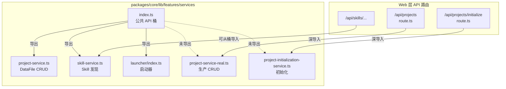

# G07：`services/index.ts` 导出什么、隐藏什么、为什么重要

> 本课核心问题：当其他模块想使用“项目服务”时，它应该从哪里导入？`services/index.ts` 这个“桶文件”决定了哪些能力被视为 `services` feature 的公共 API，哪些能力被藏在内部。今天我们就打开这个只有三行的文件，看看它背后藏的边界决策。

## 1. 开篇场景：前端同学想初始化一个项目

小王已经走完了创建流程，`project.json` 也落盘了。但项目还不能直接交给 Agent 使用——还缺 `Agent.md`、`Tool.md`、`business-model.json` 等初始化产物。

前端开发同学小赵接到任务，要写 `POST /api/projects/initialize`。他打开项目，本能地想去 `@originos/core` 找一个统一的入口：

```ts
import { projectInitializationService } from '@originos/core/lib/features/services';
```

结果发现 `services/index.ts` 并没有导出 `projectInitializationService`。他只能在代码里找到实际的用法：

```ts
import { projectInitializationService } from '@originos/core/lib/features/services/project-initialization-service';
```

这个“想从桶文件导入，结果只能深导入”的小插曲，引出了本课的问题：

**一个 feature 的 `index.ts` 到底该导出谁？漏导的能力，是故意隐藏，还是无心遗漏？**

## 2. 两种组织 exports 的思路

在讲源码之前，先区分两种常见的模块导出策略。

### 2.1 深导入：用哪个导哪个

```ts
import { projectService } from '@originos/core/lib/features/services/project-service-real';
import { skillService } from '@originos/core/lib/features/services/skill-service';
```

优点：
- 导入路径明确，读者一眼知道依赖的是哪个具体文件。
- 不会引入不需要的副作用。

缺点：
- 调用方需要知道内部文件结构。
- 如果内部路径变了，所有调用方都要改。

### 2.2 桶文件：一个入口统一导出

```ts
import { projectService, skillService } from '@originos/core/lib/features/services';
```

优点：
- 调用方只关心 feature 级别的公共 API。
- 重构内部路径时，只要 `index.ts` 不变，调用方不受影响。
- 符合 AGENTS.md 中“feature 必须通过 `index.ts` 导出公共 API”的规约。

缺点：
- 如果桶文件不完整，调用方会被迫使用深导入，桶文件就失去了意义。
- 如果桶文件导入了不属于本 feature 的东西，会造成跨 feature 耦合。

OriginOS 在 `packages/core/src/lib/features/services/` 下选择了桶文件策略，但这个桶目前**只装了一半**。

## 3. 源码精读：`services/index.ts` 的导出边界

打开 [packages/core/src/lib/features/services/index.ts](../../../../packages/core/src/lib/features/services/index.ts)。

### 3.1 完整内容

```ts
export * from './launcher';
export * from './project-service';
export * from './skill-service';
```

对应源码位置：[packages/core/src/lib/features/services/index.ts 第 1—3 行](../../../../packages/core/src/lib/features/services/index.ts#L1-L3)。

只有三行，却做了三个非常不同的声明：

| 导出 | 来源 | 在 `services` feature 中的角色 |
| --- | --- | --- |
| `./launcher` | `services/launcher/index.ts` | 启动器集合（Project / Agent / Role Agent / Skill 的启动协议） |
| `./project-service` | `services/project-service.ts` | 项目 CRUD 服务（`ProjectService` 单例） |
| `./skill-service` | `services/skill-service.ts` | Skill 发现与缓存服务（`SkillService` 单例） |

注意：`services/index.ts` **没有**导出：
- `services/project-service-real.ts`
- `services/project-initialization-service.ts`

这两个文件却在 web 层的 API 路由里被直接深导入。我们下面逐一看。

### 3.2 导出的 `projectService` 是谁？

[packages/core/src/lib/features/services/project-service.ts](../../../../packages/core/src/lib/features/services/project-service.ts) 在第 30—43 行定义了单例类，然后在第 390 行导出实例：

```ts
export class ProjectService {
  private static instance: ProjectService;

  private constructor() {}

  static getInstance(): ProjectService {
    if (!ProjectService.instance) {
      ProjectService.instance = new ProjectService();
    }
    return ProjectService.instance;
  }
  // ...
}

export const projectService = ProjectService.getInstance();
```

对应源码位置：[packages/core/src/lib/features/services/project-service.ts 第 30—43 行](../../../../packages/core/src/lib/features/services/project-service.ts#L30-L43)、[第 390 行](../../../../packages/core/src/lib/features/services/project-service.ts#L390)。

也就是说，从 `@originos/core/lib/features/services` 导入的 `projectService`，是 G03 里讲的那个基于 `jsonStore`、使用 `DataFile` 封装的项目服务。

### 3.3 生产环境实际用的是谁？

但打开 [packages/web/src/app/api/projects/route.ts](../../../../packages/web/src/app/api/projects/route.ts)，第 8 行：

```ts
import { projectService } from '@originos/core/lib/features/services/project-service-real';
```

对应源码位置：[packages/web/src/app/api/projects/route.ts 第 8 行](../../../../packages/web/src/app/api/projects/route.ts#L8)。

列表查询和直接创建项目用的不是桶文件里的 `projectService`，而是 `project-service-real.ts` 里的对象。

这是一个关键的边界事实：

> `services/index.ts` 声称的公共 API（`projectService`）和 web 生产环境实际使用的实现（`project-service-real`）**不是同一个东西**。

两者都管理项目数据，但目录结构和数据格式不同：

| 维度 | `project-service.ts`（桶文件导出） | `project-service-real.ts`（生产使用） |
| --- | --- | --- |
| 路径 | `data/projects/{projectId}/project.json` | `data/projects/{projectId}.json` |
| 文件格式 | `DataFile<T>` 封装（外层有 `version`、`createdAt`、`updatedAt`、`data`） | 纯 `Project` 对象 JSON |
| 方法集 | CRUD + `listProjects` | CRUD + `exportProject`/`importProject`/`getProjectStats` |
| 导出形式 | 单例类实例 | 普通对象字面量 |

G04 已经详细讲过两套实现的来历。本课的视角是：**因为桶文件只导出了 `project-service.ts`，所以 `project-service-real.ts` 实际上处在公共 API 之外，但它却被生产代码直接引用。**

### 3.4 `projectInitializationService` 为什么也没进桶？

[packages/web/src/app/api/projects/initialize/route.ts](../../../../packages/web/src/app/api/projects/initialize/route.ts) 第 14 行：

```ts
import { projectInitializationService } from '@originos/core/lib/features/services/project-initialization-service';
```

对应源码位置：[packages/web/src/app/api/projects/initialize/route.ts 第 14 行](../../../../packages/web/src/app/api/projects/initialize/route.ts#L14)。

这个服务负责：
- 创建标准目录结构（`reference/`、`skills/`、`output/`、`sessions/`）。
- 写入 `Agent.md`、`Tool.md`。
- 保存 `business-model.json`。
- 初始化 Agent 会话。

它在 [packages/core/src/lib/features/services/project-initialization-service.ts 第 312 行](../../../../packages/core/src/lib/features/services/project-initialization-service.ts#L312) 导出为 `projectInitializationService`。

但它同样没有出现在 `services/index.ts` 里。这意味着，按照 feature 公共边界的定义，初始化服务**不是 `services` feature 对外承诺的一部分**；但 web 层又确实需要它，所以只能通过深导入绕过这个边界。

### 3.5 `./launcher` 的导出是否合理？

`services/index.ts` 第一行：

```ts
export * from './launcher';
```

`./launcher` 下包含：
- `base.ts`：通用 `Launcher` 抽象。
- `agent.ts`：`AgentLauncher`。
- `role-agent.ts`：`RoleAgentLauncher`。
- `project.ts`：`ProjectLauncher`。
- `skill.ts`：`SkillLauncher`。
- `registry.ts`：启动器注册表。

这些启动器对应的是 Part F 的“Skill 与启动器”主题，核心问题是“Agent / Skill 怎么被启动”。它们被放在 `services/launcher/` 目录下，又被 `services/index.ts` 统一导出，导致 `services` feature 的公共边界**跨进了 Part F 的领地**。

从 AGENTS.md 的视角看，这是一种目录归属和导出边界不一致：
- 目录上，`launcher` 是 `services` 的子目录。
- 业务上，`launcher` 属于 Skill / Agent 启动基础设施，更贴近 Part F。
- 结果上，`services/index.ts` 成了 Part F 能力的间接出口。

这不是本课要修复的问题，而是教材需要标注的**边界债务**：读者看到 `services/index.ts` 时，要知道它导出的东西并不都属于同一个教学主题。

## 4. 图解：`services` feature 的调用边界



这张图说明：
- `services/index.ts` 只覆盖了 `services` 目录下的部分能力。
- 生产环境真正重要的两个服务（`project-service-real`、`project-initialization-service`）反而在桶外。
- 调用方因此出现“该用桶的地方不用桶，该深导的地方不得不深导”的混乱。

## 5. 关键类型：公共 API 与类型定义在哪里

本课涉及的类型大部分不来自 `services` feature 内部，而是来自 `packages/core/src/types/`：

| 类型 | 定义位置 | 说明 |
| --- | --- | --- |
| `Project` | [packages/core/src/types/project.ts](../../../../packages/core/src/types/project.ts) | 项目实体结构 |
| `CreateProjectRequest` | [packages/core/src/types/project.ts](../../../../packages/core/src/types/project.ts) | 创建请求 |
| `UpdateProjectRequest` | [packages/core/src/types/project.ts](../../../../packages/core/src/types/project.ts) | 更新请求 |
| `ProjectListItem` | [packages/core/src/types/project.ts](../../../../packages/core/src/types/project.ts) | 列表项 |
| `ProjectQuery` | [packages/core/src/types/project.ts](../../../../packages/core/src/types/project.ts) | 查询参数 |
| `ApiResponse<T>` | [packages/core/src/types/index.ts](../../../../packages/core/src/types/index.ts) | API 响应包装 |
| `BusinessModel` | [packages/core/src/lib/features/services/project-initialization-service.ts](../../../../packages/core/src/lib/features/services/project-initialization-service.ts) | 初始化服务自己的输入类型 |
| `InitializeProjectResult` | [packages/core/src/lib/features/services/project-initialization-service.ts](../../../../packages/core/src/lib/features/services/project-initialization-service.ts) | 初始化结果类型 |

一个值得注意的设计是：**`Project` 相关类型放在全局 `types/` 下，而不是 `services/` 或 `project/` feature 内部**。这意味着多个 feature 可以共享同一套项目类型，而不必通过 feature 的 `index.ts` 间接获取。

但这也带来一个边界问题：如果某个 feature 修改了 `types/project.ts` 里的字段，所有依赖项目类型的 feature 都会受影响。全局类型是一把双刃剑。

## 6. 失败路径与边界风险

### 6.1 桶文件导出与生产实现不一致

```ts
// 某位开发者以为这是生产用的 projectService
import { projectService } from '@originos/core/lib/features/services';

await projectService.createProject({ name: '测试', domain: '测试' });
```

这行代码调用的是 `project-service.ts`，会把项目写成 `data/projects/{id}/project.json`，外层带 `DataFile` 包装。

但 `GET /api/projects` 用的是 `project-service-real.ts`，它从 `data/projects/{id}.json` 读取纯 `Project` JSON。

如果同一个项目 ID 被两个服务分别读写，前端可能“创建成功但列表里看不到”，或者看到的数据格式错误。

### 6.2 深导入绕过 feature 边界

```ts
import { projectInitializationService } from '@originos/core/lib/features/services/project-initialization-service';
```

这种深导入意味着：
- `projectInitializationService` 的内部重构（比如改名、换目录）会直接破坏 web 层 API。
- 教材中不能再把它当作“内部实现”来讲，因为它实际上已经是被外部依赖的准公共 API。

### 6.3 `./launcher` 造成跨主题耦合

`services/index.ts` 导出 `./launcher`，让 `services` feature 的公共 API 包含了 Agent/Skill/RoleAgent/Project 启动器。这会让新开发者误以为“启动器是 services 的一部分”，而按 course-overview.md 的划分，它们属于 Part F。

### 6.4 缺少显式再导出，IDE 自动导入容易选错

在 VS Code 等 IDE 中，当开发者输入 `projectService` 时，自动补全可能同时提供：
- `@originos/core/lib/features/services`
- `@originos/core/lib/features/services/project-service`
- `@originos/core/lib/features/services/project-service-real`

如果桶文件不统一、生产实现又不从桶导入，团队很容易在不同路由里混用两套服务。

## 7. 测试证据与缺口

### 已覆盖

- `services/index.ts` 本身没有测试。
- `project-service.ts`（桶文件导出的那个）没有直接单元测试。
- `project-service-real.ts` 的测试在 [packages/web/src/app/api/projects/__tests__/project-service.test.ts](../../../../packages/web/src/app/api/projects/__tests__/project-service.test.ts)，属于 web 层集成测试。
- `skill-service.ts` 的测试在 [packages/core/src/lib/features/skills/__tests__/service.test.ts](../../../../packages/core/src/lib/features/skills/__tests__/service.test.ts)（注意它测试的是 `skills/service.ts`，不是 `services/skill-service.ts`）。
- `launcher` 的测试在 [packages/core/src/lib/features/services/launcher/__tests__/skill-launcher.test.ts](../../../../packages/core/src/lib/features/services/launcher/__tests__/skill-launcher.test.ts)。

### 缺口

- `services/index.ts` 的导出边界没有测试：无法自动检测“某个服务被加入或移出公共 API”。
- `project-service.ts` 与 `project-service-real.ts` 的导出一致性没有测试。
- 深导入路径没有被 lint 规则禁止或审计。
- 没有测试能证明“从桶导入的 `projectService` 和生产使用的 `projectService` 是否指向同一实现”。

## 8. 小实验：验证桶文件与生产实现的关系

### 步骤一：列出 `services/index.ts` 实际导出了什么

运行：

```bash
grep -n "^export" packages/core/src/lib/features/services/index.ts
```

你会看到只有三行导出。

### 步骤二：找出 web 层对 `services/` 下各文件的深导入

运行：

```bash
grep -R "@originos/core/lib/features/services/" packages/web/src/app/api --include='*.ts' --include='*.tsx'
```

你会看到类似：

```
packages/web/src/app/api/projects/route.ts:import { projectService } from '@originos/core/lib/features/services/project-service-real';
packages/web/src/app/api/projects/initialize/route.ts:import { projectInitializationService } from '@originos/core/lib/features/services/project-initialization-service';
```

### 步骤三：确认两套 `projectService` 是否相同实例

在本地写一个临时脚本：

```ts
import { projectService as bucketProjectService } from '@originos/core/lib/features/services';
import { projectService as realProjectService } from '@originos/core/lib/features/services/project-service-real';

console.log(bucketProjectService === realProjectService);
```

运行结果是 `false`。

### 实验结论

桶文件里的 `projectService` 和生产路径的 `projectService` 是**两个不同的对象**。它们可能操作同一数据目录的不同文件格式，混用会导致数据不一致。这个实验也说明：当前 `services/index.ts` 并不能代表 `services` feature 的真实公共 API。

## 9. 口头验收

读完本课后，应能不看书稿回答：

1. `services/index.ts` 导出了哪三个来源？分别对应哪些能力？
2. 为什么 `project-service-real.ts` 没有出现在 `services/index.ts` 里，却仍在生产代码中被使用？
3. 从 `@originos/core/lib/features/services` 导入的 `projectService`，和从 `@originos/core/lib/features/services/project-service-real` 导入的 `projectService`，是不是同一个对象？怎么验证？
4. `services/index.ts` 导出 `./launcher` 会带来什么边界问题？
5. 如果一位新开发者从桶文件导入 `projectService` 创建项目，然后从生产 API 读取项目，可能会遇到什么风险？

## 10. 章节收束

本课的核心认知是：**`services/index.ts` 是一个 feature 的公共 API 声明，但 OriginOS 当前这个声明并不完整，也不完全对齐生产使用路径**。

我们看到的几个关键事实：

- 桶文件只导出了 `launcher`、`project-service`、`skill-service`。
- 生产环境真正用的 `project-service-real` 和 `project-initialization-service` 被深导入，处于桶外。
- `./launcher` 的导出让 `services` feature 跨越了 Part F 的边界。
- 这种不一致可能导致混用两套项目服务、深导入路径 refactor 风险、以及公共 API 认知混乱。

下一课（G08）我们会打开 `project/index.ts`，看看另一个 feature 的公共 API 又是如何划分的，并对比两个桶文件的设计差异。
