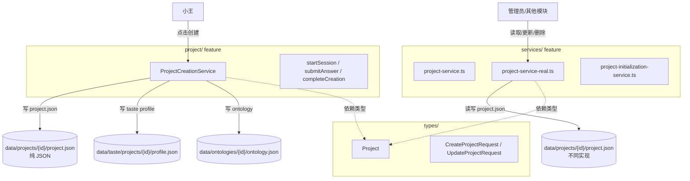

# G08：为什么 `project/index.ts` 只导出一个创建服务

> 本课核心问题：`packages/core/src/lib/features/project/` 这个目录名叫“project”，但 `index.ts` 只导出了 `ProjectCreationService`。项目的类型定义在哪里？项目的长期 CRUD 在哪里？这种“名不副实”的拆分是故意的吗？

## 1. 开篇场景：项目创建完后，小赵想查项目详情

小王创建完“社区咖啡馆”项目，前端已经拿到了 `projectId`。现在小赵要写项目详情页，需要：

- 一个 `Project` 类型来定义组件 props。
- 一个 `getProject(projectId)` 方法来读取项目。
- 一个 `updateProject(projectId, updates)` 方法来更新项目。

他先打开 `packages/core/src/lib/features/project/index.ts`，发现里面只有一行：

```ts
export * from './project-creation-service';
```

他愣了一下：难道项目读取和更新也藏在 `project-creation-service` 里？

打开 [packages/core/src/lib/features/project/project-creation-service.ts](../../../../packages/core/src/lib/features/project/project-creation-service.ts) 一看，发现它只负责“创建流程”：启动会话、提交答案、完成创建。创建完成后，它就不管了。

那么长期 CRUD 在哪里？在 `packages/core/src/lib/features/services/` 里。`Project` 类型在哪里？在 `packages/core/src/types/project.ts` 里。

本课要回答的就是：**为什么“创建项目”被单独做成一个 feature，而“管理项目”却被放进 services？**

## 2. 两种 feature 划分思路

### 2.1 按领域对象划分

如果按领域对象划分，一个 `project` feature 应该包含项目生命周期的全部能力：

```
project/
  ├── types.ts           # Project、CreateProjectRequest 等
  ├── create.ts          # 创建项目
  ├── read.ts            # 读取项目
  ├── update.ts          # 更新项目
  ├── delete.ts          # 删除项目
  └── index.ts           # 统一导出
```

优点：所有与项目相关的东西都在一处，找代码很直观。

缺点：如果“创建项目”是一个多步骤的交互流程（问答、提取 TASTE、生成本体），它会引入大量与“长期 CRUD”无关的逻辑，导致 feature 内部职责混杂。

### 2.2 按业务阶段划分

OriginOS 选择了第二种：把“创建项目”这个**多步骤流程**单独拆成 `project` feature，把“项目长期维护”放进更通用的 `services` feature。

```
project/                       # 负责“创建流程”
  └── project-creation-service.ts

services/                      # 负责“长期维护”
  ├── project-service.ts
  ├── project-service-real.ts
  └── project-initialization-service.ts

types/project.ts               # 项目领域类型（跨 feature 共享）
```

优点：
- 创建流程的复杂性（会话状态、问题模板、答案提取、TASTE 生成、本体生成）被隔离在一个 feature 里。
- `services` 可以专注于通用 CRUD，供多个 feature 调用。

缺点：
- 新开发者容易困惑：`project` feature 不导出 `Project` 类型，也不导出项目 CRUD。
- 创建流程写出的 `project.json` 格式，可能与 `services` 里的实现不一致。

## 3. 源码精读：`project/index.ts` 的边界

### 3.1 完整内容

打开 [packages/core/src/lib/features/project/index.ts](../../../../packages/core/src/lib/features/project/index.ts)。

```ts
export * from './project-creation-service';
```

对应源码位置：[packages/core/src/lib/features/project/index.ts 第 1 行](../../../../packages/core/src/lib/features/project/index.ts#L1)。

只有一行。它把 `project-creation-service.ts` 里的所有具名导出都透传出去。

### 3.2 `project-creation-service.ts` 导出了什么

打开 [packages/core/src/lib/features/project/project-creation-service.ts](../../../../packages/core/src/lib/features/project/project-creation-service.ts)。

```ts
export class ProjectCreationService {
  // ...
}

export const projectCreationService = new ProjectCreationService();
```

对应源码位置：[packages/core/src/lib/features/project/project-creation-service.ts 第 58 行](../../../../packages/core/src/lib/features/project/project-creation-service.ts#L58)、[第 733 行](../../../../packages/core/src/lib/features/project/project-creation-service.ts#L733)。

所以 `project/index.ts` 对外暴露的公共 API 只有：
- `ProjectCreationService` 类（可以自定义 sessionsDir 实例化）。
- `projectCreationService` 单例（使用默认 `SESSIONS_DIR`）。

### 3.3 `ProjectCreationService` 完成创建时写了什么

重点看 [packages/core/src/lib/features/project/project-creation-service.ts 第 237—331 行](../../../../packages/core/src/lib/features/project/project-creation-service.ts#L237-L331) 的 `completeCreation` 方法。它一次性做了四件事：

1. 创建 `data/projects/{projectId}/project.json`。
2. 创建 `data/taste/projects/{projectId}/profile.json`。
3. 创建 `data/ontologies/{projectId}/ontology.json`。
4. 更新会话状态为 `completed`。

其中写项目文件的部分是：

```ts
const project = {
  id: projectId,
  name: request.projectName,
  description: session.data.background ?? '',
  domain: session.extractedData.context_features?.domain ?? 'general',
  type: 'web-application',
  ontologyId: `ontology_${projectId}`,
  createdAt: now,
  updatedAt: now,
  lastModified: now,
  userId: session.userId,
  status: 'active',
  color: '#3B82F6', // Default blue
  metadata: {
    workMode: session.data.workMode ?? undefined,
    priorities: session.data.priorities,
    techStack: session.extractedData.context_features?.tech_stack,
  },
};

await fs.writeFile(
  path.join(projectDir, 'project.json'),
  JSON.stringify(project, null, 2)
);
```

对应源码位置：[packages/core/src/lib/features/project/project-creation-service.ts 第 271—294 行](../../../../packages/core/src/lib/features/project/project-creation-service.ts#L271-L294)。

注意几个细节：
- `type` 被硬编码为 `'web-application'`，不接受用户输入。
- `color` 被硬编码为 `'#3B82F6'`（蓝色十六进制），不是 `project-service.ts` 里的 Tailwind 渐变类。
- `ontologyId` 的格式是 `ontology_${projectId}`，而 `project-service.ts` 里是 `ontology-${projectId}`。
- 文件格式是**纯 JSON**，没有 `DataFile<T>` 外层封装。

这些差异说明：`project-creation-service` 和 `services/project-service.ts` 并不是同一个设计思路的产物，它们只是碰巧都写了一个叫 `project.json` 的文件。

### 3.4 `Project` 类型在哪里

打开 [packages/core/src/types/project.ts](../../../../packages/core/src/types/project.ts)。

```ts
export interface Project {
  id: string;
  name: string;
  description: string;
  domain: string;
  type: string;
  ontologyId: string;
  createdAt: number;
  updatedAt: number;
  lastModified: number;
  userId: string;
  status: ProjectStatus;
  color: string;
  icon?: string;
  metadata?: ProjectMetadata;
}
```

对应源码位置：[packages/core/src/types/project.ts 第 5—75 行](../../../../packages/core/src/types/project.ts#L5-L75)。

注意：
- `createdAt`、`updatedAt`、`lastModified` 是 `number`（时间戳）。
- `status` 是 `ProjectStatus = "active" | "archived" | "deleted"`。

但在 `project-creation-service.ts` 的 `completeCreation` 里，这些字段被写成 ISO 字符串：

```ts
const now = new Date().toISOString();
// ...
createdAt: now,
updatedAt: now,
lastModified: now,
```

对应源码位置：[packages/core/src/lib/features/project/project-creation-service.ts 第 264 行](../../../../packages/core/src/lib/features/project/project-creation-service.ts#L264)、[第 278—280 行](../../../../packages/core/src/lib/features/project/project-creation-service.ts#L278-L280)。

这意味着 `project-creation-service` 写出的 `project.json` 在类型上**并不严格满足** `Project` 接口：时间戳字段类型不一致。如果后续代码严格按照 `Project` 类型读取，可能会遇到运行时类型错误。

### 3.5 长期 CRUD 在哪里

如果 `project/index.ts` 不导出 CRUD，调用方只能去 `services` 里找。实际 web 层的用法是：

- `GET /api/projects` / `POST /api/projects`：使用 `project-service-real.ts`。
- `GET /api/projects/[id]` / `PUT /api/projects/[id]`：同样使用 `project-service-real.ts`。

也就是说，项目的读取、更新、删除、列表、导出、导入、统计，全部不在 `project` feature 的公共 API 里。

## 4. 图解：`project` feature 与 `services` feature 的分工



这张图说明：
- `project` feature 只负责“创建流程”这一次性动作。
- 创建完成后，项目的长期生命周期由 `services` feature 接管。
- 两者共享 `types/project.ts` 里的类型合同，但 `project-creation-service` 的实际写入并未严格遵守这个合同。

## 5. 关键类型：创建流程自己的类型合同

虽然 `Project` 类型在 `types/project.ts`，但 `project-creation-service` 还有一套自己的类型，定义在 [packages/core/src/types/project-creation.ts](../../../../packages/core/src/types/project-creation.ts)。

| 类型 | 定义位置 | 用途 |
| --- | --- | --- |
| `ProjectCreationSession` | [packages/core/src/types/project-creation.ts](../../../../packages/core/src/types/project-creation.ts) | 创建会话对象 |
| `Question` | [packages/core/src/types/project-creation.ts](../../../../packages/core/src/types/project-creation.ts) | 问题定义 |
| `SubmitAnswerRequest` | [packages/core/src/types/project-creation.ts](../../../../packages/core/src/types/project-creation.ts) | 提交答案请求 |
| `CompleteCreationRequest` | [packages/core/src/types/project-creation.ts](../../../../packages/core/src/types/project-creation.ts) | 完成创建请求 |
| `WorkMode` | [packages/core/src/types/project-creation.ts](../../../../packages/core/src/types/project-creation.ts) | 工作模式枚举 |
| `ExtractedData` | [packages/core/src/types/project-creation.ts](../../../../packages/core/src/types/project-creation.ts) | 从答案提取的隐藏数据 |

这套类型完全属于“创建流程”这个业务阶段，与 `Project` 长期类型是分开的。这也印证了按业务阶段拆分 feature 的设计：创建流程有自己的会话模型，不需要复用 `Project` 的全部字段。

## 6. 失败路径与边界风险

### 6.1 `project-creation-service` 写出的 `project.json` 不严格满足 `Project` 类型

如前所述，`Project` 要求时间戳字段为 `number`，但 `completeCreation` 写入的是 ISO 字符串。如果后续代码这样读取：

```ts
const project: Project = JSON.parse(await fs.readFile(path, 'utf-8'));
project.createdAt.toFixed(2); // 运行时错误：字符串没有 toFixed
```

类型系统在编译时不会报错（因为读取来自文件，没有运行时类型校验），但实际运行时会失败。

### 6.2 `ontologyId` 格式不一致

| 来源 | `ontologyId` 格式 |
| --- | --- |
| `project-creation-service.ts` | `ontology_${projectId}` |
| `project-service.ts` | `ontology-${projectId}` |

如果后续代码用 `ontologyId` 去拼接文件路径，细微的下划线/横线差异会导致找不到文件。

### 6.3 `type` 和 `color` 的默认值硬编码

```ts
type: 'web-application',
color: '#3B82F6',
```

对应源码位置：[packages/core/src/lib/features/project/project-creation-service.ts 第 276 行](../../../../packages/core/src/lib/features/project/project-creation-service.ts#L276)、[第 283 行](../../../../packages/core/src/lib/features/project/project-creation-service.ts#L283)。

所有通过创建流程生成的项目，默认类型都是 `web-application`，默认颜色都是蓝色。这对“社区咖啡馆”这种非技术项目并不合理，也限制了前端的展示灵活性。

### 6.4 `project/index.ts` 的命名误导

目录名叫 `project`，但只导出创建服务。新开发者容易误以为这里有项目 CRUD，结果找不到 `getProject`、`updateProject`，只能去 `services` 里翻。

如果未来要重构，有两种常见方向：
1. 把 `project` feature 改名为 `project-creation`，消除误导。
2. 把项目 CRUD 也迁回 `project` feature，让目录名名副其实。

无论哪种，都需要先解决当前 `project-service.ts` 与 `project-service-real.ts` 并存的问题（见 G04）。

### 6.5 创建流程与初始化服务的关系不清晰

`project-creation-service` 写入了 `project.json`、`taste/profile.json`、`ontology.json`。
`project-initialization-service` 又写入 `Agent.md`、`Tool.md`、`business-model.json`、标准目录结构。

这两个服务都参与了“项目从无到有”的过程，但它们的触发时机不同：
- `project-creation-service` 在小王点击“完成创建”时触发。
- `project-initialization-service` 在 `POST /api/projects/initialize` 时触发，通常基于访谈结果。

如果用户只走了创建流程，没走初始化流程，项目目录里就缺 `Agent.md` 等文件，Agent 可能无法正常工作。这是两个流程并行存在带来的体验风险。

## 7. 测试证据与缺口

### 已覆盖

- `project/index.ts` 本身没有测试。
- `project-creation-service.ts` 没有直接单元测试。
- 创建流程的端到端行为由 web 层路由间接覆盖：[packages/web/src/app/api/project/create/start/route.ts](../../../../packages/web/src/app/api/project/create/start/route.ts)、[packages/web/src/app/api/project/create/[sessionId]/complete/route.ts](../../../../packages/web/src/app/api/project/create/[sessionId]/complete/route.ts)。
- 这些路由测试（如果存在）会验证 HTTP 层面的请求/响应格式，但不验证 `project.json` 的字段类型。

### 缺口

- `completeCreation` 写出的 `project.json` 字段类型没有自动化断言。
- `ontologyId` 格式、默认 `type`、默认 `color` 没有测试。
- `project-creation-service` 与 `project-service-real` 的数据格式兼容性没有测试。
- 创建流程结束后，项目是否能被 `project-service-real` 正确读取，没有测试。
- `project/index.ts` 的导出边界没有测试。

## 8. 小实验：对比两种创建路径写出的 `project.json`

### 步骤一：通过创建流程生成项目

调用：

```bash
curl -X POST http://localhost:3000/api/project/create/start \
  -H 'Content-Type: application/json' \
  -d '{"userId":"user-xiaowang"}'
```

拿到 `sessionId` 和 `projectId` 后，依次提交三个答案，最后调用 `complete`。然后查看 `data/projects/{projectId}/project.json`。

### 步骤二：直接通过项目 API 创建项目

调用：

```bash
curl -X POST http://localhost:3000/api/projects \
  -H 'Content-Type: application/json' \
  -d '{"name":"社区咖啡馆2","description":"测试","domain":"餐饮零售"}'
```

查看 `data/projects/{projectId}/project.json`。

### 步骤三：对比字段

你可能会发现：

| 字段 | 创建流程 | 直接 API |
| --- | --- | --- |
| `createdAt` | `"2026-09-02T10:00:00.000Z"`（字符串） | `1725260000000`（数字） |
| `type` | `"web-application"` | `"generic"` 或用户传入 |
| `color` | `"#3B82F6"` | `"from-blue-500"` 等随机渐变 |
| `ontologyId` | `"ontology_proj_xxx"` | `""` 或传入值 |

### 实验结论

同一个系统里，两条路径写出的“项目文件”并不完全一致。这个实验说明：`project` feature 和 `services` feature 在项目数据格式上存在**隐性分歧**。后续如果要统一，需要明确哪一套是权威格式，并让另一套对齐。

## 9. 口头验收

读完本课后，应能不看书稿回答：

1. `project/index.ts` 导出了什么？没导出什么？
2. `Project` 类型定义在哪里？为什么不在 `project/` feature 内部？
3. `project-creation-service.ts` 写出的 `project.json` 与 `Project` 类型有什么不一致？具体是哪些字段？
4. `ontologyId` 在创建流程和 `project-service.ts` 里的格式有什么区别？
5. 如果你是一个新开发者，想找“更新项目”的代码，你会去哪里找？为什么？

## 10. 章节收束

本课的核心认知是：**`project` feature 不是“项目实体的家”，而是“项目创建流程的家”**。它只负责把用户从“点击创建”带到“项目文件落盘”，之后就把项目交给了 `services` feature。

我们看到的几个关键设计：

- `project/index.ts` 只导出 `ProjectCreationService` 和 `projectCreationService`。
- `Project` 类型、创建请求、更新请求等跨 feature 类型放在 `types/project.ts`。
- 项目长期 CRUD 在 `services/project-service-real.ts`（生产使用）和 `services/project-service.ts`（桶文件导出）。
- `project-creation-service` 写出的 `project.json` 与 `Project` 类型存在字段类型和默认值上的不一致。
- 创建流程和初始化流程是两条并行的“项目出生”路径，可能产生不同的目录内容。

下一课（G09）我们会从测试角度审视这套项目服务体系：为什么核心服务缺少单元测试，现有测试又证明了什么、没证明什么。
