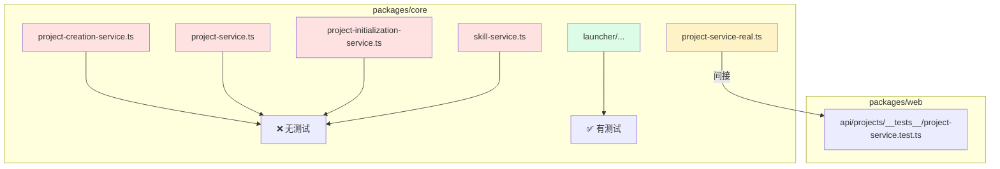

# G09：为什么项目服务体系缺少单元测试，现有测试又证明了什么

> 本课核心问题：`ProjectService`、`ProjectCreationService`、`ProjectInitializationService` 都是核心服务，但 `packages/core/src/lib/features/services/` 和 `packages/core/src/lib/features/project/` 下却找不到它们的单元测试。测试跑到哪里去了？现有测试能覆盖哪些风险，又有哪些缺口只能靠人工审计发现？

## 1. 开篇场景：代码写完后，怎么证明它不会坏

小王创建咖啡馆项目的功能已经上线。过了几天，产品经理提了一个需求：

> “创建项目时，默认颜色能不能不要老是蓝色，根据项目名称算一个？”

开发同学小周打开 [packages/core/src/lib/features/project/project-creation-service.ts](../../../../packages/core/src/lib/features/project/project-creation-service.ts)，把硬编码的 `color: '#3B82F6'` 改成根据 `projectId` 取模选择颜色，然后自信地提交。

PR 合入后，线上出现两个问题：
1. 创建流程写出的 `project.json` 颜色格式变成了 Tailwind 类，但 `ProjectCreationService.completeCreation` 的返回类型里没有 `color`，前端解析报错。
2. 某些老项目被 `project-service-real.ts` 读取时，因为颜色格式不一致，列表页渲染异常。

小周很委屈：“我只是改了一个默认值，怎么会影响到那么多地方？”

答案很简单：**项目服务体系里没有针对这些边界行为的自动化测试，改动的影响范围只能靠人脑推理。**

本课就来盘点：项目服务体系到底测了什么、没测什么、为什么。

## 2. 两种测试策略

在讲具体测试之前，先区分两种常见策略。

### 2.1 单元测试：把依赖钉死

单元测试通常这样写：

```ts
it('should create project with generated color', async () => {
  const mockWrite = vi.spyOn(jsonStore, 'write').mockResolvedValue(undefined);

  const project = await projectService.createProject({
    name: '社区咖啡馆',
    domain: '餐饮零售',
  });

  expect(project.color).toMatch(/^from-[a-z]+-\d+$/);
  expect(mockWrite).toHaveBeenCalledWith(
    expect.stringContaining('community-cafe'),
    expect.objectContaining({ name: '社区咖啡馆' })
  );
});
```

优点：
- 运行快。
- 失败时定位精准。
- 能覆盖默认值、边界分支、错误路径。

缺点：
- 需要 mock 文件系统、jsonStore、时间等依赖。
- 如果 mock 写得太假，可能测不到真实集成问题。

### 2.2 集成测试：跑真实文件系统

集成测试通常这样写：

```ts
it('should create a new project with valid data', async () => {
  const project = await projectService.createProject({
    name: 'Test Project',
    description: 'A test project',
    domain: 'Testing',
  });

  expect(project).toBeDefined();
  expect(project.name).toBe('Test Project');
  expect(project.status).toBe('active');
});
```

优点：
- 能发现文件系统、路径、格式兼容性问题。
- 更接近生产行为。

缺点：
- 运行慢，需要清理临时目录。
- 失败原因可能更复杂（环境、权限、残留文件）。

OriginOS 的项目服务目前主要依赖**集成测试**，而且大部分集成测试不在 `core` 包，而在 `web` 包的 API 路由里。

## 3. 源码精读：项目服务体系周边的测试文件

### 3.1 `core` 包里的测试

在 `packages/core/src/lib/features/services/` 和 `packages/core/src/lib/features/project/` 目录下搜索测试文件：

```bash
find packages/core/src/lib/features/services -name '*.test.ts'
find packages/core/src/lib/features/project -name '*.test.ts'
```

结果是：
- `services/` 下只有 `launcher/__tests__/skill-launcher.test.ts`。
- `project/` 下没有任何测试文件。

也就是说，
- `project-service.ts`（桶文件导出的 CRUD）**没有单元测试**。
- `project-service-real.ts`（生产 CRUD）**没有单元测试**。
- `project-initialization-service.ts`（项目初始化）**没有单元测试**。
- `project-creation-service.ts`（创建流程）**没有单元测试**。
- `skill-service.ts`（services 桶里的 Skill 服务）**没有单元测试**。

`services` feature 里唯一有测试的是 `launcher`，而 `launcher` 按规划属于 Part F。

### 3.2 `web` 包里的集成测试

打开 [packages/web/src/app/api/projects/__tests__/project-service.test.ts](../../../../packages/web/src/app/api/projects/__tests__/project-service.test.ts)。

这是项目服务体系目前最完整的自动化测试。它覆盖：
- `createProject`：创建项目、生成唯一 ID、随机颜色。
- `getProject`：按 ID 读取、读取不存在项目返回 `null`。
- `updateProject`：更新名称、描述、多个字段、刷新 `lastModified`。
- `deleteProject`：删除项目、删除不存在项目返回 `false`。
- `listProjects`：列表、按状态过滤、按 domain 过滤、排序。
- `exportProject`：导出为 JSON、导出不存在项目抛错。
- `importProject`：从 JSON 导入、导入非法 JSON 抛错、导入缺少 `project` 抛错。
- `getProjectStats`：统计文件数、最后修改时间、本体大小。

但它测试的是 `project-service-real.ts`，不是 `project-service.ts`：

```ts
import { projectService } from '@originos/core/lib/features/services/project-service-real';
```

对应源码位置：[packages/web/src/app/api/projects/__tests__/project-service.test.ts 第 8 行](../../../../packages/web/src/app/api/projects/__tests__/project-service.test.ts#L8)。

这意味着：
- 生产路径的 CRUD 行为被覆盖了大部分。
- 但 `project-service.ts` 里的 `DataFile` 封装行为完全没有被覆盖。
- 两条路径之间的差异没有测试。

### 3.3 `skills` 包的测试

打开 [packages/core/src/lib/features/skills/__tests__/service.test.ts](../../../../packages/core/src/lib/features/skills/__tests__/service.test.ts)。

这个测试与 `services/skill-service.ts` 是两个不同的文件。它测试的是 `skills/service.ts` 里的 `getSkillContent`，主要覆盖：
- 从 `data/skills/{name}/skill.md` 加载已有 skill。
- 从 Electron resources 的 bundled templates 中物化 skill 内容。

对应源码位置：[packages/core/src/lib/features/skills/__tests__/service.test.ts 第 1—80 行](../../../../packages/core/src/lib/features/skills/__tests__/service.test.ts#L1-L80)。

这说明：**Skill 的内容加载能力有测试，但 `services/skill-service.ts` 提供的缓存、格式化、诊断、目录校验等能力没有测试。**

### 3.4 `launcher` 的测试

打开 [packages/core/src/lib/features/services/launcher/__tests__/skill-launcher.test.ts](../../../../packages/core/src/lib/features/services/launcher/__tests__/skill-launcher.test.ts)。

它测试了 `SkillLauncher` 的两种回退策略：
- 当 bundled skills 根目录存在但不完整时，回退到 monorepo 模板目录。
- 启动前把 bundled template skill 物化到 `data/skills/` 下。

对应源码位置：[packages/core/src/lib/features/services/launcher/__tests__/skill-launcher.test.ts 第 18—74 行](../../../../packages/core/src/lib/features/services/launcher/__tests__/skill-launcher.test.ts#L18-L74)。

这部分属于 Part F，但它至少说明：services 目录下不是完全无测试，只是测试集中在 launcher 这个子模块。

## 4. 图解：测试覆盖地图



这张图说明：
- 项目创建、初始化、services 桶里的 skill 服务都是“红色”无测试区。
- 生产 CRUD 是“黄色”间接覆盖区，靠 web 集成测试兜底。
- 只有 launcher 是“绿色”直接覆盖区。

## 5. 关键类型：测试依赖的类型合同

测试文件里大量使用了 `Project` 和 `CreateProjectRequest` 类型：

| 类型 | 在测试中的用途 | 风险 |
| --- | --- | --- |
| `Project` | 断言创建结果 | 如果 `project-service-real.ts` 写出的 JSON 与类型不一致，测试不会发现 |
| `CreateProjectRequest` | 构造请求 | 缺少必填字段校验测试 |
| `UpdateProjectRequest` | 构造更新 | `metadata` 浅合并没有专门测试 |
| `ProjectQuery` | 构造查询 | 分页、搜索、排序边界没有测试 |

例如，[packages/web/src/app/api/projects/__tests__/project-service.test.ts 第 51—62 行](../../../../packages/web/src/app/api/projects/__tests__/project-service.test.ts#L51-L62) 断言：

```ts
expect(project).toBeDefined();
expect(project.id).toBeDefined();
expect(project.name).toBe('Test Project');
expect(project.domain).toBe('Testing');
expect(project.status).toBe('active');
expect(project.userId).toBe('current-user');
```

它没有断言：
- `createdAt` 是数字还是字符串。
- `color` 的格式是否一致。
- `ontologyId` 是否生成。
- `files/` 目录是否创建。

## 6. 失败路径与边界风险

### 6.1 创建流程无测试，默认值改动风险高

`project-creation-service.ts` 里的 `completeCreation` 硬编码了：

```ts
type: 'web-application',
color: '#3B82F6',
```

对应源码位置：[packages/core/src/lib/features/project/project-creation-service.ts 第 276 行](../../../../packages/core/src/lib/features/project/project-creation-service.ts#L276)、[第 283 行](../../../../packages/core/src/lib/features/project/project-creation-service.ts#L283)。

如果哪天有人把 `type` 改成从用户输入读取，但忘了同步前端展示逻辑，就会出现“后端存了 `cafe`，前端只认识 `web-application`”的兼容性问题。没有单元测试，这种回归只能靠人工回归。

### 6.2 `project-service.ts` 的 `DataFile` 行为完全无测试

G03 讲过 `project-service.ts` 使用 `jsonStore.write` 和 `jsonStore.read`，文件格式是：

```json
{
  "version": "1.0.0",
  "createdAt": "...",
  "updatedAt": "...",
  "data": { /* Project 对象 */ }
}
```

但没有任何测试验证：
- 写入时是否带 `version`。
- 读取时是否正确返回 `file.data`。
- `updateProject` 的 `metadata` 浅合并是否正确。
- `deleteProject` 软删除与 `permanentDeleteProject` 硬删除的区别。

这意味着桶文件导出的 `projectService` 实际上是一个**没有测试背书的公共 API**。

### 6.3 两套 `projectService` 的差异没有测试

`project-service.ts` 和 `project-service-real.ts` 都实现了项目 CRUD，但：
- 数据目录不同。
- 文件格式不同。
- 方法集不同（`real` 多了 import/export/stats）。

如果未来要把两者合并，没有任何测试能告诉你“合并后哪些行为变了”。

### 6.4 `project-initialization-service.ts` 无测试，初始化失败难以定位

初始化服务会：
- 创建标准目录结构。
- 写入 `Agent.md`、`Tool.md`。
- 保存 `business-model.json`。
- 调用 `agentSessionService` 初始化 Agent 会话。

这些步骤涉及文件系统、模板路径、Agent 会话三个外部依赖。任何一个步骤失败，都可能导致项目“创建成功但无法使用”。没有测试，这类问题只能在线上或手工验收时发现。

### 6.5 `services/skill-service.ts` 无测试，缓存逻辑风险高

`skill-service.ts` 实现了两层缓存：
- 全局 `cachedSkillsResult` + `cacheTimestamp`。
- 实例 `skillsCache` + `cacheTimeouts`。

缓存逻辑容易出现以下 bug：
- `cacheKey` 不同导致缓存不命中。
- `clearCache` 没有清理全局缓存。
- 5 秒 TTL 过期后旧缓存未被清除。

这些分支没有自动化测试，只能靠代码审查。

## 7. 测试证据与缺口总结

### 已证明

| 能力 | 测试位置 | 证明程度 |
| --- | --- | --- |
| `project-service-real.createProject` | web 集成测试 | ✅ 基本路径 |
| `project-service-real.getProject` | web 集成测试 | ✅ 基本路径 + 不存在返回 null |
| `project-service-real.updateProject` | web 集成测试 | ✅ 基本字段更新 + lastModified 刷新 |
| `project-service-real.deleteProject` | web 集成测试 | ✅ 删除 + 不存在返回 false |
| `project-service-real.listProjects` | web 集成测试 | ✅ 过滤 + 排序，但分页未覆盖 |
| `project-service-real.exportProject` / `importProject` | web 集成测试 | ✅ 基本路径 |
| `project-service-real.getProjectStats` | web 集成测试 | ✅ 基本路径 |
| `SkillLauncher` 回退与物化 | core launcher 测试 | ✅ bundled skill 加载策略 |
| `skills/service.getSkillContent` | core skills 测试 | ✅ 从 data 和 resources 加载 |

### 未证明

| 能力 | 风险 |
| --- | --- |
| `project-service.ts` 全部 CRUD | `DataFile` 封装、软删除、版本管理 |
| `project-creation-service.ts` 全生命周期 | 默认值、答案提取、TASTE/本体生成、时间戳类型 |
| `project-initialization-service.ts` 初始化流程 | 目录结构、模板复制、Agent 会话初始化 |
| `services/skill-service.ts` 缓存与格式化 | TTL、clearCache、并发、source 过滤 |
| `services/index.ts` 导出边界 | 新增/删除导出不会被自动检测 |
| `project/index.ts` 导出边界 | 同上 |
| 两套 projectService 之间的兼容性 | 目录、格式、方法集差异 |

## 8. 小实验：跑一次项目服务测试并观察缺口

### 步骤一：运行现有测试

```bash
npx vitest run packages/web/src/app/api/projects/__tests__/project-service.test.ts
```

如果测试通过，你会看到所有 describe/it 都变绿。

### 步骤二：检查测试没有覆盖的字段

打开测试文件，搜索以下关键词：

```bash
grep -n "ontologyId\|color\|type\|createdAt\|files" packages/web/src/app/api/projects/__tests__/project-service.test.ts
```

你会发现这些字段要么没有断言，要么只做了弱断言（比如 `color` 只匹配格式，不验证一致性）。

### 步骤三：验证创建流程无测试

```bash
find packages -path '*project-creation*test*'
find packages -path '*project-initialization*test*'
```

你会看到没有结果。这说明创建流程和初始化流程都还没有自动化测试。

### 步骤四：验证 `services/index.ts` 与生产路径不一致

```bash
grep -R "project-service-real\|project-initialization-service" packages/web/src/app/api --include='*.ts'
grep "project-service-real\|project-initialization-service" packages/core/src/lib/features/services/index.ts
```

前者有命中，后者没有。这说明生产代码依赖的能力不在桶文件公共 API 里。

### 实验结论

这个实验说明：项目服务体系存在“测试重心外移”现象——核心逻辑在 `core` 包，但测试主要落在 `web` 包的集成测试里，而且覆盖的是生产实现而非公共 API。很多边界行为（默认值、数据格式、初始化流程、缓存）目前处于无测试状态。

## 9. 口头验收

读完本课后，应能不看书稿回答：

1. `packages/core/src/lib/features/services/` 下哪个子模块有测试？哪几个核心服务没有测试？
2. 项目 CRUD 的测试在哪里？它测的是 `project-service.ts` 还是 `project-service-real.ts`？
3. `project-creation-service.ts` 为什么特别需要单元测试？它有哪些硬编码默认值？
4. `services/skill-service.ts` 的缓存逻辑有哪些潜在风险？
5. 如果你想给项目服务体系补测试，你会优先补哪一块？为什么？

## 10. 章节收束

本课的核心认知是：**项目服务体系目前处于“有集成测试兜底核心路径，但大量边界和公共 API 无测试”的状态**。

我们看到的几个关键事实：

- `core` 包的项目服务几乎没有单元测试。
- 生产 CRUD 靠 `web` 包 API 集成测试间接覆盖。
- 测试覆盖的是 `project-service-real.ts`，不是 `services/index.ts` 桶文件导出的 `project-service.ts`。
- 创建流程、初始化流程、Skill 服务缓存、桶文件导出边界都处于无测试状态。
- 这种测试分布会让默认值改动、数据格式改动、路径改动成为高风险操作。

下一课（G10）是单元一小结课。我们会把 G01—G09 的线索串起来，画出“小王点击创建项目到项目可用”的完整调用链，并通过工作坊形式验收本单元的学习成果。
