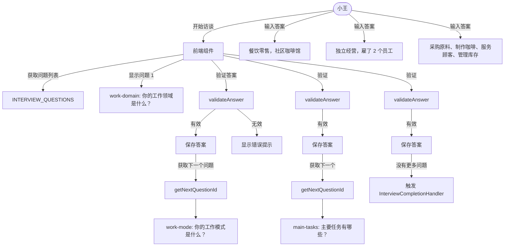

# G11：访谈模块的入口与问题流

> 本课核心问题：当小王在 OriginOS 里开始一次访谈时，系统从哪里拿到问题列表？`interview/index.ts` 导出了什么，没导出什么？

## 1. 开篇场景：小王第一次打开 OriginOS

小王注册完账号，第一次进入 OriginOS。系统弹出一个对话框：

> “欢迎！在开始之前，我们想了解你的一些信息，以便为你提供更好的服务。”

下面有三个问题：
1. 你的工作领域是什么？
2. 你的工作模式是什么？
3. 主要任务有哪些？

小王一一回答。系统说“谢谢，访谈完成！”然后自动创建了一个项目。

这个流程看起来简单，但背后有几个关键问题：

- 问题列表是写死的还是动态生成的？
- 访谈状态存在哪里？
- 答案怎么被保存和验证？
- `interview/index.ts` 作为 feature 入口，到底暴露了哪些能力？

## 2. 两种访谈模式

### 2.1 静态问题列表

问题事先定义好，所有用户看到同样的问题：

```ts
const QUESTIONS = [
  { id: 'work-domain', text: '你的工作领域是什么？' },
  { id: 'work-mode', text: '你的工作模式是什么？' },
  { id: 'main-tasks', text: '主要任务有哪些？' },
];
```

优点：简单、可控、可预测。
缺点：无法根据用户回答动态调整。

### 2.2 动态问题生成

根据用户之前的回答，LLM 生成下一个问题：

```ts
const nextQuestion = await llm.generateQuestion(previousAnswers);
```

优点：灵活、个性化。
缺点：需要 LLM 调用，成本高、延迟大、结果不可控。

OriginOS 的 `lib/features/interview` 选择了**静态问题列表**。动态访谈由 Part F 的 Project Agent 负责。

## 3. 源码精读：`interview/index.ts` 的导出边界

打开 [packages/core/src/lib/features/interview/index.ts](../../../../packages/core/src/lib/features/interview/index.ts)。

```ts
export * from './interview-completion';
export * from './interview-questions';
export * from './ontology-adapter';
```

对应源码位置：[packages/core/src/lib/features/interview/index.ts 第 1—3 行](../../../../packages/core/src/lib/features/interview/index.ts#L1-L3)。

三行导出，分别对应三个文件：

| 导出 | 来源 | 职责 |
| --- | --- | --- |
| `./interview-completion` | `interview-completion.ts` | 访谈完成后的自动处理（创建项目、生成本体） |
| `./interview-questions` | `interview-questions.ts` | 问题定义、步骤导航、答案验证 |
| `./ontology-adapter` | `ontology-adapter.ts` | 本体结构转换（`Ontology` → `OntologyModel`） |

注意：`interview/index.ts` **没有**导出：
- `InterviewService`（在 `ontology/interview.ts` 里，属于 `ontology` feature）。
- 任何 HTTP 路由或 API 处理函数（在 `packages/web/src/app/api/interviews/` 里）。

这意味着 `lib/features/interview` 这个目录只管“访谈业务逻辑”，不管“访谈会话管理”和“HTTP 接口”。

## 4. 源码精读：`interview-questions.ts`

打开 [packages/core/src/lib/features/interview/interview-questions.ts](../../../../packages/core/src/lib/features/interview/interview-questions.ts)。

### 4.1 问题定义

```ts
export interface InterviewQuestion {
  id: string;
  question: string;
  placeholder: string;
  hint: string;
  hintShort: string;
  minLength?: number;
  errorMessage?: string;
}
```

对应源码位置：[packages/core/src/lib/features/interview/interview-questions.ts 第 8—22 行](../../../../packages/core/src/lib/features/interview/interview-questions.ts#L8-L22)。

`InterviewQuestion` 是一个纯数据结构，没有方法。它描述了问题需要什么，但不关心问题怎么被展示。

### 4.2 问题列表

```ts
export const INTERVIEW_QUESTIONS: readonly InterviewQuestion[] = [
  {
    id: "work-domain",
    question: "你的工作领域是什么？",
    placeholder: "在此输入你的工作领域描述...",
    hint: "提示：例如：互联网产品、软件开发、投资分析、数据分析...",
    hintShort: "例如：互联网产品、软件开发、投资分析...",
    minLength: 3,
    errorMessage: "请输入你的工作领域",
  },
  {
    id: "work-mode",
    question: "你的工作模式是什么？",
    placeholder: "在此输入你的工作模式...",
    hint: "提示：例如：独立工作、团队协作、远程办公...",
    hintShort: "例如：独立工作、团队协作、远程办公...",
    minLength: 3,
    errorMessage: "请输入你的工作模式",
  },
  {
    id: "main-tasks",
    question: "主要任务有哪些？",
    placeholder: "在此输入你的主要任务...",
    hint: "提示：例如：需求分析、原型设计、代码编写等，可多条...",
    hintShort: "例如：需求分析、原型设计、代码编写...",
    minLength: 3,
    errorMessage: "请至少输入一项主要任务",
  },
] as const;
```

对应源码位置：[packages/core/src/lib/features/interview/interview-questions.ts 第 30—57 行](../../../../packages/core/src/lib/features/interview/interview-questions.ts#L30-L57)。

注意几个设计点：

1. **`readonly` + `as const`**：问题列表不可变，编译时就能确定内容。
2. **`minLength: 3`**：答案至少 3 个字符，防止用户随便输入。
3. **`hint` vs `hintShort`**：`hint` 是详细提示，`hintShort` 是简短提示，供不同 UI 场景使用。
4. **问题 ID 是硬编码的**：`work-domain`、`work-mode`、`main-tasks`，前端和验证逻辑都依赖这些 ID。

### 4.3 步骤导航

```ts
export function getQuestionIndex(id: string): number {
  return INTERVIEW_QUESTIONS.findIndex((q) => q.id === id);
}

export function getNextQuestionId(currentId: string): string | null {
  const index = getQuestionIndex(currentId);
  if (index === -1 || index >= INTERVIEW_QUESTIONS.length - 1) {
    return null;
  }
  const nextQuestion = INTERVIEW_QUESTIONS[index + 1];
  return nextQuestion?.id ?? null;
}

export function getPreviousQuestionId(currentId: string): string | null {
  const index = getQuestionIndex(currentId);
  if (index <= 0) {
    return null;
  }
  const prevQuestion = INTERVIEW_QUESTIONS[index - 1];
  return prevQuestion?.id ?? null;
}
```

对应源码位置：[packages/core/src/lib/features/interview/interview-questions.ts 第 72—97 行](../../../../packages/core/src/lib/features/interview/interview-questions.ts#L72-L97)。

步骤导航是纯函数，不依赖任何外部状态。输入一个 `currentId`，返回下一个或上一个问题的 `id`，或者 `null`（表示没有更多问题）。

### 4.4 答案验证

```ts
export function validateAnswer(questionId: string, answer: string): {
  valid: boolean;
  error?: string;
} {
  const question = INTERVIEW_QUESTIONS.find((q) => q.id === questionId);
  if (!question) {
    return { valid: false, error: "无效的问题" };
  }

  const trimmed = answer.trim();
  if (trimmed.length === 0) {
    return { valid: false, error: question.errorMessage || "请输入答案" };
  }

  if (question.minLength && trimmed.length < question.minLength) {
    return {
      valid: false,
      error: `答案至少需要 ${question.minLength} 个字符`,
    };
  }

  return { valid: true };
}
```

对应源码位置：[packages/core/src/lib/features/interview/interview-questions.ts 第 103—124 行](../../../../packages/core/src/lib/features/interview/interview-questions.ts#L103-L124)。

验证逻辑：
- 问题必须存在。
- 答案不能为空。
- 答案长度必须满足 `minLength`。

注意：这里没有更复杂的验证（比如正则、敏感词、语义分析），因为 OriginOS 把复杂验证留给了 Part F 的 Project Agent。

### 4.5 默认状态

```ts
export type StepState = "not-started" | "in-progress" | "completed";

export const DEFAULT_ANSWERS = Object.fromEntries(
  INTERVIEW_QUESTIONS.map((q) => [q.id, ""])
) as Record<string, string>;

export const DEFAULT_STEP_STATES = INTERVIEW_QUESTIONS.reduce(
  (acc, q) => ({ ...acc, [q.id]: "not-started" as StepState }),
  {} as Record<string, StepState>
);
```

对应源码位置：[packages/core/src/lib/features/interview/interview-questions.ts 第 130—144 行](../../../../packages/core/src/lib/features/interview/interview-questions.ts#L130-L144)。

`DEFAULT_ANSWERS` 和 `DEFAULT_STEP_STATES` 是前端初始化访谈表单时的默认值。它们基于 `INTERVIEW_QUESTIONS` 动态生成，保证问题 ID 和默认值一一对应。

## 5. 图解：访谈问题流的调用链



## 6. 关键类型

| 类型 | 定义位置 | 说明 |
| --- | --- | --- |
| `InterviewQuestion` | `interview/interview-questions.ts` | 问题定义 |
| `StepState` | `interview/interview-questions.ts` | 步骤状态枚举 |
| `InterviewResult` | `types/interview.ts` | 访谈结果（含答案和提取信息） |
| `InterviewAnswer` | `types/interview.ts` | 单个答案 |
| `InterviewSession` | `ontology/types.ts` | 访谈会话（含问题、答案、状态） |

## 7. 失败路径与边界

### 7.1 问题 ID 不存在

```ts
const question = INTERVIEW_QUESTIONS.find((q) => q.id === questionId);
if (!question) {
  return { valid: false, error: "无效的问题" };
}
```

如果前端传入了一个不存在的问题 ID，`validateAnswer` 会返回“无效的问题”。但 `getNextQuestionId` 和 `getPreviousQuestionId` 在遇到无效 ID 时只会返回 `null`，不会报错。

### 7.2 `minLength` 未定义

```ts
if (question.minLength && trimmed.length < question.minLength) {
```

如果某个问题的 `minLength` 未定义，验证会跳过长度检查。当前所有问题都定义了 `minLength: 3`，但如果未来新增问题时忘了加，就会漏检。

### 7.3 答案只验证长度，不验证内容

`validateAnswer` 只检查长度，不检查内容是否合法。用户可以输入无意义字符串（如 `"abc"`）通过验证。更严格的语义验证需要 Project Agent 来完成。

## 8. 测试证据与缺口

### 已覆盖

- `interview-questions.ts` 目前没有直接单元测试。
- `INTERVIEW_QUESTIONS` 的字段完整性没有自动化断言。
- `validateAnswer` 的各种分支没有测试。

### 缺口

- `getQuestionIndex` 对无效 ID 的处理没有测试。
- `getNextQuestionId` 在最后一个问题后返回 `null` 没有测试。
- `DEFAULT_ANSWERS` 和 `DEFAULT_STEP_STATES` 的生成逻辑没有测试。
- 问题列表变更后，`DEFAULT_ANSWERS` 是否同步更新没有测试。

## 9. 小实验：验证问题列表和导航

### 步骤一：列出所有问题

```ts
import { INTERVIEW_QUESTIONS } from '@originos/core/lib/features/interview';

INTERVIEW_QUESTIONS.forEach((q, i) => {
  console.log(`${i + 1}. ${q.id}: ${q.question}`);
});
```

### 步骤二：测试步骤导航

```ts
import { getNextQuestionId, getPreviousQuestionId } from '@originos/core/lib/features/interview';

console.log(getNextQuestionId('work-domain'));     // "work-mode"
console.log(getNextQuestionId('main-tasks'));        // null
console.log(getPreviousQuestionId('work-mode'));     // "work-domain"
console.log(getPreviousQuestionId('work-domain'));  // null
```

### 步骤三：测试答案验证

```ts
import { validateAnswer } from '@originos/core/lib/features/interview';

console.log(validateAnswer('work-domain', ''));           // { valid: false, error: "请输入你的工作领域" }
console.log(validateAnswer('work-domain', 'ab'));         // { valid: false, error: "答案至少需要 3 个字符" }
console.log(validateAnswer('work-domain', '餐饮零售'));   // { valid: true }
console.log(validateAnswer('non-existent', 'test'));      // { valid: false, error: "无效的问题" }
```

### 实验结论

问题列表、步骤导航、答案验证都是纯函数，不依赖外部状态，测试起来非常简单。但目前没有自动化测试覆盖这些基础能力。

## 10. 口头验收

读完本课后，应能不看书稿回答：

1. `interview/index.ts` 导出了哪三个来源？分别对应什么能力？
2. `INTERVIEW_QUESTIONS` 里定义了几个问题？每个问题有哪些字段？
3. `validateAnswer` 验证了哪些条件？不验证什么？
4. `getNextQuestionId` 和 `getPreviousQuestionId` 在什么情况下返回 `null`？
5. `InterviewService`（会话管理）为什么在 `ontology` feature 里，而不在 `interview` feature 里？

## 11. 章节收束

本课的核心认知是：**`lib/features/interview` 是一个轻量级的“结构化访谈逻辑”feature，它只负责问题定义、步骤导航和答案验证，不负责会话管理和 HTTP 接口**。

我们看到的几个关键设计：

- 问题列表是静态的、只读的，用 `as const` 保证不变性。
- 步骤导航是纯函数，输入输出清晰。
- 答案验证只检查基本格式（长度），不检查语义。
- `interview/index.ts` 只导出业务逻辑，不导出会话管理。
- 访谈会话管理在 `ontology` feature 里，这是一个跨 feature 的依赖关系。

下一课（G12）我们会打开 `interview-completion.ts`，看看访谈完成后，系统如何自动创建项目和本体。
