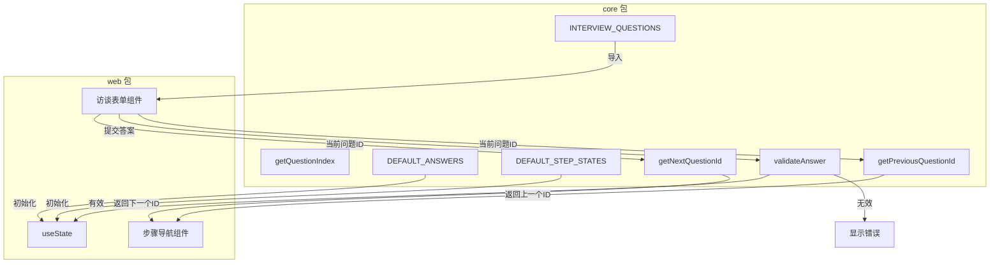

# G14：访谈问题库——问题模板、步骤映射与答案验证

> 本课核心问题：`interview-questions.ts` 里定义了哪些问题？步骤导航和答案验证是怎么实现的？问题 ID 和前端组件之间是怎么配合的？

## 1. 开篇场景：小王的三个问题从哪来

小王打开 OriginOS，系统弹出三个问题：
1. "你的工作领域是什么？"
2. "你的工作模式是什么？"
3. "主要任务有哪些？"

这些问题不是前端硬编码的，而是从 `interview-questions.ts` 导入的。但问题是怎么定义的？步骤是怎么切换的？答案是怎么验证的？

## 2. 两种问题定义方式

### 2.1 前端硬编码

```tsx
const questions = [
  { id: 'q1', text: '你的工作领域是什么？' },
  { id: 'q2', text: '你的工作模式是什么？' },
  { id: 'q3', text: '主要任务有哪些？' },
];
```

优点：简单直接，前端完全控制。
缺点：后端无法复用，问题变更需要改前端。

### 2.2 后端定义 + 前端消费

```ts
// interview-questions.ts
export const INTERVIEW_QUESTIONS = [...];

// 前端
import { INTERVIEW_QUESTIONS } from '@originos/core';
```

优点：前后端共享定义，变更一处生效。
缺点：需要确保前后端版本一致。

OriginOS 选择了**后端定义 + 前端消费**。`INTERVIEW_QUESTIONS` 定义在 `core` 包里，前端通过导入使用。

## 3. 源码精读：`InterviewQuestion` 类型

打开 [packages/core/src/lib/features/interview/interview-questions.ts](../../../../packages/core/src/lib/features/interview/interview-questions.ts)。

```ts
export interface InterviewQuestion {
  id: string;
  question: string;
  placeholder: string;
  hint: string;
  hintShort: string;
  minLength?: number;
  errorMessage?: string;
}
```

对应源码位置：[packages/core/src/lib/features/interview/interview-questions.ts 第 8—22 行](../../../../packages/core/src/lib/features/interview/interview-questions.ts#L8-L22)。

每个问题有 6 个字段：

| 字段 | 类型 | 说明 |
| --- | --- | --- |
| `id` | `string` | 问题唯一标识，用于步骤导航和答案关联 |
| `question` | `string` | 问题文本 |
| `placeholder` | `string` | 输入框占位符 |
| `hint` | `string` | 详细提示（展开状态显示） |
| `hintShort` | `string` | 简短提示（折叠状态显示） |
| `minLength` | `number` | 答案最小字符数 |
| `errorMessage` | `string` | 验证失败时的错误提示 |

注意：`hint` 和 `hintShort` 的设计是为了适配不同 UI 场景——详细提示在展开时显示，简短提示在折叠时显示。

## 4. 源码精读：问题列表

```ts
export const INTERVIEW_QUESTIONS: readonly InterviewQuestion[] = [
  {
    id: "work-domain",
    question: "你的工作领域是什么？",
    placeholder: "在此输入你的工作领域描述...",
    hint: "提示：例如：互联网产品、软件开发、投资分析、数据分析...",
    hintShort: "例如：互联网产品、软件开发、投资分析...",
    minLength: 3,
    errorMessage: "请输入你的工作领域",
  },
  {
    id: "work-mode",
    question: "你的工作模式是什么？",
    placeholder: "在此输入你的工作模式...",
    hint: "提示：例如：独立工作、团队协作、远程办公...",
    hintShort: "例如：独立工作、团队协作、远程办公...",
    minLength: 3,
    errorMessage: "请输入你的工作模式",
  },
  {
    id: "main-tasks",
    question: "主要任务有哪些？",
    placeholder: "在此输入你的主要任务...",
    hint: "提示：例如：需求分析、原型设计、代码编写等，可多条...",
    hintShort: "例如：需求分析、原型设计、代码编写...",
    minLength: 3,
    errorMessage: "请至少输入一项主要任务",
  },
] as const;
```

对应源码位置：[packages/core/src/lib/features/interview/interview-questions.ts 第 30—57 行](../../../../packages/core/src/lib/features/interview/interview-questions.ts#L30-L57)。

### 4.1 `readonly` + `as const`

```ts
export const INTERVIEW_QUESTIONS: readonly InterviewQuestion[] = [...] as const;
```

- `readonly`：数组本身不可变（不能 push/pop）。
- `as const`：数组元素和属性都不可变（不能修改已有元素的字段）。

这意味着问题列表在编译时就确定了，运行时无法修改。

### 4.2 问题 ID 的设计

三个问题的 ID 分别是：
- `work-domain`：工作领域
- `work-mode`：工作模式
- `main-tasks`：主要任务

ID 采用 kebab-case，语义清晰。前端和验证逻辑都依赖这些 ID。

## 5. 源码精读：步骤导航

### 5.1 获取问题索引

```ts
export function getQuestionIndex(id: string): number {
  return INTERVIEW_QUESTIONS.findIndex((q) => q.id === id);
}
```

对应源码位置：[packages/core/src/lib/features/interview/interview-questions.ts 第 72—74 行](../../../../packages/core/src/lib/features/interview/interview-questions.ts#L72-L74)。

`getQuestionIndex` 通过 ID 查找问题的索引。如果 ID 不存在，返回 `-1`。

### 5.2 获取下一个问题

```ts
export function getNextQuestionId(currentId: string): string | null {
  const index = getQuestionIndex(currentId);
  if (index === -1 || index >= INTERVIEW_QUESTIONS.length - 1) {
    return null;
  }
  const nextQuestion = INTERVIEW_QUESTIONS[index + 1];
  return nextQuestion?.id ?? null;
}
```

对应源码位置：[packages/core/src/lib/features/interview/interview-questions.ts 第 76—82 行](../../../../packages/core/src/lib/features/interview/interview-questions.ts#L76-L82)。

逻辑：
1. 找到当前问题的索引。
2. 如果当前问题不存在（`index === -1`），返回 `null`。
3. 如果当前问题是最后一个（`index >= length - 1`），返回 `null`。
4. 否则返回下一个问题的 ID。

### 5.3 获取上一个问题

```ts
export function getPreviousQuestionId(currentId: string): string | null {
  const index = getQuestionIndex(currentId);
  if (index <= 0) {
    return null;
  }
  const prevQuestion = INTERVIEW_QUESTIONS[index - 1];
  return prevQuestion?.id ?? null;
}
```

对应源码位置：[packages/core/src/lib/features/interview/interview-questions.ts 第 84—90 行](../../../../packages/core/src/lib/features/interview/interview-questions.ts#L84-L90)。

逻辑类似，但检查的是 `index <= 0`（第一个问题没有上一个）。

## 6. 源码精读：答案验证

```ts
export function validateAnswer(questionId: string, answer: string): {
  valid: boolean;
  error?: string;
} {
  const question = INTERVIEW_QUESTIONS.find((q) => q.id === questionId);
  if (!question) {
    return { valid: false, error: "无效的问题" };
  }

  const trimmed = answer.trim();
  if (trimmed.length === 0) {
    return { valid: false, error: question.errorMessage || "请输入答案" };
  }

  if (question.minLength && trimmed.length < question.minLength) {
    return {
      valid: false,
      error: `答案至少需要 ${question.minLength} 个字符`,
    };
  }

  return { valid: true };
}
```

对应源码位置：[packages/core/src/lib/features/interview/interview-questions.ts 第 103—124 行](../../../../packages/core/src/lib/features/interview/interview-questions.ts#L103-L124)。

验证逻辑分三步：
1. **问题必须存在**：如果 `questionId` 不在 `INTERVIEW_QUESTIONS` 中，返回“无效的问题”。
2. **答案不能为空**：trim 后长度为 0，返回 `errorMessage` 或“请输入答案”。
3. **答案长度必须满足 `minLength`**：如果定义了 `minLength` 且答案长度不足，返回错误提示。

注意：
- 验证不检查答案的语义内容（比如是否包含敏感词、是否符合领域规范）。
- `minLength` 是可选的，如果某个问题没有定义 `minLength`，跳过长度检查。
- 当前所有问题都定义了 `minLength: 3`。

## 7. 源码精读：默认状态

```ts
export type StepState = "not-started" | "in-progress" | "completed";

export const DEFAULT_ANSWERS = Object.fromEntries(
  INTERVIEW_QUESTIONS.map((q) => [q.id, ""])
) as Record<string, string>;

export const DEFAULT_STEP_STATES = INTERVIEW_QUESTIONS.reduce(
  (acc, q) => ({ ...acc, [q.id]: "not-started" as StepState }),
  {} as Record<string, StepState>
);
```

对应源码位置：[packages/core/src/lib/features/interview/interview-questions.ts 第 130—144 行](../../../../packages/core/src/lib/features/interview/interview-questions.ts#L130-L144)。

### 7.1 `DEFAULT_ANSWERS`

```ts
Object.fromEntries(
  INTERVIEW_QUESTIONS.map((q) => [q.id, ""])
)
```

生成一个对象，键是问题 ID，值是空字符串。用于前端初始化访谈表单：

```ts
const [answers, setAnswers] = useState(DEFAULT_ANSWERS);
// { "work-domain": "", "work-mode": "", "main-tasks": "" }
```

### 7.2 `DEFAULT_STEP_STATES`

```ts
INTERVIEW_QUESTIONS.reduce(
  (acc, q) => ({ ...acc, [q.id]: "not-started" as StepState }),
  {} as Record<string, StepState>
)
```

生成一个对象，键是问题 ID，值是 `"not-started"`。用于前端初始化步骤状态：

```ts
const [stepStates, setStepStates] = useState(DEFAULT_STEP_STATES);
// { "work-domain": "not-started", "work-mode": "not-started", "main-tasks": "not-started" }
```

注意：`DEFAULT_STEP_STATES` 使用 `reduce` + spread，每次迭代都创建一个新对象。对于 3 个问题来说性能不是问题，但如果问题数量很多，这会成为性能瓶颈。

## 8. 图解：问题库与前端组件的配合



## 9. 失败路径与边界

### 9.1 问题 ID 不存在

```ts
const question = INTERVIEW_QUESTIONS.find((q) => q.id === questionId);
if (!question) {
  return { valid: false, error: "无效的问题" };
}
```

如果前端传入了一个不存在的问题 ID，`validateAnswer` 会返回“无效的问题”。但 `getNextQuestionId` 和 `getPreviousQuestionId` 在遇到无效 ID 时只会返回 `null`，不会报错。

### 9.2 `minLength` 未定义

```ts
if (question.minLength && trimmed.length < question.minLength) {
```

如果某个问题的 `minLength` 未定义，验证会跳过长度检查。当前所有问题都定义了 `minLength: 3`，但如果未来新增问题时忘了加，就会漏检。

### 9.3 答案只验证长度，不验证内容

`validateAnswer` 只检查长度，不检查内容是否合法。用户可以输入无意义字符串（如 `"abc"`）通过验证。更严格的语义验证需要 Project Agent 来完成。

### 9.4 `DEFAULT_STEP_STATES` 的性能问题

```ts
INTERVIEW_QUESTIONS.reduce(
  (acc, q) => ({ ...acc, [q.id]: "not-started" as StepState }),
  {} as Record<string, StepState>
)
```

每次 `reduce` 迭代都使用 spread 创建新对象，时间复杂度是 O(n²)。对于 3 个问题来说可以忽略，但如果问题数量增加，需要考虑优化。

## 10. 测试证据与缺口

### 已覆盖

- `interview-questions.ts` 目前没有直接单元测试。
- `INTERVIEW_QUESTIONS` 的字段完整性没有自动化断言。
- `validateAnswer` 的各种分支没有测试。

### 缺口

- `getQuestionIndex` 对无效 ID 的处理没有测试。
- `getNextQuestionId` 在最后一个问题后返回 `null` 没有测试。
- `getPreviousQuestionId` 在第一个问题前返回 `null` 没有测试。
- `DEFAULT_ANSWERS` 和 `DEFAULT_STEP_STATES` 的生成逻辑没有测试。
- 问题列表变更后，`DEFAULT_ANSWERS` 是否同步更新没有测试。
- `validateAnswer` 对 `minLength` 未定义的情况没有测试。

## 11. 小实验：验证问题库

### 步骤一：列出所有问题

```ts
import { INTERVIEW_QUESTIONS } from '@originos/core/lib/features/interview';

INTERVIEW_QUESTIONS.forEach((q, i) => {
  console.log(`${i + 1}. ${q.id}: ${q.question}`);
});
// 1. work-domain: 你的工作领域是什么？
// 2. work-mode: 你的工作模式是什么？
// 3. main-tasks: 主要任务有哪些？
```

### 步骤二：测试步骤导航

```ts
import { getNextQuestionId, getPreviousQuestionId } from '@originos/core/lib/features/interview';

console.log(getNextQuestionId('work-domain'));     // "work-mode"
console.log(getNextQuestionId('main-tasks'));      // null
console.log(getPreviousQuestionId('work-mode'));   // "work-domain"
console.log(getPreviousQuestionId('work-domain')); // null
console.log(getNextQuestionId('non-existent'));    // null
```

### 步骤三：测试答案验证

```ts
import { validateAnswer } from '@originos/core/lib/features/interview';

console.log(validateAnswer('work-domain', ''));
// { valid: false, error: "请输入你的工作领域" }

console.log(validateAnswer('work-domain', 'ab'));
// { valid: false, error: "答案至少需要 3 个字符" }

console.log(validateAnswer('work-domain', '餐饮零售'));
// { valid: true }

console.log(validateAnswer('non-existent', 'test'));
// { valid: false, error: "无效的问题" }
```

### 实验结论

问题列表、步骤导航、答案验证都是纯函数，不依赖外部状态，测试起来非常简单。但目前没有自动化测试覆盖这些基础能力。

## 12. 口头验收

读完本课后，应能不看书稿回答：

1. `INTERVIEW_QUESTIONS` 定义了几个问题？每个问题有哪些字段？
2. `getNextQuestionId` 和 `getPreviousQuestionId` 在什么情况下返回 `null`？
3. `validateAnswer` 验证了哪些条件？不验证什么？
4. `DEFAULT_ANSWERS` 和 `DEFAULT_STEP_STATES` 是怎么生成的？
5. 如果新增一个问题但忘了加 `minLength`，会发生什么？

## 13. 章节收束

本课的核心认知是：**`interview-questions.ts` 是一个轻量级的问题定义库，它用纯数据结构定义了访谈流程，用纯函数实现了步骤导航和答案验证，但缺乏自动化测试**。

我们看到的几个关键设计：

- 问题列表是静态的、只读的，用 `readonly` + `as const` 保证不变性。
- 步骤导航是纯函数，输入输出清晰。
- 答案验证只检查基本格式（长度），不检查语义。
- 默认状态基于问题列表动态生成，保证 ID 一致性。
- 没有测试覆盖，新增问题时容易遗漏字段。

下一课（G15）我们会打开 `ontology-adapter.ts`，看看访谈结果如何对接 `OntologyModel`。
