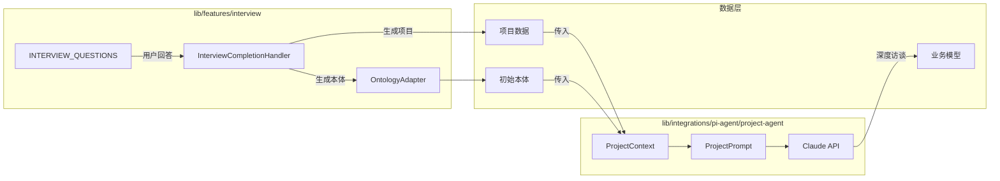
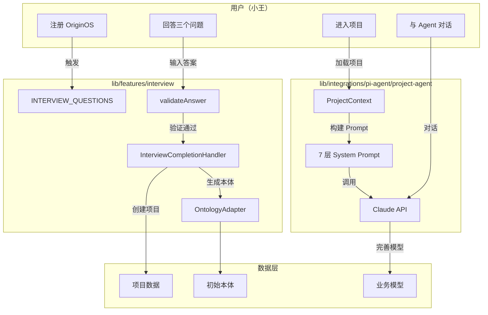

# G17：与 Part F 的边界——`lib/features/interview` 和 `lib/integrations/pi-agent/project-agent` 的区别

> 本课核心问题：OriginOS 里有两套“访谈”系统，它们有什么区别？各自的职责边界在哪里？为什么需要两套而不是一套？

## 1. 开篇场景：小王遇到了两种访谈

小王使用 OriginOS 时，遇到了两种不同的“访谈”：

**第一种（G11–G16）：**
- 刚注册时，系统弹出三个固定问题。
- "你的工作领域是什么？"
- "你的工作模式是什么？"
- "主要任务有哪些？"
- 回答完后，系统自动创建了项目。

**第二种（Part F）：**
- 进入项目后，Agent 开始和小王对话。
- "能详细描述一下你的咖啡馆每天的运营流程吗？"
- "你和供应商是怎么合作的？"
- "顾客主要是哪些人？有什么特殊需求？"
- 对话是多轮的、动态的，根据小王的回答不断深入。

这两种“访谈”有什么区别？为什么 OriginOS 需要两套系统？

## 2. 两套系统的对比

### 2.1 位置与归属

| 维度 | `lib/features/interview` | `lib/integrations/pi-agent/project-agent` |
| --- | --- | --- |
| **位置** | `packages/core/src/lib/features/interview/` | `packages/core/src/lib/integrations/pi-agent/project-agent/` |
| **归属** | Part G（本单元） | Part F |
| **层级** | Layer 2（业务功能层） | Layer 1（集成层） |

### 2.2 目的与用途

| 维度 | `lib/features/interview` | `lib/integrations/pi-agent/project-agent` |
| --- | --- | --- |
| **目的** | 收集用户基本信息，初始化项目 | 深度访谈，构建完整业务模型 |
| **输出** | 项目数据 + 初始本体 | 完整业务模型（实体、关系、规则） |
| **触发时机** | 用户首次使用 | 项目创建后，Agent 会话中 |
| **用户感知** | 表单填写 | 对话式交互 |

### 2.3 技术实现

| 维度 | `lib/features/interview` | `lib/integrations/pi-agent/project-agent` |
| --- | --- | --- |
| **问题来源** | 静态列表（`INTERVIEW_QUESTIONS`） | LLM 动态生成 |
| **交互方式** | 结构化表单 | 自然语言对话 |
| **问题数量** | 3 个固定问题 | 动态，可多轮 |
| **技术依赖** | 纯 TypeScript，无外部依赖 | LLM（Claude API） |
| **状态管理** | 前端管理 | Agent 会话管理 |

### 2.4 数据流

```
lib/features/interview:
  用户答案 → InterviewResult → CreateProjectRequest → 项目创建

lib/integrations/pi-agent/project-agent:
  对话历史 → ProjectContext → 7 层 System Prompt → LLM 生成 → 业务模型
```

## 3. 源码对比

### 3.1 `lib/features/interview` 的问题定义

```ts
// interview-questions.ts
export const INTERVIEW_QUESTIONS: readonly InterviewQuestion[] = [
  {
    id: "work-domain",
    question: "你的工作领域是什么？",
    placeholder: "在此输入你的工作领域描述...",
    hint: "提示：例如：互联网产品、软件开发...",
    minLength: 3,
    errorMessage: "请输入你的工作领域",
  },
  // ...另外两个问题
] as const;
```

对应源码位置：[packages/core/src/lib/features/interview/interview-questions.ts 第 30—57 行](../../../../packages/core/src/lib/features/interview/interview-questions.ts#L30-L57)。

特点：
- 问题列表是静态的、硬编码的。
- 所有用户看到同样的问题。
- 问题数量固定（3 个）。
- 不依赖 LLM。

### 3.2 `lib/integrations/pi-agent/project-agent` 的问题生成

```ts
// project-prompt.ts（概念性代码）
function buildProjectPrompt(context: ProjectContext): string {
  return `
    你是一个项目访谈专家。请根据以下上下文，生成针对性的访谈问题。

    项目信息：
    - 名称：${context.projectName}
    - 领域：${context.domain}
    - 模式：${context.mode}

    请生成下一个访谈问题，帮助用户完善业务模型。
  `;
}
```

对应源码位置：[packages/core/src/lib/integrations/pi-agent/project-agent/project-prompt.ts](../../../../packages/core/src/lib/integrations/pi-agent/project-agent/project-prompt.ts)。

特点：
- 问题是动态生成的，基于 LLM。
- 每个用户的问题可能不同。
- 问题数量不固定，可以多轮。
- 依赖 Claude API。

## 4. 为什么需要两套系统？

### 4.1 职责分离

| 系统 | 职责 | 为什么分离 |
| --- | --- | --- |
| `lib/features/interview` | 项目初始化 | 用户首次使用时需要快速创建项目，不能等待 LLM |
| `lib/integrations/pi-agent/project-agent` | 业务模型构建 | 项目创建后需要深度理解业务，LLM 更适合 |

### 4.2 性能考虑

- **结构化访谈**：响应快（毫秒级），不依赖外部服务。
- **Agent 访谈**：响应慢（秒级），依赖 LLM 调用。

如果用户首次使用就需要等待 LLM，体验会很差。

### 4.3 成本考虑

- **结构化访谈**：无 LLM 调用成本。
- **Agent 访谈**：每次对话都有 LLM 调用成本。

对于简单的信息收集，用 LLM 是“杀鸡用牛刀”。

### 4.4 可控性

- **结构化访谈**：问题固定，结果可预测。
- **Agent 访谈**：问题动态，结果不可完全预测。

对于项目初始化这种关键流程，需要可控性。

## 5. 边界与交互

### 5.1 数据流向



### 5.2 调用时机

| 阶段 | 系统 | 动作 |
| --- | --- | --- |
| 注册后 | `lib/features/interview` | 弹出访谈表单 |
| 回答完成后 | `lib/features/interview` | 创建项目、生成本体 |
| 进入项目后 | `lib/integrations/pi-agent/project-agent` | Agent 开始深度访谈 |
| 深度访谈后 | `lib/integrations/pi-agent/project-agent` | 完善业务模型 |

### 5.3 数据共享

两套系统共享的数据：
- **项目名称**：`InterviewResult.projectName` → `ProjectContext.projectName`
- **工作领域**：`InterviewResult.domain` → `ProjectContext.domain`
- **工作模式**：`InterviewResult.mode` → `ProjectContext.mode`
- **初始本体**：`OntologyModel` → `ProjectContext` 的知识库

但两套系统不直接调用对方的方法。它们通过数据层间接关联。

## 6. 架构规约中的定位

根据 [CLAUDE.md](../../../../CLAUDE.md)：

### 6.1 `lib/features/interview` 的定位

> `lib/features/interview` 是业务功能层（Layer 2），负责访谈相关的业务逻辑。

- 可以依赖：`lib/storage/`、`lib/integrations/`、`lib/utils/`
- 禁止依赖：`app/`、`components/`、`services/`

### 6.2 `lib/integrations/pi-agent/project-agent` 的定位

> `lib/integrations/pi-agent/` 是集成层（Layer 1），负责与外部服务（LLM）的集成。

- 可以依赖：`lib/utils/`
- 禁止依赖：`app/`、`components/`、`services/`、`lib/features/`

### 6.3 依赖关系

```
lib/features/interview/          Layer 2
  ↓ 单向依赖
lib/integrations/pi-agent/       Layer 1
```

注意：**`lib/features/interview` 不能依赖 `lib/integrations/pi-agent/project-agent`**。这是单向依赖原则的要求。

但实际上，两套系统目前没有直接依赖关系。它们通过数据层间接关联。

## 7. 常见误区

### 误区一：两套系统可以合并

**错误想法**：既然都是访谈，为什么不合并成一套？

**实际情况**：
- 结构化访谈需要快速响应，不能等 LLM。
- Agent 访谈需要深度理解，不能用固定问题。
- 合并后要么牺牲性能，要么牺牲深度。

### 误区二：Agent 访谈可以替代结构化访谈

**错误想法**：反正有 Agent 访谈，结构化访谈可以不要。

**实际情况**：
- 没有结构化访谈，项目无法初始化（没有基本信息）。
- Agent 访谈需要项目上下文才能开始。
- 两者是“先基础后深入”的关系，不是替代关系。

### 误区三：结构化访谈的结果可以直接用于 Agent 访谈

**错误想法**：结构化访谈的答案可以直接传给 Agent。

**实际情况**：
- 结构化访谈的输出是 `InterviewResult`（项目数据）。
- Agent 访谈的输入是 `ProjectContext`（项目上下文）。
- 两者格式不同，需要转换。
- 而且 Agent 访谈需要更多上下文（如知识库、历史会话）。

## 8. 图解：两套系统的完整对比



## 9. 口头验收

读完本课后，应能不看书稿回答：

1. 两套访谈系统分别在哪里？各自属于哪个层级？
2. 为什么 OriginOS 需要两套访谈系统，而不是一套？
3. 结构化访谈的问题是怎么定义的？Agent 访谈的问题是怎么生成的？
4. 两套系统的数据是怎么共享的？它们之间有直接依赖吗？
5. 如果要把 Agent 访谈的结果反馈到结构化访谈中，应该怎么设计？

## 10. 章节收束

本课的核心认知是：**OriginOS 的两套访谈系统是“互补”而非“替代”的关系——结构化访谈负责快速初始化，Agent 访谈负责深度理解，两者通过数据层间接关联，保持架构上的解耦**。

我们看到的几个关键设计：

- **结构化访谈**（`lib/features/interview`）：快速、可控、无外部依赖，适合项目初始化。
- **Agent 访谈**（`lib/integrations/pi-agent/project-agent`）：深度、动态、依赖 LLM，适合业务模型构建。
- **数据共享**：通过项目数据和本体间接关联，不直接调用。
- **层级隔离**：`lib/features/interview` 在 Layer 2，`lib/integrations/pi-agent` 在 Layer 1，单向依赖。
- **不能合并**：两者目的、性能、成本、可控性都不同，合并会牺牲某一方面。

下一课（G18）是本单元小结课，我们会画出“问题 → 答案 → 项目 → 本体”的完整调用链，并通过工作坊形式验收本单元的学习成果。
