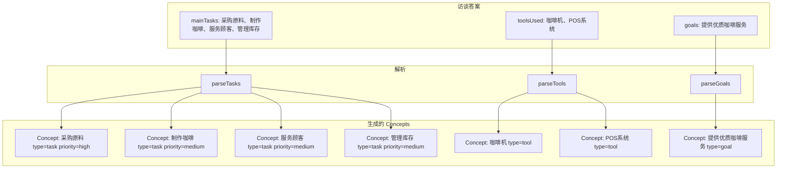

# G22：概念生成——`generateConcepts` 怎么从任务、工具、目标中提取概念

> 本课核心问题：`generateConcepts` 是怎么从访谈答案中提取 Concept 的？任务、工具、目标分别生成什么 type 的 Concept？兜底机制是怎么工作的？

## 1. 开篇场景：小王的四个任务变成四个概念

小王回答"主要任务有哪些？"时输入了：

> "采购原料、制作咖啡、服务顾客、管理库存"

系统从中提取了四个 Concept：
- "采购原料"（type: task, priority: high）
- "制作咖啡"（type: task, priority: medium）
- "服务顾客"（type: task, priority: medium）
- "管理库存"（type: task, priority: medium）

第一个任务的 priority 为什么是 high？其余为什么是 medium？

## 2. 两种概念提取策略

### 2.1 简单拆分

```ts
function extractConcepts(tasks: string): string[] {
  return tasks.split(',').map(t => t.trim());
}
```

优点：简单直接。
缺点：无法理解语义，无法处理复杂分隔符。

### 2.2 智能解析

```ts
function parseTasks(input: string): Array<{ name, priority, category, description }> {
  const lines = input.split(/[\n,;，；]/).map(l => l.trim()).filter(l => l.length > 0);
  return lines.slice(0, 5).map((line, index) => ({
    name: line.substring(0, 30),
    priority: index === 0 ? 'high' : 'medium',
    category: 'general',
    description: line,
  }));
}
```

OriginOS 选择了**智能解析**。

## 3. 源码精读：`generateConcepts`

打开 [packages/core/src/lib/features/ontology/ontology-builder.ts](../../../../packages/core/src/lib/features/ontology/ontology-builder.ts)。

```ts
private generateConcepts(
  domainId: string,
  mainTasks: string,
  toolsUsed: string | string[] | undefined,
  goals: string | undefined,
): Concept[] {
  const concepts: Concept[] = [];
  const now = new Date().toISOString();

  // Parse main tasks into concepts
  if (mainTasks) {
    const taskItems = this.parseTasks(mainTasks);
    taskItems.forEach((task) => {
      concepts.push({
        id: uuidv4(),
        domainId,
        name: task.name,
        type: 'task',
        attributes: {
          priority: task.priority,
          category: task.category,
        },
        description: task.description,
        createdAt: now,
        updatedAt: now,
      });
    });
  }

  // Generate tool concepts
  if (toolsUsed) {
    const tools = Array.isArray(toolsUsed) ? toolsUsed : [toolsUsed];
    tools.forEach((tool) => {
      if (tool && tool !== '其他') {
        concepts.push({
          id: uuidv4(),
          domainId,
          name: tool,
          type: 'tool',
          attributes: { category: 'workspace' },
          createdAt: now,
          updatedAt: now,
        });
      }
    });
  }

  // Generate goal concepts
  if (goals) {
    const goalItems = this.parseGoals(goals);
    goalItems.forEach((goal) => {
      concepts.push({
        id: uuidv4(),
        domainId,
        name: goal.name,
        type: 'goal',
        attributes: { status: 'pending' },
        description: goal.description,
        createdAt: now,
        updatedAt: now,
      });
    });
  }

  // Ensure minimum 2 concepts
  if (concepts.length < 2) {
    concepts.push(
      {
        id: uuidv4(),
        domainId,
        name: '日常工作',
        type: 'routine',
        attributes: {},
        description: '日常工作任务和流程',
        createdAt: now,
        updatedAt: now,
      },
      {
        id: uuidv4(),
        domainId,
        name: '项目管理',
        type: 'management',
        attributes: {},
        description: '项目相关的管理活动',
        createdAt: now,
        updatedAt: now,
      },
    );
  }

  return concepts;
}
```

对应源码位置：[packages/core/src/lib/features/ontology/ontology-builder.ts 第 516—611 行](../../../../packages/core/src/lib/features/ontology/ontology-builder.ts#L516-L611)。

## 4. 概念来源分析

| 来源 | 输入字段 | 生成的 Concept type | 条件 |
| --- | --- | --- | --- |
| 主要任务 | `mainTasks` | `task` | 非空 |
| 工具 | `toolsUsed` | `tool` | 非空且不为"其他" |
| 目标 | `goals` | `goal` | 非空 |
| 兜底 | 无 | `routine`, `management` | Concept 总数 < 2 |

## 5. 源码精读：`parseTasks`

```ts
private parseTasks(input: string): Array<{
  name: string;
  priority: string;
  category: string;
  description: string;
}> {
  const lines = input
    .split(/[\n,;，；]/)
    .map(l => l.trim())
    .filter(l => l.length > 0);

  return lines.slice(0, 5).map((line, index) => ({
    name: line.substring(0, 30),
    priority: index === 0 ? 'high' : 'medium',
    category: 'general',
    description: line,
  }));
}
```

对应源码位置：[packages/core/src/lib/features/ontology/ontology-builder.ts 第 651—669 行](../../../../packages/core/src/lib/features/ontology/ontology-builder.ts#L651-L669)。

### 5.1 分隔符

```ts
.split(/[\n,;，；]/)
```

支持的分隔符：
- `\n`：换行符
- `,`：英文逗号
- `;`：英文分号
- `，`：中文逗号
- `；`：中文分号

### 5.2 截断

```ts
lines.slice(0, 5)
```

最多取前 5 个任务。多余的任务被丢弃。

### 5.3 名称截断

```ts
name: line.substring(0, 30),
```

任务名称超过 30 字符会被截断。

### 5.4 Priority 规则

```ts
priority: index === 0 ? 'high' : 'medium',
```

- 第一个任务：priority 为 `'high'`。
- 其余任务：priority 为 `'medium'`。

这意味着：**任务的顺序决定了 priority**。用户输入的第一个任务被认为是优先级最高的。

## 6. 源码精读：`parseGoals`

```ts
private parseGoals(input: string): Array<{
  name: string;
  description: string;
}> {
  const lines = input
    .split(/[\n,;，；]/)
    .map(l => l.trim())
    .filter(l => l.length > 0);

  return lines.slice(0, 3).map(line => ({
    name: line.substring(0, 20),
    description: line,
  }));
}
```

对应源码位置：[packages/core/src/lib/features/ontology/ontology-builder.ts 第 674—687 行](../../../../packages/core/src/lib/features/ontology/ontology-builder.ts#L674-L687)。

与 `parseTasks` 的区别：
- 最多取前 3 个目标（`tasks` 是 5 个）。
- 名称截断到 20 字符（`tasks` 是 30 字符）。
- 没有 priority 字段。

## 7. 图解：概念生成流程



## 8. 失败路径与边界

### 8.1 任务为空

```ts
if (mainTasks) {
  const taskItems = this.parseTasks(mainTasks);
  // ...
}
```

如果 `mainTasks` 为空，不会生成 task Concept。

### 8.2 工具为"其他"

```ts
if (tool && tool !== '其他') {
  // 生成 tool Concept
}
```

"其他"选项被跳过。

### 8.3 超过 5 个任务

```ts
return lines.slice(0, 5).map(...);
```

超过 5 个任务，多余的任务被丢弃。

### 8.4 少于 2 个 Concept

```ts
if (concepts.length < 2) {
  concepts.push(
    { name: '日常工作', type: 'routine', ... },
    { name: '项目管理', type: 'management', ... },
  );
}
```

如果总数少于 2 个，添加两个默认 Concept。

## 9. 测试证据与缺口

### 已覆盖

- `generateConcepts` 没有直接单元测试。

### 缺口

- 各种分隔符的解析没有测试。
- 超过 5 个任务的截断没有测试。
- 工具为"其他"的跳过没有测试。
- 少于 2 个 Concept 的兜底没有测试。
- 任务名称超过 30 字符的截断没有测试。

## 10. 小实验：验证概念生成

### 步骤一：基本生成

```ts
import { ontologyService } from '@originos/core/lib/features/ontology';

const concepts = ontologyService['generateConcepts'](
  'dom-1',
  '采购原料、制作咖啡、服务顾客、管理库存',
  '咖啡机、POS系统',
  '提供优质咖啡服务',
);

console.log(concepts.length);           // 7 (4 task + 2 tool + 1 goal)
console.log(concepts[0].name);          // "采购原料"
console.log(concepts[0].type);          // "task"
console.log(concepts[0].attributes.priority);  // "high"
console.log(concepts[1].attributes.priority);      // "medium"
```

### 步骤二：验证分隔符

```ts
const concepts2 = ontologyService['generateConcepts'](
  'dom-1',
  '任务1\n任务2，任务3；任务4',
  undefined,
  undefined,
);
console.log(concepts2.length);  // 4
```

### 步骤三：验证截断

```ts
const longTask = 'a'.repeat(50);
const concepts3 = ontologyService['generateConcepts'](
  'dom-1',
  longTask,
  undefined,
  undefined,
);
console.log(concepts3[0].name.length);  // 30
```

### 步骤四：验证兜底

```ts
const concepts4 = ontologyService['generateConcepts'](
  'dom-1',
  '',
  undefined,
  undefined,
);
console.log(concepts4.length);      // 2
console.log(concepts4[0].name);     // "日常工作"
console.log(concepts4[1].name);     // "项目管理"
```

### 实验结论

概念生成逻辑清晰，但边界情况需要测试覆盖。

## 11. 口头验收

读完本课后，应能不看书稿回答：

1. `generateConcepts` 从哪些来源提取 Concept？分别生成什么 type？
2. `parseTasks` 支持哪些分隔符？最多取几个任务？
3. 第一个任务的 priority 为什么是 high？其余为什么是 medium？
4. 如果 `toolsUsed` 包含"其他"，会发生什么？
5. 如果生成的 Concept 少于 2 个，系统会怎么处理？

## 12. 章节收束

本课的核心认知是：**`generateConcepts` 从任务、工具、目标三个来源提取 Concept，每个来源有不同的解析规则和 type。任务最多取 5 个，第一个 priority 为 high。如果总数少于 2 个，添加默认 Concept**。

我们看到的几个关键设计：

- **多源提取**：tasks → task type, tools → tool type, goals → goal type。
- **智能解析**：支持多种分隔符，最多取 5 个任务/3 个目标。
- **Priority 规则**：第一个任务 priority 为 high，其余为 medium。
- **名称截断**：任务名称超过 30 字符截断，目标名称超过 20 字符截断。
- **工具过滤**："其他"选项被跳过。
- **兜底机制**：少于 2 个 Concept 时添加默认值。
- **无测试覆盖**：没有自动化测试。

下一课（G23）我们会深入 `generateInitialRelations`，看看关系是怎么建立的。
