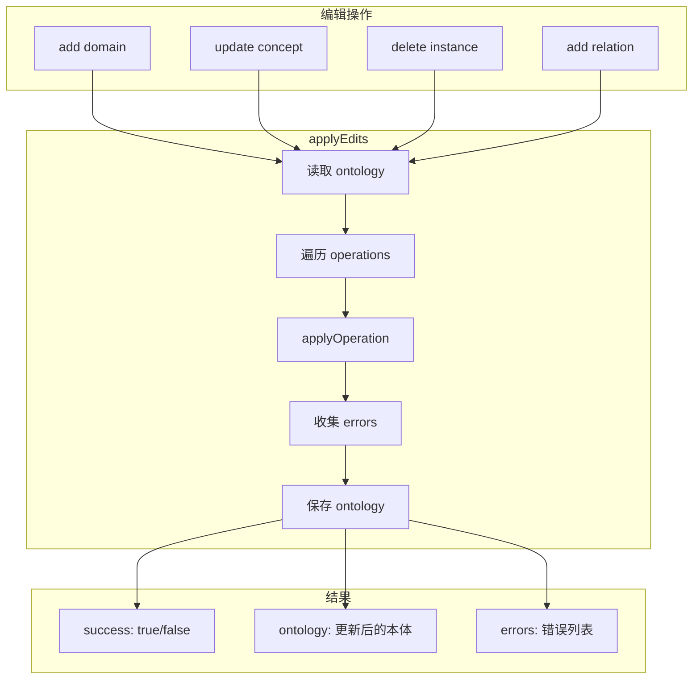

# G24：本体编辑——`applyEdits` 如何支持本体的增删改查

> 本课核心问题：`applyEdits` 是怎么支持本体的增删改查的？编辑操作有哪些类型？失败时怎么处理？

## 1. 开篇场景：小王要修改本体

小王的本体已经生成：
- Domain："餐饮零售，社区咖啡馆"
- Concepts：采购原料、制作咖啡、服务顾客、管理库存

但小王发现：
1. 漏了一个概念"清洁店面"。
2. "采购原料"的描述需要修改。
3. "管理库存"这个概念不再需要了。

系统需要提供本体编辑功能。`applyEdits` 就是做这个的。

## 2. 两种编辑策略

### 2.1 直接修改

```ts
// 直接修改 ontology 对象
ontology.concepts.push(newConcept);
ontology.concepts[0].description = '新描述';
```

优点：简单直接。
缺点：没有事务保证，部分失败时数据不一致。

### 2.2 操作日志

```ts
const operations = [
  { type: 'add', entityType: 'concept', data: newConcept },
  { type: 'update', entityType: 'concept', data: { id: 'c1', description: '新描述' } },
  { type: 'delete', entityType: 'concept', data: { id: 'c4' } },
];

const result = await ontologyService.applyEdits(ontologyId, operations);
```

OriginOS 选择了**操作日志**。

## 3. 源码精读：`applyEdits`

打开 [packages/core/src/lib/features/ontology/ontology-builder.ts](../../../../packages/core/src/lib/features/ontology/ontology-builder.ts)。

### 3.1 入口方法

```ts
async applyEdits(
  ontologyId: string,
  operations: OntologyEditOperation[],
): Promise<OntologyEditResponse> {
  const ontology = await this.getOntology(ontologyId);
  if (!ontology) {
    return {
      success: false,
      ontology: null as any,
      errors: ['Ontology not found'],
    };
  }

  const errors: string[] = [];

  for (const op of operations) {
    try {
      const result = await this.applyOperation(ontology, op);
      if (!result.success && result.errors) {
        errors.push(...result.errors);
      }
    } catch (error) {
      errors.push(
        error instanceof Error ? error.message : 'Unknown error',
      );
    }
  }

  ontology.updatedAt = new Date().toISOString();
  await this.saveOntology(ontology);

  return {
    success: errors.length === 0,
    ontology,
    errors: errors.length > 0 ? errors : undefined,
  };
}
```

对应源码位置：[packages/core/src/lib/features/ontology/ontology-builder.ts 第 143—179 行](../../../../packages/core/src/lib/features/ontology/ontology-builder.ts#L143-L179)。

### 3.2 流程分析

```
applyEdits
  ├─ 读取 ontology
  ├─ 遍历 operations
  │    ├─ applyOperation(ontology, op)
  │    │    ├─ 根据 entityType 分发
  │    │    │    ├─ domain → applyDomainOperation
  │    │    │    ├─ concept → applyConceptOperation
  │    │    │    ├─ instance → applyInstanceOperation
  │    │    │    └─ relation → applyRelationOperation
  │    │    └─ 返回 OntologyEditResponse
  │    └─ 收集 errors
  ├─ 保存 ontology
  └─ 返回 OntologyEditResponse
```

### 3.3 关键设计

- **批量操作**：一次可以传入多个操作。
- **部分失败**：某个操作失败不会阻止其他操作执行。
- **错误收集**：所有错误被收集到 `errors` 数组中。
- **最终保存**：所有操作完成后统一保存。

注意：**没有事务回滚**。如果前几个操作成功，最后一个操作失败，已经成功的操作不会被回滚。

## 4. 源码精读：`applyOperation`

```ts
private async applyOperation(
  ontology: Ontology,
  operation: OntologyEditOperation,
): Promise<OntologyEditResponse> {
  const { type, entityType, data } = operation;

  switch (entityType) {
    case 'domain':
      return this.applyDomainOperation(ontology, type, data);
    case 'concept':
      return this.applyConceptOperation(ontology, type, data);
    case 'instance':
      return this.applyInstanceOperation(ontology, type, data);
    case 'relation':
      return this.applyRelationOperation(ontology, type, data);
    default:
      return {
        success: false,
        ontology,
        errors: [`Unknown entity type: ${entityType}`],
      };
  }
}
```

对应源码位置：[packages/core/src/lib/features/ontology/ontology-builder.ts 第 184—206 行](../../../../packages/core/src/lib/features/ontology/ontology-builder.ts#L184-L206)。

## 5. Domain 的增删改查

### 5.1 Add

```ts
case 'add':
  const newDomain: Domain = {
    id: data.id || uuidv4(),
    name: data.name,
    description: data.description,
    icon: data.icon,
    color: data.color,
    createdAt: new Date().toISOString(),
    updatedAt: new Date().toISOString(),
  };
  ontology.domains.push(newDomain);
  return { success: true, ontology };
```

### 5.2 Update

```ts
case 'update':
  const domainIndex = ontology.domains.findIndex((d: Domain) => d.id === data.id);
  if (domainIndex === -1) {
    return {
      success: false,
      ontology,
      errors: ['Domain not found'],
    };
  }
  ontology.domains[domainIndex] = {
    ...ontology.domains[domainIndex]!,
    ...data,
    updatedAt: new Date().toISOString(),
  };
  return { success: true, ontology };
```

### 5.3 Delete

```ts
case 'delete':
  const deleteDomainIndex = ontology.domains.findIndex((d: Domain) => d.id === data.id);
  if (deleteDomainIndex === -1) {
    return {
      success: false,
      ontology,
      errors: ['Domain not found'],
    };
  }
  // Remove related concepts and relations
  const domainId = data.id;
  ontology.concepts = ontology.concepts.filter((c: Concept) => c.domainId !== domainId);
  ontology.relations = ontology.relations.filter((r: Relation) =>
    r.sourceId !== domainId && r.targetId !== domainId,
  );
  ontology.domains.splice(deleteDomainIndex, 1);
  return { success: true, ontology };
```

注意：**删除 Domain 时会级联删除相关的 Concept 和 Relation**。这是为了防止孤儿数据。

## 6. Concept 的增删改查

### 6.1 Add

```ts
case 'add':
  // Validate domain exists
  if (!ontology.domains.some((d: Domain) => d.id === data.domainId)) {
    return {
      success: false,
      ontology,
      errors: ['Domain not found'],
    };
  }
  const newConcept: Concept = {
    id: data.id || uuidv4(),
    domainId: data.domainId,
    name: data.name,
    type: data.type,
    attributes: data.attributes,
    description: data.description,
    createdAt: new Date().toISOString(),
    updatedAt: new Date().toISOString(),
  };
  ontology.concepts.push(newConcept);
  return { success: true, ontology };
```

注意：**添加 Concept 时会验证 Domain 是否存在**。

### 6.2 Delete

```ts
case 'delete':
  const deleteConceptIndex = ontology.concepts.findIndex((c: Concept) => c.id === data.id);
  if (deleteConceptIndex === -1) {
    return {
      success: false,
      ontology,
      errors: ['Concept not found'],
    };
  }
  // Remove related relations and instances
  const conceptId = data.id;
  ontology.instances = ontology.instances.filter((i: Instance) => i.conceptId !== conceptId);
  ontology.relations = ontology.relations.filter((r: Relation) =>
    r.sourceId !== conceptId && r.targetId !== conceptId,
  );
  ontology.concepts.splice(deleteConceptIndex, 1);
  return { success: true, ontology };
```

注意：**删除 Concept 时会级联删除相关的 Instance 和 Relation**。

## 7. 图解：编辑操作



## 8. 失败路径与边界

### 8.1 Ontology 不存在

```ts
const ontology = await this.getOntology(ontologyId);
if (!ontology) {
  return {
    success: false,
    ontology: null as any,
    errors: ['Ontology not found'],
  };
}
```

如果 ontology 不存在，直接返回错误，不执行任何操作。

### 8.2 部分操作失败

```ts
for (const op of operations) {
  try {
    const result = await this.applyOperation(ontology, op);
    if (!result.success && result.errors) {
      errors.push(...result.errors);
    }
  } catch (error) {
    errors.push(error instanceof Error ? error.message : 'Unknown error');
  }
}
```

某个操作失败不会阻止其他操作执行。但已经成功的操作不会被回滚。

### 8.3 级联删除

删除 Domain 时会级联删除 Concept 和 Relation。删除 Concept 时会级联删除 Instance 和 Relation。

这保证了数据一致性，但也可能导致意外删除。

### 8.4 没有事务回滚

```ts
// 操作 1 成功
ontology.concepts.push(newConcept);

// 操作 2 失败（Domain 不存在）
// 操作 1 不会被回滚
```

没有事务回滚机制，部分成功时数据可能不一致。

## 9. 测试证据与缺口

### 已覆盖

- `applyEdits` 没有直接单元测试。

### 缺口

- 各种操作类型的组合没有测试。
- 部分失败场景没有测试。
- 级联删除没有测试。
- 事务一致性没有测试。

## 10. 小实验：验证编辑操作

### 步骤一：添加 Concept

```ts
import { ontologyService } from '@originos/core/lib/features/ontology';

const result = await ontologyService.applyEdits('ont-1', [
  {
    type: 'add',
    entityType: 'concept',
    data: {
      domainId: 'dom-1',
      name: '清洁店面',
      type: 'task',
      attributes: { priority: 'medium' },
    },
  },
]);

console.log(result.success);  // true
console.log(result.ontology.concepts.length);  // +1
```

### 步骤二：更新 Concept

```ts
const result2 = await ontologyService.applyEdits('ont-1', [
  {
    type: 'update',
    entityType: 'concept',
    data: {
      id: 'c1',
      description: '新描述',
    },
  },
]);

console.log(result2.success);  // true
```

### 步骤三：删除 Concept（级联删除）

```ts
const result3 = await ontologyService.applyEdits('ont-1', [
  {
    type: 'delete',
    entityType: 'concept',
    data: { id: 'c4' },
  },
]);

console.log(result3.success);  // true
// 相关的 instances 和 relations 也会被删除
```

### 实验结论

编辑操作功能完整，但缺乏事务回滚机制。

## 11. 口头验收

读完本课后，应能不看书稿回答：

1. `applyEdits` 接收几个参数？返回什么？
2. 编辑操作有哪些类型？分别对应什么？
3. 删除 Domain 时会级联删除什么？
4. 如果某个操作失败，其他操作还会执行吗？
5. `applyEdits` 有没有事务回滚机制？

## 12. 章节收束

本课的核心认知是 **`applyEdits` 支持批量编辑操作，有级联删除保证数据一致性，但没有事务回滚机制**。

我们看到的几个关键设计：

- **批量操作**：一次可以传入多个操作。
- **部分失败**：某个操作失败不会阻止其他操作。
- **级联删除**：删除 Domain/Concept 时会级联删除关联数据。
- **无事务回滚**：部分成功时数据可能不一致。
- **无测试覆盖**：没有自动化测试。

下一课（G25）我们会深入 `OntologyClient`，看看 API 客户端的设计。
