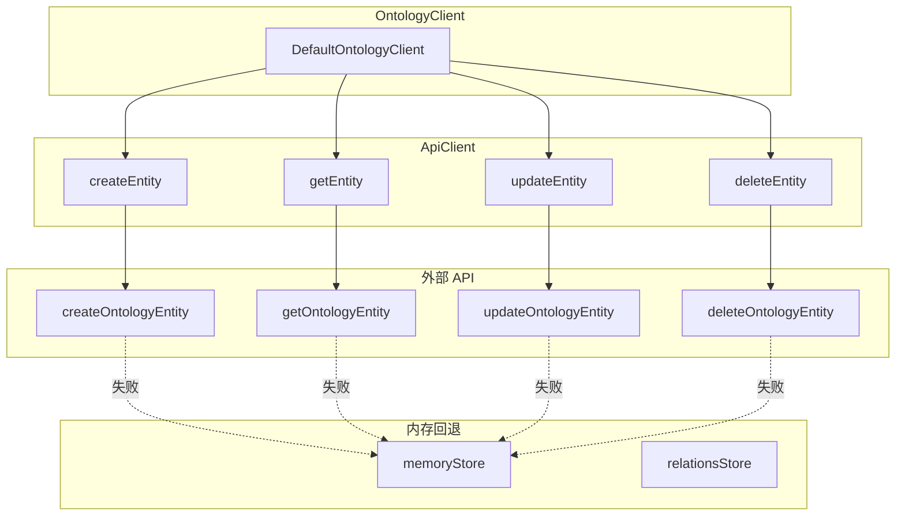

# G25：本体客户端——`OntologyClient` 如何封装底层 API 调用

> 本课核心问题：`OntologyClient` 是怎么封装底层 API 调用的？它提供了哪些便利方法？内存回退机制是怎么工作的？

## 1. 开篇场景：小王的本体数据怎么存取

小王的本体数据需要：
- 创建实体（如"XX咖啡豆供应商"）。
- 查询实体（如"所有 task 类型的实体"）。
- 建立关系（如"采购原料"depends_on"XX咖啡豆供应商"）。

这些操作需要调用底层 API。`OntologyClient` 就是封装这些 API 调用的。

## 2. 两种客户端设计

### 2.1 直接调用 API

```ts
const response = await fetch('/api/ontology/entities', {
  method: 'POST',
  body: JSON.stringify(entity),
});
```

优点：简单直接。
缺点：每个调用方都需要处理错误、重试、回退。

### 2.2 封装客户端

```ts
const entity = await ontologyClient.createEntity('Task', { title: '采购原料' });
```

OriginOS 选择了**封装客户端**。

## 3. 源码精读：`OntologyClient`

打开 [packages/core/src/lib/features/ontology/client.ts](../../../../packages/core/src/lib/features/ontology/client.ts)。

### 3.1 接口定义

```ts
interface OntologyClient {
  createEntity<T extends Record<string, unknown>>(
    type: string,
    properties: T,
  ): Promise<OntologyEntity & { properties: T }>;

  getEntity(entityId: string): Promise<OntologyEntity | null>;

  updateEntity(
    entityId: string,
    properties: Partial<Record<string, unknown>>,
  ): Promise<OntologyEntity | null>;

  deleteEntity(entityId: string): Promise<boolean>;

  queryEntities<T extends Record<string, unknown> = Record<string, unknown>>(
    type: string,
    where?: Partial<T>,
  ): Promise<Array<OntologyEntity & { properties: T }>>;

  listEntities(type?: string): Promise<OntologyEntity[]>;

  createRelation(
    fromId: string,
    relType: string,
    toId: string,
    properties?: Record<string, unknown>,
  ): Promise<OntologyRelation>;

  getRelated(
    entityId: string,
    relType?: string,
    direction?: 'outgoing' | 'incoming' | 'both',
  ): Promise<Array<{ relation: string; entity: OntologyEntity }>>;

  validateGraph(): Promise<string[]>;
}
```

对应源码位置：[packages/core/src/lib/features/ontology/client.ts 第 36—74 行](../../../../packages/core/src/lib/features/ontology/client.ts#L36-L74)。

### 3.2 实现类

```ts
class DefaultOntologyClient implements OntologyClient {
  private apiClient: ApiClient;

  constructor() {
    this.apiClient = new ApiClient();
  }

  async createEntity<T extends Record<string, unknown>>(
    type: string,
    properties: T,
  ): Promise<OntologyEntity & { properties: T }> {
    const entityId = generateEntityId(type);
    const timestamp = getTimestamp();

    const entity: OntologyEntity & { properties: T } = {
      id: entityId,
      type,
      properties,
      created: timestamp,
      updated: timestamp,
    };

    await this.apiClient.createEntity(entity);
    return entity;
  }

  // ...其他方法
}
```

对应源码位置：[packages/core/src/lib/features/ontology/client.ts 第 100—128 行](../../../../packages/core/src/lib/features/ontology/client.ts#L100-L128)。

## 4. `ApiClient` 的内存回退机制

### 4.1 创建实体

```ts
async createEntity(entity: OntologyEntity): Promise<void> {
  try {
    const response = await createOntologyEntity(entity);
    if (!response.success) {
      throw new Error(response.error?.message || 'Failed to create entity');
    }
  } catch (error) {
    console.warn('API create failed, using memory fallback:', error);
    this.storeInMemory({ op: 'create', entity });
  }
}
```

对应源码位置：[packages/core/src/lib/features/ontology/client.ts 第 208—219 行](../../../../packages/core/src/lib/features/ontology/client.ts#L208-L219)。

### 4.2 回退机制

当 API 调用失败时，`ApiClient` 会：
1. 打印警告日志。
2. 将数据存入内存（`memoryStore`）。

这意味着：**即使 API 不可用，数据也不会丢失**（在当前会话中）。

### 4.3 内存存储

```ts
private memoryStore: Map<string, OntologyEntity> = new Map();
private relationsStore: Map<string, OntologyRelation[]> = new Map();
```

对应源码位置：[packages/core/src/lib/features/ontology/client.ts 第 324—325 行](../../../../packages/core/src/lib/features/ontology/client.ts#L324-L325)。

- `memoryStore`：按 entity ID 存储实体。
- `relationsStore`：按 from entity ID 存储关系。

注意：**内存存储只在当前会话有效**。页面刷新后数据丢失。

## 5. 便利方法

```ts
export async function createPerson(properties: PersonProperties): Promise<...> {
  return ontologyClient.createEntity<PersonProperties>('Person', properties);
}

export async function createProject(properties: ProjectProperties): Promise<...> {
  return ontologyClient.createEntity<ProjectProperties>('Project', properties);
}

export async function createTask(properties: TaskProperties): Promise<...> {
  return ontologyClient.createEntity<TaskProperties>('Task', properties);
}

export async function createGoal(properties: GoalProperties): Promise<...> {
  return ontologyClient.createEntity<GoalProperties>('Goal', properties);
}
```

对应源码位置：[packages/core/src/lib/features/ontology/client.ts 第 383—409 行](../../../../packages/core/src/lib/features/ontology/client.ts#L383-L409)。

这些便利方法封装了常见实体类型的创建：
- `createPerson`
- `createProject`
- `createTask`
- `createGoal`

## 6. 图解：客户端架构



## 7. 失败路径与边界

### 7.1 API 不可用

当 API 不可用时，数据存入内存。但：
- 页面刷新后数据丢失。
- 无法与其他会话共享数据。

### 7.2 内存泄漏

```ts
private memoryStore: Map<string, OntologyEntity> = new Map();
```

`memoryStore` 是一个 Map，数据只增不减。如果长时间运行，可能导致内存泄漏。

### 7.3 没有持久化机制

内存中的数据没有自动持久化到磁盘或数据库。需要手动调用 API 保存。

## 8. 测试证据与缺口

### 已覆盖

- `OntologyClient` 没有直接单元测试。

### 缺口

- API 失败时的回退机制没有测试。
- 内存泄漏风险没有测试。
- 便利方法的类型安全没有测试。

## 9. 小实验：验证客户端

### 步骤一：创建实体

```ts
import { ontologyClient, createPerson } from '@originos/core/lib/features/ontology';

const person = await createPerson({
  name: '小王',
  email: 'wang@example.com',
});

console.log(person.id);         // "pers_..."
console.log(person.type);       // "Person"
console.log(person.properties.name);  // "小王"
```

### 步骤二：查询实体

```ts
const tasks = await ontologyClient.queryEntities('Task', {
  status: 'open',
});

console.log(tasks.length);
```

### 步骤三：建立关系

```ts
const relation = await ontologyClient.createRelation(
  'task-1',
  'depends_on',
  'task-2',
  { priority: 'high' },
);

console.log(relation.from);   // "task-1"
console.log(relation.rel);    // "depends_on"
console.log(relation.to);     // "task-2"
```

### 实验结论

客户端封装清晰，但内存回退机制有局限性。

## 10. 口头验收

读完本课后，应能不看书稿回答：

1. `OntologyClient` 提供了哪些方法？
2. `ApiClient` 的回退机制是怎么工作的？
3. 内存存储有什么限制？
4. 便利方法有哪些？它们和普通方法有什么区别？
5. 如果 API 不可用，数据会怎么处理？

## 11. 章节收束

本课的核心认知是 **`OntologyClient` 封装了底层 API 调用，提供了便利方法和内存回退机制。但内存存储只在当前会话有效，且存在内存泄漏风险**。

我们看到的几个关键设计：

- **封装 API**：`OntologyClient` 封装了底层 API 调用。
- **内存回退**：API 失败时数据存入内存。
- **便利方法**：`createPerson`、`createProject` 等常见实体类型的快捷方法。
- **内存泄漏**：`memoryStore` 只增不减。
- **无持久化**：内存数据不会自动持久化。
- **无测试覆盖**：没有自动化测试。

下一课（G26）是单元小结课，我们会画出"访谈答案 → 本体生成 → 关系建立 → 编辑"的完整调用链。
