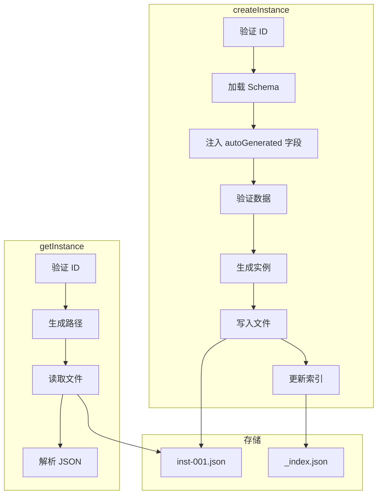

# G29：实例 CRUD（上）——`createInstance` 和 `getInstance` 是怎么工作的

> 本课核心问题：`createInstance` 是怎么创建实例的？`getInstance` 是怎么读取实例的？ID 是怎么生成的？

## 1. 开篇场景：小王录入第一个商品

小王要在系统里录入第一个商品：

```
名称：埃塞俄比亚耶加雪菲咖啡豆
类别：咖啡豆
单价：128
库存：50
```

系统需要：
1. 生成一个唯一的实例 ID。
2. 验证数据是否符合 Schema。
3. 把数据写入 JSON 文件。
4. 更新索引。

## 2. 两种创建策略

### 2.1 直接写入

```ts
const data = { name: '咖啡豆', price: 128 };
fs.writeFile('inst-001.json', JSON.stringify(data));
```

优点：简单直接。
缺点：没有验证，没有索引，没有版本。

### 2.2 完整流程

```ts
const instance = await createInstance(ontologyId, conceptId, fields, createdBy, conceptSchema);
```

OriginOS 选择了**完整流程**。

## 3. 源码精读：`createInstance`

打开 [packages/core/src/lib/features/ontology-data-store/store.ts](../../../../packages/core/src/lib/features/ontology-data-store/store.ts)。

### 3.1 入口方法

```ts
export async function createInstance(
  ontologyId: string,
  conceptId: string,
  fields: Record<string, unknown>,
  createdBy: string,
  conceptSchema?: ConceptSchema,
): Promise<InstanceData> {
  // 1. 验证 ID
  if (!isValidId(ontologyId) || !isValidId(conceptId)) {
    throw new Error('Invalid IDs: path traversal detected');
  }

  // 2. 加载或创建 Schema
  const schema = conceptSchema || (await loadConceptSchema(ontologyId, conceptId));

  // 3. 注入 autoGenerated 字段
  const autoFields = schema.fields.filter((f) => f.autoGenerated);
  for (const field of autoFields) {
    if (!fields[field.name]) {
      fields[field.name] = generateAutoValue(field);
    }
  }

  // 4. 验证数据
  validateInstance(fields, schema);

  // 5. 生成实例
  const instance: InstanceData = {
    id: generateId(),
    conceptId,
    domainId: schema.domainId,
    ontologyId,
    fields,
    meta: {
      createdAt: Date.now(),
      updatedAt: Date.now(),
      createdBy,
      version: 1,
    },
  };

  // 6. 写入文件
  const filePath = instancePath(ontologyId, conceptId, instance.id);
  await fs.mkdir(path.dirname(filePath), { recursive: true });
  await fs.writeFile(filePath, JSON.stringify(instance, null, 2), 'utf-8');

  // 7. 更新索引
  await updateIndexEntry(ontologyId, conceptId, instance.id, {
    ...fields,
    createdAt: instance.meta.createdAt,
  });

  return instance;
}
```

对应源码位置：[packages/core/src/lib/features/ontology-data-store/store.ts 第 1—50 行](../../../../packages/core/src/lib/features/ontology-data-store/store.ts#L1-L50)。

### 3.2 流程分析

```
createInstance
  ├─ 1. 验证 ID（isValidId）
  ├─ 2. 加载 Schema（loadConceptSchema）
  ├─ 3. 注入 autoGenerated 字段
  ├─ 4. 验证数据（validateInstance）
  ├─ 5. 生成实例（generateId）
  ├─ 6. 写入文件（fs.writeFile）
  ├─ 7. 更新索引（updateIndexEntry）
  └─ 返回 InstanceData
```

### 3.3 ID 生成

```ts
function generateId(): string {
  return `inst-${Date.now()}-${Math.random().toString(36).slice(2, 8)}`;
}
```

对应源码位置：[packages/core/src/lib/features/ontology-data-store/store.ts 第 52—54 行](../../../../packages/core/src/lib/features/ontology-data-store/store.ts#L52-L54)。

ID 格式：`inst-{时间戳}-{随机数}`

示例：`inst-1717603200000-abc123`

## 4. 源码精读：`getInstance`

### 4.1 入口方法

```ts
export async function getInstance(
  ontologyId: string,
  conceptId: string,
  instanceId: string,
): Promise<InstanceData> {
  if (!isValidId(ontologyId) || !isValidId(instanceId)) {
    throw new Error('Invalid IDs: path traversal detected');
  }

  const filePath = instancePath(ontologyId, conceptId, instanceId);
  const content = await fs.readFile(filePath, 'utf-8');
  return JSON.parse(content) as InstanceData;
}
```

对应源码位置：[packages/core/src/lib/features/ontology-data-store/store.ts 第 56—66 行](../../../../packages/core/src/lib/features/ontology-data-store/store.ts#L56-L66)。

### 4.2 流程分析

```
getInstance
  ├─ 1. 验证 ID（isValidId）
  ├─ 2. 生成路径（instancePath）
  ├─ 3. 读取文件（fs.readFile）
  ├─ 4. 解析 JSON
  └─ 返回 InstanceData
```

## 5. 图解：创建和读取流程



## 6. 失败路径与边界

### 6.1 路径遍历

```ts
if (!isValidId(ontologyId) || !isValidId(conceptId)) {
  throw new Error('Invalid IDs: path traversal detected');
}
```

如果 ID 包含路径遍历字符，直接抛出错误。

### 6.2 Schema 验证失败

```ts
validateInstance(fields, schema);
```

如果数据不符合 Schema（如必填项缺失、类型错误），抛出错误。

### 6.3 文件不存在

```ts
const content = await fs.readFile(filePath, 'utf-8');
```

如果文件不存在，`fs.readFile` 会抛出 `ENOENT` 错误。

## 7. 测试证据与缺口

### 已覆盖

```ts
it('createInstance writes file and updates index', async () => {
  const { createInstance } = await import('../store');
  const { clearCache } = await import('../index-manager');

  clearCache();

  const instance = await createInstance(
    TEST.ontologyId, TEST.conceptId,
    { name: '张三', status: 'active' },
    'user'
  );

  expect(instance.id).toBeDefined();
  expect(instance.fields.name).toBe('张三');
  expect(instance.meta.version).toBe(1);
  expect(instance.meta.createdBy).toBe('user');

  expect(mockedFs.writeFile).toHaveBeenCalled();
});

it('createInstance rejects invalid fields', async () => {
  const { createInstance } = await import('../store');
  const { clearCache } = await import('../index-manager');

  clearCache();

  await expect(
    createInstance(TEST.ontologyId, TEST.conceptId, { status: 'active' }, 'user')
  ).rejects.toThrow('必填项');
});

it('getInstance reads instance file', async () => {
  const { getInstance } = await import('../store');
  const result = await getInstance(TEST.ontologyId, TEST.conceptId, TEST.instanceId);

  expect(result.id).toBe(TEST.instanceId);
  expect(result.fields.name).toBe('张三');
});
```

对应源码位置：[packages/core/src/lib/features/ontology-data-store/__tests__/ontology-data-store.test.ts 第 293—342 行](../../../../packages/core/src/lib/features/ontology-data-store/__tests__/ontology-data-store.test.ts#L293-L342)。

### 缺口

- `autoGenerated` 字段的注入没有直接测试。
- 文件写入失败的处理没有测试。

## 8. 小实验：验证创建和读取

### 步骤一：创建实例

```ts
import { createInstance } from '@originos/core/lib/features/ontology-data-store';

const instance = await createInstance(
  'ontology-project-cafe-001',
  'product',
  {
    name: '埃塞俄比亚耶加雪菲咖啡豆',
    category: '咖啡豆',
    price: 128,
    stock: 50,
  },
  'user',
);

console.log(instance.id);         // "inst-1717603200000-abc123"
console.log(instance.meta.version); // 1
```

### 步骤二：读取实例

```ts
import { getInstance } from '@originos/core/lib/features/ontology-data-store';

const data = await getInstance(
  'ontology-project-cafe-001',
  'product',
  'inst-1717603200000-abc123',
);

console.log(data.fields.name);   // "埃塞俄比亚耶加雪菲咖啡豆"
console.log(data.fields.price);  // 128
```

### 实验结论

创建和读取流程完整，有 Schema 验证和索引更新。

## 9. 口头验收

读完本课后，应能不看书稿回答：

1. `createInstance` 接收哪些参数？返回什么？
2. 实例 ID 的格式是什么？怎么生成的？
3. `createInstance` 做了哪些步骤？
4. `getInstance` 是怎么读取实例的？
5. 如果 Schema 验证失败，会发生什么？

## 10. 章节收束

本课的核心认知是 **`createInstance` 通过"验证 ID → 加载 Schema → 注入 autoGenerated → 验证数据 → 生成实例 → 写入文件 → 更新索引"七步完成实例创建，而 `getInstance` 直接读取 JSON 文件**。

我们看到的几个关键设计：

- **七步创建**：完整的创建流程，保证数据一致性。
- **ID 生成**：时间戳 + 随机数，保证唯一性。
- **Schema 验证**：创建时自动验证，防止脏数据。
- **索引更新**：创建后自动更新索引，保证查询效率。
- **路径安全**：所有操作前验证 ID，防止路径遍历。
- **已测试**：创建和读取有单元测试覆盖。

下一课（G30）我们会深入 `updateInstance` 和 `deleteInstance`。
