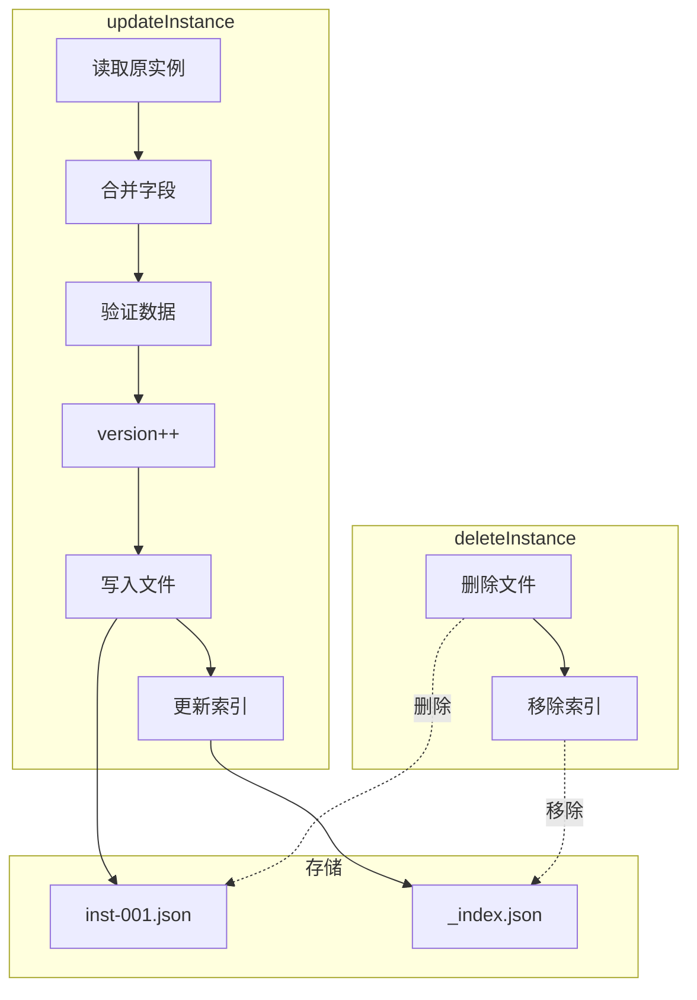

# G30：实例 CRUD（下）——`updateInstance` 和 `deleteInstance` 是怎么工作的

> 本课核心问题：`updateInstance` 是怎么更新实例的？`deleteInstance` 是怎么删除实例的？版本号是怎么递增的？

## 1. 开篇场景：小王修改商品库存

小王发现"埃塞俄比亚耶加雪菲咖啡豆"的库存需要更新：

```
原库存：50
新库存：45（卖出了 5 包）
```

系统需要：
1. 读取原实例数据。
2. 合并新字段。
3. 验证数据。
4. 递增版本号。
5. 写入文件。
6. 更新索引。

## 2. 两种更新策略

### 2.1 完全覆盖

```ts
instance.fields = newFields;
```

优点：简单直接。
缺点：会丢失未提供的字段。

### 2.2 增量合并

```ts
instance.fields = { ...instance.fields, ...newFields };
```

OriginOS 选择了**增量合并**。

## 3. 源码精读：`updateInstance`

打开 [packages/core/src/lib/features/ontology-data-store/store.ts](../../../../packages/core/src/lib/features/ontology-data-store/store.ts)。

### 3.1 入口方法

```ts
export async function updateInstance(
  ontologyId: string,
  conceptId: string,
  instanceId: string,
  fields: Record<string, unknown>,
  conceptSchema?: ConceptSchema,
): Promise<InstanceData> {
  if (!isValidId(ontologyId) || !isValidId(instanceId)) {
    throw new Error('Invalid IDs: path traversal detected');
  }

  // 1. 读取原实例
  const filePath = instancePath(ontologyId, conceptId, instanceId);
  const content = await fs.readFile(filePath, 'utf-8');
  const instance = JSON.parse(content) as InstanceData;

  // 2. 合并字段
  const updatedFields = { ...instance.fields, ...fields };

  // 3. 加载 Schema 并验证
  const schema = conceptSchema || (await loadConceptSchema(ontologyId, conceptId));
  validateInstance(updatedFields, schema);

  // 4. 更新实例
  const updated: InstanceData = {
    ...instance,
    fields: updatedFields,
    meta: {
      ...instance.meta,
      updatedAt: Date.now(),
      version: instance.meta.version + 1,
    },
  };

  // 5. 写入文件
  await fs.writeFile(filePath, JSON.stringify(updated, null, 2), 'utf-8');

  // 6. 更新索引
  await updateIndexEntry(ontologyId, conceptId, instanceId, {
    ...updatedFields,
    updatedAt: updated.meta.updatedAt,
  });

  return updated;
}
```

对应源码位置：[packages/core/src/lib/features/ontology-data-store/store.ts 第 68—105 行](../../../../packages/core/src/lib/features/ontology-data-store/store.ts#L68-L105)。

### 3.2 流程分析

```
updateInstance
  ├─ 1. 验证 ID（isValidId）
  ├─ 2. 读取原实例（fs.readFile）
  ├─ 3. 合并字段（{ ...old, ...new }）
  ├─ 4. 验证数据（validateInstance）
  ├─ 5. 更新实例（version++）
  ├─ 6. 写入文件（fs.writeFile）
  ├─ 7. 更新索引（updateIndexEntry）
  └─ 返回 InstanceData
```

### 3.3 版本号递增

```ts
version: instance.meta.version + 1,
```

每次更新，版本号自动递增。初始版本号为 1。

## 4. 源码精读：`deleteInstance`

### 4.1 入口方法

```ts
export async function deleteInstance(
  ontologyId: string,
  conceptId: string,
  instanceId: string,
): Promise<void> {
  if (!isValidId(ontologyId) || !isValidId(instanceId)) {
    throw new Error('Invalid IDs: path traversal detected');
  }

  // 1. 删除文件
  const filePath = instancePath(ontologyId, conceptId, instanceId);
  await fs.unlink(filePath);

  // 2. 从索引移除
  await removeIndexEntry(ontologyId, conceptId, instanceId);
}
```

对应源码位置：[packages/core/src/lib/features/ontology-data-store/store.ts 第 107—120 行](../../../../packages/core/src/lib/features/ontology-data-store/store.ts#L107-L120)。

### 4.2 流程分析

```
deleteInstance
  ├─ 1. 验证 ID（isValidId）
  ├─ 2. 删除文件（fs.unlink）
  ├─ 3. 从索引移除（removeIndexEntry）
  └─ 返回 void
```

## 5. 图解：更新和删除流程



## 6. 失败路径与边界

### 6.1 实例不存在

```ts
const content = await fs.readFile(filePath, 'utf-8');
```

如果实例不存在，`fs.readFile` 会抛出 `ENOENT` 错误。

### 6.2 验证失败

```ts
validateInstance(updatedFields, schema);
```

如果更新后的数据不符合 Schema，抛出错误，不会写入文件。

### 6.3 部分字段更新

```ts
const updatedFields = { ...instance.fields, ...fields };
```

只更新提供的字段，未提供的字段保持不变。

## 7. 测试证据与缺口

### 已覆盖

```ts
it('updateInstance merges fields and increments version', async () => {
  const existing = createInstanceData();
  mockedFs.readFile.mockImplementation(async (p: string) => {
    if (pathMatches(p, TEST.instanceId) && !pathMatches(p, 'versions')) {
      return JSON.stringify(existing);
    }
    // ...
  });

  const { updateInstance } = await import('../store');
  const { clearCache } = await import('../index-manager');

  clearCache();

  const updated = await updateInstance(
    TEST.ontologyId, TEST.conceptId, TEST.instanceId,
    { age: 31 }
  );

  expect(updated.fields.age).toBe(31);
  expect(updated.fields.name).toBe('张三'); // preserved
  expect(updated.meta.version).toBe(2);
});

it('deleteInstance removes file and index entry', async () => {
  const { deleteInstance } = await import('../store');
  const { clearCache } = await import('../index-manager');

  clearCache();

  await deleteInstance(TEST.ontologyId, TEST.conceptId, TEST.instanceId);

  expect(mockedFs.unlink).toHaveBeenCalled();
});
```

对应源码位置：[packages/core/src/lib/features/ontology-data-store/__tests__/ontology-data-store.test.ts 第 344—379 行](../../../../packages/core/src/lib/features/ontology-data-store/__tests__/ontology-data-store.test.ts#L344-L379)。

### 缺口

- 删除不存在实例的处理没有测试。
- 并发更新的冲突处理没有测试。

## 8. 小实验：验证更新和删除

### 步骤一：更新实例

```ts
import { updateInstance } from '@originos/core/lib/features/ontology-data-store';

const updated = await updateInstance(
  'ontology-project-cafe-001',
  'product',
  'inst-1717603200000-abc123',
  { stock: 45 },  // 只更新库存
);

console.log(updated.fields.stock);    // 45
console.log(updated.fields.price);  // 128（未变）
console.log(updated.meta.version);  // 2（递增）
```

### 步骤二：删除实例

```ts
import { deleteInstance } from '@originos/core/lib/features/ontology-data-store';

await deleteInstance(
  'ontology-project-cafe-001',
  'product',
  'inst-1717603200000-abc123',
);

// 文件已删除，索引已移除
```

### 实验结论

更新是增量合并，版本号自动递增。删除会同时清理文件和索引。

## 9. 口头验收

读完本课后，应能不看书稿回答：

1. `updateInstance` 是怎么合并字段的？
2. 版本号是怎么递增的？
3. `deleteInstance` 做了哪些操作？
4. 如果更新时验证失败，会发生什么？
5. 更新时未提供的字段会怎样？

## 10. 章节收束

本课的核心认知是 **`updateInstance` 通过增量合并字段、递增版本号、重新验证 Schema 来更新实例，而 `deleteInstance` 同时清理文件和索引**。

我们看到的几个关键设计：

- **增量合并**：只更新提供的字段，保留其他字段。
- **版本递增**：每次更新自动递增版本号。
- **重新验证**：更新后重新验证 Schema，保证数据质量。
- **原子清理**：删除时同时清理文件和索引。
- **已测试**：更新和删除有单元测试覆盖。

下一课（G31）我们会深入 `schema-validator.ts`，看看 Schema 是怎么验证的。
