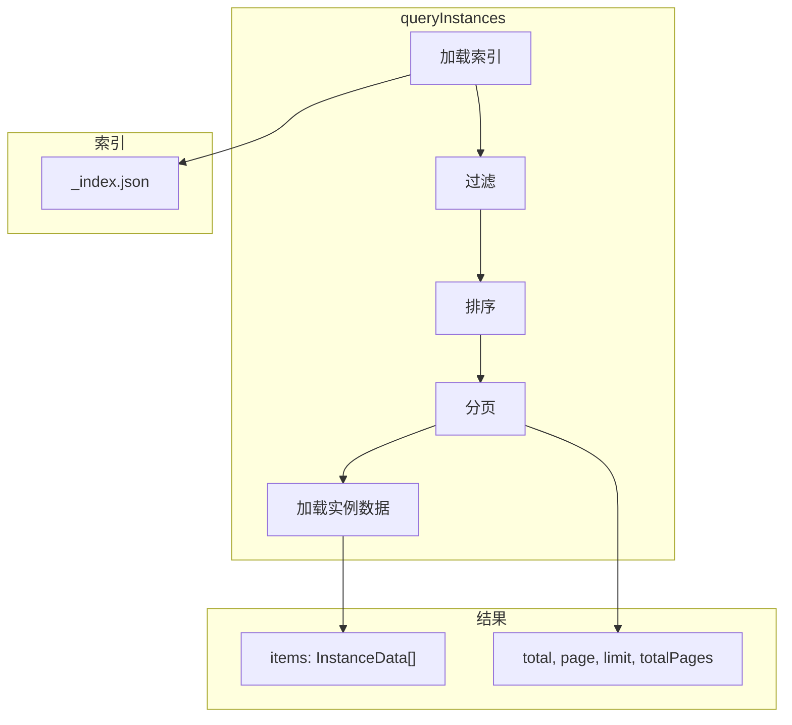

# G32：查询引擎——`queryInstances` 是怎么支持过滤、排序、分页的

> 本课核心问题：`queryInstances` 是怎么支持过滤、排序、分页的？索引是怎么被使用的？

## 1. 开篇场景：小王要查询所有咖啡豆

小王的咖啡馆有很多商品，他想查询：
- 所有"咖啡豆"类别的商品。
- 按单价从低到高排序。
- 每页显示 10 条，查看第 2 页。

这就是查询引擎的职责。

## 2. 两种查询策略

### 2.1 全量加载

```ts
const allInstances = await loadAllInstances();
const filtered = allInstances.filter(i => i.fields.category === '咖啡豆');
const sorted = filtered.sort((a, b) => a.fields.price - b.fields.price);
const paginated = sorted.slice(10, 20);
```

优点：简单直接。
缺点：数据量大时性能差。

### 2.2 索引查询

```ts
const result = await queryInstances(ontologyId, conceptId, {
  filters: { category: '咖啡豆' },
  sortBy: 'price',
  sortOrder: 'asc',
  page: 2,
  limit: 10,
});
```

OriginOS 选择了**索引查询**。

## 3. 源码精读：`queryInstances`

打开 [packages/core/src/lib/features/ontology-data-store/query-engine.ts](../../../../packages/core/src/lib/features/ontology-data-store/query-engine.ts)。

### 3.1 入口方法

```ts
export async function queryInstances(
  ontologyId: string,
  conceptId: string,
  params: QueryParams = {},
): Promise<QueryResult> {
  // 1. 加载索引
  const index = await loadIndex(ontologyId, conceptId);
  let entries = Object.entries(index.entries);

  // 2. 过滤
  if (params.filters) {
    entries = entries.filter(([_, entry]) => matchesFilter(entry, params.filters!));
  }

  // 3. 排序
  if (params.sortBy) {
    entries.sort((a, b) => {
      const aVal = a[1][params.sortBy!];
      const bVal = b[1][params.sortBy!];
      if (aVal < bVal) return params.sortOrder === 'desc' ? 1 : -1;
      if (aVal > bVal) return params.sortOrder === 'desc' ? -1 : 1;
      return 0;
    });
  }

  // 4. 分页
  const total = entries.length;
  const page = params.page || 1;
  const limit = params.limit || 10;
  const start = (page - 1) * limit;
  const paginated = entries.slice(start, start + limit);

  // 5. 加载实例数据
  const items = await Promise.all(
    paginated.map(([id]) => getInstance(ontologyId, conceptId, id).catch(() => null))
  );

  return {
    items: items.filter((i): i is InstanceData => i !== null),
    total,
    page,
    limit,
    totalPages: Math.ceil(total / limit),
  };
}
```

对应源码位置：[packages/core/src/lib/features/ontology-data-store/query-engine.ts 第 1—45 行](../../../../packages/core/src/lib/features/ontology-data-store/query-engine.ts#L1-L45)。

### 3.2 流程分析

```
queryInstances
  ├─ 1. 加载索引（loadIndex）
  ├─ 2. 过滤（matchesFilter）
  ├─ 3. 排序
  ├─ 4. 分页
  ├─ 5. 加载实例数据
  └─ 返回 QueryResult
```

## 4. 源码精读：`matchesFilter`

```ts
function matchesFilter(
  entry: IndexEntry,
  filters: Record<string, unknown>,
): boolean {
  for (const [key, value] of Object.entries(filters)) {
    if (entry[key] !== value) {
      return false;
    }
  }
  return true;
}
```

对应源码位置：[packages/core/src/lib/features/ontology-data-store/query-engine.ts 第 47—55 行](../../../../packages/core/src/lib/features/ontology-data-store/query-engine.ts#L47-L55)。

过滤逻辑：
- 遍历所有过滤条件。
- 如果某个条件不匹配，返回 `false`。
- 所有条件都匹配，返回 `true`。

注意：**只支持精确匹配**，不支持模糊查询、范围查询等高级过滤。

## 5. 图解：查询流程



## 6. 分页计算

```ts
const total = entries.length;
const page = params.page || 1;
const limit = params.limit || 10;
const start = (page - 1) * limit;
const paginated = entries.slice(start, start + limit);
```

示例：
- 总数据：25 条
- 每页：10 条
- 第 2 页：
  - `start = (2 - 1) * 10 = 10`
  - `paginated = entries.slice(10, 20)`
  - 返回 10 条
- 第 3 页：
  - `start = (3 - 1) * 10 = 20`
  - `paginated = entries.slice(20, 30)`
  - 返回 5 条

## 7. 测试证据与缺口

### 已覆盖

```ts
it('queryInstances returns all instances without filters', async () => {
  // ...
  const result = await queryInstances(TEST.ontologyId, TEST.conceptId);
  expect(result.total).toBe(2);
  expect(result.items).toHaveLength(2);
});

it('queryInstances filters by field', async () => {
  // ...
  const result = await queryInstances(TEST.ontologyId, TEST.conceptId, {
    filters: { status: 'active' },
  });
  expect(result.total).toBe(1);
  expect(result.items).toHaveLength(1);
});

it('queryInstances sorts results', async () => {
  // ...
  const result = await queryInstances(TEST.ontologyId, TEST.conceptId, {
    sortBy: 'createdAt',
    sortOrder: 'asc',
  });
  expect(result.items[0].id).toBe('inst-002'); // 100 < 200
});

it('queryInstances paginates results', async () => {
  // ...
  const result = await queryInstances(TEST.ontologyId, TEST.conceptId, {
    page: 1,
    limit: 3,
  });
  expect(result.total).toBe(10);
  expect(result.items).toHaveLength(3);
  expect(result.totalPages).toBe(4);
});
```

对应源码位置：[packages/core/src/lib/features/ontology-data-store/__tests__/ontology-data-store.test.ts 第 402—523 行](../../../../packages/core/src/lib/features/ontology-data-store/__tests__/ontology-data-store.test.ts#L402-L523)。

### 缺口

- 多字段排序没有测试。
- 复合过滤条件（AND/OR）没有测试。
- 排序字段不存在时的处理没有测试。

## 8. 小实验：验证查询

### 步骤一：无过滤查询

```ts
import { queryInstances } from '@originos/core/lib/features/ontology-data-store';

const result = await queryInstances('ontology-project-cafe-001', 'product');

console.log(result.total);       // 总数量
console.log(result.items.length); // 当前页数量
console.log(result.page);        // 当前页码
console.log(result.totalPages);  // 总页数
```

### 步骤二：过滤 + 排序 + 分页

```ts
const result = await queryInstances('ontology-project-cafe-001', 'product', {
  filters: { category: '咖啡豆' },
  sortBy: 'price',
  sortOrder: 'asc',
  page: 2,
  limit: 10,
});

console.log(result.items.map(i => ({
  name: i.fields.name,
  price: i.fields.price,
})));
```

### 实验结论

查询引擎支持过滤、排序、分页，但只支持精确匹配。

## 9. 口头验收

读完本课后，应能不看书稿回答：

1. `queryInstances` 支持哪些查询参数？
2. 过滤是怎么工作的？支持哪些操作？
3. 分页是怎么计算的？
4. 排序支持哪些方向？
5. 查询引擎的局限性是什么？

## 10. 章节收束

本课的核心认知是 **`queryInstances` 通过"加载索引 → 过滤 → 排序 → 分页 → 加载实例"五步完成查询，但只支持精确匹配**。

我们看到的几个关键设计：

- **索引查询**：基于内存索引，性能较好。
- **精确过滤**：只支持精确匹配，不支持模糊查询。
- **单字段排序**：只支持单字段排序。
- **分页计算**：基于页码和每页数量计算切片。
- **已测试**：无过滤、过滤、排序、分页都有测试覆盖。

下一课（G33）我们会深入 `index-manager.ts`，看看索引是怎么被管理的。
