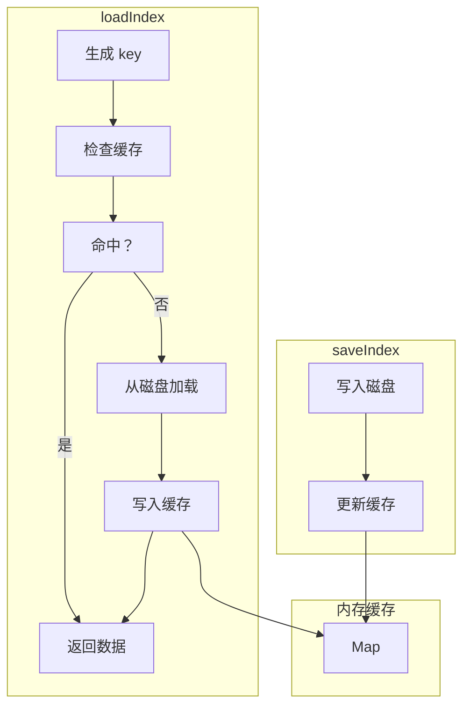

# G33：索引管理器——`loadIndex` 和 `saveIndex` 是怎么用内存缓存加速的

> 本课核心问题：`loadIndex` 是怎么加载索引的？`saveIndex` 是怎么保存索引的？内存缓存是怎么工作的？

## 1. 开篇场景：小王频繁查询商品

小王频繁查询商品列表。如果每次查询都读取磁盘，性能会很差。

解决方案：**内存缓存**。第一次查询时从磁盘加载索引到内存，后续查询直接从内存读取。

## 2. 两种索引策略

### 2.1 无索引

```ts
const files = await fs.readdir(dir);
const instances = await Promise.all(
  files.map(f => fs.readFile(f, 'utf-8').then(JSON.parse))
);
```

优点：简单。
缺点：每次查询都要读取所有文件，性能差。

### 2.2 内存缓存 + 磁盘索引

```ts
const index = await loadIndex(ontologyId, conceptId);  // 第一次从磁盘加载
// 后续从内存读取
```

OriginOS 选择了**内存缓存 + 磁盘索引**。

## 3. 源码精读：`loadIndex`

打开 [packages/core/src/lib/features/ontology-data-store/index-manager.ts](../../../../packages/core/src/lib/features/ontology-data-store/index-manager.ts)。

### 3.1 入口方法

```ts
const cache = new Map<string, IndexData>();

export async function loadIndex(
  ontologyId: string,
  conceptId: string,
): Promise<IndexData> {
  const key = `${ontologyId}:${conceptId}`;

  // 1. 检查缓存
  if (cache.has(key)) {
    return cache.get(key)!;
  }

  // 2. 从磁盘加载
  const filePath = indexPath(ontologyId, conceptId);
  let data: IndexData;

  try {
    const content = await fs.readFile(filePath, 'utf-8');
    data = JSON.parse(content) as IndexData;
  } catch {
    // 文件不存在，返回空索引
    data = { conceptId, updatedAt: 0, entries: {} };
  }

  // 3. 写入缓存
  cache.set(key, data);
  return data;
}
```

对应源码位置：[packages/core/src/lib/features/ontology-data-store/index-manager.ts 第 1—30 行](../../../../packages/core/src/lib/features/ontology-data-store/index-manager.ts#L1-L30)。

### 3.2 流程分析

```
loadIndex
  ├─ 1. 生成缓存 key（ontologyId:conceptId）
  ├─ 2. 检查缓存
  │    ├─ 命中 → 返回缓存数据
  │    └─ 未命中 → 继续
  ├─ 3. 从磁盘加载
  ├─ 4. 写入缓存
  └─ 返回 IndexData
```

### 3.3 缓存 key

```ts
const key = `${ontologyId}:${conceptId}`;
```

示例：`ontology-project-cafe-001:product`

## 4. 源码精读：`saveIndex`

```ts
export async function saveIndex(
  ontologyId: string,
  conceptId: string,
  data: IndexData,
): Promise<void> {
  const filePath = indexPath(ontologyId, conceptId);
  await fs.mkdir(path.dirname(filePath), { recursive: true });
  await fs.writeFile(filePath, JSON.stringify(data, null, 2), 'utf-8');

  // 更新缓存
  const key = `${ontologyId}:${conceptId}`;
  cache.set(key, data);
}
```

对应源码位置：[packages/core/src/lib/features/ontology-data-store/index-manager.ts 第 32—42 行](../../../../packages/core/src/lib/features/ontology-data-store/index-manager.ts#L32-L42)。

### 4.1 流程分析

```
saveIndex
  ├─ 1. 写入磁盘
  └─ 2. 更新缓存
```

注意：**先写磁盘，再更新缓存**。保证数据一致性。

## 5. 源码精读：`updateIndexEntry`

```ts
export async function updateIndexEntry(
  ontologyId: string,
  conceptId: string,
  instanceId: string,
  entry: Partial<IndexEntry>,
): Promise<void> {
  const index = await loadIndex(ontologyId, conceptId);

  // 更新或添加条目
  index.entries[instanceId] = {
    ...index.entries[instanceId],
    ...entry,
  };
  index.updatedAt = Date.now();

  // 保存到磁盘
  await saveIndex(ontologyId, conceptId, index);
}
```

对应源码位置：[packages/core/src/lib/features/ontology-data-store/index-manager.ts 第 44—60 行](../../../../packages/core/src/lib/features/ontology-data-store/index-manager.ts#L44-L60)。

## 6. 图解：索引管理流程



## 7. 缓存策略

### 7.1 缓存命中率

```
第一次查询：缓存未命中 → 从磁盘加载 → 写入缓存
第二次查询：缓存命中 → 直接返回
第三次查询：缓存命中 → 直接返回
...
```

### 7.2 缓存清理

```ts
export function clearCache(): void {
  cache.clear();
}
```

对应源码位置：[packages/core/src/lib/features/ontology-data-store/index-manager.ts 第 62—64 行](../../../../packages/core/src/lib/features/ontology-data-store/index-manager.ts#L62-L64)。

主要用于测试时清理缓存。

## 8. 测试证据与缺口

### 已覆盖

```ts
it('loadIndex returns empty entries when file not found', async () => {
  mockedFs.readFile.mockRejectedValueOnce(new Error('ENOENT'));

  const { loadIndex, clearCache } = await import('../index-manager');
  clearCache();
  const data = await loadIndex(TEST.ontologyId, TEST.conceptId);

  expect(data.entries).toEqual({});
  expect(data.conceptId).toBe(TEST.conceptId);
});

it('loadIndex uses cache for subsequent calls', async () => {
  const indexData = { conceptId: TEST.conceptId, updatedAt: 0, entries: {} };
  mockedFs.readFile.mockResolvedValue(JSON.stringify(indexData));

  const { loadIndex, clearCache } = await import('../index-manager');
  clearCache();
  await loadIndex(TEST.ontologyId, TEST.conceptId);
  await loadIndex(TEST.ontologyId, TEST.conceptId);

  // Only one fs.readFile call for _index.json (second call uses cache)
  const readCalls = mockedFs.readFile.mock.calls.filter(
    (c) => pathMatches(c[0]?.toString(), '_index.json')
  );
  expect(readCalls.length).toBe(1);
});
```

对应源码位置：[packages/core/src/lib/features/ontology-data-store/__tests__/ontology-data-store.test.ts 第 139—233 行](../../../../packages/core/src/lib/features/ontology-data-store/__tests__/ontology-data-store.test.ts#L139-L233)。

### 缺口

- 缓存大小限制没有测试。
- 缓存过期策略没有测试。
- 并发写入的冲突处理没有测试。

## 9. 小实验：验证索引缓存

### 步骤一：加载索引

```ts
import { loadIndex, clearCache } from '@originos/core/lib/features/ontology-data-store';

// 清理缓存
clearCache();

// 第一次加载（从磁盘）
const index1 = await loadIndex('ontology-project-cafe-001', 'product');
console.log(index1.entries);  // 从磁盘加载

// 第二次加载（从缓存）
const index2 = await loadIndex('ontology-project-cafe-001', 'product');
console.log(index2.entries);  // 从缓存加载（更快）
```

### 实验结论

内存缓存有效减少了磁盘读取次数。

## 10. 口头验收

读完本课后，应能不看书稿回答：

1. `loadIndex` 是怎么使用缓存的？
2. 缓存的 key 是什么格式？
3. `saveIndex` 是怎么保证缓存一致性的？
4. `clearCache` 是做什么的？什么时候用？
5. 缓存策略有什么局限性？

## 11. 章节收束

本课的核心认知是 **`loadIndex` 通过内存缓存减少磁盘读取，`saveIndex` 保证磁盘和缓存的一致性**。

我们看到的几个关键设计：

- **内存缓存**：`Map<string, IndexData>` 存储索引数据。
- **缓存 key**：`ontologyId:conceptId` 格式。
- **先写磁盘**：保证数据一致性。
- **缓存清理**：`clearCache` 用于测试。
- **已测试**：缓存命中、缓存未命中都有测试覆盖。

下一课（G34）我们会深入 `version.ts`，看看版本管理是怎么工作的。
