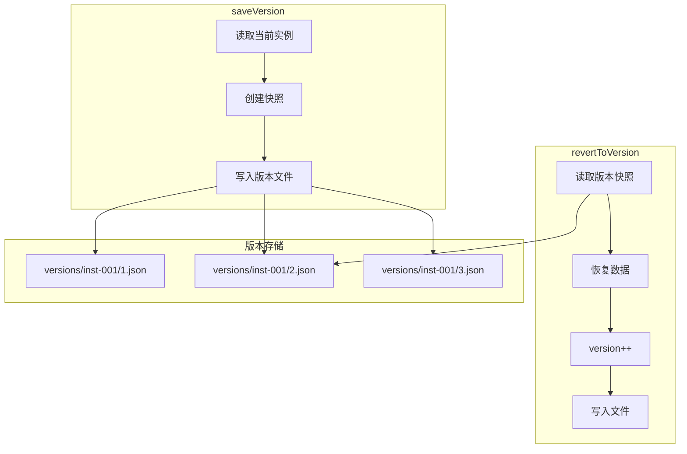

# G34：版本管理——`saveVersion` 和 `revertToVersion` 是怎么管理历史版本的

> 本课核心问题：`saveVersion` 是怎么保存版本快照的？`revertToVersion` 是怎么回滚到历史版本的？版本文件是怎么组织的？

## 1. 开篇场景：小王误改了商品数据

小王不小心把"埃塞俄比亚耶加雪菲咖啡豆"的价格从 128 改成了 12.8。他想恢复到之前的价格。

系统需要：
1. 保存每次修改前的快照。
2. 支持回滚到任意历史版本。

## 2. 两种版本策略

### 2.1 无版本管理

```ts
// 直接覆盖，无法恢复
await fs.writeFile(path, JSON.stringify(newData));
```

优点：简单。
缺点：无法恢复历史数据。

### 2.2 版本快照

```ts
// 保存快照，支持回滚
await saveVersion(ontologyId, conceptId, instanceId);
await revertToVersion(ontologyId, conceptId, instanceId, version);
```

OriginOS 选择了**版本快照**。

## 3. 源码精读：`saveVersion`

打开 [packages/core/src/lib/features/ontology-data-store/version.ts](../../../../packages/core/src/lib/features/ontology-data-store/version.ts)。

### 3.1 入口方法

```ts
export async function saveVersion(
  ontologyId: string,
  conceptId: string,
  instanceId: string,
  label?: string,
): Promise<VersionSnapshot> {
  if (!isValidId(ontologyId) || !isValidId(instanceId)) {
    throw new Error('Invalid IDs: path traversal detected');
  }

  // 1. 读取当前实例
  const filePath = instancePath(ontologyId, conceptId, instanceId);
  const content = await fs.readFile(filePath, 'utf-8');
  const instance = JSON.parse(content) as InstanceData;

  // 2. 创建快照
  const snapshot: VersionSnapshot = {
    version: instance.meta.version,
    instanceId,
    label,
    savedAt: Date.now(),
    data: instance,
  };

  // 3. 写入版本文件
  const vDir = versionDir(ontologyId, instanceId);
  await fs.mkdir(vDir, { recursive: true });
  await fs.writeFile(
    versionPath(ontologyId, instanceId, instance.meta.version),
    JSON.stringify(snapshot, null, 2),
    'utf-8',
  );

  return snapshot;
}
```

对应源码位置：[packages/core/src/lib/features/ontology-data-store/version.ts 第 1—35 行](../../../../packages/core/src/lib/features/ontology-data-store/version.ts#L1-L35)。

### 3.2 流程分析

```
saveVersion
  ├─ 1. 验证 ID
  ├─ 2. 读取当前实例
  ├─ 3. 创建快照
  ├─ 4. 写入版本文件
  └─ 返回 VersionSnapshot
```

### 3.3 版本文件路径

```
data/projects/{projectId}/ontology/versions/{instanceId}/{version}.json
```

示例：
```
data/projects/cafe-001/ontology/versions/inst-001/1.json
data/projects/cafe-001/ontology/versions/inst-001/2.json
data/projects/cafe-001/ontology/versions/inst-001/3.json
```

## 4. 源码精读：`revertToVersion`

### 4.1 入口方法

```ts
export async function revertToVersion(
  ontologyId: string,
  conceptId: string,
  instanceId: string,
  version: number,
): Promise<InstanceData> {
  // 1. 读取版本快照
  const snapshot = await getVersion(ontologyId, instanceId, version);

  // 2. 恢复数据（递增版本号）
  const reverted: InstanceData = {
    ...snapshot.data,
    meta: {
      ...snapshot.data.meta,
      updatedAt: Date.now(),
      version: snapshot.data.meta.version + 1,
    },
  };

  // 3. 写入文件
  const filePath = instancePath(ontologyId, conceptId, instanceId);
  await fs.writeFile(filePath, JSON.stringify(reverted, null, 2), 'utf-8');

  return reverted;
}
```

对应源码位置：[packages/core/src/lib/features/ontology-data-store/version.ts 第 37—60 行](../../../../packages/core/src/lib/features/ontology-data-store/version.ts#L37-L60)。

### 4.2 流程分析

```
revertToVersion
  ├─ 1. 读取版本快照
  ├─ 2. 恢复数据（version++）
  ├─ 3. 写入文件
  └─ 返回 InstanceData
```

注意：**回滚后版本号递增**，而不是恢复到旧版本号。

## 5. 图解：版本管理流程



## 6. 版本列表

```ts
export async function getVersions(
  ontologyId: string,
  instanceId: string,
): Promise<Array<{ version: number; label?: string; savedAt: number }>> {
  if (!isValidId(ontologyId) || !isValidId(instanceId)) {
    throw new Error('Invalid IDs: path traversal detected');
  }

  const vDir = versionDir(ontologyId, instanceId);
  let files: string[];
  try {
    files = await fs.readdir(vDir);
  } catch {
    return [];
  }

  return files
    .filter((f) => f.endsWith('.json'))
    .map((f) => ({
      version: parseInt(f.replace('.json', ''), 10),
      label: undefined,
      savedAt: 0,
    }))
    .filter((v) => !isNaN(v.version))
    .sort((a, b) => a.version - b.version);
}
```

对应源码位置：[packages/core/src/lib/features/ontology-data-store/version.ts 第 62—85 行](../../../../packages/core/src/lib/features/ontology-data-store/version.ts#L62-L85)。

## 7. 测试证据与缺口

### 已覆盖

```ts
it('saveVersion writes snapshot to version file', async () => {
  // ...
  const { saveVersion } = await import('../version');
  const snapshot = await saveVersion(TEST.ontologyId, TEST.conceptId, TEST.instanceId, 'v1 snapshot');

  expect(snapshot.version).toBe(1);
  expect(snapshot.label).toBe('v1 snapshot');
  expect(mockedFs.writeFile).toHaveBeenCalled();
});

it('getVersions returns version list', async () => {
  mockedFs.readdir.mockResolvedValueOnce(['1.json', '2.json', '3.json']);

  const { getVersions } = await import('../version');
  const versions = await getVersions(TEST.ontologyId, TEST.instanceId);

  expect(versions).toHaveLength(3);
  expect(versions.map((v) => v.version)).toEqual([1, 2, 3]);
});

it('revertToVersion restores data and increments version', async () => {
  // ...
  const { revertToVersion } = await import('../version');
  const reverted = await revertToVersion(TEST.ontologyId, TEST.conceptId, TEST.instanceId, 2);

  expect(reverted.meta.version).toBe(3);
  expect(mockedFs.writeFile).toHaveBeenCalled();
});
```

对应源码位置：[packages/core/src/lib/features/ontology-data-store/__tests__/ontology-data-store.test.ts 第 529—599 行](../../../../packages/core/src/lib/features/ontology-data-store/__tests__/ontology-data-store.test.ts#L529-L599)。

### 缺口

- 版本文件损坏的处理没有测试。
- 并发保存版本的冲突处理没有测试。
- 版本数量限制没有测试。

## 8. 小实验：验证版本管理

### 步骤一：保存版本

```ts
import { saveVersion } from '@originos/core/lib/features/ontology-data-store';

const snapshot = await saveVersion(
  'ontology-project-cafe-001',
  'product',
  'inst-1717603200000-abc123',
  '修改价格前',
);

console.log(snapshot.version);  // 1
console.log(snapshot.label);    // "修改价格前"
```

### 步骤二：回滚版本

```ts
import { revertToVersion } from '@originos/core/lib/features/ontology-data-store';

const reverted = await revertToVersion(
  'ontology-project-cafe-001',
  'product',
  'inst-1717603200000-abc123',
  1,  // 回滚到版本 1
);

console.log(reverted.meta.version);  // 2（递增）
console.log(reverted.fields.price);  // 128（恢复旧值）
```

### 实验结论

版本管理支持保存快照和回滚，回滚后版本号递增。

## 9. 口头验收

读完本课后，应能不看书稿回答：

1. `saveVersion` 是怎么保存版本快照的？
2. `revertToVersion` 是怎么回滚的？
3. 回滚后版本号是怎么变化的？
4. 版本文件存储在哪里？
5. `getVersions` 返回什么？

## 10. 章节收束

本课的核心认知是 **`saveVersion` 保存实例快照到版本文件，`revertToVersion` 读取快照并恢复数据，回滚后版本号递增**。

我们看到的几个关键设计：

- **快照保存**：每次调用 `saveVersion` 保存当前实例的完整副本。
- **版本文件**：按 `versions/{instanceId}/{version}.json` 组织。
- **回滚恢复**：读取快照，恢复数据，版本号递增。
- **版本列表**：`getVersions` 返回所有历史版本。
- **已测试**：保存、列表、回滚都有测试覆盖。

下一课（G35）我们会深入 `instance-relations.ts`，看看实例关系是怎么管理的。
