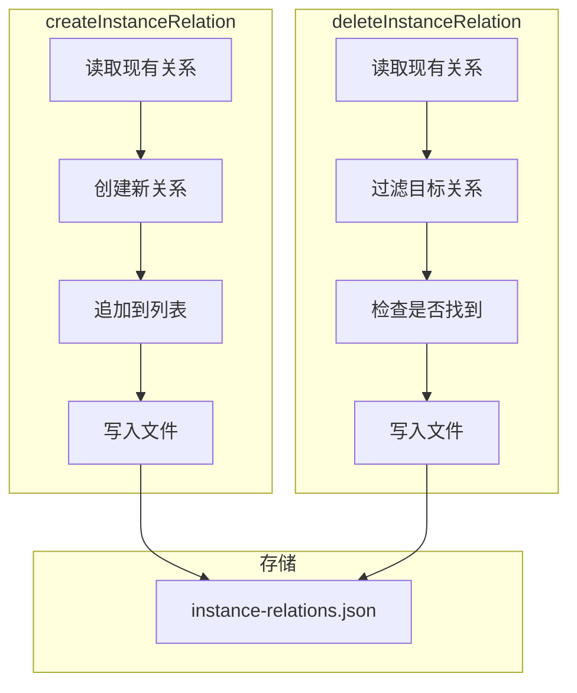

# G35：实例关系——`createInstanceRelation` 和 `deleteInstanceRelation` 是怎么管理实例关联的

> 本课核心问题：`createInstanceRelation` 是怎么建立实例关联的？`deleteInstanceRelation` 是怎么删除关联的？实例关系和概念关系有什么区别？

## 1. 开篇场景：小王的咖啡豆和供应商

小王录入了两个实例：
- 商品："埃塞俄比亚耶加雪菲咖啡豆"
- 供应商："XX 咖啡豆贸易公司"

系统需要建立它们之间的关系："埃塞俄比亚耶加雪菲咖啡豆" **由** "XX 咖啡豆贸易公司" **供应**。

这就是实例关系的职责。

## 2. 两种关系

### 2.1 概念关系（Concept Relation）

定义在**本体结构层**，描述 Concept 之间的关系：

```ts
// Concept "商品" 和 "供应商" 之间的关系
{
  sourceId: 'product',
  targetId: 'supplier',
  type: 'supplied_by',
}
```

### 2.2 实例关系（Instance Relation）

定义在**数据层**，描述具体 Instance 之间的关系：

```ts
// 具体实例之间的关系
{
  sourceInstanceId: 'inst-product-001',
  targetInstanceId: 'inst-supplier-001',
  type: 'supplied_by',
}
```

OriginOS 同时支持两种关系。

## 3. 源码精读：`createInstanceRelation`

打开 [packages/core/src/lib/features/ontology-data-store/instance-relations.ts](../../../../packages/core/src/lib/features/ontology-data-store/instance-relations.ts)。

### 3.1 入口方法

```ts
export async function createInstanceRelation(
  ontologyId: string,
  input: CreateInstanceRelationInput,
): Promise<InstanceRelation> {
  // 1. 读取现有关系
  const stored = await readInstanceRelations(ontologyId);

  // 2. 创建新关系
  const relation: InstanceRelation = {
    id: `irel-${Date.now()}-${Math.random().toString(36).slice(2, 8)}`,
    sourceInstanceId: input.sourceInstanceId,
    targetInstanceId: input.targetInstanceId,
    type: input.type,
    sourceConceptId: input.sourceConceptId,
    targetConceptId: input.targetConceptId,
  };

  // 3. 写入文件
  await writeInstanceRelations(ontologyId, {
    relations: [...stored.relations, relation],
  });

  return relation;
}
```

对应源码位置：[packages/core/src/lib/features/ontology-data-store/instance-relations.ts 第 40—73 行](../../../../packages/core/src/lib/features/ontology-data-store/instance-relations.ts#L40-L73)。

### 3.2 流程分析

```
createInstanceRelation
  ├─ 1. 读取现有关系
  ├─ 2. 创建新关系
  ├─ 3. 追加到列表
  ├─ 4. 写入文件
  └─ 返回 InstanceRelation
```

### 3.3 ID 生成

```ts
id: `irel-${Date.now()}-${Math.random().toString(36).slice(2, 8)}`
```

格式：`irel-{时间戳}-{随机数}`

## 4. 源码精读：`deleteInstanceRelation`

```ts
export async function deleteInstanceRelation(
  ontologyId: string,
  relationId: string,
): Promise<void> {
  const stored = await readInstanceRelations(ontologyId);
  const relations = stored.relations.filter((relation) => relation.id !== relationId);

  if (relations.length === stored.relations.length) {
    throw new Error(`实例关系 "${relationId}" 不存在`);
  }

  await writeInstanceRelations(ontologyId, { relations });
}
```

对应源码位置：[packages/core/src/lib/features/ontology-data-store/instance-relations.ts 第 75—88 行](../../../../packages/core/src/lib/features/ontology-data-store/instance-relations.ts#L75-L88)。

### 4.1 流程分析

```
deleteInstanceRelation
  ├─ 1. 读取现有关系
  ├─ 2. 过滤掉目标关系
  ├─ 3. 检查是否找到
  ├─ 4. 写入文件
  └─ 返回 void
```

## 5. 存储结构

### 5.1 文件路径

```
data/projects/{projectId}/ontology/instance-relations.json
```

### 5.2 文件格式

```json
{
  "relations": [
    {
      "id": "irel-1717603200000-abc123",
      "sourceInstanceId": "inst-product-001",
      "targetInstanceId": "inst-supplier-001",
      "type": "supplied_by",
      "sourceConceptId": "product",
      "targetConceptId": "supplier"
    }
  ]
}
```

## 6. 图解：实例关系管理



## 7. 测试证据与缺口

### 已覆盖

- 实例关系的测试在 `ontology-data-store.test.ts` 中没有直接覆盖。

### 缺口

- `createInstanceRelation` 没有直接测试。
- `deleteInstanceRelation` 没有直接测试。
- 关系不存在时的处理没有测试。
- 重复关系的处理没有测试。

## 8. 小实验：验证实例关系

### 步骤一：创建关系

```ts
import { createInstanceRelation } from '@originos/core/lib/features/ontology-data-store';

const relation = await createInstanceRelation(
  'ontology-project-cafe-001',
  {
    sourceInstanceId: 'inst-product-001',
    targetInstanceId: 'inst-supplier-001',
    type: 'supplied_by',
    sourceConceptId: 'product',
    targetConceptId: 'supplier',
  },
);

console.log(relation.id);                    // "irel-1717603200000-abc123"
console.log(relation.sourceInstanceId);      // "inst-product-001"
console.log(relation.targetInstanceId);      // "inst-supplier-001"
```

### 步骤二：删除关系

```ts
import { deleteInstanceRelation } from '@originos/core/lib/features/ontology-data-store';

await deleteInstanceRelation(
  'ontology-project-cafe-001',
  'irel-1717603200000-abc123',
);
```

### 实验结论

实例关系管理简单直接，但没有去重机制。

## 9. 口头验收

读完本课后，应能不看书稿回答：

1. 概念关系和实例关系有什么区别？
2. `createInstanceRelation` 是怎么创建关系的？
3. `deleteInstanceRelation` 是怎么删除关系的？
4. 实例关系存储在哪里？
5. 关系 ID 的格式是什么？

## 10. 章节收束

本课的核心认知是 **实例关系管理通过读写 `instance-relations.json` 文件来建立和删除实例关联，但没有去重机制**。

我们看到的几个关键设计：

- **概念关系 vs 实例关系**：前者定义在本体结构层，后者定义在数据层。
- **追加写入**：创建关系时追加到列表。
- **过滤删除**：删除时过滤掉目标关系。
- **统一存储**：所有实例关系存储在一个文件中。
- **无去重**：可以创建重复的关系。
- **无测试**：没有直接测试覆盖。

下一课（G36）我们会深入 `ontology-ops.ts`，看看本体操作层是怎么管理 Domain、Concept、Relation 的。
