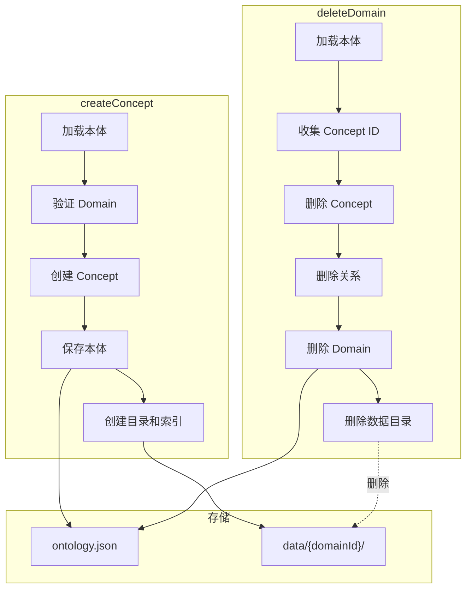

# G36：本体操作层——`ontology-ops.ts` 怎么管理 Domain、Concept、Relation 的结构

> 本课核心问题：`ontology-ops.ts` 是怎么管理 Domain、Concept、Relation 的 CRUD 的？级联删除是怎么工作的？

## 1. 开篇场景：小王要添加一个新的商品类别

小王的本体已经有：
- Domain："餐饮零售，社区咖啡馆"
- Concept："商品"、"供应商"、"订单"

现在小王要添加一个新的 Concept："客户"。

系统需要：
1. 在 `ontology.json` 中添加 Concept 定义。
2. 创建对应的数据目录。
3. 初始化索引文件。

## 2. 两种操作策略

### 2.1 直接修改 JSON

```ts
const ontology = JSON.parse(await fs.readFile('ontology.json', 'utf-8'));
ontology.concepts.push(newConcept);
await fs.writeFile('ontology.json', JSON.stringify(ontology));
```

优点：简单直接。
缺点：没有验证，没有级联处理。

### 2.2 封装操作

```ts
const concept = await createConcept(ontologyId, domainId, name, type);
```

OriginOS 选择了**封装操作**。

## 3. 源码精读：`createConcept`

打开 [packages/core/src/lib/features/ontology-data-store/ontology-ops.ts](../../../../packages/core/src/lib/features/ontology-data-store/ontology-ops.ts)。

### 3.1 入口方法

```ts
export async function createConcept(
  ontologyId: string,
  domainId: string,
  name: string,
  type: string,
  description?: string,
  attributes?: Record<string, { type: string; required?: boolean }>,
): Promise<OntologyConcept> {
  // 1. 加载本体
  const ontology = await loadOntology(ontologyId);

  // 2. 验证 Domain 存在
  const domain = ontology.domains.find((d) => d.id === domainId);
  if (!domain) {
    throw new Error(`Domain "${domainId}" 不存在`);
  }

  // 3. 创建 Concept
  const conceptId = `concept-${Date.now()}`;
  const newConcept: OntologyConcept = {
    id: conceptId,
    domainId,
    name,
    type,
    description: description || '',
  };
  if (attributes && Object.keys(attributes).length > 0) {
    newConcept.attributes = attributes;
  }

  // 4. 添加到本体
  ontology.concepts.push(newConcept);
  ontology.updatedAt = new Date().toISOString();
  await saveOntology(ontologyId, ontology);

  // 5. 创建数据目录和索引
  const conceptDataDir = `${getOntologyDir(ontologyId)}/data/${domainId}/${conceptId}`;
  await ensureDir(conceptDataDir);
  await fs.writeFile(
    `${conceptDataDir}/_index.json`,
    JSON.stringify({ instanceIds: [] }),
    'utf-8',
  );

  return newConcept;
}
```

对应源码位置：[packages/core/src/lib/features/ontology-data-store/ontology-ops.ts 第 167—208 行](../../../../packages/core/src/lib/features/ontology-data-store/ontology-ops.ts#L167-L208)。

### 3.2 流程分析

```
createConcept
  ├─ 1. 加载本体
  ├─ 2. 验证 Domain
  ├─ 3. 创建 Concept
  ├─ 4. 保存本体
  ├─ 5. 创建数据目录
  ├─ 6. 初始化索引
  └─ 返回 OntologyConcept
```

## 4. 源码精读：`deleteDomain`

### 4.1 入口方法

```ts
export async function deleteDomain(
  ontologyId: string,
  domainId: string,
): Promise<void> {
  const ontology = await loadOntology(ontologyId);
  const domain = ontology.domains.find((d) => d.id === domainId);
  if (!domain) {
    throw new Error(`Domain "${domainId}" 不存在`);
  }

  // 1. 收集该 Domain 下的所有 Concept ID
  const conceptIds = ontology.concepts
    .filter((c) => c.domainId === domainId)
    .map((c) => c.id);

  // 2. 删除这些 Concept
  ontology.concepts = ontology.concepts.filter((c) => c.domainId !== domainId);

  // 3. 删除涉及这些 Concept 的关系
  ontology.relations = ontology.relations.filter(
    (r) => !conceptIds.includes(r.sourceId) && !conceptIds.includes(r.targetId)
  );

  // 4. 删除 Domain
  ontology.domains = ontology.domains.filter((d) => d.id !== domainId);

  ontology.updatedAt = new Date().toISOString();
  await saveOntology(ontologyId, ontology);

  // 5. 删除数据目录
  const dir = `${getOntologyDir(ontologyId)}/data/${domainId}`;
  if (existsSync(dir)) {
    await fs.rm(dir, { recursive: true });
  }
}
```

对应源码位置：[packages/core/src/lib/features/ontology-data-store/ontology-ops.ts 第 134—161 行](../../../../packages/core/src/lib/features/ontology-data-store/ontology-ops.ts#L134-L161)。

### 4.2 流程分析

```
deleteDomain
  ├─ 1. 加载本体
  ├─ 2. 收集 Concept ID
  ├─ 3. 删除 Concept（级联）
  ├─ 4. 删除关系（级联）
  ├─ 5. 删除 Domain
  ├─ 6. 保存本体
  └─ 7. 删除数据目录
```

## 5. 图解：本体操作



## 6. 级联删除

### 6.1 deleteDomain 的级联

```
deleteDomain
  ├─ 删除 Domain
  ├─ 级联删除该 Domain 下的所有 Concept
  ├─ 级联删除涉及这些 Concept 的关系
  └─ 删除数据目录
```

### 6.2 deleteConcept 的级联

```ts
export async function deleteConcept(
  ontologyId: string,
  conceptId: string,
): Promise<void> {
  const ontology = await loadOntology(ontologyId);
  const concept = ontology.concepts.find((c) => c.id === conceptId);
  if (!concept) {
    throw new Error(`Concept "${conceptId}" 不存在`);
  }

  // 删除 Concept
  ontology.concepts = ontology.concepts.filter((c) => c.id !== conceptId);

  // 删除涉及该 Concept 的关系
  ontology.relations = ontology.relations.filter(
    (r) => r.sourceId !== conceptId && r.targetId !== conceptId
  );

  ontology.updatedAt = new Date().toISOString();
  await saveOntology(ontologyId, ontology);

  // 删除数据目录
  const dir = `${getOntologyDir(ontologyId)}/data/${concept.domainId}/${conceptId}`;
  if (existsSync(dir)) {
    await fs.rm(dir, { recursive: true });
  }
}
```

对应源码位置：[packages/core/src/lib/features/ontology-data-store/ontology-ops.ts 第 210—234 行](../../../../packages/core/src/lib/features/ontology-data-store/ontology-ops.ts#L210-L234)。

## 7. 测试证据与缺口

### 已覆盖

- `ontology-ops.ts` 的测试在 `ontology-data-store.test.ts` 中没有直接覆盖。

### 缺口

- `createDomain` 没有直接测试。
- `deleteDomain` 的级联删除没有测试。
- `createConcept` 没有直接测试。
- `deleteConcept` 的级联删除没有测试。
- `searchOntology` 没有测试。

## 8. 小实验：验证本体操作

### 步骤一：创建 Domain

```ts
import { createDomain } from '@originos/core/lib/features/ontology-data-store';

const domain = await createDomain(
  'ontology-project-cafe-001',
  '餐饮零售',
  '咖啡馆业务',
);

console.log(domain.id);   // "domain-1717603200000"
console.log(domain.name); // "餐饮零售"
```

### 步骤二：创建 Concept

```ts
import { createConcept } from '@originos/core/lib/features/ontology-data-store';

const concept = await createConcept(
  'ontology-project-cafe-001',
  'domain-1717603200000',
  '客户',
  'customer',
  '咖啡馆客户',
);

console.log(concept.id);   // "concept-1717603200000"
console.log(concept.name); // "客户"
```

### 步骤三：删除 Domain（级联）

```ts
import { deleteDomain } from '@originos/core/lib/features/ontology-data-store';

await deleteDomain(
  'ontology-project-cafe-001',
  'domain-1717603200000',
);

// Domain 及其下的 Concept、关系、数据目录都被删除
```

### 实验结论

本体操作层提供了完整的 CRUD，有级联删除保证数据一致性。

## 9. 口头验收

读完本课后，应能不看书稿回答：

1. `createConcept` 做了哪些操作？
2. `deleteDomain` 的级联删除是怎么工作的？
3. 删除 Domain 时会删除哪些数据？
4. `ontology-ops.ts` 和 `store.ts` 有什么区别？
5. 本体操作层的测试覆盖情况如何？

## 10. 章节收束

本课的核心认知是 **`ontology-ops.ts` 提供了 Domain、Concept、Relation 的结构化操作，有级联删除保证数据一致性**。

我们看到的几个关键设计：

- **完整 CRUD**：Domain、Concept、Relation 都有创建、删除、查询。
- **级联删除**：删除 Domain 时级联删除 Concept 和 Relation。
- **数据目录**：创建 Concept 时自动创建数据目录和索引。
- **路径安全**：所有操作前验证 ID。
- **无测试**：没有直接测试覆盖。

下一课（G37）我们会深入 `export.ts`，看看导出功能是怎么实现的。
