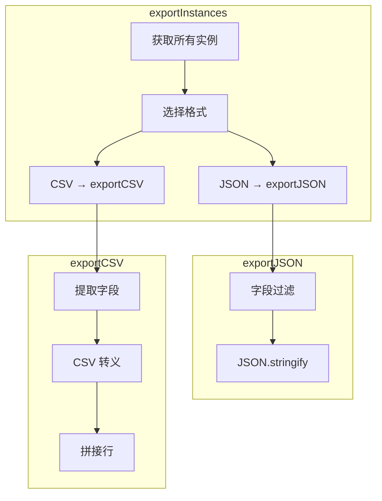

# G37：导出功能——`exportInstances` 是怎么支持 JSON 和 CSV 导出的

> 本课核心问题：`exportInstances` 是怎么支持 JSON 和 CSV 导出的？字段过滤是怎么工作的？CSV 转义是怎么处理的？

## 1. 开篇场景：小王要导出商品清单

小王要把所有商品数据导出，发给会计师做账。他可以选择：
- **JSON 格式**：供程序处理。
- **CSV 格式**：供 Excel 打开。

## 2. 两种导出策略

### 2.1 客户端导出

```ts
// 在前端生成 CSV
const csv = convertToCSV(data);
const blob = new Blob([csv], { type: 'text/csv' });
```

优点：不需要后端参与。
缺点：数据量大时性能差。

### 2.2 服务端导出

```ts
const csv = await exportInstances({ ontologyId, conceptId, format: 'csv' });
```

OriginOS 选择了**服务端导出**。

## 3. 源码精读：`exportInstances`

打开 [packages/core/src/lib/features/ontology-data-store/export.ts](../../../../packages/core/src/lib/features/ontology-data-store/export.ts)。

### 3.1 入口方法

```ts
export async function exportInstances(options: ExportOptions): Promise<string> {
  // 1. 获取所有实例
  const allInstances = await getInstancesForConcept(options);

  // 2. 根据格式导出
  if (options.format === 'json') {
    return exportJSON(allInstances, options.fields);
  }
  return exportCSV(allInstances, options.fields);
}
```

对应源码位置：[packages/core/src/lib/features/ontology-data-store/export.ts 第 1—15 行](../../../../packages/core/src/lib/features/ontology-data-store/export.ts#L1-L15)。

### 3.2 流程分析

```
exportInstances
  ├─ 1. 获取所有实例（queryInstances）
  ├─ 2. 根据格式分发
  │    ├─ json → exportJSON
  │    └─ csv → exportCSV
  └─ 返回字符串
```

## 4. 源码精读：`exportJSON`

```ts
function exportJSON(
  instances: Array<{ id: string; fields: Record<string, unknown> }>,
  fields?: string[],
): string {
  const data = instances.map((inst) => {
    if (!fields) return { id: inst.id, ...inst.fields };
    const row: Record<string, unknown> = { id: inst.id };
    for (const f of fields) {
      row[f] = inst.fields[f];
    }
    return row;
  });
  return JSON.stringify(data, null, 2);
}
```

对应源码位置：[packages/core/src/lib/features/ontology-data-store/export.ts 第 17—30 行](../../../../packages/core/src/lib/features/ontology-data-store/export.ts#L17-L30)。

### 4.1 字段过滤

```ts
if (!fields) return { id: inst.id, ...inst.fields };
```

- 如果不指定 `fields`，导出所有字段。
- 如果指定 `fields`，只导出指定字段。

## 5. 源码精读：`exportCSV`

```ts
function exportCSV(
  instances: Array<{ id: string; fields: Record<string, unknown> }>,
  fields?: string[],
): string {
  const allFields = fields ?? extractAllFields(instances);
  const header = ['id', ...allFields].join(',');
  const rows = instances.map((inst) => {
    return ['id', ...allFields].map((f) => {
      const value = f === 'id' ? inst.id : inst.fields[f];
      return csvEscape(value);
    }).join(',');
  });
  return [header, ...rows].join('\n');
}
```

对应源码位置：[packages/core/src/lib/features/ontology-data-store/export.ts 第 32—45 行](../../../../packages/core/src/lib/features/ontology-data-store/export.ts#L32-L45)。

### 5.1 CSV 转义

```ts
function csvEscape(value: unknown): string {
  if (value === null || value === undefined) return '';
  const str = typeof value === 'object' ? JSON.stringify(value) : String(value);
  if (str.includes(',') || str.includes('"') || str.includes('\n')) {
    return `"${str.replace(/"/g, '""')}"`;
  }
  return str;
}
```

对应源码位置：[packages/core/src/lib/features/ontology-data-store/export.ts 第 47—55 行](../../../../packages/core/src/lib/features/ontology-data-store/export.ts#L47-L55)。

### 5.2 转义规则

| 情况 | 处理 |
| --- | --- |
| 包含逗号 | 用引号包裹 |
| 包含引号 | 转义为 `""` |
| 包含换行 | 用引号包裹 |
| null/undefined | 返回空字符串 |
| 对象 | JSON.stringify |

## 6. 图解：导出流程



## 7. 测试证据与缺口

### 已覆盖

- `exportInstances` 没有直接测试。

### 缺口

- JSON 导出没有测试。
- CSV 导出没有测试。
- CSV 转义没有测试。
- 字段过滤没有测试。

## 8. 小实验：验证导出

### 步骤一：JSON 导出

```ts
import { exportInstances } from '@originos/core/lib/features/ontology-data-store';

const json = await exportInstances({
  ontologyId: 'ontology-project-cafe-001',
  conceptId: 'product',
  format: 'json',
});

console.log(json);
// [
//   { "id": "inst-001", "name": "埃塞俄比亚耶加雪菲咖啡豆", "price": 128 },
//   { "id": "inst-002", "name": "哥伦比亚慧兰咖啡豆", "price": 98 }
// ]
```

### 步骤二：CSV 导出

```ts
const csv = await exportInstances({
  ontologyId: 'ontology-project-cafe-001',
  conceptId: 'product',
  format: 'csv',
  fields: ['name', 'price'],
});

console.log(csv);
// id,name,price
// inst-001,埃塞俄比亚耶加雪菲咖啡豆,128
// inst-002,哥伦比亚慧兰咖啡豆,98
```

### 步骤三：字段过滤

```ts
const csvFiltered = await exportInstances({
  ontologyId: 'ontology-project-cafe-001',
  conceptId: 'product',
  format: 'csv',
  fields: ['name'],  // 只导出 name
});

console.log(csvFiltered);
// id,name
// inst-001,埃塞俄比亚耶加雪菲咖啡豆
// inst-002,哥伦比亚慧兰咖啡豆
```

### 实验结论

导出功能支持 JSON 和 CSV，有字段过滤和 CSV 转义。

## 9. 口头验收

读完本课后，应能不看书稿回答：

1. `exportInstances` 支持哪些格式？
2. `exportJSON` 是怎么工作的？
3. `exportCSV` 是怎么工作的？
4. CSV 转义是怎么处理的？
5. 字段过滤是怎么工作的？

## 10. 章节收束

本课的核心认知是 **`exportInstances` 通过 `exportJSON` 和 `exportCSV` 支持两种格式导出，有字段过滤和 CSV 转义**。

我们看到的几个关键设计：

- **双格式支持**：JSON 和 CSV。
- **字段过滤**：可以指定导出哪些字段。
- **CSV 转义**：处理逗号、引号、换行。
- **服务端导出**：数据量大时性能更好。
- **无测试**：没有直接测试覆盖。

下一课（G38）是单元小结课，我们会画出"实例创建 → Schema 验证 → 索引更新 → 查询 → 版本管理"的完整调用链。
