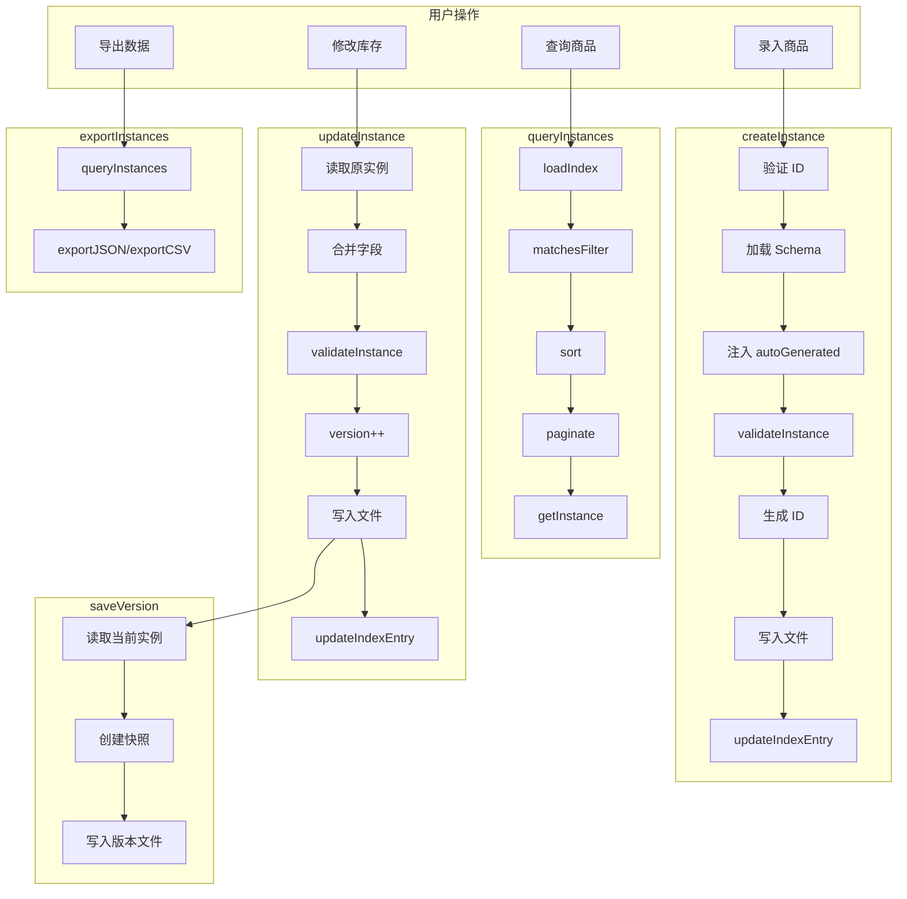

# G38：单元小结课——画出"实例创建 → Schema 验证 → 索引更新 → 查询 → 版本管理"的完整调用链

> 本课核心问题：从 G27 到 G37，我们已经把本体数据存储拆成了十一节课。现在请你脱离源码，把"实例创建 → Schema 验证 → 索引更新 → 查询 → 版本管理"的完整旅程画出来，并标出每个关键节点的责任方、数据格式、失败路径和测试缺口。

## 1. 开篇场景：十一节课之后，小王的数据终于能用了

让我们回到小王的视角：

1. 小王录入了一个商品："埃塞俄比亚耶加雪菲咖啡豆"。
2. 系统验证 Schema（名称是字符串、单价是数字、必填项完整）。
3. 系统生成实例 ID，写入 JSON 文件。
4. 系统更新索引（内存缓存 + 磁盘持久化）。
5. 小王查询所有"咖啡豆"类别的商品。
6. 系统从索引过滤、排序、分页，返回结果。
7. 小王修改库存（50 → 45），系统保存版本快照。
8. 小王导出所有商品为 CSV。

这个看似简单的流程，背后涉及多个文件、多个服务、多种数据格式。

本单元小结课的任务，就是**把这条线从头到尾画清楚**。

## 2. 概念阶梯回顾

### 2.1 从直觉到术语

| 直觉说法 | 专业术语 | 对应源码 |
| --- | --- | --- |
| "小王录入了一个商品" | `createInstance` | `store.ts` |
| "系统验证了数据" | `validateInstance` | `schema-validator.ts` |
| "系统生成了唯一 ID" | `generateId` | `store.ts` |
| "系统更新了索引" | `updateIndexEntry` | `index-manager.ts` |
| "小王查询了商品" | `queryInstances` | `query-engine.ts` |
| "系统按价格排序" | `entries.sort` | `query-engine.ts` |
| "小王修改了库存" | `updateInstance` | `store.ts` |
| "系统保存了版本" | `saveVersion` | `version.ts` |
| "小王导出了 CSV" | `exportInstances` | `export.ts` |

### 2.2 关键边界

本单元反复强调的边界：

- **`store.ts` 负责实例 CRUD。**
- **`schema-validator.ts` 负责数据验证。**
- **`index-manager.ts` 负责索引管理。**
- **`query-engine.ts` 负责查询。**
- **`version.ts` 负责版本管理。**
- **`export.ts` 负责导出。**
- **所有操作前都验证 ID，防止路径遍历。**

## 3. 完整调用链图解



## 4. 节点责任表

| 步骤 | 负责人 | 输入 | 输出 | 关键设计决策 |
| --- | --- | --- | --- | --- |
| 创建实例 | `createInstance` | `fields`, `conceptSchema` | `InstanceData` | 七步流程，Schema 验证 |
| 验证数据 | `validateInstance` | `fields`, `ConceptSchema` | void / Error | 严格模式，拒绝未知字段 |
| 生成 ID | `generateId` | 无 | `inst-{timestamp}-{random}` | 时间戳 + 随机数 |
| 写入文件 | `fs.writeFile` | `InstanceData` | JSON 文件 | 每个实例一个文件 |
| 更新索引 | `updateIndexEntry` | `instanceId`, `fields` | `_index.json` | 内存缓存 + 磁盘持久化 |
| 查询实例 | `queryInstances` | `QueryParams` | `QueryResult` | 基于索引，精确匹配 |
| 排序 | `entries.sort` | `sortBy`, `sortOrder` | 排序后的数组 | 单字段排序 |
| 分页 | `entries.slice` | `page`, `limit` | 分页后的数组 | 基于页码和每页数量 |
| 更新实例 | `updateInstance` | `fields` | `InstanceData` | 增量合并，version++ |
| 保存版本 | `saveVersion` | `instanceId` | `VersionSnapshot` | 完整快照 |
| 导出数据 | `exportInstances` | `format`, `fields` | 字符串 | JSON / CSV |

## 5. 数据格式转换链

```
用户输入
  ↓
{ name: '埃塞俄比亚耶加雪菲咖啡豆', price: 128, stock: 50 }
  ↓
validateInstance(fields, schema)
  ↓
InstanceData {
  id: 'inst-1717603200000-abc123',
  conceptId: 'product',
  domainId: 'retail',
  ontologyId: 'ontology-project-cafe-001',
  fields: { name: '...', price: 128, stock: 50 },
  meta: { createdAt: 1717603200000, updatedAt: 1717603200000, createdBy: 'user', version: 1 }
}
  ↓
JSON 文件（inst-1717603200000-abc123.json）
  ↓
IndexEntry { name: '...', price: 128, createdAt: 1717603200000 }
  ↓
_index.json
```

## 6. 失败路径复盘

### 6.1 创建阶段

| 失败场景 | 处理方式 | 风险 |
| --- | --- | --- |
| ID 包含路径遍历字符 | 抛出错误 | 安全 |
| Schema 验证失败 | 抛出错误 | 数据质量 |
| 文件写入失败 | 抛出错误 | 数据丢失 |
| 索引更新失败 | 抛出错误 | 查询不一致 |

### 6.2 查询阶段

| 失败场景 | 处理方式 | 风险 |
| --- | --- | --- |
| 索引不存在 | 返回空数组 | 正常 |
| 实例文件不存在 | 跳过（filter） | 数据不一致 |
| 排序字段不存在 | 按 undefined 排序 | 结果不可预期 |

### 6.3 更新阶段

| 失败场景 | 处理方式 | 风险 |
| --- | --- | --- |
| 实例不存在 | 抛出错误 | 正常 |
| Schema 验证失败 | 抛出错误 | 数据质量 |
| 版本冲突 | 无处理 | 数据覆盖 |

### 6.4 版本管理

| 失败场景 | 处理方式 | 风险 |
| --- | --- | --- |
| 版本文件不存在 | 抛出错误 | 正常 |
| 回滚后版本号递增 | 自动处理 | 版本号跳跃 |

## 7. 测试覆盖复盘

| 能力 | 测试位置 | 覆盖状态 |
| --- | --- | --- |
| `createInstance` | `ontology-data-store.test.ts` | 已覆盖 |
| `getInstance` | `ontology-data-store.test.ts` | 已覆盖 |
| `updateInstance` | `ontology-data-store.test.ts` | 已覆盖 |
| `deleteInstance` | `ontology-data-store.test.ts` | 已覆盖 |
| `validateInstance` | `ontology-data-store.test.ts` | 已覆盖 |
| `queryInstances` | `ontology-data-store.test.ts` | 已覆盖 |
| `loadIndex` | `ontology-data-store.test.ts` | 已覆盖 |
| `saveVersion` | `ontology-data-store.test.ts` | 已覆盖 |
| `getVersions` | `ontology-data-store.test.ts` | 已覆盖 |
| `revertToVersion` | `ontology-data-store.test.ts` | 已覆盖 |
| `exportInstances` | 无 | 未覆盖 |
| `createInstanceRelation` | 无 | 未覆盖 |
| `deleteInstanceRelation` | 无 | 未覆盖 |
| `ontology-ops.ts` | 无 | 未覆盖 |

## 8. 工作坊练习

### 练习一：画出调用链

请拿一张纸或打开一个白板工具，不看书稿，画出以下调用链：

1. 小王录入商品。
2. 系统验证 Schema。
3. 系统生成 ID，写入文件。
4. 系统更新索引。
5. 小王查询商品。
6. 系统过滤、排序、分页。
7. 小王修改库存。
8. 系统保存版本快照。

要求：
- 每个箭头标注调用的函数/方法名。
- 每个节点标注输入和输出的数据格式。
- 在每个节点旁边写出一个可能的失败场景。

### 练习二：找出设计问题

请列出至少三个设计问题：

| 问题 | 影响 | 改进建议 |
| --- | --- | --- |
| 无事务回滚 | 部分失败时数据不一致 | 增加事务机制 |
| 单字段排序 | 无法按多字段排序 | 支持多字段排序 |
| 精确匹配过滤 | 不支持模糊查询 | 支持正则或模糊匹配 |
| 无缓存过期 | 内存缓存无限增长 | 增加 LRU 缓存策略 |
| 版本无限制 | 版本文件无限增长 | 限制版本数量 |

### 练习三：补测试计划

假设你只能补三个测试，你会优先补哪三个？请说明理由。

参考答案（不唯一）：

1. **`exportInstances` 测试**
   - 理由：导出功能是核心功能，没有测试意味着无法验证导出结果。

2. **`ontology-ops.ts` 级联删除测试**
   - 理由：级联删除涉及数据一致性，需要验证。

3. **并发更新冲突测试**
   - 理由：并发更新可能导致数据覆盖，需要验证。

## 9. 口头验收

完成本单元后，应能不看书稿回答：

1. 从"实例创建"到"查询"，中间经历了哪几个主要阶段？
2. `createInstance` 做了哪些步骤？
3. `validateInstance` 验证哪些内容？
4. `queryInstances` 是怎么支持过滤、排序、分页的？
5. `saveVersion` 和 `revertToVersion` 是怎么工作的？

## 10. 章节收束

本单元（G27—G38）围绕"实例创建 → Schema 验证 → 索引更新 → 查询 → 版本管理"这一流程，拆解了 OriginOS 的本体数据存储系统。

我们学到的核心认知：

- **严格类型**：`InstanceData`、`ConceptSchema` 等都有明确的类型定义。
- **Schema 验证**：创建和更新时自动验证，保证数据质量。
- **文件存储**：每个实例一个 JSON 文件，便于管理和迁移。
- **内存缓存**：`index-manager.ts` 通过内存缓存加速查询。
- **版本管理**：`saveVersion` 保存快照，`revertToVersion` 支持回滚。
- **导出功能**：支持 JSON 和 CSV 格式导出。
- **路径安全**：所有操作前验证 ID，防止路径遍历。
- **测试覆盖较好**：CRUD、查询、版本管理都有测试覆盖。

下一单元（G39—G46）我们将进入**文档、API 客户端、沙箱**，看看 Agent 是怎么操作文档和调用外部 API 的。

---

**本单元到此结束。**
