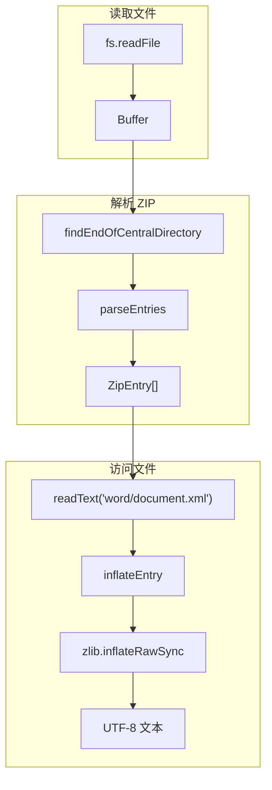

# G40：Office ZIP 解析器——`OfficeZip` 是怎么解析 docx/xlsx 文件的

> 本课核心问题：`OfficeZip` 是怎么解析 ZIP 文件的？ZIP 结构是怎么被读取的？压缩数据是怎么被解压的？

## 1. 开篇场景：小王的菜单文档是一个 ZIP 包

小王的 `menu.docx` 实际上是一个 ZIP 包，里面包含：

```
[Content_Types].xml
word/
  ├── document.xml      ← 正文内容
  ├── styles.xml
  └── ...
_rels/
  └── .rels
```

系统需要解析这个 ZIP 包，提取 `word/document.xml`。

## 2. 两种解析策略

### 2.1 使用外部库

```ts
import JSZip from 'jszip';
const zip = await JSZip.loadAsync(buffer);
const xml = await zip.file('word/document.xml')!.async('text');
```

优点：简单，功能完整。
缺点：增加依赖，体积大。

### 2.2 自定义解析

```ts
const zip = await OfficeZip.fromFile(filePath);
const xml = zip.readText('word/document.xml');
```

OriginOS 选择了**自定义解析**。

## 3. 源码精读：`OfficeZip`

打开 [packages/core/src/lib/features/document/office-zip.ts](../../../../packages/core/src/lib/features/document/office-zip.ts)。

### 3.1 ZIP 文件结构

```
[Local File Header 1]
[File Data 1]
[Local File Header 2]
[File Data 2]
...
[Central Directory]
[End of Central Directory]
```

### 3.2 查找中央目录

```ts
const EOCD_SIGNATURE = 0x06054b50;

function findEndOfCentralDirectory(buffer: Buffer): number {
  const minOffset = Math.max(0, buffer.length - 0xffff - 22);
  for (let offset = buffer.length - 22; offset >= minOffset; offset -= 1) {
    if (buffer.readUInt32LE(offset) === EOCD_SIGNATURE) {
      return offset;
    }
  }
  throw new Error('Invalid Office file: ZIP central directory not found');
}
```

对应源码位置：[packages/core/src/lib/features/document/office-zip.ts 第 16—24 行](../../../../packages/core/src/lib/features/document/office-zip.ts#L16-L24)。

### 3.3 解析中央目录

```ts
function parseEntries(buffer: Buffer): ZipEntry[] {
  const eocdOffset = findEndOfCentralDirectory(buffer);
  const entryCount = buffer.readUInt16LE(eocdOffset + 10);
  const centralDirectoryOffset = buffer.readUInt32LE(eocdOffset + 16);
  const entries: ZipEntry[] = [];

  let offset = centralDirectoryOffset;
  for (let i = 0; i < entryCount; i += 1) {
    if (buffer.readUInt32LE(offset) !== CENTRAL_DIRECTORY_SIGNATURE) {
      throw new Error('Invalid Office file: corrupt ZIP central directory');
    }

    const compressionMethod = buffer.readUInt16LE(offset + 10);
    const compressedSize = buffer.readUInt32LE(offset + 20);
    const uncompressedSize = buffer.readUInt32LE(offset + 24);
    const fileNameLength = buffer.readUInt16LE(offset + 28);
    const localHeaderOffset = buffer.readUInt32LE(offset + 42);
    const name = buffer.toString('utf8', offset + 46, offset + 46 + fileNameLength);

    entries.push({ name, compressionMethod, compressedSize, uncompressedSize, localHeaderOffset });
    offset += 46 + fileNameLength + extraLength + commentLength;
  }

  return entries;
}
```

对应源码位置：[packages/core/src/lib/features/document/office-zip.ts 第 26—59 行](../../../../packages/core/src/lib/features/document/office-zip.ts#L26-L59)。

### 3.4 解压数据

```ts
function inflateEntry(buffer: Buffer, entry: ZipEntry): Buffer {
  const localOffset = entry.localHeaderOffset;
  const fileNameLength = buffer.readUInt16LE(localOffset + 26);
  const extraLength = buffer.readUInt16LE(localOffset + 28);
  const dataOffset = localOffset + 30 + fileNameLength + extraLength;
  const compressed = buffer.subarray(dataOffset, dataOffset + entry.compressedSize);

  if (entry.compressionMethod === 0) {
    return compressed;  // 无压缩
  }
  if (entry.compressionMethod === 8) {
    return zlib.inflateRawSync(compressed, { finishFlush: zlib.constants.Z_SYNC_FLUSH });
  }
  throw new Error(`Unsupported ZIP compression method ${entry.compressionMethod}`);
}
```

对应源码位置：[packages/core/src/lib/features/document/office-zip.ts 第 61—79 行](../../../../packages/core/src/lib/features/document/office-zip.ts#L61-L79)。

### 3.5 OfficeZip 类

```ts
export class OfficeZip {
  private readonly buffer: Buffer;
  private readonly entries: ZipEntry[];

  private constructor(buffer: Buffer) {
    this.buffer = buffer;
    this.entries = parseEntries(buffer);
  }

  static async fromFile(filePath: string): Promise<OfficeZip> {
    return new OfficeZip(await fs.readFile(filePath));
  }

  listFiles(): string[] {
    return this.entries.map((entry) => entry.name);
  }

  readText(entryName: string): string | null {
    const entry = this.entries.find((candidate) => candidate.name === entryName);
    if (!entry) return null;
    const inflated = inflateEntry(this.buffer, entry);
    return inflated.toString('utf8');
  }
}
```

对应源码位置：[packages/core/src/lib/features/document/office-zip.ts 第 81—107 行](../../../../packages/core/src/lib/features/document/office-zip.ts#L81-L107)。

## 4. 图解：ZIP 解析流程



## 5. 设计亮点

### 5.1 零依赖

```ts
import { promises as fs } from 'fs';
import zlib from 'zlib';
```

只使用 Node.js 内置模块，没有外部依赖。

### 5.2 懒加载

```ts
readText(entryName: string): string | null {
  const entry = this.entries.find(...);
  if (!entry) return null;
  const inflated = inflateEntry(this.buffer, entry);
  return inflated.toString('utf8');
}
```

只在需要时解压，避免一次性解压所有文件。

### 5.3 容错处理

```ts
if (entry.uncompressedSize > 0 && inflated.length !== entry.uncompressedSize) {
  // Some Office producers write inconsistent size fields; prefer content over failing hard.
}
```

容忍不一致的 size 字段，优先返回内容。

## 6. 测试证据与缺口

### 已覆盖

- `OfficeZip` 没有直接测试。

### 缺口

- ZIP 解析没有测试。
- 压缩方法不支持时的处理没有测试。
- 损坏的 ZIP 文件处理没有测试。

## 7. 小实验：验证 ZIP 解析

```ts
import { OfficeZip } from '@originos/core/lib/features/document';

const zip = await OfficeZip.fromFile('menu.docx');

// 列出所有文件
console.log(zip.listFiles());
// ['[Content_Types].xml', 'word/document.xml', ...]

// 读取正文
const xml = zip.readText('word/document.xml');
console.log(xml?.substring(0, 100));
```

## 8. 口头验收

读完本课后，应能不看书稿回答：

1. `OfficeZip` 是怎么解析 ZIP 文件的？
2. `findEndOfCentralDirectory` 是怎么工作的？
3. `inflateEntry` 支持哪些压缩方法？
4. `readText` 是怎么读取文件的？
5. 为什么 OriginOS 选择自定义解析而不是使用外部库？

## 9. 章节收束

本课的核心认知是 **`OfficeZip` 通过自定义 ZIP 解析器，零依赖地解析 docx/xlsx 文件，支持懒加载和容错处理**。

我们看到的几个关键设计：

- **零依赖**：只使用 Node.js 内置模块。
- **自定义解析**：手动解析 ZIP 结构。
- **懒加载**：只在需要时解压。
- **容错处理**：容忍不一致的 size 字段。
- **无测试**：没有直接测试覆盖。

下一课（G41）我们会深入 `parsers.ts`，看看文档是怎么被解析成 AST 的。
