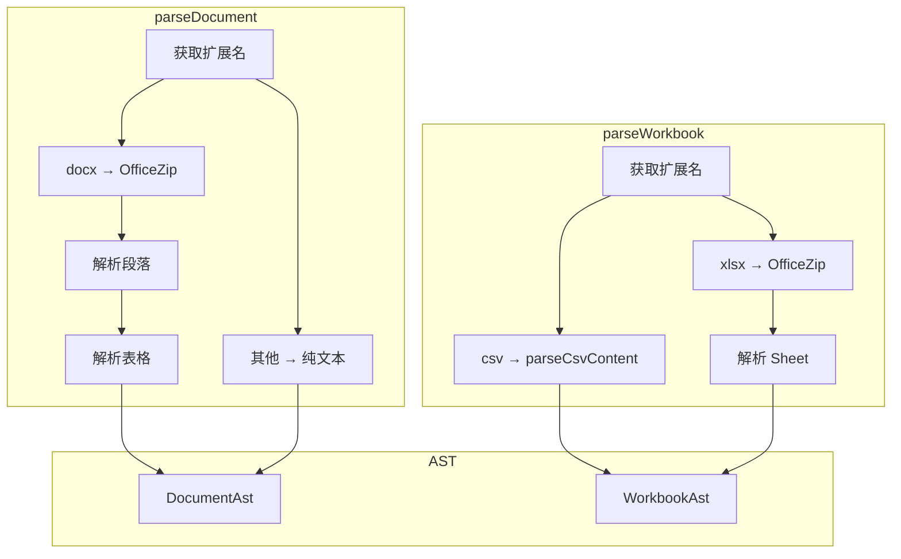

# G41：文档解析引擎——`parseDocument` 和 `parseWorkbook` 是怎么把文件转成 AST 的

> 本课核心问题：`parseDocument` 是怎么把 docx/txt/md 转成 AST 的？`parseWorkbook` 是怎么把 xlsx/csv 转成表格数据的？

## 1. 开篇场景：小王的菜单文档需要被解析

小王上传了 `menu.docx`，系统需要：
1. 解析 ZIP 结构，提取 `word/document.xml`。
2. 解析 XML，提取段落和表格。
3. 转成结构化的 AST。

## 2. 源码精读：`parseDocument`

打开 [packages/core/src/lib/features/document/parsers.ts](../../../../packages/core/src/lib/features/document/parsers.ts)。

### 2.1 入口方法

```ts
export async function parseDocument(filePath: string): Promise<DocumentAst> {
  const extension = getExtension(filePath);

  if (extension === 'docx') {
    const zip = await OfficeZip.fromFile(filePath);
    const documentXml = zip.readText('word/document.xml');
    if (!documentXml) {
      throw new Error('Invalid docx: word/document.xml not found');
    }
    const blocks = parseDocxParagraphs(documentXml);
    const tables = parseDocxTables(documentXml);
    return {
      type: 'docx',
      title: blocks.find((block) => block.type === 'heading')?.text,
      blocks,
      tables,
      metadata: await getMetadata(filePath, 'office-zip-docx'),
    };
  }

  // 其他格式（txt, md, json, xml, html）
  const content = await fs.readFile(filePath, 'utf8');
  const lines = content.split(/\r?\n/);
  const blocks: DocumentBlock[] = lines
    .map((line): DocumentBlock | null => {
      const heading = /^(#{1,6})\s+(.+)$/.exec(line);
      if (heading) {
        return { type: 'heading', level: (heading[1] ?? '#').length, text: (heading[2] ?? '').trim() };
      }
      const text = line.trim();
      return text ? { type: 'paragraph', text } : null;
    })
    .filter((block): block is DocumentBlock => Boolean(block));

  return {
    type: ['md', 'txt', 'json', 'xml', 'html'].includes(extension) ? extension as DocumentAst['type'] : 'txt',
    title: blocks.find((block) => block.type === 'heading')?.text,
    blocks,
    tables: [],
    metadata: await getMetadata(filePath, 'plain-text'),
  };
}
```

对应源码位置：[packages/core/src/lib/features/document/parsers.ts 第 115—155 行](../../../../packages/core/src/lib/features/document/parsers.ts#L115-L155)。

### 2.2 流程分析

```
parseDocument
  ├─ 1. 获取扩展名
  ├─ 2. 如果是 docx
  │    ├─ 解析 ZIP（OfficeZip）
  │    ├─ 提取 XML
  │    ├─ 解析段落（parseDocxParagraphs）
  │    ├─ 解析表格（parseDocxTables）
  │    └─ 返回 DocumentAst
  └─ 3. 如果是其他格式
       ├─ 读取文本
       ├─ 按行分割
       ├─ 解析标题（# heading）
       └─ 返回 DocumentAst
```

### 2.3 解析 docx 段落

```ts
function parseDocxParagraphs(documentXml: string): DocumentBlock[] {
  const blocks: DocumentBlock[] = [];
  const paragraphMatches = documentXml.match(/<w:p[\s\S]*?<\/w:p>/g) ?? [];

  for (const paragraphXml of paragraphMatches) {
    const textParts = [...paragraphXml.matchAll(/<w:t(?:\s[^>]*)?>([\s\S]*?)<\/w:t>/g)]
      .map((match) => decodeXmlText(match[1] ?? ''));
    const text = textParts.join('').trim();
    if (!text) continue;

    const styleMatch = paragraphXml.match(/<w:pStyle[^>]*w:val="([^"]+)"/);
    const style = styleMatch?.[1]?.toLowerCase() ?? '';
    const headingMatch = style.match(/heading(\d+)/);
    if (headingMatch) {
      blocks.push({ type: 'heading', level: Number(headingMatch[1]), text });
    } else {
      blocks.push({ type: 'paragraph', text });
    }
  }

  return blocks;
}
```

对应源码位置：[packages/core/src/lib/features/document/parsers.ts 第 66—87 行](../../../../packages/core/src/lib/features/document/parsers.ts#L66-L87)。

### 2.4 解析 docx 表格

```ts
function parseDocxTables(documentXml: string): DocumentTable[] {
  const tables: DocumentTable[] = [];
  const tableMatches = documentXml.match(/<w:tbl[\s\S]*?<\/w:tbl>/g) ?? [];

  for (let tableIndex = 0; tableIndex < tableMatches.length; tableIndex += 1) {
    const tableXml = tableMatches[tableIndex] ?? '';
    const rows: string[][] = [];
    const rowMatches = tableXml.match(/<w:tr[\s\S]*?<\/w:tr>/g) ?? [];
    for (const rowXml of rowMatches) {
      const cells: string[] = [];
      const cellMatches = rowXml.match(/<w:tc[\s\S]*?<\/w:tc>/g) ?? [];
      for (const cellXml of cellMatches) {
        const text = [...cellXml.matchAll(/<w:t(?:\s[^>]*)?>([\s\S]*?)<\/w:t>/g)]
          .map((match) => decodeXmlText(match[1] ?? ''))
          .join('')
          .trim();
        cells.push(text);
      }
      rows.push(cells);
    }
    tables.push({ index: tableIndex, rows });
  }

  return tables;
}
```

对应源码位置：[packages/core/src/lib/features/document/parsers.ts 第 89—113 行](../../../../packages/core/src/lib/features/document/parsers.ts#L89-L113)。

## 3. 源码精读：`parseWorkbook`

### 3.1 入口方法

```ts
export async function parseWorkbook(filePath: string): Promise<WorkbookAst> {
  const extension = getExtension(filePath);

  if (extension === 'csv') {
    const content = await fs.readFile(filePath, 'utf8');
    const rows = parseCsvContent(content);
    const columnCount = rows.reduce((max, row) => Math.max(max, row.length), 0);
    const sheet: WorkbookSheet = {
      name: path.basename(filePath, path.extname(filePath)),
      rowCount: rows.length,
      columnCount,
      merges: [],
      rows: rows.map((row) => Array.from({ length: columnCount }, (_, index) => row[index] ?? '')),
      cells: [],
    };
    return {
      type: 'csv',
      sheets: [sheet],
      metadata: await getMetadata(filePath, 'csv-native'),
    };
  }

  if (extension !== 'xlsx') {
    throw new Error(`Unsupported workbook extension: .${extension}`);
  }

  const zip = await OfficeZip.fromFile(filePath);
  const workbookXml = zip.readText('xl/workbook.xml');
  const relationshipsXml = zip.readText('xl/_rels/workbook.xml.rels');
  if (!workbookXml || !relationshipsXml) {
    throw new Error('Invalid xlsx: workbook metadata not found');
  }
  const relationships = parseWorkbookRelationships(relationshipsXml);
  const sheetRefs = parseWorkbookSheets(workbookXml, relationships);
  const sharedStrings = parseSharedStrings(zip.readText('xl/sharedStrings.xml'));
  const sheets = sheetRefs.map((sheetRef) => {
    const sheetXml = zip.readText(sheetRef.path);
    if (!sheetXml) {
      return { name: sheetRef.name, rowCount: 0, columnCount: 0, merges: [], rows: [], cells: [] };
    }
    return parseSheetXml(sheetRef.name, sheetXml, sharedStrings);
  });

  return {
    type: 'xlsx',
    sheets,
    metadata: await getMetadata(filePath, 'office-zip-xlsx'),
  };
}
```

对应源码位置：[packages/core/src/lib/features/document/parsers.ts 第 306—354 行](../../../../packages/core/src/lib/features/document/parsers.ts#L306-L354)。

## 4. 图解：解析流程



## 5. 测试证据与缺口

### 已覆盖

- `parseDocument` 和 `parseWorkbook` 没有直接测试。

### 缺口

- docx 解析没有测试。
- xlsx 解析没有测试。
- csv 解析没有测试。
- 损坏文件处理没有测试。

## 6. 小实验：验证解析

```ts
import { parseDocument, parseWorkbook } from '@originos/core/lib/features/document';

// 解析文档
const doc = await parseDocument('menu.docx');
console.log(doc.type);      // 'docx'
console.log(doc.title);     // '社区咖啡馆菜单'
console.log(doc.blocks[0].text);  // '社区咖啡馆菜单'

// 解析表格
const wb = await parseWorkbook('inventory.xlsx');
console.log(wb.type);       // 'xlsx'
console.log(wb.sheets[0].name);  // 'Sheet1'
console.log(wb.sheets[0].rows[0]);  // ['商品', '价格', '库存']
```

## 7. 口头验收

读完本课后，应能不看书稿回答：

1. `parseDocument` 支持哪些格式？
2. docx 的段落是怎么被解析的？
3. docx 的表格是怎么被解析的？
4. `parseWorkbook` 支持哪些格式？
5. xlsx 的 Sheet 是怎么被解析的？

## 8. 章节收束

本课的核心认知是 **`parseDocument` 和 `parseWorkbook` 通过 OfficeZip 解析 docx/xlsx，通过正则解析纯文本，最终生成结构化的 AST**。

我们看到的几个关键设计：

- **格式分发**：根据扩展名选择不同的解析器。
- **ZIP 解析**：docx/xlsx 通过 OfficeZip 解析。
- **正则提取**：通过正则从 XML 中提取内容。
- **CSV 原生**：CSV 直接按行解析。
- **无测试**：没有直接测试覆盖。

下一课（G42）我们会深入 `api-clients`，看看 API 客户端是怎么设计的。
