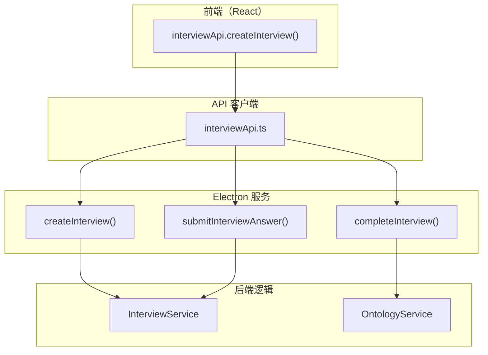

# G42：API 客户端设计——`interviewApi` 是怎么封装 Electron 服务的

> 本课核心问题：`interviewApi` 是怎么封装 Electron 服务的？它提供了哪些方法？和直接调用 Electron API 有什么区别？

## 1. 开篇场景：小王开始访谈

小王点击"开始访谈"按钮，前端需要：
1. 调用后端创建访谈会话。
2. 提交答案。
3. 完成访谈并生成本体。

这些操作都通过 `interviewApi` 封装。

## 2. 两种调用方式

### 2.1 直接调用 Electron API

```ts
// 直接调用 Electron 服务
const result = await window.electron.createInterview(request);
```

优点：简单直接。
缺点：前端代码和 Electron 强耦合，难以测试。

### 2.2 封装 API 客户端

```ts
// 通过封装层调用
const result = await interviewApi.createInterview(request);
```

OriginOS 选择了**封装 API 客户端**。

## 3. 源码精读：`interviewApi`

打开 [packages/core/src/lib/features/api-clients/interviewApi.ts](../../../../packages/core/src/lib/features/api-clients/interviewApi.ts)。

### 3.1 入口对象

```ts
export const interviewApi = {
  async createInterview(request: CreateInterviewRequest): Promise<ApiResponse<{ id: string }>> {
    return createInterview(request) as Promise<ApiResponse<{ id: string }>>;
  },

  async submitAnswer(interviewId: string, questionId: string, answer: unknown): Promise<ApiResponse<unknown>> {
    return submitInterviewAnswer(interviewId, questionId, String(answer)) as Promise<ApiResponse<unknown>>;
  },

  async completeInterview(request: CompleteInterviewRequest): Promise<ApiResponse<unknown>> {
    return completeInterview(request.interviewId) as Promise<ApiResponse<unknown>>;
  },

  async generateOntology(request: GenerateOntologyRequest): Promise<ApiResponse<{
    ontology: OntologyModel;
    generationTime: number;
    source: string;
  }>> {
    return generateOntology(request) as Promise<ApiResponse<...>>;
  },

  async confirmOntology(ontologyId: string, confirmed: boolean): Promise<ApiResponse<unknown>> {
    return confirmOntology(ontologyId, confirmed) as Promise<ApiResponse<unknown>>;
  },

  async getOntology(ontologyId: string): Promise<ApiResponse<{ ontology: OntologyModel }>> {
    return getOntology(ontologyId) as Promise<ApiResponse<{ ontology: OntologyModel }>>;
  },
};
```

对应源码位置：[packages/core/src/lib/features/api-clients/interviewApi.ts 第 12—75 行](../../../../packages/core/src/lib/features/api-clients/interviewApi.ts#L12-L75)。

### 3.2 方法列表

| 方法 | 参数 | 返回值 | 说明 |
| --- | --- | --- | --- |
| `createInterview` | `CreateInterviewRequest` | `ApiResponse<{ id: string }>` | 创建访谈会话 |
| `submitAnswer` | `interviewId, questionId, answer` | `ApiResponse<unknown>` | 提交答案 |
| `completeInterview` | `CompleteInterviewRequest` | `ApiResponse<unknown>` | 完成访谈 |
| `generateOntology` | `GenerateOntologyRequest` | `ApiResponse<{ ontology, generationTime, source }>` | 生成本体 |
| `confirmOntology` | `ontologyId, confirmed` | `ApiResponse<unknown>` | 确认本体 |
| `getOntology` | `ontologyId` | `ApiResponse<{ ontology }>` | 获取本体 |

## 4. 图解：API 客户端架构



## 5. 设计亮点

### 5.1 类型安全

```ts
async createInterview(request: CreateInterviewRequest): Promise<ApiResponse<{ id: string }>>
```

所有方法都有完整的类型定义，保证调用安全。

### 5.2 统一返回格式

```ts
interface ApiResponse<T> {
  success: boolean;
  data?: T;
  error?: string;
}
```

统一的 `ApiResponse` 格式，便于错误处理。

### 5.3 参数转换

```ts
async submitAnswer(interviewId: string, questionId: string, answer: unknown): Promise<ApiResponse<unknown>> {
  return submitInterviewAnswer(interviewId, questionId, String(answer)) as Promise<ApiResponse<unknown>>;
}
```

`answer` 被转换为字符串，保证类型一致性。

## 6. 测试证据与缺口

### 已覆盖

- `interviewApi` 没有直接测试。

### 缺口

- 所有方法都没有测试。
- 错误处理没有测试。
- 类型转换没有测试。

## 7. 小实验：验证 API 客户端

```ts
import { interviewApi } from '@originos/core/lib/features/api-clients';

// 创建访谈
const result = await interviewApi.createInterview({
  projectName: '社区咖啡馆',
  domain: '餐饮零售',
});

console.log(result.success);  // true
console.log(result.data?.id);  // "interview-001"

// 提交答案
await interviewApi.submitAnswer('interview-001', 'q1', '餐饮零售，社区咖啡馆');

// 完成访谈
await interviewApi.completeInterview({ interviewId: 'interview-001' });
```

## 8. 口头验收

读完本课后，应能不看书稿回答：

1. `interviewApi` 提供了哪些方法？
2. 为什么需要封装 API 客户端？
3. `ApiResponse` 的结构是什么？
4. `submitAnswer` 是怎么处理参数的？
5. API 客户端和 Electron 服务的关系是什么？

## 9. 章节收束

本课的核心认知是 **`interviewApi` 通过封装 Electron 服务，提供了类型安全的 API 客户端，统一了返回格式**。

我们看到的几个关键设计：

- **类型安全**：所有方法都有完整的类型定义。
- **统一返回**：`ApiResponse<T>` 统一了成功和失败的返回格式。
- **参数转换**：自动转换参数类型。
- **解耦**：前端不直接依赖 Electron API。
- **无测试**：没有直接测试覆盖。

下一课（G43）我们会深入 `sandbox/app-scanner.ts`，看看沙箱应用是怎么被发现的。
