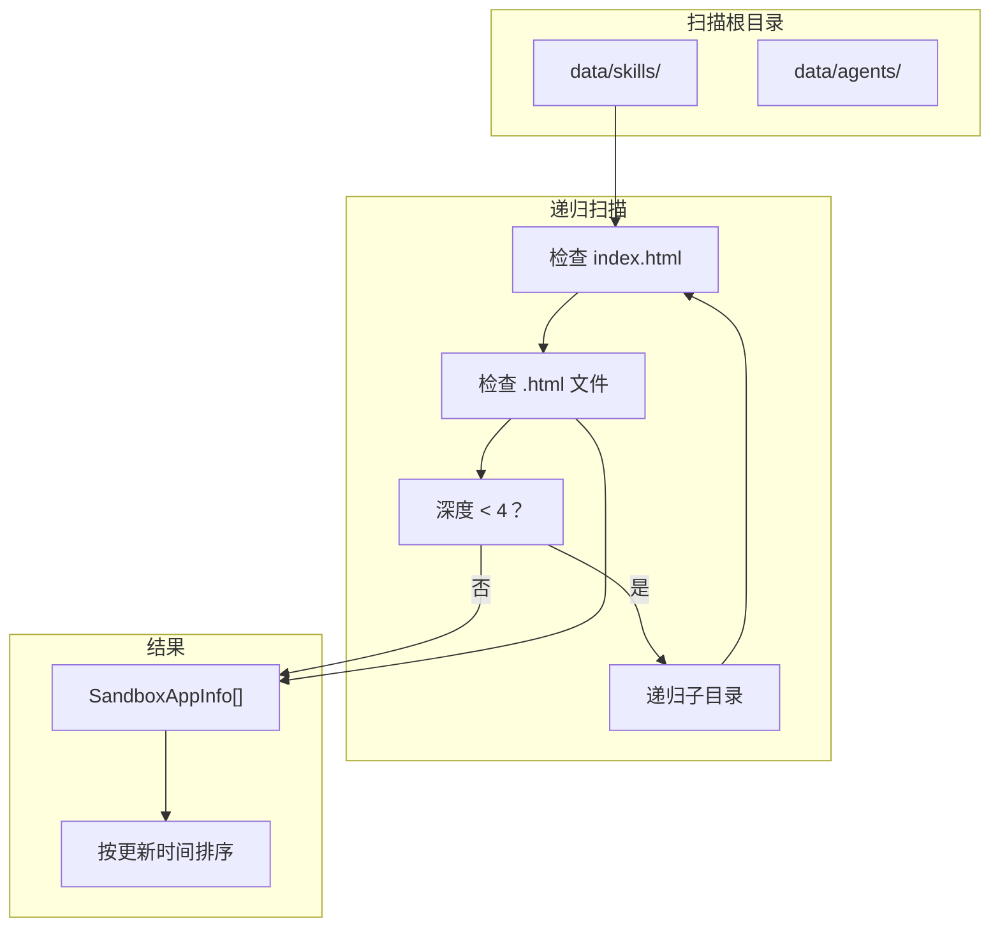

# G43：沙箱应用扫描器——`listSandboxApps` 是怎么发现 /data 下的 HTML 应用的

> 本课核心问题：`listSandboxApps` 是怎么扫描 /data 目录的？它是怎么识别 HTML 应用的？深度限制是怎么工作的？

## 1. 开篇场景：小王安装了一个技能

小王安装了一个"库存管理"技能，技能生成了一个 HTML 应用：

```
data/skills/inventory-skill/
├── index.html
├── style.css
└── app.js
```

系统需要发现这个应用，并展示在界面上。

## 2. 两种扫描策略

### 2.1 固定路径

```ts
const apps = ['data/skills/app1', 'data/skills/app2'];
```

优点：简单。
缺点：不灵活，需要手动维护。

### 2.2 递归扫描

```ts
const apps = listSandboxApps();
```

OriginOS 选择了**递归扫描**。

## 3. 源码精读：`listSandboxApps`

打开 [packages/core/src/lib/features/sandbox/app-scanner.ts](../../../../packages/core/src/lib/features/sandbox/app-scanner.ts)。

### 3.1 入口方法

```ts
export function listSandboxApps(): SandboxAppInfo[] {
  const dataDir = getDataRoot();
  const apps: SandboxAppInfo[] = [];

  const scanRoots = ['skills', 'agents'];

  function scan(dir: string, relPath: string) {
    let entries: string[];
    try {
      entries = readdirSync(dir);
    } catch {
      return;
    }

    // 检查 index.html
    if (entries.includes('index.html')) {
      const stat = statSync(dir);
      const appId = relPath.replace(/^data\//, '');
      apps.push({
        id: appId,
        name: path.basename(dir),
        path: relPath,
        updatedAt: stat.mtimeMs,
      });
    }

    // 检查独立的 HTML 文件
    for (const entry of entries) {
      if (entry.endsWith('.html') && entry !== 'index.html') {
        const htmlPath = path.join(dir, entry);
        const stat = statSync(htmlPath);
        const appId = relPath.replace(/^data\//, '') + '/' + entry;
        apps.push({
          id: appId,
          name: entry.replace(/\.html$/, ''),
          path: relPath + '/' + entry,
          updatedAt: stat.mtimeMs,
        });
      }
    }

    // 递归扫描子目录
    for (const entry of entries) {
      if (entry.startsWith('.') || entry === 'node_modules') continue;
      const entryPath = path.join(dir, entry);
      const entryStat = statSync(entryPath);
      if (entryStat.isDirectory()) {
        const depth = relPath.split('/').length;
        if (depth < 4) {
          scan(entryPath, path.join(relPath, entry));
        }
      }
    }
  }

  for (const root of scanRoots) {
    const rootPath = path.join(dataDir, root);
    if (existsSync(rootPath)) {
      scan(rootPath, path.join('data', root));
    }
  }

  apps.sort((a, b) => b.updatedAt - a.updatedAt);
  return apps;
}
```

对应源码位置：[packages/core/src/lib/features/sandbox/app-scanner.ts 第 16—77 行](../../../../packages/core/src/lib/features/sandbox/app-scanner.ts#L16-L77)。

### 3.2 流程分析

```
listSandboxApps
  ├─ 1. 定义扫描根目录（skills, agents）
  ├─ 2. 递归扫描每个根目录
  │    ├─ 检查 index.html
  │    ├─ 检查独立的 HTML 文件
  │    └─ 递归扫描子目录（深度 < 4）
  ├─ 3. 按更新时间排序
  └─ 返回 SandboxAppInfo[]
```

## 4. 扫描规则

### 4.1 扫描根目录

```ts
const scanRoots = ['skills', 'agents'];
```

只扫描 `data/skills/` 和 `data/agents/` 两个目录。

### 4.2 识别 HTML 应用

```ts
// 方式一：包含 index.html 的目录
if (entries.includes('index.html')) {
  apps.push({ id: appId, name: path.basename(dir), ... });
}

// 方式二：独立的 HTML 文件
if (entry.endsWith('.html') && entry !== 'index.html') {
  apps.push({ id: appId, name: entry.replace(/\.html$/, ''), ... });
}
```

### 4.3 深度限制

```ts
const depth = relPath.split('/').length;
if (depth < 4) {
  scan(entryPath, path.join(relPath, entry));
}
```

最多扫描 4 层深度，防止无限递归。

### 4.4 排除规则

```ts
if (entry.startsWith('.') || entry === 'node_modules') continue;
```

排除隐藏文件和 `node_modules`。

## 5. 图解：扫描流程



## 6. 测试证据与缺口

### 已覆盖

- `listSandboxApps` 没有直接测试。

### 缺口

- 扫描逻辑没有测试。
- 深度限制没有测试。
- 排除规则没有测试。

## 7. 小实验：验证扫描

```ts
import { listSandboxApps } from '@originos/core/lib/features/sandbox';

const apps = listSandboxApps();

console.log(apps.length);  // 应用数量
console.log(apps[0].id);   // "skills/inventory-skill"
console.log(apps[0].name); // "inventory-skill"
console.log(apps[0].path); // "data/skills/inventory-skill"
```

## 8. 口头验收

读完本课后，应能不看书稿回答：

1. `listSandboxApps` 扫描哪些目录？
2. 它是怎么识别 HTML 应用的？
3. 深度限制是多少？为什么？
4. 哪些文件会被排除？
5. 结果是怎么排序的？

## 9. 章节收束

本课的核心认知是 **`listSandboxApps` 通过递归扫描 `data/skills/` 和 `data/agents/`，识别包含 `index.html` 的目录和独立的 HTML 文件，最多扫描 4 层深度**。

我们看到的几个关键设计：

- **递归扫描**：自动发现所有 HTML 应用。
- **双识别模式**：目录（index.html）和独立 HTML 文件。
- **深度限制**：最多 4 层，防止无限递归。
- **排除规则**：隐藏文件和 node_modules。
- **排序**：按更新时间降序。
- **无测试**：没有直接测试覆盖。

下一课（G44）我们会深入 `path-resolver.ts`，看看沙箱路径是怎么被安全解析的。
