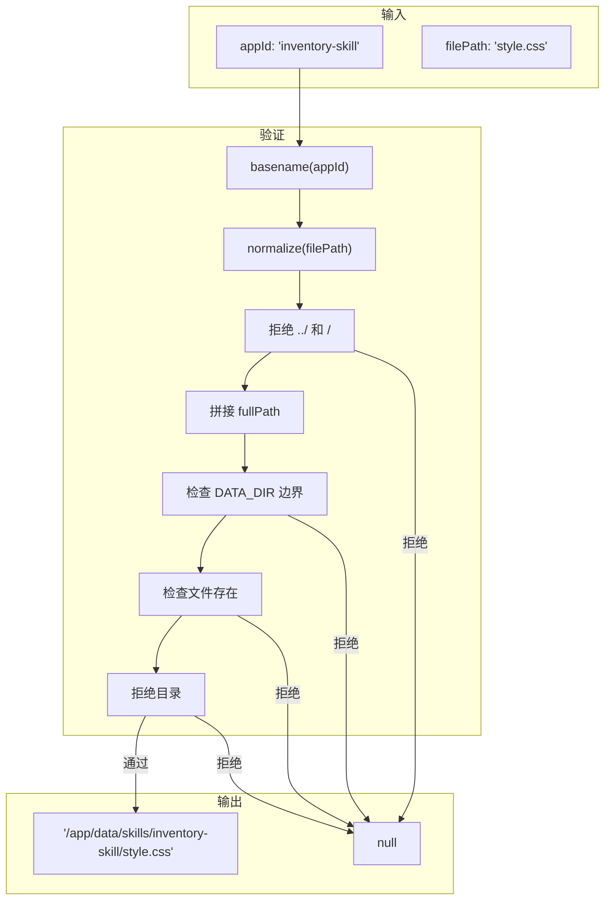

# G44：沙箱路径解析器——`resolveSandboxFilePath` 是怎么防止目录穿越的

> 本课核心问题：`resolveSandboxFilePath` 是怎么解析沙箱文件路径的？它是怎么防止目录穿越攻击的？

## 1. 开篇场景：小王的沙箱应用需要加载资源

小王的"库存管理"应用需要加载 `style.css`：

```
data/skills/inventory-skill/
├── index.html
├── style.css
└── app.js
```

系统需要安全地解析 `style.css` 的路径，防止恶意请求访问系统文件。

## 2. 两种路径解析策略

### 2.1 直接拼接

```ts
const path = `data/skills/${appId}/${filePath}`;
```

优点：简单。
缺点：不安全，可能被目录穿越。

### 2.2 安全解析

```ts
const path = resolveSandboxFilePath(appId, filePath);
```

OriginOS 选择了**安全解析**。

## 3. 源码精读：`resolveSandboxFilePath`

打开 [packages/core/src/lib/features/sandbox/path-resolver.ts](../../../../packages/core/src/lib/features/sandbox/path-resolver.ts)。

### 3.1 入口方法

```ts
export function resolveSandboxFilePath(appId: string, filePath: string): string | null {
  // 1. 规范化 appId（只取 basename）
  const normalizedAppId = path.basename(appId);

  // 2. 规范化文件路径
  const normalizedFile = path.normalize(filePath);

  // 3. 拒绝路径穿越
  if (normalizedFile.startsWith('..') || normalizedFile.startsWith('/')) {
    return null;
  }

  // 4. 拼接完整路径
  const fullPath = path.join(DATA_DIR, normalizedAppId, normalizedFile);

  // 5. 确保路径在 DATA_DIR 下
  if (!fullPath.startsWith(DATA_DIR)) {
    return null;
  }

  // 6. 检查文件存在
  if (!existsSync(fullPath)) {
    return null;
  }

  // 7. 拒绝目录
  if (statSync(fullPath).isDirectory()) {
    return null;
  }

  return fullPath;
}
```

对应源码位置：[packages/core/src/lib/features/sandbox/path-resolver.ts 第 18—43 行](../../../../packages/core/src/lib/features/sandbox/path-resolver.ts#L18-L43)。

### 3.2 流程分析

```
resolveSandboxFilePath
  ├─ 1. 规范化 appId（basename）
  ├─ 2. 规范化文件路径
  ├─ 3. 拒绝路径穿越
  ├─ 4. 拼接完整路径
  ├─ 5. 确保在 DATA_DIR 下
  ├─ 6. 检查文件存在
  ├─ 7. 拒绝目录
  └─ 返回路径或 null
```

## 4. 安全机制

### 4.1 basename 规范化

```ts
const normalizedAppId = path.basename(appId);
```

```
appId: "../../etc/passwd"
normalizedAppId: "passwd"
```

### 4.2 路径穿越检测

```ts
if (normalizedFile.startsWith('..') || normalizedFile.startsWith('/')) {
  return null;
}
```

```
filePath: "../../../etc/passwd"
结果: null（拒绝）
```

### 4.3 DATA_DIR 边界检查

```ts
if (!fullPath.startsWith(DATA_DIR)) {
  return null;
}
```

```ts
// 假设 DATA_DIR = '/app/data'
// fullPath = '/app/data/skills/app1/style.css' → 通过
// fullPath = '/etc/passwd' → 拒绝
```

### 4.4 目录拒绝

```ts
if (statSync(fullPath).isDirectory()) {
  return null;
}
```

拒绝目录请求，只允许文件。

## 5. 图解：安全解析流程



## 6. 测试证据与缺口

### 已覆盖

- `resolveSandboxFilePath` 没有直接测试。

### 缺口

- 路径穿越检测没有测试。
- DATA_DIR 边界检查没有测试。
- 目录拒绝没有测试。

## 7. 小实验：验证路径解析

```ts
import { resolveSandboxFilePath } from '@originos/core/lib/features/sandbox';

// 正常请求
const path1 = resolveSandboxFilePath('inventory-skill', 'style.css');
console.log(path1);  // '/app/data/skills/inventory-skill/style.css'

// 路径穿越攻击
const path2 = resolveSandboxFilePath('inventory-skill', '../../../etc/passwd');
console.log(path2);  // null

// 目录请求
const path3 = resolveSandboxFilePath('inventory-skill', '../');
console.log(path3);  // null
```

## 8. 口头验收

读完本课后，应能不看书稿回答：

1. `resolveSandboxFilePath` 接收哪些参数？返回什么？
2. 它是怎么防止路径穿越的？
3. `basename` 的作用是什么？
4. DATA_DIR 边界检查是怎么工作的？
5. 如果请求的是目录，会发生什么？

## 9. 章节收束

本课的核心认知是 **`resolveSandboxFilePath` 通过多层验证（basename 规范化、路径穿越检测、DATA_DIR 边界检查、文件存在检查、目录拒绝）保证沙箱文件访问的安全性**。

我们看到的几个关键设计：

- **basename 规范化**：防止 appId 包含路径。
- **路径穿越检测**：拒绝 `../` 和 `/` 开头的路径。
- **DATA_DIR 边界**：确保路径在数据目录内。
- **文件存在检查**：只返回存在的文件。
- **目录拒绝**：只允许文件，不允许目录。
- **无测试**：没有直接测试覆盖。

下一课（G45）我们会深入 `console-bridge.ts`，看看控制台桥接是怎么工作的。
