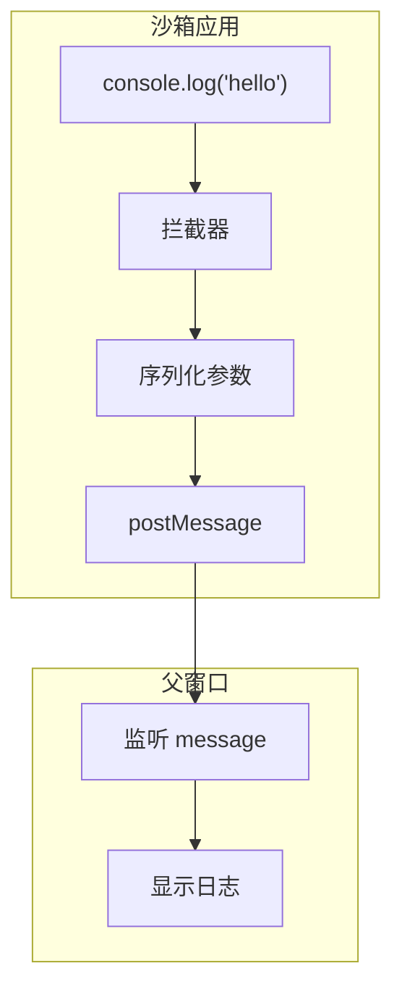

# G45：控制台桥接——`CONSOLE_BRIDGE_SCRIPT` 是怎么把沙箱日志传出来的

> 本课核心问题：`CONSOLE_BRIDGE_SCRIPT` 是怎么拦截沙箱控制台的？它是怎么把日志传回主窗口的？错误处理是怎么工作的？

## 1. 开篇场景：小王的沙箱应用出错了

小王的"库存管理"应用在沙箱中运行，但控制台报错：

```
Error: Cannot read properties of undefined
```

系统需要把这个错误传回主窗口，让小王看到。

## 2. 两种日志策略

### 2.1 不拦截

```ts
// 沙箱中的 console.log 只在沙箱内可见
console.log('debug info');  // 主窗口看不到
```

缺点：无法调试沙箱应用。

### 2.2 拦截并转发

```ts
// 拦截 console.log，通过 postMessage 传回主窗口
console.log = function(...args) {
  window.parent.postMessage({ type: 'sandbox-console', args }, '*');
};
```

OriginOS 选择了**拦截并转发**。

## 3. 源码精读：`CONSOLE_BRIDGE_SCRIPT`

打开 [packages/core/src/lib/features/sandbox/console-bridge.ts](../../../../packages/core/src/lib/features/sandbox/console-bridge.ts)。

### 3.1 脚本内容

```ts
export const CONSOLE_BRIDGE_SCRIPT = `
(function() {
  var _origConsole = {};
  var _method = ['log', 'warn', 'error', 'info', 'debug'];
  _method.forEach(function(method) {
    _origConsole[method] = console[method];
    console[method] = function() {
      var args = Array.prototype.slice.call(arguments).map(function(arg) {
        try { return typeof arg === 'object' ? JSON.stringify(arg, null, 2) : String(arg); }
        catch(e) { return String(arg); }
      });
      try {
        window.parent.postMessage({
          type: 'sandbox-console',
          method: method,
          args: args,
          timestamp: Date.now()
        }, '*');
      } catch(e) {}
      _origConsole[method].apply(console, arguments);
    };
  });

  window.addEventListener('error', function(e) {
    try {
      window.parent.postMessage({
        type: 'sandbox-error',
        message: e.message || 'Unknown error',
        stack: e.error ? e.error.stack : undefined,
        lineno: e.lineno,
        colno: e.colno,
        timestamp: Date.now()
      }, '*');
    } catch(err) {}
  });

  window.addEventListener('unhandledrejection', function(e) {
    try {
      window.parent.postMessage({
        type: 'sandbox-error',
        message: (e.reason && e.reason.message) || String(e.reason),
        stack: e.reason ? e.reason.stack : undefined,
        timestamp: Date.now()
      }, '*');
    } catch(err) {}
  });
})();
`;
```

对应源码位置：[packages/core/src/lib/features/sandbox/console-bridge.ts 第 4—51 行](../../../../packages/core/src/lib/features/sandbox/console-bridge.ts#L4-L51)。

### 3.2 流程分析

```
CONSOLE_BRIDGE_SCRIPT
  ├─ 1. 保存原始 console 方法
  ├─ 2. 拦截 console 方法
  │    ├─ 序列化参数
  │    ├─ postMessage 发送给父窗口
  │    └─ 调用原始方法
  ├─ 3. 监听 error 事件
  │    ├─ 提取错误信息
  │    └─ postMessage 发送给父窗口
  └─ 4. 监听 unhandledrejection 事件
       ├─ 提取错误信息
       └─ postMessage 发送给父窗口
```

## 4. 消息格式

### 4.1 控制台消息

```ts
{
  type: 'sandbox-console',
  method: 'log' | 'warn' | 'error' | 'info' | 'debug',
  args: string[],
  timestamp: number
}
```

### 4.2 错误消息

```ts
{
  type: 'sandbox-error',
  message: string,
  stack?: string,
  lineno?: number,
  colno?: number,
  timestamp: number
}
```

## 5. 图解：控制台桥接流程



## 6. 设计亮点

### 6.1 参数序列化

```ts
var args = Array.prototype.slice.call(arguments).map(function(arg) {
  try { return typeof arg === 'object' ? JSON.stringify(arg, null, 2) : String(arg); }
  catch(e) { return String(arg); }
});
```

对象被 JSON.stringify，其他类型被 String()。

### 6.2 容错处理

```ts
try {
  window.parent.postMessage({ ... }, '*');
} catch(e) {}
```

所有 postMessage 都被 try-catch 包裹，防止沙箱崩溃。

### 6.3 保留原始行为

```ts
_origConsole[method].apply(console, arguments);
```

拦截后仍然调用原始方法，保证控制台正常输出。

## 7. 测试证据与缺口

### 已覆盖

- `CONSOLE_BRIDGE_SCRIPT` 没有直接测试。

### 缺口

- 控制台拦截没有测试。
- 错误转发没有测试。
- 参数序列化没有测试。

## 8. 小实验：验证控制台桥接

```ts
// 在沙箱 HTML 中注入脚本
const html = `<!DOCTYPE html>
<html>
<body>
  <script>${CONSOLE_BRIDGE_SCRIPT}</script>
  <script>
    console.log('Hello from sandbox!');
    console.error('Something went wrong');
  </script>
</body>
</html>`;

// 在父窗口中监听
window.addEventListener('message', (e) => {
  if (e.data.type === 'sandbox-console') {
    console.log(`[${e.data.method}]`, e.data.args);
  }
  if (e.data.type === 'sandbox-error') {
    console.error('Error:', e.data.message);
  }
});
```

## 9. 口头验收

读完本课后，应能不看书稿回答：

1. `CONSOLE_BRIDGE_SCRIPT` 拦截了哪些 console 方法？
2. 它是怎么把日志传给父窗口的？
3. 错误消息包含哪些字段？
4. 参数是怎么被序列化的？
5. 为什么保留原始 console 方法？

## 10. 章节收束

本课的核心认知是 **`CONSOLE_BRIDGE_SCRIPT` 通过拦截 console 方法、监听 error 和 unhandledrejection 事件，通过 postMessage 把日志和错误传回父窗口**。

我们看到的几个关键设计：

- **拦截转发**：拦截 console 方法，通过 postMessage 转发。
- **参数序列化**：对象 JSON.stringify，其他 String()。
- **错误捕获**：监听 error 和 unhandledrejection。
- **容错处理**：try-catch 包裹所有 postMessage。
- **保留原始行为**：拦截后仍然调用原始方法。
- **无测试**：没有直接测试覆盖。

下一课（G46）是单元小结课，我们会画出"文档解析 → API 调用 → 沙箱运行"的完整调用链。
