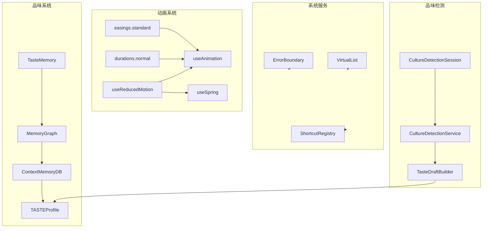

# G60：单元小结课——画出"动画 → 系统 → Taste → Culture"的完整调用链

> 本课核心问题：从 G47 到 G59，我们已经把 Animation、System、Taste、Culture 拆成了十三节课。现在请你脱离源码，把"动画 → 系统 → Taste → Culture"的完整旅程画出来，并标出每个关键节点的责任方、数据格式、失败路径和测试缺口。

## 1. 开篇场景：十三节课之后，小王理解了 OriginOS 的"软实力"

让我们回到小王的视角：

1. 小王打开 OriginOS，界面用 `easings.standard` 缓动动画平滑过渡。
2. 小王滚动长列表时，`VirtualList` 只渲染可见项，保持 60fps。
3. 小王按 `Ctrl+K` 打开命令面板，`ShortcutRegistry` 响应快捷键。
4. 小王和 OriginOS 对话，系统通过 `CultureDetectionService` 分析小王的回答。
5. 系统发现小王偏好"简洁"和"可维护性"，生成 Taste Profile。
6. 小王再次使用时，系统根据 Taste Profile 推荐更合适的方案。

## 2. 概念阶梯回顾

### 2.1 从直觉到术语

| 直觉说法 | 专业术语 | 对应源码 |
| --- | --- | --- |
| "动画很流畅" | `easings.standard` | `easings.ts` |
| "动画太快了" | `durations.fast` | `durations.ts` |
| "动画可以暂停" | `useAnimation` | `useAnimation.ts` |
| "动画像弹簧一样" | `useSpring` | `useSpring.ts` |
| "减少动画" | `useReducedMotion` | `useReducedMotion.ts` |
| "页面出错了" | `ErrorBoundary` | `ErrorBoundary.tsx` |
| "列表太长了" | `VirtualList` | `VirtualList.tsx` |
| "快捷键冲突" | `ShortcutRegistry` | `ShortcutRegistry.ts` |
| "系统懂我" | `TasteMemory` | `taste-schema.ts` |
| "品味档案" | `TASTEProfile` | `taste-schema.ts` |
| "对话分析" | `CultureDetectionService` | `CultureDetectionService.ts` |

### 2.2 关键边界

本单元反复强调的边界：

- **`animations/`** 负责动画效果。
- **`system/`** 负责系统服务。
- **`taste/`** 负责品味记忆。
- **`culture/`** 负责品味检测。
- **所有模块都没有直接测试。**

## 3. 完整调用链图解



## 4. 节点责任表

| 步骤 | 负责人 | 输入 | 输出 | 关键设计决策 |
| --- | --- | --- | --- | --- |
| 缓动函数 | `easings.ts` | 无 | 缓动字符串 | Fluent Design |
| 时长常量 | `durations.ts` | 无 | 时长数字 | 人类感知阈值 |
| 动画控制 | `useAnimation` | keyframes, config | AnimationControls | Web Animations API |
| 弹簧动画 | `useSpring` | target, config | SpringValue | 物理公式 |
| 减少动画 | `useReducedMotion` | 无 | boolean | matchMedia |
| 错误边界 | `ErrorBoundary` | children | fallback | getDerivedStateFromError |
| 虚拟列表 | `VirtualList` | items, height | 可见项 | translateY 偏移 |
| 快捷键 | `ShortcutRegistry` | key, handler | 无 | Map 存储 |
| 品味记忆 | `TasteMemory` | context, judgment, feedback | memory | 三元组 |
| 记忆图 | `MemoryGraph` | memory | nodes, edges | 三个 Map |
| 记忆数据库 | `ContextMemoryDB` | memory | profile | 写入条件过滤 |
| 品味检测 | `CultureDetectionService` | dialogue | profile | 关键词匹配 |

## 5. 数据格式转换链

```
用户对话
  ↓
CultureDetectionSession
  ↓
dialogueHistory
  ↓
extractKeywords(text)
  ↓
{ experience, taste, tension }
  ↓
buildAnalysisFromKeywords(keywords)
  ↓
TASTEProfile {
  experience_topology: [...],
  taste_standards: { ... },
  tension_position: { ... },
  symbiosis_boundary: { ... }
}
```

## 6. 失败路径复盘

### 6.1 动画系统

| 失败场景 | 处理方式 | 风险 |
| --- | --- | --- |
| 减少动画偏好 | 跳过动画，直接到最终状态 | 无 |
| 动画元素不存在 | 返回 null | 正常 |
| 关键帧不足 | 返回 null | 正常 |

### 6.2 系统服务

| 失败场景 | 处理方式 | 风险 |
| --- | --- | --- |
| 子组件报错 | ErrorBoundary 捕获 | 无 |
| 长列表滚动 | VirtualList 只渲染可见项 | 无 |
| 快捷键冲突 | console.warn | 低 |

### 6.3 Taste & Culture

| 失败场景 | 处理方式 | 风险 |
| --- | --- | --- |
| 写入条件不满足 | 跳过 | 正常 |
| 找不到相似记忆 | 创建新记忆 | 正常 |
| 关键词匹配失败 | 空结果 | 正常 |

## 7. 测试覆盖复盘

| 能力 | 测试位置 | 覆盖状态 |
| --- | --- | --- |
| `easings` | 无 | 未覆盖 |
| `durations` | 无 | 未覆盖 |
| `useAnimation` | 无 | 未覆盖 |
| `useSpring` | 无 | 未覆盖 |
| `useReducedMotion` | 无 | 未覆盖 |
| `ErrorBoundary` | 无 | 未覆盖 |
| `VirtualList` | 无 | 未覆盖 |
| `ShortcutRegistry` | 无 | 未覆盖 |
| `taste-schema` | 无 | 未覆盖 |
| `MemoryGraph` | 无 | 未覆盖 |
| `ContextMemoryDB` | 无 | 未覆盖 |
| `CultureDetectionService` | 无 | 未覆盖 |

## 8. 工作坊练习

### 练习一：画出调用链

请拿一张纸或打开一个白板工具，不看书稿，画出以下调用链：

1. 小王打开 OriginOS，界面动画平滑过渡。
2. 小王滚动长列表，VirtualList 只渲染可见项。
3. 小王按 Ctrl+K，ShortcutRegistry 响应。
4. 小王和 OriginOS 对话。
5. CultureDetectionService 分析对话。
6. 生成 TASTEProfile。
7. 系统根据 Taste Profile 推荐方案。

要求：
- 每个箭头标注调用的函数/方法名。
- 每个节点标注输入和输出的数据格式。
- 在每个节点旁边写出一个可能的失败场景。

### 练习二：找出设计问题

请列出至少三个设计问题：

| 问题 | 影响 | 改进建议 |
| --- | --- | --- |
| 无测试覆盖 | 无法验证功能正确性 | 补单元测试 |
| 关键词匹配简单 | 可能漏掉或误匹配 | 集成 LLM |
| 图结构在内存中 | 重启后数据丢失 | 持久化到磁盘 |
| 无缓存 | 重复计算 | 增加缓存 |
| 置信度计算简单 | 可能不准确 | 增加更多维度 |

### 练习三：补测试计划

假设你只能补三个测试，你会优先补哪三个？请说明理由。

参考答案（不唯一）：

1. **`MemoryGraph` 测试**
   - 理由：图结构是 Taste 系统的核心，需要验证。

2. **`CultureDetectionService` 关键词提取测试**
   - 理由：关键词提取是品味检测的核心，需要验证。

3. **`VirtualList` 测试**
   - 理由：虚拟列表是性能优化的关键，需要验证。

## 9. 口头验收

完成本单元后，应能不看书稿回答：

1. `easings.ts` 定义了哪四个缓动函数？
2. `useAnimation` 是怎么控制动画的？
3. `VirtualList` 是怎么只渲染可见项的？
4. `ShortcutRegistry` 是怎么存储快捷键的？
5. Taste Memory 的三元组是什么？
6. `CultureDetectionService` 是怎么分析对话的？
7. 置信度是怎么计算的？

## 10. 章节收束

本单元（G47—G60）围绕"动画 → 系统 → Taste → Culture"这一流程，拆解了 OriginOS 的 Animation、System、Taste、Culture 四个模块。

我们学到的核心认知：

- **动画系统**：通过 Fluent Design 缓动函数和 Web Animations API 实现流畅动画。
- **系统服务**：通过 ErrorBoundary、VirtualList、ShortcutRegistry 提供底层能力。
- **Taste**：通过三元组（Context + Judgment + Feedback）和图结构管理品味记忆。
- **Culture**：通过关键词匹配和置信度计算分析对话，生成 TASTE Profile。
- **无测试覆盖**：所有模块都没有直接测试。

下一单元（G61—G72）我们将进入**技能系统、用户配置和注册表**。

---

**本单元到此结束。**
