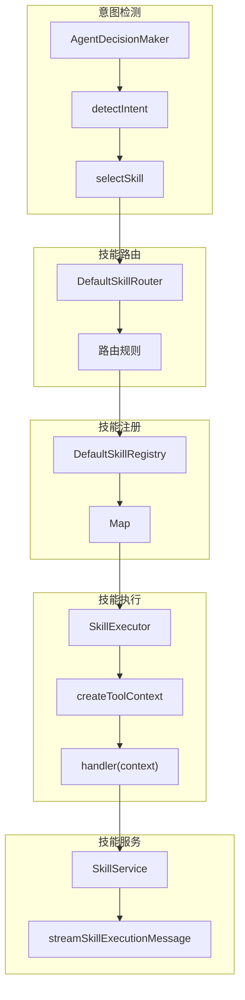

# G68：单元小结课——画出"注册 → 路由 → 执行"的完整流程

> 本课核心问题：从 G61 到 G67，我们已经把 Skill 系统的核心组件拆成了七节课。现在请你脱离源码，把"注册 → 路由 → 执行"的完整流程画出来，并标出每个关键节点的责任方、数据格式、失败路径和测试缺口。

## 1. 开篇场景：七节课之后，小王理解了 OriginOS 的技能系统

让我们回到小王的视角：

1. 小王输入"创建任务"，系统通过 `AgentDecisionMaker` 检测意图为 `MANAGE_TASKS`。
2. 系统通过 `DefaultSkillRouter` 路由到 `task-manager` 技能。
3. `DefaultSkillRegistry` 返回 `task-manager` 的处理器。
4. `SkillExecutor` 创建工具上下文并执行处理器。
5. `SkillService` 流式返回结果。

## 2. 概念阶梯回顾

### 2.1 从直觉到术语

| 直觉说法 | 专业术语 | 对应源码 |
| --- | --- | --- |
| "识别意图" | `detectIntent` | `decision.ts` |
| "找到技能" | `SkillRouter.route` | `registry.ts` |
| "加载技能" | `SkillRegistry.get` | `registry.ts` |
| "执行技能" | `SkillExecutor.execute` | `executor.ts` |
| "流式返回" | `streamSkillExecutionMessage` | `service.ts` |
| "创建实体" | `tools.createEntity` | `executor.ts` |
| "更新实体" | `tools.updateEntity` | `executor.ts` |
| "查询实体" | `tools.queryEntities` | `executor.ts` |

### 2.2 关键边界

本单元反复强调的边界：

- **`SkillRegistry`** 负责注册和存储技能。
- **`SkillRouter`** 负责路由到合适技能。
- **`SkillExecutor`** 负责执行技能并注入工具。
- **`AgentDecisionMaker`** 负责检测意图。
- **`SkillService`** 提供统一入口。
- **所有模块都没有直接测试。**

## 3. 完整调用链图解



## 4. 节点责任表

| 步骤 | 负责人 | 输入 | 输出 | 关键设计决策 |
| --- | --- | --- | --- | --- |
| 意图检测 | `AgentDecisionMaker` | 用户输入 | Intent + Skill + Confidence | 关键词匹配 |
| 技能路由 | `DefaultSkillRouter` | Intent | LoadedSkill | 优先级规则 |
| 技能注册 | `DefaultSkillRegistry` | LoadedSkill | void | Map 存储 |
| 技能查找 | `DefaultSkillRegistry` | 技能名称 | LoadedSkill | O(1) 查找 |
| 工具创建 | `SkillExecutor` | Session | SkillTools | 注入系统能力 |
| 技能执行 | `SkillExecutor` | SkillContext | SkillResult | 异常捕获 |
| 流式返回 | `SkillService` | SkillResult | SSE Event | Server-Sent Events |

## 5. 数据格式转换链

```
用户输入
  ↓
detectIntent(input)
  ↓
Intent (MANAGE_TASKS)
  ↓
selectSkill(intent)
  ↓
LoadedSkill { metadata, handler }
  ↓
createToolContext(session)
  ↓
SkillContext { input, session, tools }
  ↓
handler(context)
  ↓
SkillResult { success, data/error }
  ↓
SSE Event { type, data }
```

## 6. 失败路径复盘

### 6.1 意图检测

| 失败场景 | 处理方式 | 风险 |
| --- | --- | --- |
| 关键词不匹配 | 返回 CHAT_GENERAL | 可能误判 |
| 多意图冲突 | 取第一个匹配 | 可能不准确 |
| 置信度低 | 仍返回结果 | 用户可能不满意 |

### 6.2 技能路由

| 失败场景 | 处理方式 | 风险 |
| --- | --- | --- |
| 无匹配规则 | 返回 null | 技能无法执行 |
| 规则冲突 | 优先级高的优先 | 可能不符合预期 |
| 技能未注册 | 返回 null | 需要提前注册 |

### 6.3 技能执行

| 失败场景 | 处理方式 | 风险 |
| --- | --- | --- |
| 处理器报错 | 返回错误结果 | 无重试机制 |
| 工具调用失败 | 返回错误结果 | 无降级策略 |
| 超时 | 未处理 | 可能挂起 |

## 7. 测试覆盖复盘

| 能力 | 测试位置 | 覆盖状态 |
| --- | --- | --- |
| `SkillService.listSkills` | 无 | 未覆盖 |
| `SkillService.startSkillExecution` | 无 | 未覆盖 |
| `SkillService.completeSkillExecution` | 无 | 未覆盖 |
| `SkillService.streamSkillExecutionMessage` | 无 | 未覆盖 |
| `DefaultSkillRegistry.register` | 无 | 未覆盖 |
| `DefaultSkillRegistry.get` | 无 | 未覆盖 |
| `DefaultSkillRouter.route` | 无 | 未覆盖 |
| `SkillExecutor.execute` | 无 | 未覆盖 |
| `AgentDecisionMaker.decide` | 无 | 未覆盖 |
| `detectIntent` | 无 | 未覆盖 |

## 8. 工作坊练习

### 练习一：画出调用链

请拿一张纸或打开一个白板工具，不看书稿，画出以下调用链：

1. 小王输入"创建任务"。
2. `AgentDecisionMaker` 检测意图。
3. `DefaultSkillRouter` 路由到 `task-manager`。
4. `DefaultSkillRegistry` 返回处理器。
5. `SkillExecutor` 创建工具上下文。
6. 执行 `task-manager` 处理器。
7. `SkillService` 流式返回结果。

要求：
- 每个箭头标注调用的函数/方法名。
- 每个节点标注输入和输出的数据格式。
- 在每个节点旁边写出一个可能的失败场景。

### 练习二：找出设计问题

请列出至少三个设计问题：

| 问题 | 影响 | 改进建议 |
| --- | --- | --- |
| 无测试覆盖 | 无法验证功能正确性 | 补单元测试 |
| 关键词匹配简单 | 可能漏掉或误匹配 | 集成 LLM |
| 无重试机制 | 执行失败后无法恢复 | 增加重试 |
| 无超时处理 | 可能挂起 | 增加超时 |
| 置信度计算简单 | 可能不准确 | 增加更多维度 |

### 练习三：补测试计划

假设你只能补三个测试，你会优先补哪三个？请说明理由。

参考答案（不唯一）：

1. **`SkillExecutor.execute` 测试**
   - 理由：技能执行是核心，需要验证。

2. **`AgentDecisionMaker.decide` 测试**
   - 理由：意图检测是入口，需要验证。

3. **`DefaultSkillRouter.route` 测试**
   - 理由：路由是连接意图和技能的关键，需要验证。

## 9. 口头验收

完成本单元后，应能不看书稿回答：

1. `AgentDecisionMaker` 是怎么检测意图的？
2. `DefaultSkillRouter` 是怎么路由技能的？
3. `DefaultSkillRegistry` 是怎么存储技能的？
4. `SkillExecutor` 是怎么注入工具的？
5. `SkillService` 是怎么流式返回结果的？
6. 技能系统的失败路径有哪些？
7. 如果要改进，你会从哪方面入手？

## 10. 章节收束

本单元（G61—G67）围绕"注册 → 路由 → 执行"这一流程，拆解了 OriginOS 的技能系统。

我们学到的核心认知：

- **意图检测**：通过关键词匹配检测用户意图。
- **技能路由**：通过优先级规则路由到合适技能。
- **技能注册**：通过 Map 存储技能，支持 O(1) 查找。
- **技能执行**：通过工具上下文注入系统能力。
- **流式返回**：通过 SSE 实现流式结果返回。
- **无测试覆盖**：所有模块都没有直接测试。

下一单元（G69—G72）我们会进入**用户配置和用户注册表**。

---

**本单元到此结束。**
