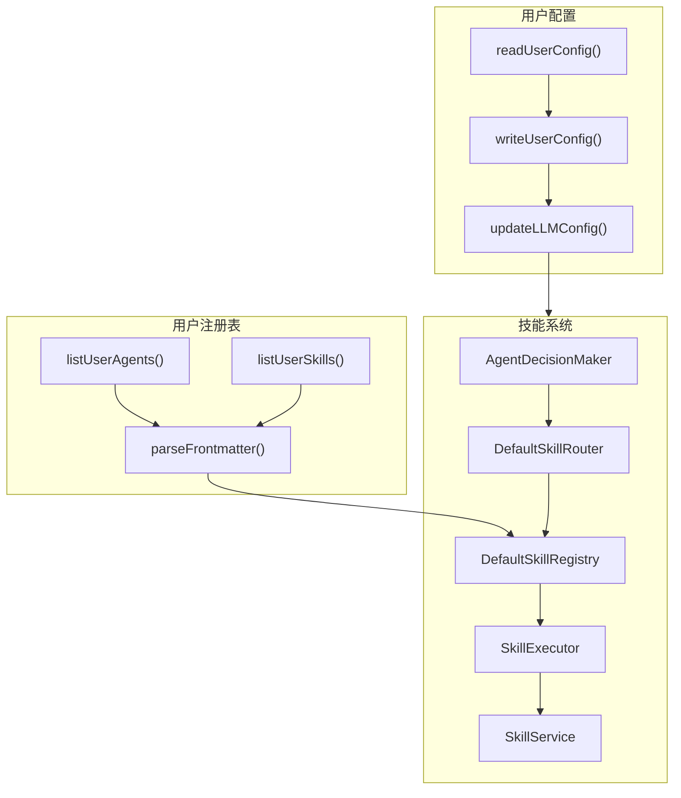

# G72：单元小结课——画出"配置 → 注册表 → 技能系统"的完整调用链

> 本课核心问题：从 G61 到 G71，我们已经把技能系统、用户配置和用户注册表拆成了十二节课。现在请你脱离源码，把"配置 → 注册表 → 技能系统"的完整调用链画出来，并标出每个关键节点的责任方、数据格式、失败路径和测试缺口。

## 1. 开篇场景：十二节课之后，小王理解了 OriginOS 的"配置 → 注册表 → 技能系统"

让我们回到小王的视角：

1. 小王打开 OriginOS，系统通过 `readUserConfig` 读取用户配置。
2. 小王在"我的 Agent"页面，系统通过 `listUserAgents` 扫描 Agent。
3. 小王输入"创建任务"，系统通过 `AgentDecisionMaker` 检测意图。
4. 系统通过 `DefaultSkillRouter` 路由到 `task-manager` 技能。
5. `DefaultSkillRegistry` 返回处理器。
6. `SkillExecutor` 执行技能，创建任务。
7. `SkillService` 流式返回结果。

## 2. 概念阶梯回顾

### 2.1 从直觉到术语

| 直觉说法 | 专业术语 | 对应源码 |
| --- | --- | --- |
| "读取配置" | `readUserConfig` | `user-config/index.ts` |
| "更新配置" | `updateUserConfig` | `user-config/index.ts` |
| "切换 LLM" | `updateLLMConfig` | `user-config/index.ts` |
| "查看 Agent" | `listUserAgents` | `user-registry/index.ts` |
| "查看 Skill" | `listUserSkills` | `user-registry/index.ts` |
| "识别意图" | `AgentDecisionMaker` | `decision.ts` |
| "找到技能" | `DefaultSkillRouter` | `registry.ts` |
| "执行技能" | `SkillExecutor` | `executor.ts` |
| "流式返回" | `SkillService` | `service.ts` |

### 2.2 关键边界

本单元反复强调的边界：

- **`user-config/`** 负责用户配置读写。
- **`user-registry/`** 负责 Agent/Skill 扫描。
- **`skills/`** 负责技能注册、路由、执行。
- **所有模块都没有直接测试。**

## 3. 完整调用链图解



## 4. 节点责任表

| 步骤 | 负责人 | 输入 | 输出 | 关键设计决策 |
| --- | --- | --- | --- | --- |
| 读取配置 | `readUserConfig` | 无 | UserConfig | JSON 文件 |
| 写入配置 | `writeUserConfig` | UserConfig | void | JSON 文件 |
| 更新 LLM | `updateLLMConfig` | Partial<LLMConfig> | UserConfig | 部分更新 |
| 扫描 Agent | `listUserAgents` | 无 | UserAgent[] | 目录扫描 |
| 扫描 Skill | `listUserSkills` | 无 | UserSkill[] | 目录扫描 |
| 解析元数据 | `parseFrontmatter` | Markdown | Record | YAML 解析 |
| 检测意图 | `AgentDecisionMaker` | 用户输入 | DecisionResult | 关键词匹配 |
| 路由技能 | `DefaultSkillRouter` | Intent | LoadedSkill | 优先级规则 |
| 注册技能 | `DefaultSkillRegistry` | LoadedSkill | void | Map 存储 |
| 执行技能 | `SkillExecutor` | SkillContext | SkillResult | 工具注入 |
| 流式返回 | `SkillService` | SkillResult | SSE Event | Server-Sent Events |

## 5. 数据格式转换链

```
用户配置
  ↓
readUserConfig()
  ↓
UserConfig { theme, language, llm }
  ↓
updateLLMConfig({ provider: 'openai' })
  ↓
UserConfig { theme, language, llm: { provider: 'openai', ... } }
  ↓
listUserAgents()
  ↓
UserAgent[] { name, displayName, description }
  ↓
listUserSkills()
  ↓
UserSkill[] { name, displayName, tags }
  ↓
AgentDecisionMaker.decide()
  ↓
DecisionResult { intent, skill, confidence }
  ↓
DefaultSkillRouter.route()
  ↓
LoadedSkill { metadata, handler }
  ↓
SkillExecutor.execute()
  ↓
SkillResult { success, data/error }
  ↓
SkillService.streamSkillExecutionMessage()
  ↓
SSE Event { type, data }
```

## 6. 失败路径复盘

### 6.1 用户配置

| 失败场景 | 处理方式 | 风险 |
| --- | --- | --- |
| 配置文件不存在 | 返回默认配置 | 无 |
| 配置文件损坏 | 返回默认配置 | 丢失用户配置 |
| 验证失败 | 返回默认配置 | 丢失用户配置 |

### 6.2 用户注册表

| 失败场景 | 处理方式 | 风险 |
| --- | --- | --- |
| 目录不存在 | 返回空数组 | 无 |
| 文件不存在 | 跳过 | 无 |
| Frontmatter 解析失败 | 跳过 | 无 |

### 6.3 技能系统

| 失败场景 | 处理方式 | 风险 |
| --- | --- | --- |
| 意图不匹配 | 返回 CHAT_GENERAL | 可能误判 |
| 技能未注册 | 返回 null | 无法执行 |
| 执行出错 | 返回错误结果 | 无重试 |
| 流式中断 | 未处理 | 可能挂起 |

## 7. 测试覆盖复盘

| 能力 | 测试位置 | 覆盖状态 |
| --- | --- | --- |
| `readUserConfig` | 无 | 未覆盖 |
| `writeUserConfig` | 无 | 未覆盖 |
| `updateLLMConfig` | 无 | 未覆盖 |
| `listUserAgents` | 无 | 未覆盖 |
| `listUserSkills` | 无 | 未覆盖 |
| `parseFrontmatter` | 无 | 未覆盖 |
| `AgentDecisionMaker.decide` | 无 | 未覆盖 |
| `DefaultSkillRouter.route` | 无 | 未覆盖 |
| `DefaultSkillRegistry.register` | 无 | 未覆盖 |
| `SkillExecutor.execute` | 无 | 未覆盖 |
| `SkillService.streamSkillExecutionMessage` | 无 | 未覆盖 |

## 8. 工作坊练习

### 练习一：画出调用链

请拿一张纸或打开一个白板工具，不看书稿，画出以下调用链：

1. 小王打开 OriginOS，系统读取用户配置。
2. 小王查看"我的 Agent"，系统扫描 Agent。
3. 小王输入"创建任务"，系统检测意图。
4. 系统路由到 `task-manager` 技能。
5. `SkillExecutor` 执行技能，创建任务。
6. `SkillService` 流式返回结果。

要求：
- 每个箭头标注调用的函数/方法名。
- 每个节点标注输入和输出的数据格式。
- 在每个节点旁边写出一个可能的失败场景。

### 练习二：找出设计问题

请列出至少三个设计问题：

| 问题 | 影响 | 改进建议 |
| --- | --- | --- |
| 无测试覆盖 | 无法验证功能正确性 | 补单元测试 |
| 配置文件损坏 | 丢失用户配置 | 备份机制 |
| 关键词匹配简单 | 可能漏掉或误匹配 | 集成 LLM |
| 无重试机制 | 执行失败后无法恢复 | 增加重试 |
| 无超时处理 | 可能挂起 | 增加超时 |

### 练习三：补测试计划

假设你只能补三个测试，你会优先补哪三个？请说明理由。

参考答案（不唯一）：

1. **`readUserConfig` 测试**
   - 理由：配置读取是基础，影响所有功能。

2. **`AgentDecisionMaker.decide` 测试**
   - 理由：意图检测是入口，影响用户体验。

3. **`SkillExecutor.execute` 测试**
   - 理由：技能执行是核心，影响功能正确性。

## 9. 口头验收

完成本单元后，应能不看书稿回答：

1. `readUserConfig` 是怎么工作的？
2. `listUserAgents` 是怎么扫描 Agent 的？
3. `AgentDecisionMaker` 是怎么检测意图的？
4. `DefaultSkillRouter` 是怎么路由技能的？
5. `SkillExecutor` 是怎么注入工具的？
6. `SkillService` 是怎么流式返回结果的？
7. 如果要改进，你会从哪方面入手？

## 10. 章节收束

本单元（G61—G72）围绕"配置 → 注册表 → 技能系统"这一流程，拆解了 OriginOS 的技能系统、用户配置和用户注册表。

我们学到的核心认知：

- **用户配置**：通过 JSON 文件持久化，支持读取、写入和更新。
- **用户注册表**：通过扫描目录和解析 Frontmatter，动态发现 Agent 和 Skill。
- **技能系统**：通过注册、路由、执行三个步骤完成技能调用。
- **流式返回**：通过 SSE 实现流式结果返回。
- **无测试覆盖**：所有模块都没有直接测试。

---

**Part G 全部 72 课到此结束。**

下一部分（如有）将进入新的主题。
