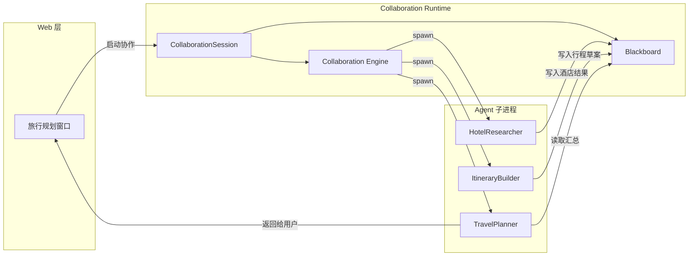

# H01：从单 Agent 会话到多 Agent 协作

## 小林的旅行规划窗口

小林在 OriginOS 中打开“毕业旅行规划”项目，点击“启动协作规划”。几秒后，界面上出现三个 Agent 卡片：

- `TravelPlanner`：总体策划 Supervisor
- `HotelResearcher`：酒店调研 Worker
- `ItineraryBuilder`：行程构建 Worker

小林输入：“两个人，预算六千元，杭州玩五天。”`TravelPlanner` 先追问确认日期偏好，然后把任务分解给两个 Worker；两个 Worker 并行工作，一个查酒店，一个查景点路线；最终行程草案和酒店清单一起出现在项目黑板上。

如果系统只有 Part E 讲过的单 Agent Pi Agent 运行时，这个场景会遇到四个硬问题：

1. **输出怎么传给下一个 Agent？** `HotelResearcher` 找到的酒店列表不能自动成为 `ItineraryBuilder` 的输入。
2. **并行怎么同步？** 两个 Worker 同时运行时，系统怎么知道它们都完成了才汇总？
3. **冲突怎么办？** 两个 Worker 都想写同一个 `budget` key，谁说了算？
4. **全局目标怎么判定？** 单个 Agent 完成一轮对话就算结束，但协作需要等所有子任务完成。

`CollaborationRuntime` 正是为了解决这些问题而存在的。本章回答：**为什么单 Agent 运行时不够？多 Agent 协作请求进入系统后，首先被包装成什么对象？**

## 概念阶梯：三个容易混淆的“运行时”

OriginOS 里至少有三个与 Agent 相关的运行时概念。先分清它们，才能理解 Collaboration Runtime 的位置。

| 名称 | 通俗解释 | 小林的例子 | 不能把它误认为 |
| --- | --- | --- | --- |
| **Pi Agent 基础运行时** | 驱动一个 Agent 与用户对话的引擎 | `TravelPlanner` 单独与小林对话 | 多 Agent 编排器 |
| **Collaboration Runtime** | 让多个 Agent 协同工作的基础设施 | 协调 `TravelPlanner`、`HotelResearcher`、`ItineraryBuilder` 并行/串行执行 | 单个 Agent 的替代品 |
| **Agent 子进程** | 真正执行 LLM 调用和工具的隔离进程 | 每个 Agent 在独立 sandbox 子进程中运行 | 浏览器窗口或 API 路由 |

三者是上下层关系：Collaboration Runtime 负责决定“哪个 Agent 什么时候运行、输入从哪里来、结果写到哪里去”；Pi Agent 基础运行时负责“一个 Agent 收到消息后如何思考、调用工具、生成回复”；Agent 子进程负责“把 Pi Agent 运行时隔离在独立进程中，避免阻塞主应用”。

## 第一段源码：模块入口暴露了哪些能力

打开 [packages/core/src/modules/collaboration-runtime/index.ts](../../../../packages/core/src/modules/collaboration-runtime/index.ts)：

```ts
export { CollaborationRuntime } from "./config";
export type {
  CollaborationRuntimeDeps,
  AgentEngine,
  AgentConfig,
  AgentInstance,
  ToolExecutor,
  ToolRegistration,
  OntologyStore,
  FileOps,
  EventEmitter,
  AgentDefinitionParser,
} from "./config";

export { Blackboard } from "./session/blackboard";
export type { BlackboardState } from "./session/blackboard";

export { FsEventStore } from "./session/fs-event-store";
export type { EventStore } from "./session/event-store";

// ... 大量 engine / protocol / sandbox / observability 导出
```

这个文件做了两件事：

1. **把模块内部实现封装起来**：外部调用者只看到这个 `index.ts` 里列出的公共 API，不需要知道 `dag-executor.ts` 或 `conflict-detector.ts` 的存在。
2. **暴露两个核心对象**：`CollaborationRuntime`（运行时入口）和 `CollaborationRuntimeDeps`（依赖注入合同），以及 `Blackboard`、`FsEventStore` 等共享状态与事件存储抽象。

注意一个关键设计：导出列表里没有从 `src/lib/` 或 `src/components/` 来的东西。 Collaboration Runtime 模块内部**禁止**直接 import 外部模块，所有外部能力都通过 `CollaborationRuntimeDeps` 注入。这是 AGENTS.md 的强制规约，也是本模块能被独立测试的原因。

## 第二段源码：为什么需要独立的协作运行时

设计文档 [docs/design/multi-agent-runtime.md §1.2](../../../../docs/design/multi-agent-runtime.md#L17) 明确写了需要独立协作运行时的原因：

> 当前项目中每个 Agent 是独立定义的……但**缺少一个运行时来实际驱动这些 Agent 协同工作**。现有 PI Agent 基座驱动的是单 Agent 对话，无法处理：
> - Agent A 的输出如何作为 Agent B 的输入
> - 多个 Agent 并行执行时的同步
> - Agent 间的消息路由与格式转换
> - 协作过程中的冲突检测与消解
> - 全局目标的达成判定

这五条正好对应小林场景中的四个硬问题，外加一条“全局目标判定”。单 Agent 运行时只需要回答“这一轮用户消息回复什么”，而协作运行时还要回答：

- 哪些 Agent 参与？
- 它们之间的执行顺序是什么？
- 共享状态放在哪里？
- 怎么知道所有任务都完成了？

## 协作请求进入系统后的第一步转换

小林的点击不会直接创建一个 Pi Agent 会话，而是先创建一个 **协作会话（CollaborationSession）**。这个对象对应 [packages/core/src/modules/collaboration-runtime/session/types.ts](../../../../packages/core/src/modules/collaboration-runtime/session/types.ts#L329) 中的类型：

```ts
export interface CollaborationSession {
  id: string;
  projectId: string;
  globalGoal?: string;
  status: SessionStatus;
  createdAt: string;
  updatedAt: string;
  config: {
    maxIterations?: number;
    timeoutMs?: number;
    mode?: "workflow" | "system";
    llmConfig?: { /* ... */ };
  };
  hostPid?: number;
  terminationReason?: string;
}
```

这个类型合同说明：协作请求首先要被包装成一个带有 `globalGoal`、`status`、`config.mode` 的会话对象。`projectId` 把它绑定到具体项目，`hostPid` 用于后续孤儿检测（Story 9.24）。

注意 `status` 是 `SessionStatus`，取值包括 `"created" | "greeting" | "running" | "completed" | "aborted" | "terminated"`。这不是单个 Agent 的“正在思考/已回复”，而是整个协作会话的生命周期状态。

## 图解：单 Agent vs 多 Agent 运行时的边界



这张图说明：

- **Web 层**只负责发起请求和展示结果。
- **Collaboration Runtime** 负责维护会话、黑板和编排引擎。
- **Agent 子进程**是实际执行者，它们之间不直接通信，而是通过 Blackboard 共享状态。

Collaboration Runtime 不替代 Pi Agent 运行时，而是把它包裹在“会话 → 黑板 → 编排 → 子进程”的框架中。Pi Agent 运行时仍然负责单个 Agent 内部的思考与工具调用，但什么时候调用哪个 Agent、输入从哪里来、输出写到哪里去，由 Collaboration Runtime 决定。

## 两种执行模式：workflow 与 system

设计文档 [§1.4](../../../../docs/design/multi-agent-runtime.md#L37) 定义了两种执行模式：

| 维度 | Workflow 模式 | System 模式 |
| --- | --- | --- |
| 协作类型 | 全是 `trigger`（单向触发） | 存在 `notify` 或 `depend` |
| 执行顺序 | 固定 DAG | 依赖满足即可并行 |
| 上下文传递 | Handoff（A 输出摘要 → B 输入） | 共享 Blackboard |
| 冲突检测 | 不需要 | 需要 |

小林的旅行规划如果是“Supervisor 分解 → Worker 并行 → Supervisor 汇总”，并且边全是 `trigger`，那就是 **workflow** 模式。如果两个 Worker 还需要反复协商、互相订阅事件，那就是 **system** 模式。

这个模式判定不是由用户手动选择，而是由 Solution Manifest 中的协作拓扑自动决定。`mode` 字段被写进 `CollaborationSession.config`，后续 `DagExecutor` 或 `Supervisor` 根据它选择执行路径。

## 失败路径与边界

### 边界 1：Collaboration Runtime 不处理 HTTP

`CollaborationSession` 是一个 Core 模块内部的对象，不是 HTTP 请求体。Web 层的 API route 负责把 HTTP body 转换成这个对象，再传给 Runtime。如果 API route 漏传了 `projectId`，Runtime 无法知道会话属于哪个项目，但 Runtime 本身不负责验证 HTTP 字段——它只按类型合同工作。

### 边界 2：Collaboration Runtime 不直接启动 LLM 调用

`CollaborationRuntimeDeps.agentEngine` 是一个注入接口。真正的 LLM 调用由注入的实现负责（通常是 PI Agent 相关代码）。Runtime 只调用 `agentEngine.startAgent(config)`，不关心内部是 `@mariozechner/agent` 还是其他 SDK。这意味着：如果 Agent 无法启动，问题可能在 `agentEngine` 注入实现，也可能在 Agent 配置，但 Runtime 只报告“启动失败”这一层事实。

### 边界 3：不是所有多 Agent 场景都需要 Collaboration Runtime

设计文档 [§16.3](../../../../docs/design/multi-agent-runtime.md#L1698) 的决策规则说：

> - 如果 Agent 协作全是单向 trigger → 使用 Workflow 模式（轻量 DAG）
> - 如果存在 notify/depend 关系 + 需要共享上下文 → 使用 System 模式（黑板 + Queen-Led）
> - 如果任务简单且独立 → 不需要协作运行时，主 Agent 直接并行 spawn 子 Agent

因此，Collaboration Runtime 解决的是“需要共享上下文、需要冲突检测、需要全局目标判定”的多 Agent 协作，而不是所有多 Agent 调用。

## 测试证据与缺口

### 已覆盖的测试

- `packages/core/src/modules/collaboration-runtime/__tests__/story-9.36.test.ts`：覆盖了一个完整协作会话的创建、执行和终止路径。它能证明：给定正确的输入，Runtime 可以驱动一次多 Agent 协作完成。
- `packages/core/src/modules/collaboration-runtime/engine/__tests__/topology-parser.test.ts`：证明拓扑解析器能正确识别 workflow 和 system 模式。

### 测试缺口

- H01 这一层本身没有直接针对 `CollaborationRuntime` 构造函数或 `createSession` 的单元测试。`index.ts` 主要是 re-export，逻辑集中在 `config.ts` 和 facade 层。
- “单 Agent 运行时无法处理多 Agent 协作”是一个架构设计结论，不是单一测试能断言的。读者需要通过阅读 `docs/design/multi-agent-runtime.md` 和对比 Part E 的 Pi Agent 运行时来理解。

## 小实验

1. 打开 [packages/core/src/modules/collaboration-runtime/index.ts](../../../../packages/core/src/modules/collaboration-runtime/index.ts)，数一下它导出了多少个公共 API。判断哪些是运行时对象，哪些是类型合同，哪些是协议/引擎/沙箱/可观测性工具。
2. 打开 [packages/core/src/modules/collaboration-runtime/session/types.ts](../../../../packages/core/src/modules/collaboration-runtime/session/types.ts#L329)，找到 `CollaborationSession` 类型。列出它比单 Agent 会话多出的三个字段，并说明每个字段的协作语义。
3. 假设小林的旅行规划只有两个 Agent：`TravelPlanner` 和 `HotelResearcher`，边是 `trigger`。根据设计文档的判定规则，这应该走 workflow 还是 system 模式？为什么？

## 口头验收

不看源码，你能解释：

1. 为什么单 Agent Pi Agent 运行时无法直接驱动多 Agent 协作？
2. Collaboration Runtime 在三层架构（Web / Runtime / Agent 子进程）中处于哪一层？
3. `CollaborationSession` 和 Pi Agent 的 session 有什么本质区别？
4. workflow 模式和 system 模式的判定依据是什么？
5. Collaboration Runtime 模块为什么不直接 import `src/lib/` 里的模块？

## 章节收束

本章建立了最前置的边界：多 Agent 协作请求进入 OriginOS 后，首先被包装成 `CollaborationSession`，同时创建 `Blackboard` 作为共享状态容器。Collaboration Runtime 本身不执行 LLM 调用，而是通过依赖注入接口协调 Agent 子进程。

下一章（H02）会深入 `CollaborationRuntimeDeps`，解释这个“外接电源插口”里的每个接口分别代表什么外部能力，以及模块边界规约如何被强制执行。
